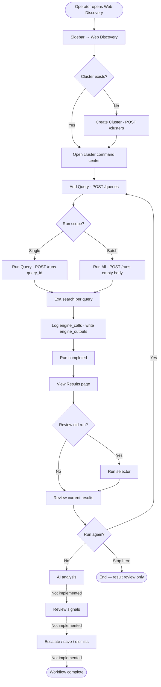
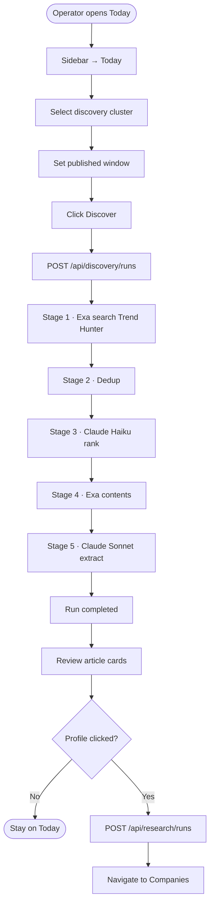
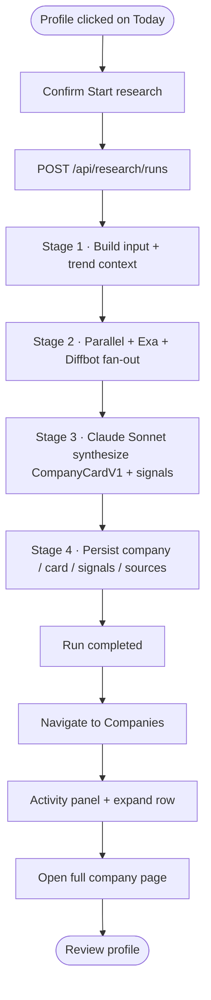

# P1-01 — Core Operator Workflow (Admin Console)

| Field | Value |
|-------|-------|
| **Document ref** | P1-01-Admin |
| **Title** | Core Operator Workflow — Admin Console |
| **Version** | 2.3 |
| **Status** | Draft |
| **Last updated** | 2026-06-08 |
| **Parent document** | [P1-00 Phase 1 Overview](./phase-1-overview.md) |
| **Companion document** | [P1-01 User](./P1-01-user.md) (pending) |

---

## 1. Introduction

The **NORAD Intel Engine Admin Console** (`apps/web`) is where operators configure search scope and run pipelines. The backend (`apps/api`) executes all search and research work.

**Primary workflow (P1-01):** Web Discovery — `Cluster → Query → Run → Result → AI Analysis → Signal / Escalation`. This is the canonical operator path documented in §2.

**Secondary workflow:** Today (Trend Hunter discovery) — documented in §3.

**Deep research workflow:** Triggered from Today **Profile** — documented in §4 (includes Companies page objects).

**Supporting admin workflows:** Discovery Clusters (§8) feeds Today; Settings (§9) configures research engines.

Each workflow section uses the same format: component table → flow line → short explanation → complete pipeline diagram at the end.

### 1.1 Definitions used in this document

**AI analyzes results** means any LLM step inside a pipeline that grades, ranks, extracts, synthesizes, or interprets data — not only a separate post-run analysis button. If Claude or another LLM runs during the pipeline, that counts as AI analysis.

| Term | Meaning in this codebase |
|------|--------------------------|
| **Save** | User explicitly bookmarks or saves a result for later. Distinct from automatic persistence (DB writes the pipeline already does). |
| **Dismiss** | User or system removes a result from the active review queue. Distinct from **Detach/Clear** (UI-only; backend keeps running) and **Archive** (Activity panel label for a finished log — not delete). |
| **Escalate** | User promotes a result into the next pipeline (e.g. article → deep research, or result → pending review on user frontend). |

See §6 for what is implemented vs not implemented for each term.

---

## 2. Workflow — Web Discovery (primary)

### 2.1 Overview

| Attribute | Value |
|-----------|-------|
| **Route** | `/discover-web` |
| **Sidebar** | Web Discovery |
| **Pipeline** | Web Discovery (`source_kind = web_discovery`) |
| **Backend** | `routers/web_discovery.py` → `_execute_web_discovery_run` |
| **Flow start** | Operator creates or opens a search cluster |
| **Flow end (implemented)** | Operator reviews Exa results on the query results page |
| **Flow end (target)** | Operator completes AI analysis and escalates / saves / dismisses results |

Operators define themed search clusters, add Exa queries, run one query or all active queries in a cluster, and review ranked web results.

---

### 2.2 Create search cluster

| Component | Action | Backend |
|-----------|--------|---------|
| **Create Cluster** button | Click on cluster list page | Opens create dialog |
| **Cluster form** (name, keywords, geography, sources, signal priorities) | Fill and submit | `POST /api/web-discovery/clusters` → `web_discovery_clusters` |
| Auto-navigation | On success | Routes to cluster command center |

**Flow:**

`Sidebar → Web Discovery` → `Create Cluster (click)` → `Fill form (submit)` → `Cluster command center`

The operator names the cluster and sets scope tags (include/exclude keywords, geography, source preferences, signal priorities). On save, the API persists the cluster and opens the command center for that cluster.

---

### 2.3 Add search query

| Component | Action | Backend |
|-----------|--------|---------|
| **+ Add Query** button | Click on cluster page | Navigates to query editor |
| **Query form** (label, search text, search type, result count, content modes, filters) | Fill and save | `POST /api/web-discovery/clusters/:id/queries` → `web_discovery_queries` |
| **Save Query** (edit mode) | Click | `PUT /api/web-discovery/queries/:id` |

**Flow:**

`Cluster command center` → `+ Add Query (click)` → `Query form (fill + save)`

Each query is an Exa search definition. The form pre-fills search text from the cluster keywords. LLM fields (`system_prompt`, `output_schema`) can be saved but are **not executed** at run time today.

---

### 2.4 Run query or cluster

| Component | Action | Backend |
|-----------|--------|---------|
| **Run All Cluster Queries** | Click → confirm | `POST /api/web-discovery/clusters/:id/runs` with `{}` — runs all active queries sequentially |
| **Run Query** | Click on query editor | `POST .../runs` with `{ query_id }` — single query only |
| **Create & Run Query** | Click on new query form | Creates query then starts single-query run |

**Flow (single query):**

`Query editor` → `Run Query (click)` → `SSE activity log` → `Results page (auto)`

**Flow (full cluster):**

`Cluster command center` → `Run All Cluster Queries (click + confirm)` → `Results tab (monitor)`

Both paths create a `runs` row with `source_kind = web_discovery`. Maximum 5 concurrent web discovery runs system-wide.

---

### 2.5 Monitor the run

| Component | Action | Backend |
|-----------|--------|---------|
| **Activity log** (query editor) | Watch inline while running | SSE `run_events` per query |
| **Results tab** (cluster page) | Switch tab after batch run | Polls cluster runs every 5 s |
| Progress | — | `runs.status`: `queued` → `researching` → `completed` / `failed` |

**Flow:**

`Run started` → `Activity log (watch)` → `Run completed toast`

For each active query the backend calls Exa search with the query's content settings, logs to `engine_calls`, and appends results to `runs.engine_outputs`.

---

### 2.6 View results

| Component | Action | Backend |
|-----------|--------|---------|
| **View Query Results** / auto-navigate | Open after run | `GET /api/web-discovery/queries/:id/results?run_id=` |
| **Run selector** | Pick a past run | Loads historical result slice |
| **Filter / Sort** | Client-side | Filters title, URL, summary |
| **Run again** | Click → confirm | Returns to query editor to re-run |
| **Edit query** | Click | Navigates to query editor |

**Flow:**

`Run complete` → `Results page` → `Review sources (expand/filter)` → optional `Run again`

Each result shows URL, title, snippet, Exa score, and optional highlights/summary/text from Exa content modes.

---

### 2.7 AI analysis and result disposition (Web Discovery)

| Step | LLM in pipeline? | User action? | Detail |
|------|------------------|--------------|--------|
| AI analyzes results | **No NORAD LLM** | — | Run executor calls Exa only. Exa `summary`/`highlights` are vendor-side. Query LLM fields are stored but never executed. |
| User reviews signals | — | **No** | No signals extracted from web results |
| Save result | — | **No** | Results auto-persist in `runs.engine_outputs`; no bookmark/save button |
| Dismiss result | — | **No** | No dismiss API or UI on web results |
| Escalate result | — | **No** | No escalate to research or user frontend from results page |

Implemented end point: operator reviews Exa results on the results page. See §5–§6 for full LLM and disposition matrix.

---

### 2.8 End-to-end flow

**Flow:**

`Sidebar → Web Discovery` → `Create Cluster` → `Add Query` → `Run Query or Run All` → `Monitor activity` → `View Results` → *(target: AI analysis → escalate / save / dismiss)*

This is the primary P1-01 operator path on the admin console.

---

### 2.9 Complete pipeline diagram — Web Discovery

---

### 2.10 Alternate paths

| Path | How | End point |
|------|-----|-----------|
| Single query run | **Run Query** on query editor | That query's results page |
| Full cluster batch | **Run All Cluster Queries** on cluster page | Results tab; per-query results via query list |
| Review old results | **Run selector** on results page | Historical `engine_outputs` slice |
| Re-run query | **Run again** on results page | New run → fresh results |
| Edit scope mid-flow | Cluster **Settings** tab or query **Edit** | Updated config on next run |

---

### 2.11 Errors and limits

| Condition | UI response |
|-----------|-------------|
| Cluster paused | Toast error (HTTP 400) |
| No active queries | Toast error (HTTP 400) |
| 5 concurrent web discovery runs | Toast error (HTTP 429) |
| Exa error on one query | Warning in activity log; other queries continue in batch |
| Pipeline crash | `failed` status; error on results page |
| Empty results | Completed run with zero sources |

---

## 3. Workflow — Today (secondary)

### 3.1 Overview

| Attribute | Value |
|-----------|-------|
| **Route** | `/discover` |
| **Sidebar** | Today |
| **Pipeline** | Today discovery → optional deep research |
| **Backend** | `services/discovery.py` then `services/research.py` |

Operators pick a Trend Hunter keyword cluster and date window, run AI-ranked article discovery, and optionally profile a subject company. Cluster configuration is managed on **Discovery Clusters** (`/discovery-clusters`), not on this page.

---

### 3.2 Start a discovery run

| Component | Action | Backend |
|-----------|--------|---------|
| **Discovery cluster** dropdown | Select cluster | Cluster `keywords[]` applied on run start |
| **Published window** | Select preset or custom dates | Date bounds sent with run |
| **Discover** button | Click | `POST /api/discovery/runs` → 5-stage pipeline |

**Flow:**

`Sidebar → Today` → `Cluster dropdown (select)` → `Date window (select)` → `Discover (click)`

---

### 3.3 Monitor the run

| Component | Action | Backend |
|-----------|--------|---------|
| **Activity** panel | Watch timeline | SSE `run_events` — stages 1–5 |
| **Run group** | Expand to see progress | Polls `runs.status` |

| Stage | Engine | Output |
|-------|--------|--------|
| 1 — Search | Exa | Trend Hunter URLs |
| 2 — Dedup | Database | `trend_articles` |
| 3 — Rank | Claude Haiku 4.5 | `relevance_score` |
| 4 — Contents | Exa | Article bodies |
| 5 — Extract | Claude Sonnet 4.5 | `summary`, `extracted_companies` |

**Flow:**

`Discover (click)` → `Activity panel (watch)` → `Run group expands (auto)`

---

### 3.4 Review results and start research

| Component | Action | Backend |
|-----------|--------|---------|
| **Article card** | Review ranked article | `trend_articles` (`status = extracted`) |
| **Profile** button | Click primary company | `POST /api/research/runs` → deep research |
| **Countdown banner** | Wait or Go now | Navigates to `/companies` |

**Flow:**

`Run group (expand)` → `Article card (review)` → `Profile (click)` → `Start research (confirm)` → `Companies`

Clicking **Profile** escalates the primary company into deep research (§4). **Detach/Clear** only stops UI tracking — it does not dismiss articles. **Archive** on the Activity panel is a label for a finished log, not delete. Article dismiss exists as API only (`POST /api/discovery/articles/:id/dismiss`) with **no button** on cards.

---

### 3.5 Complete pipeline diagram — Today

---

### 3.6 Errors, fallbacks, and limits

| Condition | Backend behaviour | UI response |
|-----------|-------------------|-------------|
| Haiku rank fails (whole batch) | Run `failed` — no auto-retry | Toast + error banner |
| Sonnet extract fails (one article) | Article skipped; run continues | Warning in Activity log; article not on cards |
| No cluster selected | — | Discover disabled |
| Run already active | — | Button shows **Running…** |
| 5 concurrent runs | HTTP 429 | Toast error |

---

## 4. Workflow — Deep Research

### 4.1 Overview

| Attribute | Value |
|-----------|-------|
| **Entry (admin)** | **Profile** button on Today article card |
| **Routes** | `/companies`, `/companies/:id`, `/runs/:id` |
| **Pipeline** | Deep research (`source_kind = research`) |
| **Backend** | `services/research.py` |
| **Output** | `CompanyCardV1` in `companies`, `cards`, `signals`, `sources` |

Deep research builds a structured company profile from web evidence. On the admin console it is started from Today, not from Web Discovery results.

---

### 4.2 Start research from Today

| Component | Action | Backend |
|-----------|--------|---------|
| **Profile** button | Click beside article card | Opens confirmation modal |
| **Start research** | Confirm in modal | `POST /api/research/runs` with `{ company_name, trend_article_id }` |
| **Countdown banner** | Wait 3 s or **Go now** | Navigates to `/companies` |

**Flow:**

`Today → Article card → Profile (click) → Start research (confirm) → Companies page`

The research run starts immediately on confirm. The countdown only controls navigation timing — cancelling it keeps the operator on Today while research continues.

---

### 4.3 Companies page — browse and monitor

| Component | Action | Backend |
|-----------|--------|---------|
| **Activity** panel (left) | Watch timeline for focused company | SSE `run_events`; shows stages, costs, synthesis retry events (§5.1) |
| **Company row** (collapsed) | Click row header | Expands excerpt; Activity panel switches to that company's latest run |
| **Status pill** | Read | `Profiling…` (live), `Done` (completed), or `failed` / `cancelled` |
| **Overall score** | Read (right side) | From completed Company Card |
| **Run count** | Read | e.g. `6 RUNS` — number of research passes for this company |

**Flow:**

`Sidebar → Companies` → `Click company row (expand)` → `Activity panel (watch)`

On load: `GET /api/research/feed`. Live rows poll every 3 s; completed rows every 15 s. Expanding a row lazy-loads the card excerpt via `GET /api/research/companies/:id`.

---

### 4.4 Expanded company row — objects and actions

| Object / button | Action | Backend |
|-----------------|--------|---------|
| **Strategic fit** block | Read summary + recommendation pill (e.g. MONITOR) | From `cards.card.strategic_fit` |
| **Top signals** list | Read first 2 signals (type + headline) | From `signals` table |
| **View run log →** | Click | Navigate to `/runs/:id` — full run header + Activity feed |
| **Cancel run** | Click while profiling (live only) | `POST /api/research/runs/:id/cancel` |
| **Open full page →** | Click | Navigate to `/companies/:id` |

**Flow:**

`Expanded row` → `View run log` or `Open full page` → optional `Cancel run` (if live)

**Cancel run** stops the pipeline at the next checkpoint. Engine calls already in flight may finish, but no company/card/signals are saved from that run.

---

### 4.5 Company detail page (`/companies/:id`)

| Component | Action | Backend |
|-----------|--------|---------|
| **Company header** | Read name, domain, overall score, confidence | `GET /api/research/companies/:id` |
| **Follow / Signal Alert / Share** | Click | **No handler** — UI shell only |
| **Key facts panels** | Read classification, financials, team | From `CompanyCardV1` JSON |
| **Strategic Fit** section | Read narrative | LLM-synthesized in Stage 3 |
| **Signals** section | Read all signals with evidence | `signals` table |
| **Sources** section | Read cited URLs | `sources` table |
| **Research Evidence** | Expand engine I/O | `GET /api/research/companies/:id/evidence` |
| **Profile history** | Click a past run row | `/runs/:id`; cancel available on in-flight runs |
| **Cancel run** (history) | Click on active run | `POST /api/research/runs/:id/cancel` |

**Flow:**

`Companies → Open full page` → `Review card sections` → optional `Research Evidence` or `Profile history → View run log`

---

### 4.6 Run log page (`/runs/:id`)

| Component | Action | Backend |
|-----------|--------|---------|
| **Run header** | Read status, progress, company link | `GET /api/research/runs/:id` (polls every 2 s while live) |
| **Stages summary** | Read completed pipeline stages | From run record |
| **Activity feed** (right) | Watch or review saved log | SSE when live; **Archive** label when complete |
| **Open company** CTA | Click when run completed | Links to `/companies/:id` |

**Flow:**

`View run log` → `Monitor Activity` → `Open company` (when done)

| Stage | Engine | What happens |
|-------|--------|--------------|
| 1 — Build input | Application | Loads trend article context if provided |
| 2 — Fan-out | Parallel + Exa + Diffbot | Structured brief, web content, entity record |
| 3 — Synthesize | Claude Sonnet 4.5 | Company Card + signals; fallbacks in §5.1 |
| 4 — Persist | Application | Writes `companies`, `cards`, `signals`, `sources` |

---

### 4.7 Complete pipeline diagram — Deep Research

---

### 4.8 Errors, fallbacks, and limits

| Condition | Backend behaviour | UI response |
|-----------|-------------------|-------------|
| One engine fails in Stage 2 | Run continues with other engines | Activity shows partial OK/FAIL |
| All engines fail in Stage 2 | Run `failed`; no card saved | Error in Activity; failed status on row |
| Thin signals after synth | Auto-retry Claude once (§5.1) | `synthesis_retry` events in Activity |
| Validation fails after coerce | Run `failed`; no orphan card | Error in Activity |
| 5 concurrent research runs | HTTP 429 | Toast error |
| User cancels run | `cancelled`; no card from that run | Row shows cancelled |

---

## 5. LLM processing by pipeline

Any row below counts as **AI analyzes results** per §1.1.

| Pipeline | Stage | LLM | What it does | Persisted to |
|----------|-------|-----|--------------|--------------|
| Today | 3 — Rank | Claude Haiku 4.5 | Grades articles 0–100; keeps top 15 | `trend_articles.relevance_score`, `relevance_reason` |
| Today | 5 — Extract | Claude Sonnet 4.5 | Summary + company names from article body | `trend_articles.summary`, `extracted_companies` |
| Web Discovery | Post-run | — | **No NORAD LLM** (Exa vendor summaries only) | `runs.engine_outputs` |
| Deep Research | 3 — Synthesize | Claude Sonnet 4.5 | Full Company Card + signal extraction | `cards.card`, `signals` |

**Non-LLM filtering (not AI analysis):**

| Pipeline | Mechanism | What it does |
|----------|-----------|--------------|
| Today | Topic keyword filter (Stage 1) | Hard-coded exclusions (cannabis, psychedelic, etc.) — drops before DB |
| Today | Top-N cutoff (Stage 3) | Keeps top 15 after Haiku rank — lower scores not read/extracted |

### 5.1 AI failure and fallback behaviour

When an LLM or AI step fails, the pipeline may **skip**, **fall back to other engines**, **deterministically backfill**, or **auto-retry** — depending on the stage. There is no generic retry on every Claude call.

#### Today discovery

| Stage | If AI / step fails | Fallback behaviour |
|-------|-------------------|-------------------|
| 3 — Haiku rank (whole batch) | Claude call fails or returns no tool output | **Entire run fails** — no auto-retry |
| 3 — Haiku rank (per article) | Article omitted from Haiku response | Article **skipped** — not ranked, not kept in top 15 |
| 4 — Exa contents | Exa API error | **Entire run fails** |
| 4 — Exa contents (per URL) | URL missing from response | Article **skipped** — no body text |
| 5 — Sonnet extract (per article) | Claude call fails for one article | Article **skipped** with warning in Activity log; **run continues** for other articles. Failed article stays at `read`, not shown on Today cards |

There is **no automatic re-call** of Claude for a failed Today extract. The operator must start a new Discover run.

#### Deep research

| Stage | If AI / step fails | Fallback behaviour |
|-------|-------------------|-------------------|
| 2 — Engine fan-out | One engine fails (Parallel, Exa, or Diffbot) | **Run continues** with remaining engines |
| 2 — Engine fan-out | All three engines fail | **Run fails** — no card saved |
| 3 — Sonnet synthesize (validation) | Pydantic validation error on card JSON | **Auto-coerce** bare scalars into `Valued[]` wrappers and re-validate once |
| 3 — Sonnet synthesize (thin output) | After first pass: sources backfilled from registry; Parallel signals harvested; Parallel/Diffbot fields promoted | **Deterministic backfill** — no extra LLM cost |
| 3 — Sonnet synthesize (still thin signals) | Fewer than 3 signals after backfill + harvest | **Auto-retry** — second Claude call (`synthesize_card_retry`) asking to expand signals; accepted only if signal count increases |
| 3 — Sonnet synthesize (hard failure) | Validation still fails after coerce, or unrecoverable synth error | **Run fails** — no card saved |

Activity panel events for research fallbacks include: `sources_backfilled`, `signals_harvested`, `parallel_fields_promoted`, `diffbot_fields_promoted`, `synthesis_retry`, `synthesis_retry_done`, `synthesis_coerce_recovered`.

#### Web Discovery

| Step | If step fails | Fallback behaviour |
|------|--------------|-------------------|
| Exa search (per query in batch) | Exa error on one query | Warning in activity log; **other queries continue** |
| Post-run LLM analysis | Not implemented | No NORAD LLM step exists |

---

## 6. Save, dismiss, and escalate — what exists today

Automatic persistence (pipeline writes to DB) is **not** the same as a user **Save** action.

| Action | Web Discovery | Today | Deep Research |
|--------|---------------|-------|---------------|
| **Auto-persist results** | Yes — `runs.engine_outputs` | Yes — `trend_articles` | Yes — `companies`, `cards`, `signals`, `sources` |
| **User Save / bookmark** | No UI, no API | No UI, no API | No UI, no API |
| **User Dismiss** | No UI, no API | API only: `POST .../articles/:id/dismiss` sets `status=dismissed` — **no button on article cards** | N/A |
| **LLM dismissing results** | No | No — Haiku ranks/scores but does not mark `dismissed`; topic filter is rule-based not LLM | No |
| **User Escalate** | No — cannot promote a web result to research from results page | Yes — **Profile** → deep research pipeline | N/A (this is the escalation target) |
| **Detach / Clear (Today)** | — | UI only — stops watching run; does **not** dismiss articles | — |
| **Archive (Activity label)** | Label on finished log | Label on finished log | Label on finished log — **not** delete or dismiss |

**Answer — Can results be saved, dismissed, or escalated?**

- **Saved by user:** No explicit save/bookmark action exists on any admin screen. Data is saved automatically by pipelines only.
- **Dismissed:** Only Today articles via API; no UI button. No dismiss on Web Discovery results. No LLM-driven dismiss.
- **Escalated:** Only via Today **Profile** → deep research. Web Discovery has no escalate path on admin console. User frontend escalate (e.g. Pending review) is documented in P1-01-User.

---

## 7. P1-01 document completion

This section records deliverable coverage for the core workflow specification.

### 7.1 Primary user outcome

Operators configure web search scope (clusters and queries), execute Exa searches, and review results to identify market signal. On Today, operators additionally funnel Trend Hunter articles into company research.

### 7.2 Required flow coverage

| Required step | Web Discovery | Today | Deep Research |
|---------------|---------------|-------|---------------|
| Login | Not implemented (single-user) | Same | Same |
| Create search cluster | Implemented | Uses pre-configured clusters | — |
| Add search queries | Implemented | — | — |
| Run query or cluster | Implemented | Discover run | — |
| View results | Results page | Article cards | Company Card page |
| AI analyzes results | **No NORAD LLM** | Haiku rank + Sonnet extract | Sonnet synthesis + signals |
| Review signals | Not implemented | Scores + extracted companies | Signals on company page |
| User save | Not implemented | Not implemented | Not implemented |
| User dismiss | Not implemented | API only, no UI | — |
| Escalate | Not implemented | Profile → research | Is the escalation target |

### 7.3 Screens involved

| Screen | Route | Workflow |
|--------|-------|----------|
| Web Discovery list | `/discover-web` | Primary |
| Cluster command center | `/discover-web/clusters/:id` | Primary |
| Query editor | `.../queries/new` or `.../queries/:id` | Primary |
| Query results | `.../queries/:id/results` | Primary |
| Today | `/discover` | Secondary |
| Discovery Clusters | `/discovery-clusters` | Today keyword admin (§8) |
| Companies | `/companies`, `/companies/:id` | Deep research output (§4.3–4.5) |
| Run log | `/runs/:id` | Research event stream (§4.6) |
| Settings | `/settings` | Engine config (§9) |

### 7.4 Checklist answers

| Question | Answer |
|----------|--------|
| Can users run a single query, or only a full cluster? | **Both** on Web Discovery. |
| Can results be saved, dismissed, or escalated? | See §6. No user save anywhere. Dismiss: API only on Today articles (no UI). Escalate: Today Profile only on admin. |
| What is AI analysis? | Any in-pipeline LLM step (§5). Web Discovery has none; Today and Research do. |
| What happens when a run fails? | Toast + error; `runs.status = failed`; operator can re-run. |
| What happens when AI analysis fails? | See §5.1. **Today:** per-article extract failure skips that article and continues; whole-batch rank failure fails the run. **Research:** engine partial-failure tolerated; deterministic backfill + optional Claude retry-on-thin signals; hard validation failure fails the run. |

### 7.5 Completion status

| Requirement | Status |
|-------------|--------|
| Primary workflow (Web Discovery) | Documented (§2) |
| Alternate paths | Documented (§2.10) |
| Today workflow + LLM stages | Documented (§3) |
| Deep research + Companies UI guide | Documented (§4) |
| Discovery Clusters workflow | Documented (§8) |
| Settings workflow | Documented (§9) |
| LLM inventory (AI analysis definition) | Documented (§5) |
| Save / dismiss / escalate — actual behaviour | Documented (§6) |
| User frontend perspective | Documented — [P1-01-User](./P1-01-user.md) v1.0 (primary flow) |
| Admin doc approved | **Pending** reviewer sign-off |

---

## 8. Workflow — Discovery Clusters

Discovery Clusters administers the keyword libraries used by the **Today** page. Distinct from Web Discovery clusters (`discovery_clusters` vs `web_discovery_clusters`).

### 8.1 Overview

| Attribute | Value |
|-----------|-------|
| **Route** | `/discovery-clusters` |
| **Sidebar** | Discovery Clusters |
| **Feeds** | Today page cluster dropdown only |

---

### 8.2 Manage clusters

| Component | Action | Backend |
|-----------|--------|---------|
| **New cluster** | Click | Opens create dialog |
| **Cluster card → Edit** | Click | Opens edit dialog with existing values |
| **Cluster card → Make default** | Click | `PUT /api/discovery/clusters/:id` with `is_default: true` |
| **Cluster card → Delete** | Click → confirm | `DELETE /api/discovery/clusters/:id` |
| **Create / Save changes** (dialog) | Submit form | `POST` or `PUT /api/discovery/clusters` |

**Form fields:** name, group, description, keywords (comma or newline), Enabled checkbox, Set as default checkbox.

**Flow:**

`Sidebar → Discovery Clusters` → `New cluster (click)` → `Fill form (submit)` → cluster appears in library

**Flow (edit Today scope):**

`Discovery Clusters` → `Edit (click)` → `Update keywords / enabled (save)` → changes apply on next **Discover** on Today

Deleting a cluster removes it from the Today dropdown. Existing `trend_articles` and past runs are unaffected. If the default cluster is deleted, the next cluster by `sort_order` is promoted.

---

### 8.3 End-to-end flow

**Flow:**

`Discovery Clusters` → `Create or edit cluster` → `Today page` → `Cluster dropdown shows updated list` → `Discover (click)`

Operators maintain keyword themes here; Today only shows cluster names — keywords are applied server-side on each discovery run.

---

## 9. Workflow — Settings

### 9.1 Overview

| Attribute | Value |
|-----------|-------|
| **Route** | `/settings` |
| **Sidebar** | Settings (footer) |
| **Affects** | Deep research runs only (next run after save) |

---

### 9.2 System status

| Component | Action | Backend |
|-----------|--------|---------|
| **Postgres (Supabase)** status | Read | `GET /health/db` |
| **Redis (Upstash)** status | Read | Same health check |

---

### 9.3 Research engine configuration

| Component | Action | Backend |
|-----------|--------|---------|
| **Parallel — Processor** | Select tier (lite → ultra8x) | Stored in `app_kv` key `research_config` |
| **Parallel — Timeout** | Set seconds (60–3600) | Same |
| **Exa — Search type** | Select (auto, fast, neural, keyword, deep) | Same |
| **Exa — Deep model** | Select when search type = deep | Same |
| **Exa — Results per query** | Set count (1–50) | Same |
| **Diffbot — Enabled** | Toggle on/off | Same |
| **Diffbot — Score threshold** | Set 0.0–1.0 | Same |
| **Save changes** | Click (enabled when dirty) | `PUT /api/settings/research` |

**Flow:**

`Sidebar → Settings` → `Adjust engine parameters` → `Save changes (click)`

Changes apply to the **next** research run, not runs already in flight. In production (`debug=False`), save requires `X-Admin-Token` header.

---

### 9.4 End-to-end flow

**Flow:**

`Settings` → `Tune Parallel / Exa / Diffbot` → `Save changes` → `Today Profile or research API` → `Next run uses new config`

---

## 10. Additional admin screens

| Screen | Route | Status |
|--------|-------|--------|
| Dashboard | `/` | Not documented — static entry point |

---

## 11. Approval

| Role | Name | Date | Status |
|------|------|------|--------|
| Author | huzaifa | 2026-06-08 | Draft |
| Reviewer | — | — | Pending |

**Next:** P1-01-User (analyst frontend walkthrough).

---

## 12. Revision history

| Version | Date | Author | Description |
|---------|------|--------|-------------|
| 1.0–1.3 | 2026-06-08 | huzaifa | Today workflow; format iterations |
| 2.0 | 2026-06-08 | huzaifa | Web Discovery primary workflow |
| 2.1 | 2026-06-08 | huzaifa | Deep research UI guide; LLM/save/dismiss/escalate definitions; honest completion status |
| 2.2 | 2026-06-08 | huzaifa | §5.1 AI failure and fallback/retry behaviour per pipeline |
| 2.3 | 2026-06-08 | huzaifa | Companies UI objects, Discovery Clusters, Settings workflows |
