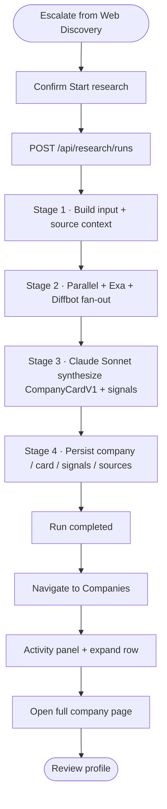

# P1-01 — Core Operator Workflow (Admin Console)

| Field | Value |
|-------|-------|
| **Document ref** | P1-01-Admin |
| **Title** | Core Operator Workflow — Admin Console |
| **Version** | 2.5 |
| **Status** | Draft |
| **Last updated** | 2026-06-08 |

---

## 1. Introduction

The **NORAD Intel Engine Admin Console** (`apps/web`) is where operators configure search scope and run pipelines. The backend (`apps/api`) executes all search and research work.

**Primary workflow (P1-01):** Web Discovery — `Cluster → Query → Run → Result → AI Analysis → Signal / Escalation`. This is the canonical operator path documented in §2.

**Deep research workflow:** Triggered from Web Discovery **Escalate** (target) or analyst actions on the user frontend — documented in §3 (includes Companies page objects).

**Supporting admin workflow:** Settings (§7) configures research engines.

Each workflow section uses the same format: component table → flow line → short explanation → complete pipeline diagram at the end.

**Additional fields (v2.4):** Each workflow subsection may also include **What the operator is trying to do**, an **Action type** column in the component table, and a **Failure states** block before the section divider. Summary error tables (§2.11, §3.8) are unchanged.

| Block | Purpose |
|-------|---------|
| **What the operator is trying to do** | The goal of this step in the operator journey |
| **UI guide** | Component, action, **action type**, and backend effect |
| **Flow** | One-line click path |
| **Failure states** | What the operator sees and what the system does when something goes wrong |
| **Diagram** | Complete pipeline map *(end of each workflow)* |

**Action types:** `Read` · `Navigate` · `Configure` · `Run` · `Monitor` · `Escalate` · `Cancel` · `Dismiss` · `Filter` · `—`

### 1.1 Definitions used in this document

**AI analyzes results** means any LLM step inside a pipeline that grades, ranks, extracts, synthesizes, or interprets data — not only a separate post-run analysis button. If Claude or another LLM runs during the pipeline, that counts as AI analysis.

| Term | Meaning in this codebase |
|------|--------------------------|
| **Save** | User explicitly bookmarks or saves a result for later. Distinct from automatic persistence (DB writes the pipeline already does). |
| **Dismiss** | User or system removes a result from the active review queue. Distinct from **Detach/Clear** (UI-only; backend keeps running) and **Archive** (Activity panel label for a finished log — not delete). |
| **Escalate** | User promotes a result into the next pipeline (e.g. article → deep research, or result → pending review on user frontend). |

See §5 for what is implemented vs not implemented for each term.

---

## 2. Workflow — Web Discovery (primary)

### 2.1 Overview

| Attribute | Value |
|-----------|-------|
| **Route** | `/discover-web` |
| **Sidebar** | Web Discovery |
| **Pipeline** | Web Discovery (`source_kind = web_discovery`) |
| **Backend** | `routers/web_discovery.py` → `_execute_web_discovery_run` |
| **Flow start** | Operator creates or opens a search cluster |
| **Flow end (implemented)** | Operator reviews Exa results on the query results page |
| **Flow end (target)** | Operator completes AI analysis and escalates / saves / dismisses results |

Operators define themed search clusters, add Exa queries, run one query or all active queries in a cluster, and review ranked web results.

---

### 2.2 Create search cluster

**What the operator is trying to do:** Define a themed search scope — keywords, geography, sources — before adding queries or running Exa searches.

| Component | Action | Action type | Backend |
|-----------|--------|-------------|---------|
| **Create Cluster** button | Click on cluster list page | Navigate | Opens create dialog |
| **Cluster form** (name, keywords, geography, sources, signal priorities) | Fill and submit | Configure | `POST /api/web-discovery/clusters` → `web_discovery_clusters` |
| Auto-navigation | On success | Navigate | Routes to cluster command center |

**Flow:**

`Sidebar → Web Discovery` → `Create Cluster (click)` → `Fill form (submit)` → `Cluster command center`

The operator names the cluster and sets scope tags (include/exclude keywords, geography, source preferences, signal priorities). On save, the API persists the cluster and opens the command center for that cluster.

**Failure states:**

| Condition | What the operator sees | What the system does |
|-----------|------------------------|----------------------|
| Required fields missing | Inline validation; submit blocked | Cluster not saved |
| Duplicate cluster name | Error toast | `POST` rejected — operator renames |

---

### 2.3 Add search query

**What the operator is trying to do:** Add one Exa search definition inside the cluster — the unit that actually runs when the operator hits **Run**.

| Component | Action | Action type | Backend |
|-----------|--------|-------------|---------|
| **+ Add Query** button | Click on cluster page | Navigate | Navigates to query editor |
| **Query form** (label, search text, search type, result count, content modes, filters) | Fill and save | Configure | `POST /api/web-discovery/clusters/:id/queries` → `web_discovery_queries` |
| **Save Query** (edit mode) | Click | Configure | `PUT /api/web-discovery/queries/:id` |

**Flow:**

`Cluster command center` → `+ Add Query (click)` → `Query form (fill + save)`

Each query is an Exa search definition. The form pre-fills search text from the cluster keywords. LLM fields (`system_prompt`, `output_schema`) can be saved but are **not executed** at run time today.

**Failure states:**

| Condition | What the operator sees | What the system does |
|-----------|------------------------|----------------------|
| Empty search text | Validation error | Query not saved |
| Cluster has no active queries at run time | Toast when running batch later | Run blocked until at least one active query exists |

---

### 2.4 Run query or cluster

**What the operator is trying to do:** Execute Exa searches and produce fresh web results — single query or full cluster batch.

| Component | Action | Action type | Backend |
|-----------|--------|-------------|---------|
| **Run All Cluster Queries** | Click → confirm | Run | `POST /api/web-discovery/clusters/:id/runs` with `{}` — runs all active queries sequentially |
| **Run Query** | Click on query editor | Run | `POST .../runs` with `{ query_id }` — single query only |
| **Create & Run Query** | Click on new query form | Run | Creates query then starts single-query run |

**Flow (single query):**

`Query editor` → `Run Query (click)` → `SSE activity log` → `Results page (auto)`

**Flow (full cluster):**

`Cluster command center` → `Run All Cluster Queries (click + confirm)` → `Results tab (monitor)`

Both paths create a `runs` row with `source_kind = web_discovery`. Maximum 5 concurrent web discovery runs system-wide.

---

### 2.5 Monitor the run

**What the operator is trying to do:** Watch the run complete and confirm Exa returned results before opening the results page.

| Component | Action | Action type | Backend |
|-----------|--------|-------------|---------|
| **Activity log** (query editor) | Watch inline while running | Monitor | SSE `run_events` per query |
| **Results tab** (cluster page) | Switch tab after batch run | Monitor | Polls cluster runs every 5 s |
| Progress | — | Read | `runs.status`: `queued` → `researching` → `completed` / `failed` |

**Flow:**

`Run started` → `Activity log (watch)` → `Run completed toast`

For each active query the backend calls Exa search with the query's content settings, logs to `engine_calls`, and appends results to `runs.engine_outputs`.

**Failure states:**

| Condition | What the operator sees | What the system does |
|-----------|------------------------|----------------------|
| Cluster paused | Toast error (HTTP 400) | Run not started |
| No active queries | Toast error (HTTP 400) | Run not started |
| 5 concurrent web discovery runs | Toast error (HTTP 429) | Run queued/rejected until slot free |

**Failure states:**

| Condition | What the operator sees | What the system does |
|-----------|------------------------|----------------------|
| Exa error on one query (batch) | Warning in activity log | Other queries in batch continue |
| Pipeline crash | `failed` status; error on results page | Run stops; partial `engine_outputs` may exist |
| Empty results | Completed run with zero sources | Operator adjusts query scope and re-runs |

---

### 2.6 View results

**What the operator is trying to do:** Review Exa hits, compare runs, and decide whether to re-run or edit the query — the implemented end point for Web Discovery today.

| Component | Action | Action type | Backend |
|-----------|--------|-------------|---------|
| **View Query Results** / auto-navigate | Open after run | Navigate | `GET /api/web-discovery/queries/:id/results?run_id=` |
| **Run selector** | Pick a past run | Filter | Loads historical result slice |
| **Filter / Sort** | Client-side | Filter | Filters title, URL, summary |
| **Run again** | Click → confirm | Run | Returns to query editor to re-run |
| **Edit query** | Click | Navigate | Navigates to query editor |

**Flow:**

`Run complete` → `Results page` → `Review sources (expand/filter)` → optional `Run again`

Each result shows URL, title, snippet, Exa score, and optional highlights/summary/text from Exa content modes.

**Failure states:**

| Condition | What the operator sees | What the system does |
|-----------|------------------------|----------------------|
| Escalate / Save / Dismiss | No buttons on results page | Not implemented — operator reviews only |
| Post-run NORAD LLM analysis | Exa vendor summaries only | No NORAD LLM step — see §2.7 |

---

### 2.7 AI analysis and result disposition (Web Discovery)

**What the operator is trying to do:** Understand what AI runs today on Web Discovery results and what save / dismiss / escalate actions exist (most are not implemented yet).

| Step | LLM in pipeline? | User action? | Detail |
|------|------------------|--------------|--------|
| AI analyzes results | **No NORAD LLM** | — | Run executor calls Exa only. Exa `summary`/`highlights` are vendor-side. Query LLM fields are stored but never executed. |
| User reviews signals | — | **No** | No signals extracted from web results |
| Save result | — | **No** | Results auto-persist in `runs.engine_outputs`; no bookmark/save button |
| Dismiss result | — | **No** | No dismiss API or UI on web results |
| Escalate result | — | **No** | No escalate to research or user frontend from results page |

Implemented end point: operator reviews Exa results on the results page. See §4–§5 for full LLM and disposition matrix.

**Failure states:**

| Condition | What the operator sees | What the system does |
|-----------|------------------------|----------------------|
| Expecting NORAD LLM on results | No analysis step after Exa | Query LLM fields stored but not executed |
| Expecting save / dismiss / escalate | No buttons on results page | Results auto-persist in `engine_outputs` only |

---

### 2.8 End-to-end flow

**Flow:**

`Sidebar → Web Discovery` → `Create Cluster` → `Add Query` → `Run Query or Run All` → `Monitor activity` → `View Results` → *(target: AI analysis → escalate / save / dismiss)*

This is the primary P1-01 operator path on the admin console.

---

### 2.9 Complete pipeline diagram — Web Discovery

---

### 2.10 Alternate paths

| Path | How | End point |
|------|-----|-----------|
| Single query run | **Run Query** on query editor | That query's results page |
| Full cluster batch | **Run All Cluster Queries** on cluster page | Results tab; per-query results via query list |
| Review old results | **Run selector** on results page | Historical `engine_outputs` slice |
| Re-run query | **Run again** on results page | New run → fresh results |
| Edit scope mid-flow | Cluster **Settings** tab or query **Edit** | Updated config on next run |

---

### 2.11 Errors and limits

*Summary table — per-step failure states are in §2.2–2.6 above.*

| Condition | UI response |
|-----------|-------------|
| Cluster paused | Toast error (HTTP 400) |
| No active queries | Toast error (HTTP 400) |
| 5 concurrent web discovery runs | Toast error (HTTP 429) |
| Exa error on one query | Warning in activity log; other queries continue in batch |
| Pipeline crash | `failed` status; error on results page |
| Empty results | Completed run with zero sources |

---

## 3. Workflow — Deep Research

### 3.1 Overview

| Attribute | Value |
|-----------|-------|
| **Entry (admin, target)** | **Escalate** on Web Discovery search result (§2.7 — not implemented) |
| **Entry (admin, monitor)** | `/companies`, `/companies/:id`, `/runs/:id` |
| **Entry (analyst)** | **+ ADD** on News article, **Find & queue** manual bookmark — [P1-01-User](./P1-01-user.md) |
| **Pipeline** | Deep research (`source_kind = research`) |
| **Backend** | `services/research.py` |
| **Output** | `CompanyCardV1` in `companies`, `cards`, `signals`, `sources` |

Deep research builds a structured company profile from web evidence. On the admin console the target entry path is Web Discovery escalation; the Companies page is where operators monitor runs and read completed profiles.

---

### 3.2 Start research from Web Discovery (target)

**What the operator is trying to do:** Escalate a promising Exa hit from Web Discovery results into a full company profile run.

| Component | Action | Action type | Backend |
|-----------|--------|-------------|---------|
| **Escalate** button on search result | Click | Escalate | Opens confirmation modal |
| **Start research** | Confirm in modal | Escalate | `POST /api/research/runs` with `{ company_name, domain?, source_run_id, result_url }` |
| Post-confirm navigation | Auto or **Go now** | Navigate | Navigates to `/companies` |

**Flow:**

`Web Discovery → Results page → Escalate (click) → Start research (confirm) → Companies page`

**Status:** Not implemented — target end state for §2. Until built, deep research is triggered from the analyst frontend or via API.

**Failure states:**

| Condition | What the operator sees | What the system does |
|-----------|------------------------|----------------------|
| Escalate not implemented | No button on results page | Operator uses analyst +ADD or API |
| 5 concurrent research runs | Toast error (HTTP 429) | Run rejected until slot free |
| Research already running for company | Existing row shows **Profiling…** | New run may queue or coalesce per API rules |

---

### 3.3 Companies page — browse and monitor

**What the operator is trying to do:** Monitor in-flight research runs and open completed company profiles.

| Component | Action | Action type | Backend |
|-----------|--------|-------------|---------|
| **Activity** panel (left) | Watch timeline for focused company | Monitor | SSE `run_events`; shows stages, costs, synthesis retry events (§4.1) |
| **Company row** (collapsed) | Click row header | Navigate | Expands excerpt; Activity panel switches to that company's latest run |
| **Status pill** | Read | Read | `Profiling…` (live), `Done` (completed), or `failed` / `cancelled` |
| **Overall score** | Read (right side) | Read | From completed Company Card |
| **Run count** | Read | Read | e.g. `6 RUNS` — number of research passes for this company |

**Flow:**

`Sidebar → Companies` → `Click company row (expand)` → `Activity panel (watch)`

On load: `GET /api/research/feed`. Live rows poll every 3 s; completed rows every 15 s. Expanding a row lazy-loads the card excerpt via `GET /api/research/companies/:id`.

---

### 3.4 Expanded company row — objects and actions

**What the operator is trying to do:** Read the research excerpt, open the full profile or run log, or cancel a live run.

| Object / button | Action | Action type | Backend |
|-----------------|--------|-------------|---------|
| **Strategic fit** block | Read summary + recommendation pill (e.g. MONITOR) | Read | From `cards.card.strategic_fit` |
| **Top signals** list | Read first 2 signals (type + headline) | Read | From `signals` table |
| **View run log →** | Click | Navigate | Navigate to `/runs/:id` — full run header + Activity feed |
| **Cancel run** | Click while profiling (live only) | Cancel | `POST /api/research/runs/:id/cancel` |
| **Open full page →** | Click | Navigate | Navigate to `/companies/:id` |

**Flow:**

`Expanded row` → `View run log` or `Open full page` → optional `Cancel run` (if live)

**Cancel run** stops the pipeline at the next checkpoint. Engine calls already in flight may finish, but no company/card/signals are saved from that run.

**Failure states:**

| Condition | What the operator sees | What the system does |
|-----------|------------------------|----------------------|
| Run cancelled | Row shows `cancelled` | No card saved from that run |
| Run failed | Row shows `failed` | No card saved — operator may re-escalate from Web Discovery |
| Card excerpt loading | Spinner on expand | Lazy-load via `GET /api/research/companies/:id` |

---

### 3.5 Company detail page (`/companies/:id`)

**What the operator is trying to do:** Read the full company profile — strategic fit, signals, sources, and research evidence.

| Component | Action | Action type | Backend |
|-----------|--------|-------------|---------|
| **Company header** | Read name, domain, overall score, confidence | Read | `GET /api/research/companies/:id` |
| **Follow / Signal Alert / Share** | Click | — | **No handler** — UI shell only |
| **Key facts panels** | Read classification, financials, team | Read | From `CompanyCardV1` JSON |
| **Strategic Fit** section | Read narrative | Read | LLM-synthesized in Stage 3 |
| **Signals** section | Read all signals with evidence | Read | `signals` table |
| **Sources** section | Read cited URLs | Read | `sources` table |
| **Research Evidence** | Expand engine I/O | Read | `GET /api/research/companies/:id/evidence` |
| **Profile history** | Click a past run row | Navigate | `/runs/:id`; cancel available on in-flight runs |
| **Cancel run** (history) | Click on active run | Cancel | `POST /api/research/runs/:id/cancel` |

**Flow:**

`Companies → Open full page` → `Review card sections` → optional `Research Evidence` or `Profile history → View run log`

---

### 3.6 Run log page (`/runs/:id`)

**What the operator is trying to do:** Monitor or review a single research run's pipeline stages and activity log.

| Component | Action | Action type | Backend |
|-----------|--------|-------------|---------|
| **Run header** | Read status, progress, company link | Read | `GET /api/research/runs/:id` (polls every 2 s while live) |
| **Stages summary** | Read completed pipeline stages | Read | From run record |
| **Activity feed** (right) | Watch or review saved log | Monitor | SSE when live; **Archive** label when complete |
| **Open company** CTA | Click when run completed | Navigate | Links to `/companies/:id` |

**Flow:**

`View run log` → `Monitor Activity` → `Open company` (when done)

| Stage | Engine | What happens |
|-------|--------|--------------|
| 1 — Build input | Application | Loads source context if provided (search result URL, article provenance) |
| 2 — Fan-out | Parallel + Exa + Diffbot | Structured brief, web content, entity record |
| 3 — Synthesize | Claude Sonnet 4.5 | Company Card + signals; fallbacks in §4.1 |
| 4 — Persist | Application | Writes `companies`, `cards`, `signals`, `sources` |

---

### 3.7 Complete pipeline diagram — Deep Research

---

### 3.8 Errors, fallbacks, and limits

*Summary table — per-step failure states are in §3.2–3.4 above.*

| Condition | Backend behaviour | UI response |
|-----------|-------------------|-------------|
| One engine fails in Stage 2 | Run continues with other engines | Activity shows partial OK/FAIL |
| All engines fail in Stage 2 | Run `failed`; no card saved | Error in Activity; failed status on row |
| Thin signals after synth | Auto-retry Claude once (§4.1) | `synthesis_retry` events in Activity |
| Validation fails after coerce | Run `failed`; no orphan card | Error in Activity |
| 5 concurrent research runs | HTTP 429 | Toast error |
| User cancels run | `cancelled`; no card from that run | Row shows cancelled |

---

## 4. LLM processing by pipeline

Any row below counts as **AI analyzes results** per §1.1.

| Pipeline | Stage | LLM | What it does | Persisted to |
|----------|-------|-----|--------------|--------------|
| Web Discovery | Post-run | — | **No NORAD LLM today** (Exa vendor summaries only) | `runs.engine_outputs` |
| Web Discovery | Post-run (target) | Claude (TBD) | Rank, summarise, extract signals from Exa hits | `runs.engine_outputs` or child rows — **planned** |
| Deep Research | 3 — Synthesize | Claude Sonnet 4.5 | Full Company Card + signal extraction | `cards.card`, `signals` |

### 4.1 AI failure and fallback behaviour

When an LLM or AI step fails, the pipeline may **skip**, **fall back to other engines**, **deterministically backfill**, or **auto-retry** — depending on the stage. There is no generic retry on every Claude call.

#### Deep research

| Stage | If AI / step fails | Fallback behaviour |
|-------|-------------------|-------------------|
| 2 — Engine fan-out | One engine fails (Parallel, Exa, or Diffbot) | **Run continues** with remaining engines |
| 2 — Engine fan-out | All three engines fail | **Run fails** — no card saved |
| 3 — Sonnet synthesize (validation) | Pydantic validation error on card JSON | **Auto-coerce** bare scalars into `Valued[]` wrappers and re-validate once |
| 3 — Sonnet synthesize (thin output) | After first pass: sources backfilled from registry; Parallel signals harvested; Parallel/Diffbot fields promoted | **Deterministic backfill** — no extra LLM cost |
| 3 — Sonnet synthesize (still thin signals) | Fewer than 3 signals after backfill + harvest | **Auto-retry** — second Claude call (`synthesize_card_retry`) asking to expand signals; accepted only if signal count increases |
| 3 — Sonnet synthesize (hard failure) | Validation still fails after coerce, or unrecoverable synth error | **Run fails** — no card saved |

Activity panel events for research fallbacks include: `sources_backfilled`, `signals_harvested`, `parallel_fields_promoted`, `diffbot_fields_promoted`, `synthesis_retry`, `synthesis_retry_done`, `synthesis_coerce_recovered`.

#### Web Discovery

| Step | If step fails | Fallback behaviour |
|------|--------------|-------------------|
| Exa search (per query in batch) | Exa error on one query | Warning in activity log; **other queries continue** |
| Post-run LLM analysis | Not implemented | No NORAD LLM step exists |

---

## 5. Save, dismiss, and escalate — what exists today

Automatic persistence (pipeline writes to DB) is **not** the same as a user **Save** action.

| Action | Web Discovery | Deep Research |
|--------|---------------|---------------|
| **Auto-persist results** | Yes — `runs.engine_outputs` | Yes — `companies`, `cards`, `signals`, `sources` |
| **User Save / bookmark** | No UI, no API | No UI, no API |
| **User Dismiss** | No UI, no API | N/A |
| **LLM dismissing results** | No | No |
| **User Escalate** | **Not implemented** — target: result → deep research (§3.2) | N/A (this is the escalation target) |
| **Archive (Activity label)** | Label on finished log | Label on finished log — **not** delete or dismiss |

**Answer — Can results be saved, dismissed, or escalated?**

- **Saved by user:** No explicit save/bookmark action exists on any admin screen. Data is saved automatically by pipelines only.
- **Dismissed:** No dismiss on Web Discovery results today. No LLM-driven dismiss.
- **Escalated:** Target path is Web Discovery **Escalate** → deep research (§3.2, not implemented). Analyst frontend escalate (+ADD, manual bookmark) is documented in [P1-01-User](./P1-01-user.md).

---

## 6. P1-01 document completion

This section records deliverable coverage for the core workflow specification.

### 6.1 Primary user outcome

Operators configure web search scope (clusters and queries), execute Exa searches, review results to identify market signal, and escalate promising hits into deep research (target).

### 6.2 Required flow coverage

| Required step | Web Discovery | Deep Research |
|---------------|---------------|---------------|
| Login | Not implemented (single-user) | Same |
| Create search cluster | Implemented | — |
| Add search queries | Implemented | — |
| Run query or cluster | Implemented | — |
| View results | Results page | Company Card page |
| AI analyzes results | **No NORAD LLM** (target: post-run LLM planned) | Sonnet synthesis + signals |
| Review signals | Not implemented (target) | Signals on company page |
| User save | Not implemented | Not implemented |
| User dismiss | Not implemented | — |
| Escalate | **Not implemented** (target: result → research) | Is the escalation target |

### 6.3 Screens involved

| Screen | Route | Workflow |
|--------|-------|----------|
| Web Discovery list | `/discover-web` | Primary |
| Cluster command center | `/discover-web/clusters/:id` | Primary |
| Query editor | `.../queries/new` or `.../queries/:id` | Primary |
| Query results | `.../queries/:id/results` | Primary |
| Companies | `/companies`, `/companies/:id` | Deep research output (§3.3–3.5) |
| Run log | `/runs/:id` | Research event stream (§3.6) |
| Settings | `/settings` | Engine config (§7) |

### 6.4 Checklist answers

| Question | Answer |
|----------|--------|
| Can users run a single query, or only a full cluster? | **Both** on Web Discovery. |
| Can results be saved, dismissed, or escalated? | See §5. No user save anywhere. Escalate: target Web Discovery → research (not implemented). |
| What is AI analysis? | Any in-pipeline LLM step (§4). Web Discovery has none today; Deep Research does. |
| What happens when a run fails? | Toast + error; `runs.status = failed`; operator can re-run. |
| What happens when AI analysis fails? | See §4.1. **Research:** engine partial-failure tolerated; deterministic backfill + optional Claude retry-on-thin signals; hard validation failure fails the run. |

### 6.5 Completion status

| Requirement | Status |
|-------------|--------|
| Primary workflow (Web Discovery) | Documented (§2) |
| Alternate paths | Documented (§2.10) |
| Deep research + Companies UI guide | Documented (§3) |
| Settings workflow | Documented (§7) |
| LLM inventory (AI analysis definition) | Documented (§4) |
| Save / dismiss / escalate — actual behaviour | Documented (§5) |
| User frontend perspective | Documented — [P1-01-User](./P1-01-user.md) v1.0 (primary flow) |
| Admin doc approved | **Pending** reviewer sign-off |

---

## 7. Workflow — Settings

### 7.1 Overview

| Attribute | Value |
|-----------|-------|
| **Route** | `/settings` |
| **Sidebar** | Settings (footer) |
| **Affects** | Deep research runs only (next run after save) |

---

### 7.2 System status

**What the operator is trying to do:** Confirm Postgres and Redis are reachable before running pipelines.

| Component | Action | Action type | Backend |
|-----------|--------|-------------|---------|
| **Postgres (Supabase)** status | Read | Read | `GET /health/db` |
| **Redis (Upstash)** status | Read | Read | Same health check |

---

### 7.3 Research engine configuration

**What the operator is trying to do:** Tune Parallel, Exa, and Diffbot settings so the next deep research run uses the right cost/quality trade-off.

| Component | Action | Action type | Backend |
|-----------|--------|-------------|---------|
| **Parallel — Processor** | Select tier (lite → ultra8x) | Configure | Stored in `app_kv` key `research_config` |
| **Parallel — Timeout** | Set seconds (60–3600) | Configure | Same |
| **Exa — Search type** | Select (auto, fast, neural, keyword, deep) | Configure | Same |
| **Exa — Deep model** | Select when search type = deep | Configure | Same |
| **Exa — Results per query** | Set count (1–50) | Configure | Same |
| **Diffbot — Enabled** | Toggle on/off | Configure | Same |
| **Diffbot — Score threshold** | Set 0.0–1.0 | Configure | Same |
| **Save changes** | Click (enabled when dirty) | Configure | `PUT /api/settings/research` |

**Flow:**

`Sidebar → Settings` → `Adjust engine parameters` → `Save changes (click)`

Changes apply to the **next** research run, not runs already in flight. In production (`debug=False`), save requires `X-Admin-Token` header.

**Failure states:**

| Condition | What the operator sees | What the system does |
|-----------|------------------------|----------------------|
| Save without admin token (prod) | 403 error toast | Settings not persisted |
| In-flight research run | Run unaffected | New config applies on **next** run only |
| Invalid threshold value | Inline validation | Save blocked |

---

### 7.4 End-to-end flow

**Flow:**

`Settings` → `Tune Parallel / Exa / Diffbot` → `Save changes` → `Next deep research run uses new config`

---

## 8. Additional admin screens

| Screen | Route | Status |
|--------|-------|--------|
| Dashboard | `/` | Not documented — static entry point |

---

## 9. Approval

| Role | Name | Date | Status |
|------|------|------|--------|
| Author | Huzaifa | 2026-06-08 | Draft |
| Reviewer | Shehrayar Haq | — | Pending |

