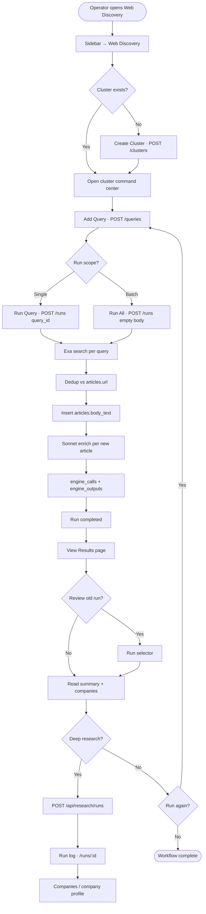
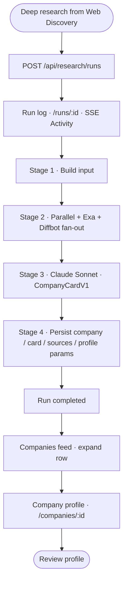

# P1-01 — Core Operator Workflow (Admin Console)

| Field | Value |
|-------|-------|
| **Document ref** | P1-01-Admin |
| **Title** | Core Operator Workflow — Admin Console |
| **Version** | 3.1 |
| **Last updated** | 2026-06-16 |
| **Controlling doc** | [P1-00 Overview](./phase-1-overview.md) |
| **Paired doc** | [P1-01-User](./P1-01-user.md) — same app, analyst reading journey |

---

## 1. Introduction

The **NORAD Intel Engine** (`apps/web` + `apps/api`) is a **single application**. This document describes the **operator workflow**: configuring scope, running pipelines, and monitoring output.

**Paired document:** [P1-01-User](./P1-01-user.md) describes the same screens from the **analyst reading journey** (results → Deep research → company profile). Terminology below is shared between both documents.

**Primary workflow (P1-01):** `Cluster → Query → Run → Article ingest → Sonnet enrich → Results → Deep research (per company)`.

Route: `/discover-web` (sidebar: **Web Discovery**).

**Deep research workflow:** Triggered via **Deep research** on a company mentioned in a Web Discovery result, or manually from Companies. Documented in §3.

**Supporting workflow:** Settings (§7) configures **deep research** engines only.

Each workflow section uses the same format: component table → flow line → short explanation → complete pipeline diagram at the end.

| Block | Purpose |
|-------|---------|
| **What the operator is trying to do** | The goal of this step in the operator journey |
| **UI guide** | Component, action, **action type**, and backend effect |
| **Flow** | One-line click path |
| **Failure states** | What the operator sees and what the system does when something goes wrong |
| **Diagram** | Complete pipeline map *(end of each workflow)* |

**Action types:** `Read` · `Navigate` · `Configure` · `Run` · `Monitor` · `Research` · `Cancel` · `Dismiss` · `Filter` · `—`

### 1.1 Definitions used in this document

**AI analyzes results** means any LLM step inside a pipeline that grades, ranks, extracts, synthesizes, or interprets data — not only a separate post-run analysis button.

| Term | Meaning in this codebase |
|------|--------------------------|
| **Save** | User explicitly bookmarks a result. Distinct from automatic persistence (pipelines write to DB by design). **Not implemented** on Web Discovery results UI today. |
| **Dismiss** | Remove an article from the active feed (`POST /api/web-discovery/articles/:id/dismiss`). **API only** — no UI button yet. |
| **Deep research** | Full Company Card pipeline (`POST /api/research/runs`) for a named company. Replaces the old “Escalate article → research” wording. |
| **Enrich** | Per-article Sonnet step in Web Discovery: executive summary + `mentioned_companies` on `articles`. |

See §5 for disposition matrix.

### 1.2 Section pairing (Admin ↔ User)

| Topic | This doc (Admin) | [P1-01-User](./P1-01-user.md) |
|-------|------------------|-------------------------------|
| Web Discovery | §2 — configure clusters, run queries | §2 — read enriched results |
| Deep research | §3 — trigger, monitor, cancel | §3 — watch run log, open profile |
| Companies | §3.3–3.5 | §4 |
| Settings | §7 — engine configuration | §6 — status + config (same screen) |
| Dashboard | §8 | §5 |
| Phase 2 (not built) | — | §7 |

---

## 2. Workflow — Cluster discovery (primary)

### 2.1 Overview

| Attribute | Value |
|-----------|-------|
| **Route** | `/discover-web` |
| **Sidebar** | Web Discovery |
| **Pipeline** | Cluster runs (`source_kind = web_discovery`) |
| **Backend** | `routers/web_discovery.py` → `services/web_discovery.py` (`safe_execute_web_discovery_run`) |
| **Flow start** | Operator creates or opens a cluster |
| **Flow end** | Operator reviews Sonnet-enriched results; optional Deep research per company |

Operators define themed search clusters, add Exa queries, run one query or all active queries in a cluster, and review enriched article cards (summary, companies, full text).

---

### 2.2 Create search cluster

**What the operator is trying to do:** Define a themed search scope — keywords, geography, sources — before adding queries or running Exa searches.

| Component | Action | Action type | Backend |
|-----------|--------|-------------|---------|
| **Create Cluster** button | Click on cluster list page | Navigate | Opens create dialog |
| **Cluster form** (name, keywords, geography, sources, signal priorities) | Fill and submit | Configure | `POST /api/web-discovery/clusters` → `web_discovery_clusters` |
| Auto-navigation | On success | Navigate | Routes to cluster command center |

**Flow:**

`Sidebar → Web Discovery` → `Create Cluster (click)` → `Fill form (submit)` → `Cluster command center`

The operator names the cluster and sets scope tags (include/exclude keywords, geography, source preferences, signal priorities). On save, the API persists the cluster and opens the command center for that cluster.

**Failure states:**

| Condition | What the operator sees | What the system does |
|-----------|------------------------|----------------------|
| Required fields missing | Inline validation; submit blocked | Cluster not saved |
| Duplicate cluster name | Error toast | `POST` rejected — operator renames |

---

### 2.3 Add search query

**What the operator is trying to do:** Add one Exa search definition inside the cluster — the unit that actually runs when the operator hits **Run**.

| Component | Action | Action type | Backend |
|-----------|--------|-------------|---------|
| **+ Add Query** button | Click on cluster page | Navigate | Navigates to query editor |
| **Query form** (label, search text, search type, result count, content modes, filters) | Fill and save | Configure | `POST /api/web-discovery/clusters/:id/queries` → `web_discovery_queries` |
| **Save Query** (edit mode) | Click | Configure | `PUT /api/web-discovery/queries/:id` |

**Flow:**

`Cluster command center` → `+ Add Query (click)` → `Query form (fill + save)`

Each query is an Exa search definition. The form pre-fills search text from the cluster keywords.

**Query LLM fields** (`system_prompt`, `output_schema`) are persisted on `web_discovery_queries` but **are not executed** at run time. Article enrichment uses a fixed Sonnet tool in `web_discovery.py` (executive summary + mentioned companies).

**Failure states:**

| Condition | What the operator sees | What the system does |
|-----------|------------------------|----------------------|
| Empty search text | Validation error | Query not saved |
| Cluster has no active queries at run time | Toast when running batch later | Run blocked until at least one active query exists |

---

### 2.4 Run query or cluster

**What the operator is trying to do:** Execute Exa searches and produce fresh web results — single query or full cluster batch.

| Component | Action | Action type | Backend |
|-----------|--------|-------------|---------|
| **Run All Cluster Queries** | Click → confirm | Run | `POST /api/web-discovery/clusters/:id/runs` with `{}` — runs all active queries sequentially |
| **Run Query** | Click on query editor | Run | `POST .../runs` with `{ query_id }` — single query only |
| **Create & Run Query** | Click on new query form | Run | Creates query then starts single-query run |

**Flow (single query):**

`Query editor` → `Run Query (click)` → `SSE activity log` → `Results page (auto)`

**Flow (full cluster):**

`Cluster command center` → `Run All Cluster Queries (click + confirm)` → `Results tab (monitor)`

Both paths create a `runs` row with `source_kind = web_discovery`. Maximum **5** concurrent web discovery runs system-wide. Execution is **in-process** (`asyncio.create_task` in the API) — no separate worker process.

---

### 2.5 Monitor the run

**What the operator is trying to do:** Watch the run complete and confirm Exa returned results before opening the results page.

| Component | Action | Action type | Backend |
|-----------|--------|-------------|---------|
| **Activity log** (query editor) | Watch inline while running | Monitor | SSE `run_events` per query |
| **Results tab** (cluster page) | Switch tab after batch run | Monitor | Polls cluster runs every 5 s |
| Progress | — | Read | `runs.status`: `queued` → `researching` → `completed` / `failed` |

**Flow:**

`Run started` → `Activity log (watch Exa + enrich events)` → `Run completed toast` → auto-navigate to results (single-query path)

For each active query the backend:

1. Calls Exa search (+ contents per query flags) → `engine_calls`
2. Dedupes against `articles.url`
3. Inserts new rows into `articles` with `body_text`
4. Runs Claude Sonnet enrich per new article (up to 4 concurrent) → `articles.summary`, `articles.mentioned_companies`
5. Appends enriched hits to `runs.engine_outputs`

**Failure states:**

| Condition | What the operator sees | What the system does |
|-----------|------------------------|----------------------|
| Cluster paused | Toast error (HTTP 400) | Run not started |
| No active queries | Toast error (HTTP 400) | Run not started |
| 5 concurrent web discovery runs | Toast error (HTTP 429) | Run rejected until slot free |
| Exa error on one query (batch) | Warning in activity log | Other queries in batch continue |
| Pipeline crash | `failed` status; error on results page | Run stops; partial `engine_outputs` may exist |
| Empty results | Completed run with zero sources | Operator adjusts query scope and re-runs |
| Sonnet enrich fails (one article) | Card without executive summary | Run continues; `enriched: false` on hit |

---

### 2.6 View results

**What the operator is trying to do:** Read NORAD analysis per source, compare runs, and start Deep research on companies mentioned in a story.

| Component | Action | Action type | Backend |
|-----------|--------|-------------|---------|
| **Results page** | Open after run or from query list | Navigate | `GET /api/web-discovery/queries/:id/results?run_id=` |
| **Run selector** | Pick a past run | Filter | Loads historical slice; hydrates from `articles` table |
| **Filter / Sort** | Client-side | Filter | Title, URL, summary text |
| **Executive summary** | Read | Read | `articles.summary` (Sonnet) |
| **Companies in this story** | Read list | Read | `articles.mentioned_companies` |
| **Deep research** | Click per company | Research | `POST /api/research/runs` → navigate to `/runs/:id` |
| **Full article** | Expand collapsible | Read | `articles.body_text` (cleaned for display) |
| **Source excerpts (Exa)** | Read | Read | Shown only when no executive summary exists |
| **Run again** | Click → confirm | Run | Returns to query editor |
| **Edit query** | Click | Navigate | Query editor |

**Flow:**

`Run complete` → `Results page` → `Read summary + companies` → optional `Deep research` on a company

**Content modes:** If neither highlights nor full text is enabled on the query, cards may show a warning (“Limited content…”) and thin `body_text`. Enable **Highlights** or **Full text** on the query and re-run.

**Failure states:**

| Condition | What the operator sees | What the system does |
|-----------|------------------------|----------------------|
| Enrich failed for one article | “Analyzed” badge may be missing; no summary block | Hit still in results; Exa data retained; `enriched: false` |
| Duplicate URL | “Previously ingested” badge | Skips re-enrich; summary loaded from existing `articles` row |
| Expecting Save / Dismiss buttons | Not on UI | See §5 — API dismiss exists; save not built |

---

### 2.7 AI analysis (Web Discovery enrich)

**What the operator is trying to do:** Understand what AI runs automatically on each new article during a Web Discovery run.

| Step | LLM? | When | Detail |
|------|------|------|--------|
| Exa search | No | Per query | Vendor search + optional contents |
| Article enrich | **Yes — Claude Sonnet** | Per **new** article (not duplicates) | Tool `analyze_article`: executive summary + companies with role/context |
| Query `system_prompt` / `output_schema` | No | — | Stored only; not executed |
| User Deep research | Yes — full pipeline | On button click | Separate `research` run (§3) |

**Persisted:**

| Field | Table |
|-------|-------|
| `summary`, `mentioned_companies`, `body_text` | `articles` |
| Per-hit enrich fields + `article_id`, `ingest_status`, `enriched` | `runs.engine_outputs` |

**Failure states:**

| Condition | What the operator sees | What the system does |
|-----------|------------------------|----------------------|
| Sonnet timeout / error | Card without executive summary; may fall back to Exa excerpts | `enriched: false`; run still completes |
| Empty body (no highlights/text) | Limited-content warning | Enrich may produce thin or empty summary |

---

### 2.8 End-to-end flow

**Flow:**

`Sidebar → Web Discovery` → `Create Cluster` → `Add Query` → `Run Query or Run All` → `Monitor activity` → `View Results` → `Read enrich` → optional `Deep research` on a company

This is the primary P1-01 operator path on the admin console.

---

### 2.9 Complete pipeline diagram — Cluster discovery

---

### 2.10 Alternate paths

| Path | How | End point |
|------|-----|-----------|
| Single query run | **Run Query** on query editor | That query's results page |
| Full cluster batch | **Run All Cluster Queries** on cluster page | Results tab; per-query results via query list |
| Review old results | **Run selector** on results page | Historical `engine_outputs` slice |
| Re-run query | **Run again** on results page | New run → fresh results |
| Edit scope mid-flow | Cluster **Settings** tab or query **Edit** | Updated config on next run |

---

### 2.11 Errors and limits

*Summary table — per-step failure states are in §2.2–2.6 above.*

| Condition | UI response |
|-----------|-------------|
| Cluster paused | Toast error (HTTP 400) |
| No active queries | Toast error (HTTP 400) |
| 5 concurrent web discovery runs | Toast error (HTTP 429) |
| Exa error on one query | Warning in activity log; other queries continue in batch |
| Pipeline crash | `failed` status; error on results page |
| Empty results | Completed run with zero sources |

---

## 3. Workflow — Deep Research

### 3.1 Overview

| Attribute | Value |
|-----------|-------|
| **Entry (Web Discovery)** | **Deep research** on a company in results (§2.6) |
| **Entry (monitor)** | `/companies`, `/companies/:id`, `/runs/:id` |
| **Entry (API)** | `POST /api/research/runs` with `{ company_name, domain_hint? }` |
| **Pipeline** | Deep research (`source_kind = research`) |
| **Backend** | `services/research.py` |
| **Output** | `CompanyCardV1` in `companies`, `cards`, `sources`, `card_profile_parameters` |

Deep research builds a structured company profile from web evidence. The primary entry from Web Discovery is **Deep research** on a `mentioned_companies` row; the Companies page is where operators monitor runs and read completed profiles.

---

### 3.2 Start research from Web Discovery result

**What the operator is trying to do:** Run the full Company Card pipeline for a company named in an enriched article.

| Component | Action | Action type | Backend |
|-----------|--------|-------------|---------|
| **Deep research** button (per company) | Click | Research | `POST /api/research/runs` with `{ company_name, domain_hint? }` |
| Post-start navigation | Auto | Navigate | `/runs/:run_id` (live Activity feed) |

**Flow:**

`Web Discovery → Results page → Companies in this story → Deep research (click)` → `Run log page`

There is **no** article-level **Escalate** button on the results page. Research is company-scoped.

**Failure states:**

| Condition | What the operator sees | What the system does |
|-----------|------------------------|----------------------|
| 5 concurrent research runs | Toast error (HTTP 429) | Run rejected until slot free |
| Research already running for company | Activity shows in-flight run | New run allowed per API admission rules |

---

### 3.3 Companies page — browse and monitor

**What the operator is trying to do:** Monitor in-flight research runs and open completed company profiles.

| Component | Action | Action type | Backend |
|-----------|--------|-------------|---------|
| **Activity** panel (left) | Watch timeline for focused company | Monitor | SSE `run_events`; shows stages, costs, backfill events (§4.1) |
| **Company row** (collapsed) | Click row header | Navigate | Expands excerpt; Activity panel switches to that company's latest run |
| **Status pill** | Read | Read | `Profiling…` (live), `Done` (completed), or `failed` / `cancelled` |
| **Profile completeness** | Read (when card exists) | Read | From `cards.profile_completeness_pct` |
| **Run count** | Read | Read | e.g. `6 RUNS` — number of research passes for this company |

**Flow:**

`Sidebar → Companies` → `Click company row (expand)` → `Activity panel (watch)`

On load: `GET /api/research/feed`. Live rows poll every 3 s; completed rows every 15 s. Expanding a row lazy-loads the card excerpt via `GET /api/research/companies/:id`.

---

### 3.4 Expanded company row — objects and actions

**What the operator is trying to do:** Read the research excerpt, open the full profile or run log, or cancel a live run.

| Object / button | Action | Action type | Backend |
|-----------------|--------|-------------|---------|
| **Strategic fit** block | Read summary excerpt | Read | From `cards.card.strategic_fit.fit_summary` |
| **View run log →** | Click | Navigate | Navigate to `/runs/:id` — full run header + Activity feed |
| **Cancel run** | Click while profiling (live only) | Cancel | `POST /api/research/runs/:id/cancel` |
| **Open full page →** | Click | Navigate | Navigate to `/companies/:id` |

**Flow:**

`Expanded row` → `View run log` or `Open full page` → optional `Cancel run` (if live)

**Cancel run** stops the pipeline at the next checkpoint. Engine calls already in flight may finish, but no company/card is saved from that run.

**Failure states:**

| Condition | What the operator sees | What the system does |
|-----------|------------------------|----------------------|
| Run cancelled | Row shows `cancelled` | No card saved from that run |
| Run failed | Row shows `failed` | No card saved — operator may start Deep research again from Web Discovery results |
| Card excerpt loading | Spinner on expand | Lazy-load via `GET /api/research/companies/:id` |

---

### 3.5 Company detail page (`/companies/:id`)

**What the operator is trying to do:** Read the full company profile — strategic fit, sources, profile completeness, and research evidence.

| Component | Action | Action type | Backend |
|-----------|--------|-------------|---------|
| **Company header** | Read name, domain, confidence pills | Read | `GET /api/research/companies/:id` |
| **Follow / Signal Alert / Share** | Click | — | **No handler** — UI shell only |
| **Key facts panels** | Read classification, financials, team | Read | From `CompanyCardV1` JSON |
| **Strategic Fit** section | Read narrative | Read | LLM-synthesized `fit_summary` in Stage 3 |
| **Sources** section | Read cited URLs | Read | `sources` table |
| **Research Evidence** | Expand engine I/O | Read | `GET /api/research/companies/:id/evidence` |
| **Profile Completeness** | Expand audit groups | Read | `GET /api/research/companies/:id/profile-completeness` |
| **Profile history** | Click a past run row | Navigate | `/runs/:id`; cancel available on in-flight runs |
| **Cancel run** (history) | Click on active run | Cancel | `POST /api/research/runs/:id/cancel` |

**Flow:**

`Companies → Open full page` → `Review card sections` → optional `Research Evidence` or `Profile history → View run log`

---

### 3.6 Run log page (`/runs/:id`)

**What the operator is trying to do:** Monitor or review a single research run's pipeline stages and activity log.

| Component | Action | Action type | Backend |
|-----------|--------|-------------|---------|
| **Run header** | Read status, progress, company link | Read | `GET /api/research/runs/:id` (polls every 2 s while live) |
| **Stages summary** | Read completed pipeline stages | Read | From run record |
| **Activity feed** (right) | Watch or review saved log | Monitor | SSE when live; **Archive** label when complete |
| **Open company** CTA | Click when run completed | Navigate | Links to `/companies/:id` |

**Flow:**

`View run log` → `Monitor Activity` → `Open company` (when done)

| Stage | Engine | What happens |
|-------|--------|--------------|
| 1 — Build input | Application | Loads source context if provided (search result URL, article provenance) |
| 2 — Fan-out | Parallel + Exa + Diffbot | Structured brief, web content, entity record |
| 3 — Synthesize | Claude Sonnet 4.5 | Company Card fact blocks + sources; BD signals/scores stripped |
| 4 — Persist | Application | Writes `companies`, `cards`, `sources`, `card_profile_parameters` |

---

### 3.7 Complete pipeline diagram — Deep Research

---

### 3.8 Errors, fallbacks, and limits

*Summary table — per-step failure states are in §3.2–3.4 above.*

| Condition | Backend behaviour | UI response |
|-----------|-------------------|-------------|
| One engine fails in Stage 2 | Run continues with other engines | Activity shows partial OK/FAIL |
| All engines fail in Stage 2 | Run `failed`; no card saved | Error in Activity; failed status on row |
| Validation fails after coerce | Run `failed`; no orphan card | Error in Activity |
| 5 concurrent research runs | HTTP 429 | Toast error |
| User cancels run | `cancelled`; no card from that run | Row shows cancelled |

---

## 4. LLM processing by pipeline

Any row below counts as **AI analyzes results** per §1.1.

| Pipeline | Stage | LLM | What it does | Persisted to |
|----------|-------|-----|--------------|--------------|
| Web Discovery | Per new article | Claude Sonnet | Executive summary + mentioned companies | `articles`, `runs.engine_outputs` |
| Web Discovery | Search | — | Exa search + contents | `engine_calls`, `articles.body_text` |
| Deep Research | 3 — Synthesize | Claude Sonnet | Full Company Card fact blocks | `cards.card`, `sources`, `card_profile_parameters` |

### 4.1 AI failure and fallback behaviour

When an LLM or AI step fails, the pipeline may **skip**, **fall back to other engines**, **deterministically backfill**, or **auto-retry** — depending on the stage. There is no generic retry on every Claude call.

#### Deep research

| Stage | If AI / step fails | Fallback behaviour |
|-------|-------------------|-------------------|
| 2 — Engine fan-out | One engine fails (Parallel, Exa, or Diffbot) | **Run continues** with remaining engines |
| 2 — Engine fan-out | All three engines fail | **Run fails** — no card saved |
| 3 — Sonnet synthesize (validation) | Pydantic validation error on card JSON | **Auto-coerce** bare scalars into `Valued[]` wrappers and re-validate once |
| 3 — Sonnet synthesize (thin output) | After first pass: sources backfilled from registry; Parallel/Diffbot fields promoted | **Deterministic backfill** — no extra LLM cost |
| 3 — Sonnet synthesize (hard failure) | Validation still fails after coerce, or unrecoverable synth error | **Run fails** — no card saved |

Activity panel events for research fallbacks include: `sources_backfilled`, `parallel_fields_promoted`, `diffbot_fields_promoted`, `synthesis_coerce_recovered`.

#### Web Discovery

| Step | If step fails | Fallback behaviour |
|------|--------------|-------------------|
| Exa search (per query in batch) | Exa error on one query | Warning in activity log; **other queries continue** |
| Article insert | Duplicate URL | Skip insert; hydrate summary from existing `articles` row |
| Sonnet enrich (per article) | Timeout / API error | Article row kept; `enriched: false`; run continues |

---

## 5. Save, dismiss, and escalate

Automatic persistence (pipeline writes to DB) is **not** the same as a user **Save** action.

| Action | Web Discovery | Deep Research |
|--------|---------------|---------------|
| **Auto-persist** | Yes — `articles` + `runs.engine_outputs` | Yes — `companies`, `cards`, `sources`, `card_profile_parameters` |
| **User Save / bookmark** | **Not implemented** (UI) | N/A |
| **User Dismiss** | **API only** (`POST …/articles/:id/dismiss`) — no UI | N/A |
| **Deep research** | Per-company button on results page | N/A (this pipeline) |
| **Archive (Activity label)** | Label on finished run log | Label on finished run log — not delete |

**Summary**

- **Enriched automatically:** Every new article gets Sonnet summary + companies during the run.
- **Deep research:** Operator-triggered per company from results (§3.2).
- **Dismiss:** Backend endpoint exists; UI not wired.
- **Save:** Not built.

---

## 6. P1-01 document completion

This section records deliverable coverage for the core workflow specification.

### 6.1 Primary user outcome

Operators configure web search scope (clusters and queries), execute Exa searches with automatic Sonnet enrichment, review executive summaries and mentioned companies, and start Deep research on selected companies.

### 6.2 Required flow coverage

| Required step | Web Discovery | Deep Research |
|---------------|---------------|---------------|
| Login | Single-user (no auth UI) | Same |
| Create cluster | ✓ | — |
| Add queries | ✓ | — |
| Run query or cluster | ✓ | — |
| View results | Enriched results page | Company Card page |
| AI analyzes results | Sonnet per article (enrich) | Sonnet synthesis (facts + sources) |
| Review companies in story | Results page | Company profile page |
| User save | **Not built** | — |
| User dismiss | **API only** | — |
| Deep research | Per company on results | This pipeline |

### 6.3 Screens involved

| Screen | Route | Workflow |
|--------|-------|----------|
| Web Discovery list | `/discover-web` | Primary |
| Cluster command center | `/discover-web/clusters/:id` | Primary |
| Query editor | `.../queries/new` or `.../queries/:id` | Primary |
| Query results | `.../queries/:id/results` | Primary |
| Companies | `/companies`, `/companies/:id` | Deep research output (§3.3–3.5) |
| Run log | `/runs/:id` | Research event stream (§3.6) |
| Settings | `/settings` | Engine config (§7) |

### 6.4 Checklist answers

| Question | Answer |
|----------|--------|
| Can users run a single query, or only a full cluster? | **Both** on Web Discovery. |
| Can results be saved, dismissed, or escalated? | See §5. |
| What is AI analysis? | Web Discovery: Sonnet enrich per article. Research: Sonnet Company Card synthesis (§4). |
| What happens when a run fails? | Toast + error; `runs.status = failed`; operator can re-run. |
| What happens when AI analysis fails? | See §4.1. **Research:** engine partial-failure tolerated; deterministic source backfill; hard validation failure fails the run. |

### 6.5 Completion status

| Requirement |
| ------------- |
| Primary workflow (Cluster discovery) |
| Alternate paths |
| Deep research + Companies UI guide |
| Settings workflow |
| LLM inventory (AI analysis definition) |
| Save / dismiss / escalate — actual behaviour |
| User frontend perspective | Paired with [P1-01-User](./P1-01-user.md) |
| Admin doc approved | v3.0 — 2026-06-19 |

---

## 7. Workflow — Settings

### 7.1 Overview

| Attribute | Value |
|-----------|-------|
| **Route** | `/settings` |
| **Sidebar** | Settings (footer) |
| **Affects** | Deep research runs only (next run after save) |

---

### 7.2 System status

**What the operator is trying to do:** Confirm Postgres and Redis are reachable before running pipelines.

| Component | Action | Action type | Backend |
|-----------|--------|-------------|---------|
| **Postgres (GCP Cloud SQL)** status | Read | Read | `GET /health/db` |
| **Redis** status | Read | Read | Same health check (optional if `REDIS_URL` unset) |

---

### 7.3 Research engine configuration

**What the operator is trying to do:** Tune Parallel, Exa, and Diffbot settings so the next deep research run uses the right cost/quality trade-off.

| Component | Action | Action type | Backend |
|-----------|--------|-------------|---------|
| **Parallel — Processor** | Select tier (lite → ultra8x) | Configure | Stored in `app_kv` key `research_config` |
| **Parallel — Timeout** | Set seconds (60–3600) | Configure | Same |
| **Exa — Search type** | Select (auto, fast, neural, keyword, deep) | Configure | Same |
| **Exa — Deep model** | Select when search type = deep | Configure | Same |
| **Exa — Results per query** | Set count (1–50) | Configure | Same |
| **Diffbot — Enabled** | Toggle on/off | Configure | Same |
| **Diffbot — Score threshold** | Set 0.0–1.0 | Configure | Same |
| **Save changes** | Click (enabled when dirty) | Configure | `PUT /api/settings/research` |

**Flow:**

`Sidebar → Settings` → `Adjust engine parameters` → `Save changes (click)`

Changes apply to the **next** research run, not runs already in flight. In production (`debug=False`), save requires `X-Admin-Token` header.

**Failure states:**

| Condition | What the operator sees | What the system does |
|-----------|------------------------|----------------------|
| Save without admin token (prod) | 403 error toast | Settings not persisted |
| In-flight research run | Run unaffected | New config applies on **next** run only |
| Invalid threshold value | Inline validation | Save blocked |

---

### 7.4 End-to-end flow

**Flow:**

`Settings` → `Tune Parallel / Exa / Diffbot` → `Save changes` → `Next deep research run uses new config`

---

## 8. Additional admin screens

| Screen | Route |
| -------- | ------- |
| Dashboard | `/` | Health tile + CTA to Web Discovery; run feed placeholder |

---

## 9. Approval

| Role | Name | Date |
| ------ | ------ | ------ |
| Author | Huzaifa | 2026-06-19 |
| Reviewer | Shehrayar Haq | — |
