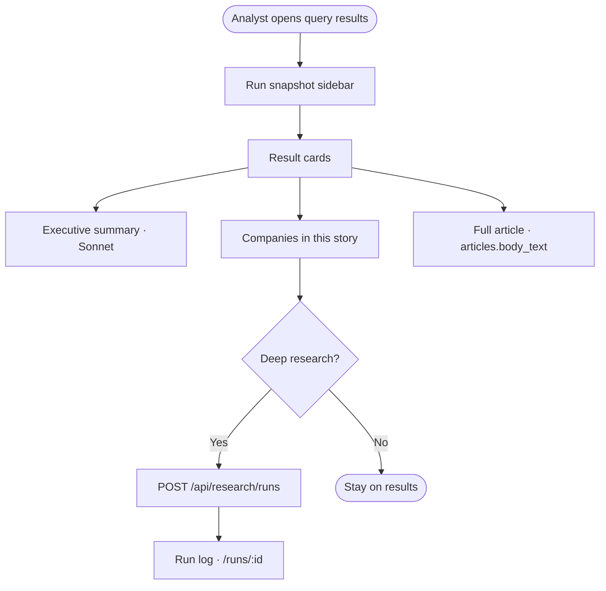
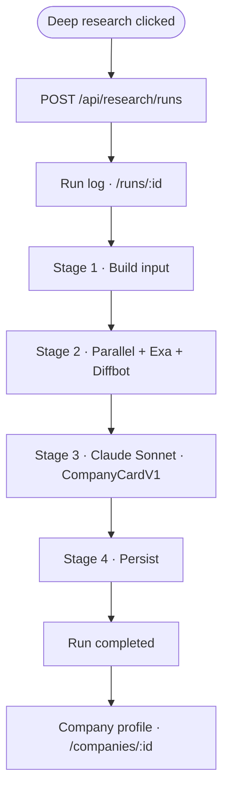
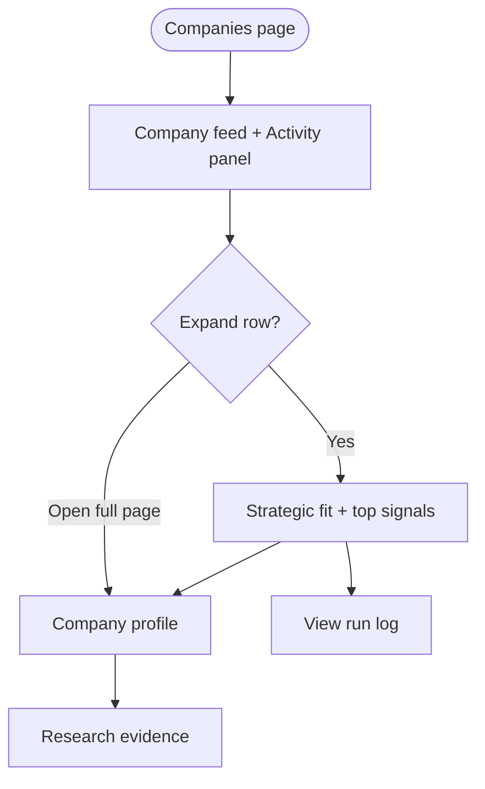
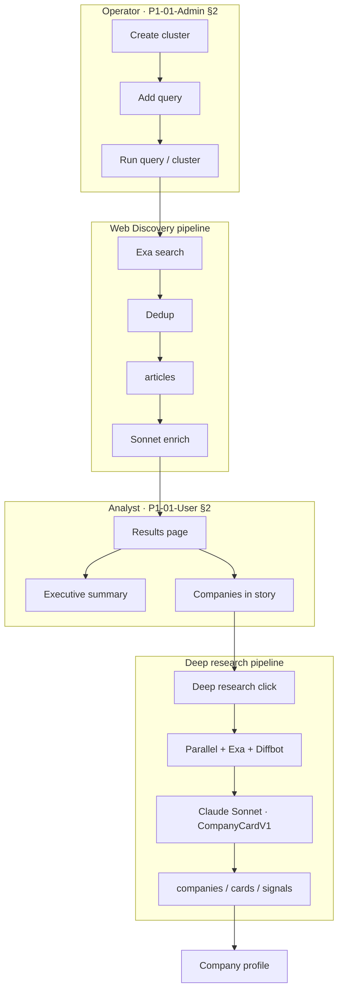

# P1-01 — Core Analyst Workflow

| Field | Value |
|-------|-------|
| **Document ref** | P1-01-User |
| **Title** | Core Analyst Workflow |
| **Version** | 2.0 |
| **Last updated** | 2026-06-19 |
| **Audience** | Stakeholders, product, analysts |
| **Controlling doc** | [P1-00 Overview](./phase-1-overview.md) |
| **Paired doc** | [P1-01-Admin](./P1-01-admin.md) — same app, operator configure/run journey |

---

## 1. Introduction

NORAD is delivered as **one web application** (`apps/web`). There is no separate analyst-only app in this repository.

This document describes the **analyst reading journey**: how a user consumes intelligence after an operator (often the same person) has configured and run Web Discovery. It uses plain language for what the user sees and clicks. **Behind the scenes** blocks summarise pipelines without implementation detail.

**Operator actions** (create cluster, run query, tune Settings) are documented in [P1-01-Admin](./P1-01-admin.md). This document covers **read and decide** steps on the same routes.

| Block | Purpose |
|-------|---------|
| **What the user is trying to do** | Goal of this step in the analyst journey |
| **UI guide** | Component, user action, **action type**, what the user sees |
| **Behind the scenes** | Short pipeline note (engines, LLM, what gets saved) |
| **Flow** | One-line click path |
| **Failure states** | What the user sees when something goes wrong |
| **Diagram** | Visual map *(end of major workflows)* |

**Action types:** `Read` · `Navigate` · `Filter` · `Research` · `Cancel` · `—` (display only)

### 1.1 Shared terminology (with Admin doc)

| Term | Meaning |
|------|---------|
| **Web Discovery** | Exa search pipeline: cluster → query → run → articles |
| **Enrich** | Automatic Claude Sonnet step per new article: executive summary + companies mentioned |
| **Deep research** | Full Company Card pipeline for one company (`POST /api/research/runs`) |
| **Executive summary** | Sonnet-written paragraph on each result card — not Exa's vendor summary |
| **Companies in this story** | Entities Sonnet extracted from the article body |
| **Full article** | Original crawled text from `articles.body_text` |
| **Profiling…** | In-flight Deep research run on the Companies feed |
| **Save / Dismiss (article)** | **Not implemented** in UI today (dismiss API exists only) |

### 1.2 Section pairing (User ↔ Admin)

| Topic | This doc (User) | [P1-01-Admin](./P1-01-admin.md) |
|-------|-----------------|--------------------------------|
| Web Discovery results | §2 | §2 — configure & run |
| Deep research | §3 | §3 |
| Companies & profile | §4 | §3.3–3.5 |
| Dashboard | §5 | §8 |
| Settings | §6 | §7 |
| Phase 2 (planned) | §7 | — |

Workflows follow the analyst's typical path: **Web Discovery results → Deep research → Companies profile**.

---

## 2. Workflow — Web Discovery results

### 2.1 Overview

| Attribute | Value |
|-----------|-------|
| **Route** | `/discover-web/clusters/:clusterId/queries/:queryId/results` |
| **Reached from** | Auto after **Run Query**, or **View results** on cluster / query list |
| **Prerequisite** | Operator has run a query (see Admin §2.4) |
| **User outcome** | Read enriched articles; start Deep research on a company |

Each result card is one web source (URL). After a successful run, cards show **Executive summary**, **Companies in this story**, and **Full article** — not raw Exa highlight junk.

---

### 2.2 Results page layout

**What the user is trying to do:** Understand what NORAD found for this query and whether any company deserves a full profile run.

| Component | User action | Action type | What the user sees |
|-----------|-------------|-------------|-------------------|
| **Run snapshot** (sidebar) | Read | Read | Query label, run name, status, counts (sources / new / analyzed) |
| **Reading guide** | Read | Read | Explains Executive summary, Companies, Full article |
| **Run selector** | Pick past run | Filter | Historical results for this query |
| **Filter / Sort** | Type or sort | Filter | Client-side title / URL / summary filter |
| **Result card** — title + URL | Read / open link | Read / Navigate | Source headline, domain, date, relevance |
| **Analyzed** badge | Read | Read | Shown when Sonnet enrich succeeded |
| **Previously ingested** badge | Read | Read | URL already in `articles` — summary from existing row |
| **Executive summary** | Read | Read | Sonnet paragraph tied to the search query |
| **Companies in this story** | Read list | Read | Name, role, context, industry/market hints |
| **Deep research** | Click per company | **Research** | Starts Company Card pipeline → `/runs/:id` |
| **Full article** | Expand section | Read | Formatted paragraphs from crawled body |
| **Source excerpts (Exa)** | Read | Read | Only when no executive summary (fallback) |
| **Limited content** warning | Read | Read | Query needs Highlights or Full text enabled |
| **Run again** / **Edit query** | Click | Navigate | Returns to query editor |

**Behind the scenes:**

**Pipeline:** `Exa search → dedup → articles row → Sonnet enrich → results API hydrates from articles`

The operator's run already completed enrich for each **new** URL. The results page loads `GET /api/web-discovery/queries/:id/results`, which merges `articles.summary`, `mentioned_companies`, and `body_text` onto each hit. Duplicate URLs reuse the existing article's summary.

**Flow:**

`Web Discovery → Query results` → `Read executive summary` → `Review companies` → optional `Deep research`

**Failure states:**

| Condition | What the user sees | What the system does |
|-----------|-------------------|----------------------|
| No executive summary | Yellow limited-content warning or Exa excerpts only | Thin `body_text` or enrich failed — enable content modes and re-run |
| Enrich failed | No **Analyzed** badge; no summary block | `enriched: false`; Exa metadata still shown |
| Duplicate article | **Previously ingested** badge | Summary from existing `articles` row |
| No companies in story | Companies section empty | Sonnet found none — no Deep research targets on that card |

---

### 2.3 Reading guide (sidebar)

The sidebar **Reading guide** defines three blocks the user should expect on each card:

| Block | What it is |
|-------|------------|
| **Executive summary** | NORAD (Sonnet) analysis tied to the search query |
| **Companies** | Entities mentioned — **Deep research** runs a full company profile |
| **Full article** | Original crawled content from the source URL |

This matches the implemented UI in `WebDiscoveryQueryResults.tsx`.

---

### 2.4 End-to-end flow and diagram

**Flow:**

`Open results` → `Pick run (optional)` → `Read cards` → `Deep research on a company`



*Configure/run steps (cluster, query, Run button): [P1-01-Admin §2](./P1-01-admin.md)*

---

## 3. Workflow — Deep research

### 3.1 Overview

| Attribute | Value |
|-----------|-------|
| **Typical entry** | **Deep research** on Web Discovery results (§2) |
| **Run log route** | `/runs/:id` |
| **Pipeline** | `source_kind = research` |
| **Output** | Company Card on `/companies/:id` when complete |

Deep research is the expensive pipeline: Parallel + Exa + Diffbot evidence → Claude Sonnet → `CompanyCardV1`.

---

### 3.2 Start from Web Discovery

**What the user is trying to do:** Promote one company mentioned in a story into a full intel profile.

| Component | User action | Action type | What the user sees |
|-----------|-------------|-------------|-------------------|
| **Deep research** button | Click | Research | Toast "Research started…"; navigates to run log |
| **Run log** (`/runs/:id`) | Watch | Read / Monitor | Status pill, stage list, Activity feed (SSE) |

**Behind the scenes:**

**Pipeline:** `POST /api/research/runs` → Stages 1–4 (see §3.4) → `companies` + `cards` + `signals` + `sources`

There is **no** **+ ADD**, **Escalate**, or **Pending review** queue in the current app. Research starts immediately on button click.

**Flow:**

`Results → Companies in this story → Deep research (click)` → `Run log page`

**Failure states:**

| Condition | What the user sees | What the system does |
|-----------|-------------------|----------------------|
| 5 runs already in flight | Error toast (HTTP 429) | New run rejected |
| Run fails | Failed status on run log | No company card saved |
| User cancels (from Companies) | Cancelled status | No card from that run |

---

### 3.3 Run log page (`/runs/:id`)

**What the user is trying to do:** Watch Deep research complete and jump to the company profile.

| Component | User action | Action type | What the user sees |
|-----------|-------------|-------------|-------------------|
| **Status pill** | Read | Read | `queued` → `researching` → `completed` / `failed` |
| **Stages** | Read | Read | Build input → Fan-out → Synthesize → Persist |
| **Activity feed** | Watch | Monitor | Live SSE events; costs and engine steps |
| **Open company** CTA | Click when done | Navigate | Links to `/companies/:id` |

**Flow:**

`Deep research clicked` → `Run log` → `Activity feed` → `Open company` (when completed)

---

### 3.4 Deep research stages (behind the scenes)

| Stage | Tool / engine | What it does |
|-------|---------------|--------------|
| **1 — Build input** | Application | Company name + optional domain hint |
| **2 — Fan-out** | **Parallel** | Structured research brief |
| **2 — Fan-out** | **Exa** | Deep web search + page contents |
| **2 — Fan-out** | **Diffbot** | Knowledge-graph entity record |
| **3 — Synthesize** | **Claude Sonnet** | Merges evidence into `CompanyCardV1` + signals |
| **3 — Retry** | **Claude Sonnet** | One automatic retry if signals too thin |
| **4 — Persist** | Application | Saves company, card, signals, sources |

Stage 2 tolerates partial engine failure. All three failing stops the run with no saved card.



*Operator monitoring / cancel: [P1-01-Admin §3.3–3.6](./P1-01-admin.md)*

---

## 4. Workflow — Companies & company profile

### 4.1 Overview

| Attribute | Value |
|-----------|-------|
| **List route** | `/companies` |
| **Profile route** | `/companies/:id` |
| **Purpose** | Monitor in-flight research; read completed Company Cards |

**Not implemented today:** Watchlist tab, Pending review queue, **+ Add company** manual bookmark, daily monitoring auto-append.

---

### 4.2 Companies feed

**What the user is trying to do:** See every company with a saved profile and track live research.

| Component | User action | Action type | What the user sees |
|-----------|-------------|-------------|-------------------|
| **Activity panel** (left) | Watch | Monitor | SSE feed for focused company's latest run |
| **Company row** | Click to expand | Navigate | Collapsed: name, status, score, run count |
| **Status** | Read | Read | **Profiling…** (live), **Done**, `failed`, `cancelled` |
| **Strategic fit excerpt** | Read | Read | Summary + recommendation when expanded |
| **Top signals** | Read | Read | First signals from card |
| **View run log →** | Click | Navigate | `/runs/:id` |
| **Open full page →** | Click | Navigate | `/companies/:id` |
| **Cancel run** | Click (live only) | Cancel | Stops pipeline at next checkpoint |

**Behind the scenes:**

**Pipeline:** `GET /api/research/feed` — groups runs by company; polls every 3 s when live, 15 s when idle.

**Flow:**

`Sidebar → Companies` → `Expand row` → `Activity panel` or `Open full page`

**Failure states:**

| Condition | What the user sees | What the system does |
|-----------|-------------------|----------------------|
| No profiles yet | Empty state | Start Deep research from Web Discovery results |
| Run failed | Failed pill | No card saved for that run |
| Cancelled | Cancelled pill | No card from cancelled run |

---

### 4.3 Company profile (`/companies/:id`)

**What the user is trying to do:** Read the full deep-research output — strategic fit, signals, sources, engine evidence.

| Component | User action | Action type | What the user sees |
|-----------|-------------|-------------|-------------------|
| **Header** | Read | Read | Name, domain, fit badge, score breakdown |
| **Key facts** | Read | Read | Classification, financials, team groupings |
| **Strategic fit** | Read | Read | Narrative + recommended action |
| **Signals** | Read | Read | Signal list with evidence |
| **Sources** | Read | Read | Cited URLs |
| **Research evidence** | Expand tabs | Read | Parallel / Exa / Diffbot / synthesis I/O |
| **Must-have coverage** | Read | Read | Which card blocks are populated |
| **Profile history** | Click run | Navigate | Past `/runs/:id` entries |
| **Follow / Share / Signal alert** | Click | — | **UI shell only** — no handler |

**Behind the scenes:**

**Pipeline:** `GET /api/research/companies/:id` returns `CompanyCardV1` JSON plus denormalized `signals` and `sources`.

The profile is a **single scrollable page** (not separate Overview / People / Financials tabs). Content comes from `CompanyBriefSections`, `ResearchEvidence`, and `MustHaveCoverage` components.

**Flow:**

`Companies → Open full page` → `Read card sections` → optional `Research evidence`

---

### 4.4 Diagram — Companies journey



---

## 5. Workflow — Dashboard

### 5.1 Overview

| Attribute | Value |
|-----------|-------|
| **Route** | `/` |
| **Sidebar** | Dashboard |

### 5.2 What the user sees today

| Component | User action | What the user sees |
|-----------|-------------|-------------------|
| **Hero CTA** | Click **Open Clusters** | Navigates to `/discover-web` |
| **Stat cards** | Read | Companies / Runs / Signals counts — **placeholders (`0`)** |
| **System tile** | Read | Postgres health from `GET /health/db` |
| **Recent runs** | Read | **Placeholder** — empty state; links to Companies |

**Behind the scenes:** Dashboard does not yet aggregate live run stats. Web Discovery and research activity live on their respective pages.

**Flow:**

`Dashboard` → `Open Clusters` → `Web Discovery`

---

## 6. Workflow — Settings

### 6.1 Overview

| Attribute | Value |
|-----------|-------|
| **Route** | `/settings` |
| **Affects** | **Deep research only** (next run after save) |

Analysts and operators use the **same Settings screen**. Configuration detail: [P1-01-Admin §7](./P1-01-admin.md).

| Component | User action | What the user sees |
|-----------|-------------|-------------------|
| **Postgres (GCP Cloud SQL)** | Read status | OK / degraded |
| **Redis** | Read status | OK / skipped if unset |
| **Parallel / Exa / Diffbot** controls | Adjust + Save | Research engine tuning |

Web Discovery (Exa per-query flags) is configured on the **query editor**, not Settings.

---

## 7. Phase 2 — Planned (not built)

The following appeared in earlier Phase 1 drafts and **are not in the current app**. Documented here so stakeholders do not expect them on today's routes.

| Planned capability | Was described as | Status |
|--------------------|------------------|--------|
| Home **Top** tab | Weekly Watchlist + Industry digest | **Removed** (Today page retired) |
| Home **News** tab | Hot News table + expand article | **Removed** |
| **+ ADD** on article | Queue company → Pending review | **Replaced** by **Deep research** on results |
| **Pending review** queue | Promote / Dismiss before Watchlist | **Not built** |
| **Watchlist** monitoring | Daily auto-append signals | **Not built** |
| **Signals** page (`/signals`) | Categorized news feed | Sidebar **Soon** only |
| **Feeds** page (`/feeds`) | — | Sidebar **Soon** only |
| Scheduled cluster cron | Auto-ingest to News feed | **Not built** |
| Manual **+ Add company** | Bookmark without article | **Not built** (empty-state copy only) |

When Phase 2 ships, this section moves to P1-00 §3.2 and these workflows get full sections here.

---

## 8. Complete analyst journey

**Primary path (built today):**

`Web Discovery results` → `Read enrich` → `Deep research` → `Run log` → `Company profile`

**Supporting paths:**

`Dashboard` → `Web Discovery` · `Companies` → monitor live runs · `Settings` → tune research engines

```mermaid
flowchart LR
    WD[Web Discovery results] --> READ[Read summary + companies]
    READ --> DR[Deep research]
    DR --> RUN[/runs/:id]
    RUN --> CO[/companies/:id]
```

**Master pipeline (both personas, one app):**



---

## 9. Capability status

| Capability | User experience today |
|------------|----------------------|
| Web Discovery enriched results | **Built** — summary, companies, full article |
| Deep research from results | **Built** — per-company button |
| Run log with Activity SSE | **Built** — `/runs/:id` |
| Companies feed + expand row | **Built** |
| Company profile (CompanyCardV1) | **Built** |
| Research evidence viewer | **Built** |
| Cancel in-flight research | **Built** |
| Settings (research engines) | **Built** |
| Dashboard live stats | **Placeholder** |
| Article Save / Dismiss UI | **Not built** |
| Pending review / Promote / Watchlist | **Not built** |
| Home Top / News tabs | **Removed** |
| Signals / Feeds pages | **Soon** (nav only) |
| Manual add company | **Not built** |
| Scheduled cluster runs | **Not built** |

---

## 10. Approval

| Role | Name | Date |
|------|------|------|
| Author | Huzaifa | 2026-06-19 |
| Reviewer | — | — |
