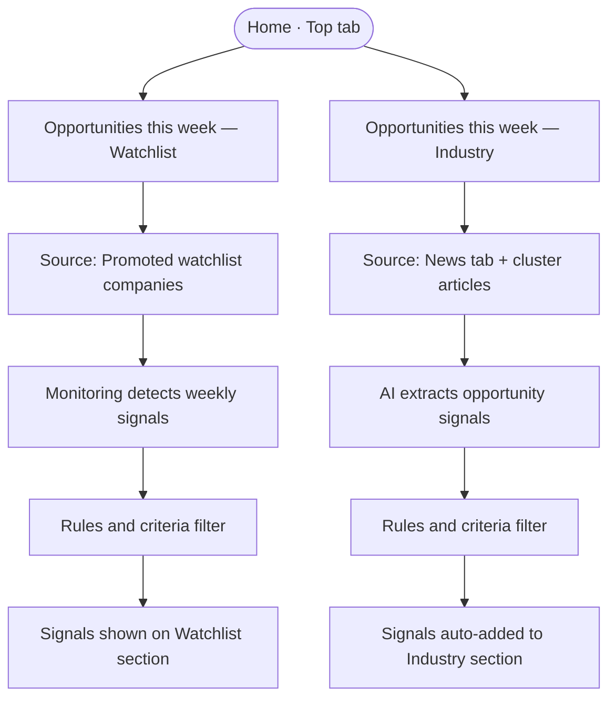
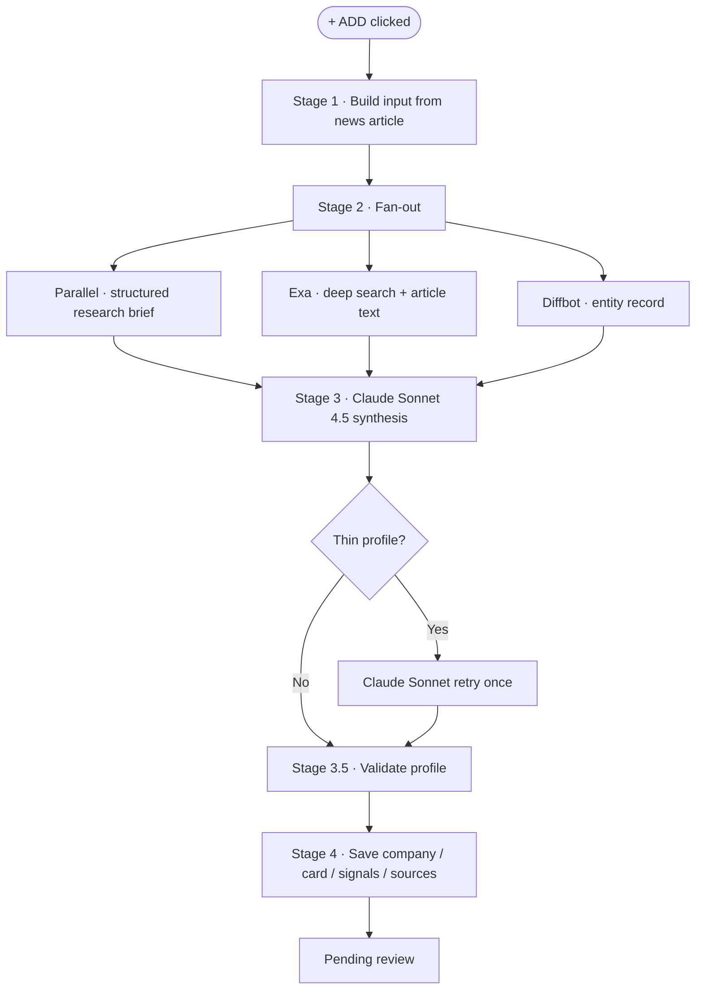
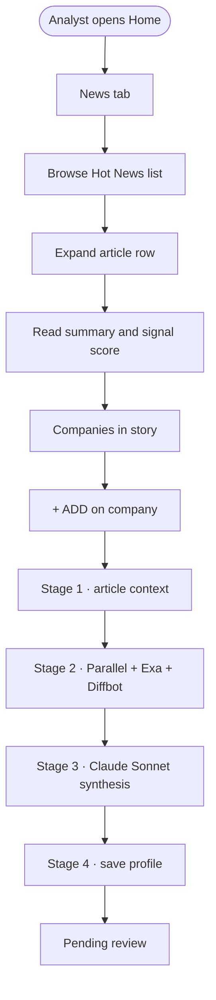
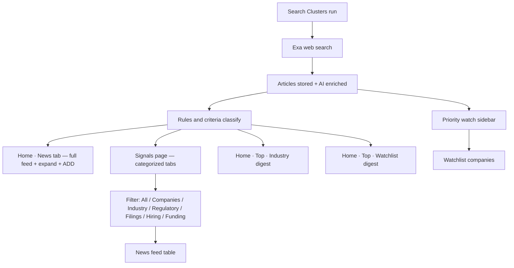
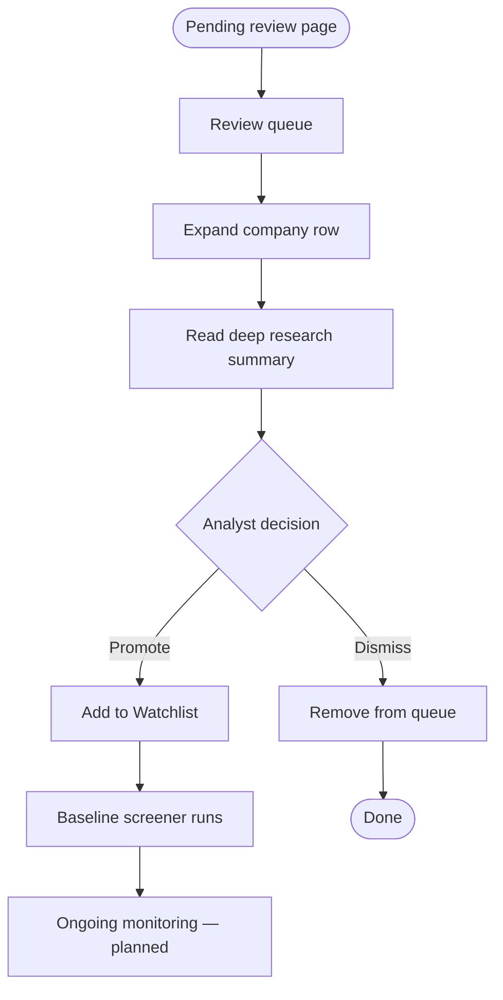
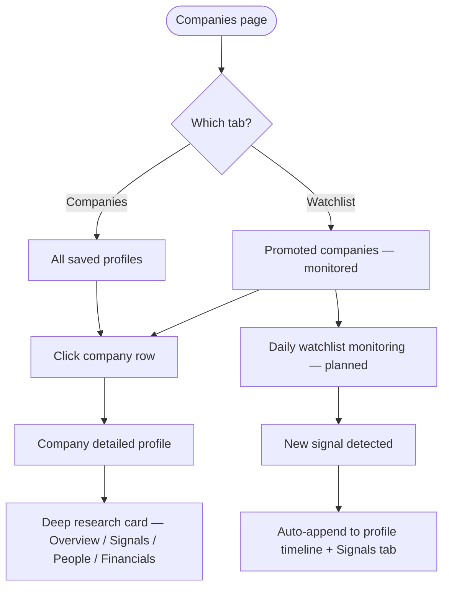
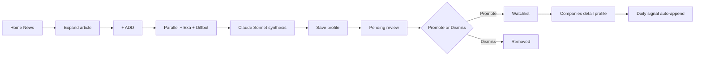
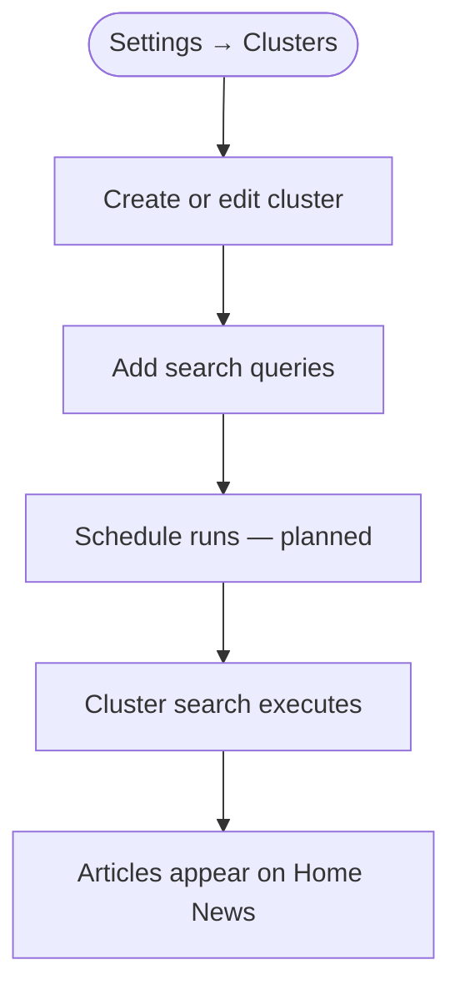

# P1-01 — Core Analyst Workflow

| Field | Value |
|-------|-------|
| **Document ref** | P1-01-User |
| **Title** | Core Analyst Workflow |
| **Version** | 1.6 |
| **Status** | Draft |
| **Last updated** | 2026-06-08 |
| **Audience** | Stakeholders, product, and analyst users |

---

## 1. Introduction

NORAD AI is the analyst application for reading market intelligence, shortlisting companies, and deciding what enters ongoing monitoring.

This document describes the analyst experience in plain language. It explains what the user sees, what they click, and what the system does in response. **Behind the scenes** blocks add a short pipeline flow and a plain-language note on which engines and AI steps run — enough context for stakeholders without implementation detail.

**Section format:**

| Block | Purpose |
|-------|---------|
| **UI guide** | Each clickable element and what the user sees |
| **Behind the scenes** | Pipeline flow line + short paragraph (engines, LLM steps, what gets saved) |
| **Flow** | One-line click path |
| **Explanation** | Short paragraph tying the steps together |
| **Diagram** | Visual map of the same flow |

Workflows are ordered as the analyst experiences them, starting from the **Home page**.

---

## 2. Workflow — Home page

### 2.1 Overview

| Attribute | Value |
|-----------|-------|
| **Entry point** | Sidebar → **Home** |
| **Sub-tabs** | **Top** · **News** |
| **Top tab** | Curated weekly opportunities — Watchlist companies and Industry signals |
| **News tab** | Full article feed — browse, expand, and **+ ADD** companies for deep research |

The **Top** tab is the analyst's weekly briefing. The **News** tab is where they discover new stories and flag companies for research.

---

### 2.2 Top tab — Opportunities this week — Watchlist

The **first section** on the Top tab. Shows this week's signals for companies the analyst has already promoted to the **Watchlist** (after deep research and **Promote** in Pending review).

| Component | User action | What the user sees |
|-----------|-------------|-------------------|
| **Top** tab | Click | Top view opens (alongside News) |
| **Opportunities this week — Watchlist** heading | Read | Section title |
| **Subtitle** | Read | e.g. "This week's signals and news for companies on your watchlist" |
| **Company card** | Read | Company name (e.g. Pendulum Therapeutics, Ultra Pouches) |
| **Category tag** | Read | Industry segment (e.g. PARTNER, FUND) |
| **Signal tag** | Read | Event type (e.g. Partnership, Funding round) |
| **Bullet points** | Read | Identified signals for that company this week |

**Behind the scenes:**

**Pipeline:** `Promote → Watchlist → Ongoing monitoring → Weekly signal scan → Rules/criteria filter → Watchlist section on Top tab`

After the analyst **Promotes** a company from Pending review, it enters the **Watchlist**. The system monitors those companies continuously. Each week, new activity is detected (news, filings, funding, partnerships, etc.) and evaluated against **configured rules and criteria** (signal type, relevance, recency, tier). Signals that pass appear automatically in **Opportunities this week — Watchlist** — no manual refresh needed.

Watchlist monitoring and rules engine — **planned**; Top tab layout is available today.

**Flow:**

`Sidebar → Home` → `Top tab` → `Opportunities this week — Watchlist` → `Read company signals`

---

### 2.3 Top tab — Opportunities this week — Industry

The **second section** below Watchlist on the Top tab. Shows sector-wide opportunity signals drawn from the **News** feed and cluster monitoring — not limited to Watchlist companies.

| Component | User action | What the user sees |
|-----------|-------------|-------------------|
| **Opportunities this week — Industry** heading | Read | Section title |
| **Subtitle** | Read | e.g. "This week's sector moves from industry news, clusters, and your monitored roster" |
| **Opportunity card** | Read | Company name or sector headline (e.g. Reynolds American, Health Canada draft rule) |
| **Category tag** | Read | Segment (e.g. FDA, HC, IP, FUND) |
| **Signal tag** | Read | Event type (e.g. FDA filing, Health Canada filing, Patent / IP) |
| **Bullet points** | Read | Key opportunity signals extracted from news |

**Behind the scenes:**

**Pipeline:** `News tab articles + cluster results → AI signal extraction → Rules/criteria filter → Auto-surface on Top · Industry section`

Articles ingested via Search Clusters and shown on the **News** tab and **Signals** page (§3) are continuously analysed. When an article or story matches **configured rules and criteria** (signal type, category, score threshold, geography, etc.), the system extracts opportunity signals and **automatically adds** them to **Opportunities this week — Industry** on the Top tab. The analyst does not manually curate this list — it is rule-driven from the news pipeline.

Rules engine and auto-surfacing — **planned**; Industry section layout is available today.

**Flow:**

`News pipeline feeds articles` → `Rules/criteria evaluate signals` → `Industry section on Top tab updates`

**How the two Top sections differ:**

| Section | Source | What appears |
|---------|--------|--------------|
| **Watchlist** | Companies the analyst **Promoted** after deep research | This week's signals for **monitored watchlist companies only** |
| **Industry** | **News** tab and cluster monitoring | Sector-wide opportunities from **all qualifying news** — watchlist or not |

---

### 2.4 Top tab — end-to-end flow and diagram

**Flow:**

`Home → Top tab` → `Read Watchlist opportunities (your promoted companies)` → `Read Industry opportunities (auto from news rules)`

The Top tab is the weekly digest: personal watchlist signals on top, broader industry moves below.

---

### 2.5 News tab — Browse Hot News

| Component | User action | What the user sees |
|-----------|-------------|-------------------|
| **Sidebar → Home** | Click | Home page opens |
| **News** tab | Click (default) | Hot News table loads |
| **News row** | Read | Headline, one-line summary, category tag, signal tag, score, age (e.g. 18d) |
| **Full feed →** | Click | Extended news list |
| **Row chevron (›)** | Click | Row expands to full article detail |

**Behind the scenes:**

**Pipeline:** `Search Cluster → Queries execute → Exa web search → Articles stored → Hot News list`

Configured Search Clusters hold one or more search queries. When a cluster runs (on a schedule — planned; manual today), the backend executes each query through **Exa**, a web search engine that finds matching articles and stores them. Category tags, signal tags, and the headline score on each row come from enrichment applied before or as articles enter the feed. The analyst sees finished results — not the search running live.

**Flow:**

`Sidebar → Home` → `News tab` → `Scan Hot News list`

The analyst lands on Home and reads the highest-priority market signal. Category tags (e.g. MED-NIC, VAPE) show industry segment. Signal tags (e.g. FUND, FDA, LEGAL) show event type. The red score shows priority.

---

### 2.6 Expanded article

| Component | User action | What the user sees |
|-----------|-------------|-------------------|
| **Executive summary** | Read | Short analyst-style summary of the article |
| **Why it matters** | Read | Strategic context for the business |
| **What to watch next** | Read | Follow-up items to monitor |
| **Key facts** | Read | Category label and signal type |
| **Signal score** | Read | Overall score (e.g. 92/100) plus relevance, recency, magnitude, and source trust bars |
| **Related coverage** | Click VIEW | Other articles on the same story |
| **OPEN** | Click | Source article opens in a new browser tab |
| **Bookmark / share icons** | Click | Save or share the article |

**Behind the scenes:**

**Pipeline:** `Article stored → AI reads content → Summary + signal scores built → Shown on expand`

Before an article is ready to expand, an **AI analysis step** (Claude LLM) has typically read the article text and produced the executive summary, strategic context, and signal sub-scores (relevance, recency, magnitude, source trust). Expanding the row only displays work already completed — clicking does not start a new pipeline run.

**Flow:**

`News row chevron (click)` → `Read expanded article` → `Review signal score and summary`

---
### 2.7 Companies in story

**What the user is trying to do:** Escalate a company spotted in a news signal into deep research for full profiling. This is the primary action the entire News tab exists to support — everything before this step (browsing, expanding, reading scores) is leading here.

| Component | User action | Action type | What the user sees |
|-----------|-------------|-------------------|-------------------|
| **Companies in story** block | Read | — | Companies mentioned in the article |
| **PRIMARY** badge | Read | — | Main subject company |
| **PARTNER** badge | Read | — | Secondary or partner company |
| **Company chevron** | Click | Navigate | Expands company description blurb |
| **+ ADD** button | Click | **Escalate** | Queues company for deep research → sends to Pending review |

**Behind the scenes:**

**Pipeline:** `+ ADD → Stage 1 (article context) → Stage 2 (Parallel + Exa + Diffbot) → Stage 3 (Claude Sonnet synthesis) → Stage 3.5 (validate) → Stage 4 (save profile) → Pending review`

Clicking **+ ADD** starts the full **Deep Research** pipeline on the NORAD backend. See **§2.7.1** for every stage and tool. Research runs in the background — the analyst can keep reading news.

**Flow:**

`Expanded article` → `Companies in story` → `+ ADD (click)`

---

**Failure states:**

| Condition | What the user sees | What the system does |
|-----------|-------------------|----------------------|
| Company already in Pending review | Toast: "Already queued" or button disabled | No duplicate run started |
| Stage 2 — one engine fails (Parallel, Exa, or Diffbot) | No visible change  research continues | Run proceeds with remaining engines |
| Stage 2 — all three engines fail | Pending review row shows failed state | Run stops; no profile saved; analyst can retry |
| Stage 3 — AI synthesis fails (unrecoverable) | Pending review row shows failed state | Run stops; no profile saved |
| Article has no companies detected | Companies in story block absent or empty | No + ADD button shown |

---

### 2.7.1 Deep Research pipeline — complete tools

Triggered by **+ ADD**. Produces one company profile per run.

| Stage | Tool / engine | What it does |
|-------|---------------|--------------|
| **1 — Build input** | Application | Binds company name, domain hint, and the news article context that triggered **+ ADD** |
| **2 — Fan-out** | **Parallel** | Deep web research task — returns a structured brief (identity, funding, signals, sources) |
| **2 — Fan-out** | **Exa** | Two deep web searches, then reads the top article pages for full text |
| **2 — Fan-out** | **Diffbot** | Knowledge-graph entity lookup — company record, description, and linked data |
| **3 — Synthesize** | **Claude Sonnet 4.5** (LLM) | Merges Parallel + Exa + Diffbot evidence into one company profile and signal list |
| **3 — Synthesize (retry)** | **Claude Sonnet 4.5** (LLM) | If the first pass returns too few signals or sources, one automatic retry |
| **3.5 — Validate** | Application | Cleans confidence labels and source rules before the profile is saved |
| **4 — Persist** | Application | Saves company, profile card, signals, and source citations to the database |

**Stage 2 behaviour:** Parallel and Exa start together. Diffbot runs with a domain hint (from the article or derived from Exa URLs). If one engine in Stage 2 fails, the run continues with the others. If all three fail, the run stops with no profile saved.

**Pipeline flow:**

`+ ADD` → `Stage 1 · article context` → `Stage 2 · Parallel + Exa + Diffbot` → `Stage 3 · Claude Sonnet synthesis` → `Stage 3.5 · validate` → `Stage 4 · save` → `Pending review`

---

### 2.8 End-to-end flow — News tab

**Flow:**

`Sidebar → Home` → `News tab` → `Expand article` → `Read summary and score` → `+ ADD on company`

This is the analyst's daily starting point: scan signal, understand context, and flag a company for deeper profiling.

---

### 2.9 Diagram — News tab

---

## 3. Workflow — Signals page

The **Signals** page shows the **same incoming news** that feeds Home → **News** tab. The difference is presentation: here every story is **categorized and filtered** by configured **rules and criteria** — signal type, category, score, and other rules decide which tab each story appears under.

### 3.1 Overview

| Attribute | Value |
|-----------|-------|
| **Entry** | Sidebar → **Signals** |
| **Purpose** | Browse all ingested news as categorized signals — filter by type without re-reading the full News feed |
| **Data source** | Same cluster → search → article pipeline as Home News (§2.5) |
| **Header** | e.g. "Signals — 11 stories in feed · updated 4m ago" |

**How the three news views relate:**

| View | What it is | Analyst use |
|------|------------|-------------|
| **Home → News** | Full article feed — expandable rows, **+ ADD** | Discover stories and flag companies for deep research |
| **Signals** | Same articles, **categorized by rules** into filter tabs | Scan all signals by type (Regulatory, Filings, Funding, etc.) |
| **Home → Top** | Weekly digest — Watchlist + Industry subsets | Read this week's highest-priority opportunities only |

---

### 3.2 Category filter tabs

| Component | User action | What the user sees |
|-----------|-------------|-------------------|
| **All** tab | Click | Every signal in the feed (e.g. 11 stories) |
| **Companies** tab | Click | Company-focused signals only (e.g. 7) |
| **Industry** tab | Click | Sector-wide signals (e.g. 2 — grey-market vapes, sentiment trends) |
| **Regulatory** tab | Click | Regulatory signals (e.g. 3) |
| **Filings** tab | Click | Filing signals — FDA, Health Canada, etc. (e.g. 2) |
| **Hiring** tab | Click | Hiring signals (e.g. 0 when none match) |
| **Funding** tab | Click | Funding-round signals (e.g. 3) |
| **Tab count badge** | Read | Number of stories matching that category's rules |
| **Header subtitle** | Read | Updates per tab — e.g. "2 in industry · updated 4m ago" |

**Behind the scenes:**

**Pipeline:** `Incoming article → AI enrichment (category + signal type + score) → Rules/criteria assign tab → Signals page filter`

When articles enter the system from Search Clusters (§7), each one is enriched with a **category tag** (e.g. MED-NIC, VAPE, CESS), a **signal tag** (e.g. FUND, FDA, GREY, SENT), and a **score**. Configured **rules and criteria** map each story to one or more filter tabs. Clicking a tab applies that category filter — the analyst is not manually sorting; the rules engine has already classified each item.

**Flow:**

`Sidebar → Signals` → `Select category tab (All / Companies / Industry / …)`

---

### 3.3 News feed table

| Component | User action | What the user sees |
|-----------|-------------|-------------------|
| **News feed** heading | Read | Table label |
| **Title column** | Read | Headline + one-line summary snippet |
| **Category column** | Read | Category tag (e.g. MED-NIC, VAPE, NIC-ALT, CESS) |
| **Signal column** | Read | Signal type tag (e.g. FUND, FDA, GREY, SENT, IP) |
| **Score column** | Read | Priority score (e.g. 92, 67) — higher = more relevant per rules |
| **Date column** | Read | Age of signal (e.g. 18d, 20d) |

**Behind the scenes:**

**Pipeline:** `Same articles as Home News → Pre-scored and tagged → Displayed in Signals table`

Each row is one article from the shared news pipeline. The score and tags were assigned during ingestion — the same values the analyst sees when expanding an article on Home News. Signals presents them in a scannable table for triage by type, not for deep-read or **+ ADD** (that stays on Home News).

**Flow:**

`Signals page` → `Scan News feed table` → `Switch tab to narrow by category`

---

### 3.4 Priority watch sidebar

| Component | User action | What the user sees |
|-----------|-------------|-------------------|
| **Top signal** card | Read | Highest-priority signal this period (e.g. Ultra Pouches — FUND) |
| **Priority watch** heading | Read | Watchlist companies with active signals |
| **Watchlist company card** | Read | Company name, tags, bullet-point signals (e.g. Pendulum Therapeutics, Stay Wyld Organics) |

**Behind the scenes:**

**Pipeline:** `Promoted watchlist companies → Monitoring detects signals → Rules filter → Priority watch sidebar`

The right sidebar surfaces **Watchlist** companies (promoted after deep research) that have matching signals in the current feed. This is the same watchlist logic as **Opportunities this week — Watchlist** on Home Top (§2.2), shown in context while the analyst browses the full categorized feed.

**Flow:**

`Signals page` → `Priority watch sidebar` → `Read watchlist company signals`

---

### 3.5 End-to-end flow and diagram

**Flow:**

`Clusters ingest news` → `Rules categorize into tabs` → `Signals page` → `Filter by category` → `Read feed + Priority watch`

The Signals page is the **master categorized view** of all incoming news. Home News is for discovery and **+ ADD**. Home Top is the weekly digest. All three draw from the same pipeline.

---

## 4. Workflow — Pending review

After **+ ADD**, the company appears in **Pending review**. The sidebar badge shows how many items are waiting (e.g. 2).

### 4.1 Overview

| Attribute | Value |
|-----------|-------|
| **Entry** | Sidebar → **Pending review** |
| **Purpose** | Analyst approves or rejects companies that completed deep research |
| **Subtitle** | e.g. "2 candidates awaiting approval" |

---

### 4.2 Review queue

| Component | User action | What the user sees |
|-----------|-------------|-------------------|
| **Pending review** (sidebar) | Click | Review table opens |
| **All / Bookmarked / Manual** tabs | Click | Filter list by how the company arrived |
| **Table row** | Read | Origin, company name, URL, context, time added |
| **Row chevron** | Click | Expands detail for that company |

**Behind the scenes:**

**Pipeline:** `+ ADD → Stages 1–4 (see §2.7.1) → Row appears in Pending review`

Each row is tied to a Deep Research run. While **Stage 2** (Parallel, Exa, Diffbot) or **Stage 3** (Claude Sonnet synthesis) is still running, the row may show a waiting state. When **Stage 4** completes, the saved profile is ready for review. Tools involved: **Parallel**, **Exa**, **Diffbot**, **Claude Sonnet 4.5**. The context column records the originating news signal (e.g. "Series B funding signal — NGP").

**Flow:**

`Sidebar → Pending review` → `Review table`

---

### 4.3 Expanded company card

| Component | User action | What the user sees |
|-----------|-------------|-------------------|
| **Company name and URL** | Read | Company identity |
| **Source context** | Read | Which news signal triggered this entry |
| **Deep research summary** | Read | Profile summary once research completes |
| **No profile yet** | Read (if in progress) | Message that research is still running |
| **On Promote** checklist | Read | Four steps that happen if the analyst promotes |

**Behind the scenes:**

**Pipeline:** `Stage 1 (article context) → Stage 2 (Parallel + Exa + Diffbot) → Stage 3 (Claude Sonnet synthesis) → Stage 3.5 (validate) → Stage 4 (save) → Summary shown here`

The summary on this card is the finished output of the full Deep Research pipeline (§2.7.1):

| Stage | Tool | Role in what the analyst reads |
|-------|------|-------------------------------|
| 1 | Application | Links profile back to the news signal that triggered **+ ADD** |
| 2 | **Parallel** | Structured brief — identity, funding, early signals |
| 2 | **Exa** | Web search hits and article text used as evidence |
| 2 | **Diffbot** | Entity record — description, linked company data |
| 3 | **Claude Sonnet 4.5** | Writes the deep research summary, signals, and strategic fit narrative |
| 3.5 | Application | Validates confidence and sources before save |
| 4 | Application | Saves profile — what you see once research completes |

While Stages 2–3 are running, the card shows that research is still in progress. The **On Promote** checklist describes downstream steps if the analyst accepts the company.

**Flow:**

`Pending review` → `Expand row` → `Read deep research summary`

---

### 4.4 Promote to Watchlist

| Component | User action | Outcome |
|-----------|-------------|---------|
| **Promote** / **Promote to Watchlist** | Click | Company accepted for monitoring |

**Behind the scenes:**

**Pipeline:** `Promote → Watchlist record created → Baseline screener runs → Fit score + tier filled → Monitoring (planned)`

Accepting the company writes it to the **Watchlist** and triggers a **baseline screener** — a lighter pipeline pass that scores strategic fit, assigns a tier, and fills profile fields for ongoing use. The company appears on the **Companies** page (§5). Once monitoring is live, new signals auto-append to the company detail page (§5.8) and weekly highlights surface on Home Top (§2.2).

**Flow:**

`Expanded card` → `Promote to Watchlist (click)` → `Company enters Watchlist`

---

### 4.5 Dismiss

| Component | User action | Outcome |
|-----------|-------------|---------|
| **Dismiss** (X button) | Click | Company removed from Pending review |

**Behind the scenes:**

**Pipeline:** `Dismiss → Pending record removed → Research card discarded (no new pipeline run)`

This is a state change only — no engines or LLM steps run. The company is removed from the pending queue and the research card built for this review is discarded. The analyst is indicating the company is not relevant for monitoring.

**Flow:**

`Expanded card` → `Dismiss (click)` → `Company removed from queue`

---

### 4.6 End-to-end flow — Pending review

**Flow:**

`Sidebar → Pending review` → `Expand company` → `Read research summary` → `Promote` or `Dismiss`

The analyst makes a go / no-go decision. Promote sends the company to the Watchlist. Dismiss clears it from the queue.

---

### 4.7 Diagram — Pending review

---

## 5. Workflow — Companies page

The **Companies** page lists every company with a saved profile. Clicking any row opens the **company detailed profile** — the full deep research card plus ongoing updates for watchlist companies.

### 5.1 Overview

| Attribute | Value |
|-----------|-------|
| **Entry** | Sidebar → **Companies** |
| **Header** | e.g. "10 companies — 4 on watchlist" |
| **Purpose** | Browse all saved companies; open full profiles; manually bookmark new ones |
| **Two tabs** | **Watchlist** (promoted subset) · **Companies** (all saved) |

| Tab | What it contains |
|-----|------------------|
| **Watchlist** | Companies the analyst **Promoted** from Pending review — actively monitored |
| **Companies** | **Every saved profile** — watchlist companies plus any researched or manually queued company not yet promoted |

---

### 5.2 Company list

| Component | User action | What the user sees |
|-----------|-------------|-------------------|
| **Watchlist** tab | Click | Promoted companies only (e.g. 4) |
| **Companies** tab | Click | All saved companies (e.g. 10) |
| **Search companies…** | Type | Filters the table |
| **Table row** | Click | Opens company detailed profile |
| **Company column** | Read | Name + website URL |
| **Industry column** | Read | Sector (e.g. Wellness, Biotechnology) |
| **Location column** | Read | City and country |
| **Last Updated column** | Read | When profile or signals last changed |
| **Actions (⋯)** | Click | Row actions menu |
| **+ Add company** | Click | Opens bookmark modal |

**Behind the scenes:**

**Pipeline:** `Deep research completes → Company saved → Appears on Companies tab` · `Promote → Also tagged watchlist → Appears on Watchlist tab`

Every company that finishes deep research (from News **+ ADD** or manual **Find & queue**) is saved and listed on the **Companies** tab. Only **Promoted** companies also appear on the **Watchlist** tab and enter active monitoring.

**Flow:**

`Sidebar → Companies` → `Watchlist or Companies tab` → `Click company row`

---

### 5.3 Add company manually

| Component | User action | What the user sets |
|-----------|-------------|-------------------|
| **+ Add company** | Click | "Bookmark a company" modal opens |
| **Company name** (optional) | Type | e.g. Lumina Nicotine |
| **Website** (optional) | Type | URL or domain — at least one field required |
| **Find & queue** | Click | Company queued for review |
| **Cancel** | Click | Modal closes |

**Behind the scenes:**

**Pipeline:** `Find & queue → Pending review (Manual) → Deep Research pipeline (§2.7.1) → Company saved → Companies tab`

Manual bookmark skips the News **+ ADD** path but follows the same research pipeline. The company enters **Pending review** under the **Manual** tab. After research completes, the analyst **Promotes** or **Dismisses** as usual. On save, the profile appears on the **Companies** tab.

**Flow:**

`Companies` → `+ Add company` → `Enter name or URL` → `Find & queue` → `Pending review → Promote or Dismiss`

---

### 5.4 Company detailed profile — header and tabs

Clicking any company from **Watchlist** or **Companies** opens the full profile.

| Component | User action | What the user sees |
|-----------|-------------|-------------------|
| **Breadcrumb** | Read | e.g. Companies › Ultra Pouches |
| **Company logo + name** | Read | Identity |
| **Fit badge** | Read | e.g. HIGH FIT |
| **Overview** tab | Click | Key facts, description, signal timeline, market snapshot |
| **Signals** tab | Click | Live intent signal, score trend, signal feed |
| **People** tab | Click | Decision makers, decision map |
| **Financials** tab | Click | Revenue, headcount, deal sizing |
| **Timeline** tab | Click | Chronological company events |
| **Analysis** tab | Click | Deep research analysis sections |
| **Outreach** tab | Click | Outreach tools (when available) |

**Behind the scenes:**

**Pipeline:** `Deep Research Stage 4 save → Company card loaded → Profile tabs populated`

The detailed profile is built from the **Deep Research** pipeline output (§2.7.1) — Parallel, Exa, Diffbot evidence synthesised by **Claude Sonnet** into a structured company card. Key facts, signals, people, and financials all come from that initial research run.

**Flow:**

`Companies list` → `Click row` → `Company detailed profile`

---

### 5.5 Overview tab

| Component | User action | What the user sees |
|-----------|-------------|-------------------|
| **Key facts grid** | Read | Founded, CEO, employees, sector, location, website |
| **Company description** | Read / expand | Deep research narrative — View More |
| **Revenue / ACV bar** | Read | Estimated financials |
| **Lead score** | Read | e.g. 78 — STRONG MATCH |
| **Signal Analysis** | Read | Timeline of signals with dates and source counts |
| **Latest Developments** | Read | Recent milestones |
| **Strategic Considerations** | Read | Analyst-style strategic notes |
| **Market Snapshot** | Read | Moat, competitors, intent signal, data completeness |
| **Similar Companies** | Read | Comparable companies with scores |

**Behind the scenes:**

**Pipeline:** `Deep Research synthesis → Company card fields → Overview tab display`

Overview shows the core output of **Claude Sonnet** synthesis — identity, funding, strategic fit, moat, and the initial signal set from Stage 2 engines. For **watchlist** companies, new entries also append here daily via monitoring (§5.8).

**Flow:**

`Company profile` → `Overview tab` → `Read key facts and signal timeline`

---

### 5.6 Signals tab

| Component | User action | What the user sees |
|-----------|-------------|-------------------|
| **Intent Signal** card | Read | Live status — e.g. Strongly Surging |
| **Score Trend** | Read | 12-week trend chart (e.g. +36pts) |
| **Signal feed** | Read | Dated signals — type (STRATEGIC, GROWTH), confidence (confirmed/estimated), tier, sources |

**Behind the scenes:**

**Pipeline:** `Initial deep research signals` + `Watchlist monitoring → new signals daily → Signals tab feed`

The Signals tab lists every identified signal for this company. Initial signals come from deep research. For **watchlist** companies only, monitoring detects new news and activity daily and **auto-appends** new signal rows here.

**Flow:**

`Company profile` → `Signals tab` → `Read intent + signal feed`

---

### 5.7 People and Financials tabs

| Tab | What the user sees |
|-----|-------------------|
| **People** | Decision makers table (name, function, role), filters (Champions, Influencers, Buyers, Technical), Decision Map |
| **Financials** | Reported revenue, estimated ACV, headcount, 5-year trajectory, deal sizing tiers |
| **Timeline** | Chronological event history |
| **Analysis** | Extended deep research analysis |
| **Outreach** | Contact and outreach actions (when available) |

**Behind the scenes:**

**Pipeline:** `Deep Research synthesis → Structured card sections → Tab content`

People, financials, and timeline fields are extracted during **Claude Sonnet** synthesis from Parallel, Exa, and Diffbot evidence. Fields without source data show as unavailable rather than guessed.

---

### 5.8 Watchlist monitoring — auto-append on detail page

**Only watchlist companies** receive ongoing updates. Companies on the **Companies** tab that were never promoted do **not** auto-append.

| What updates | Where it appears |
|--------------|------------------|
| New news or articles about the company | Signal Analysis timeline (Overview), Signals feed |
| New funding, product, hiring, regulatory events | Latest Developments, Signals tab |
| Score / intent changes | Lead score, Intent Signal card, Score Trend |

**Behind the scenes:**

**Pipeline:** `Watchlist company → Daily monitoring scan → New signal detected → Rules filter → Auto-append to company detail page`

Each day the system scans for new activity related to **watchlist** companies. When a new article or signal is found and passes rules, it is **automatically appended** to that company's detail page — Overview timeline, Signals feed, and Last Updated on the Companies list. The analyst does not manually refresh or re-run research.

Watchlist daily monitoring — **planned**; profile layout and deep research content are **available** today.

**Flow:**

`Promoted to Watchlist` → `Daily monitoring` → `New signal found` → `Auto-appended on company detail page`

---

### 5.9 End-to-end flow and diagram

**Flow:**

`Companies list (Watchlist or Companies tab)` → `Click company` → `Read profile tabs` → `Watchlist: new signals auto-append daily`

---

## 6. Complete analyst journey

**Discovery path:**

`Home → News tab` → `Expand article` → `+ ADD` → `Deep research` → `Pending review` → `Promote` or `Dismiss`

**Manual add path:**

`Companies → + Add company` → `Find & queue` → `Pending review` → `Deep research` → `Promote or Dismiss`

**After Promote:**

`Companies · Watchlist tab` → `Company detail profile` → `Daily monitoring auto-appends new signals`

`Weekly signals` → `Home Top · Opportunities this week — Watchlist`

**Industry digest (automatic):**

`News pipeline` → `Rules/criteria` → `Top tab · Opportunities this week — Industry`

The analyst discovers companies via News or manual bookmark, approves them in Pending review, and promoted companies appear on Companies Watchlist with a living profile that grows as monitoring detects new activity.

---

## 7. How news enters the feed (supporting workflow)

This section explains where Hot News content comes from. It is configured separately from daily reading — not the analyst's first step.

### 7.1 Overview

| Attribute | Value |
|-----------|-------|
| **Entry** | Profile menu → **Settings** → **Clusters** card |
| **Purpose** | Define what topics the system monitors and searches for |
| **Feeds** | Home **News** tab (on schedule — planned) |

---

### 7.2 Configure a Search Cluster

| Component | User action | What the user sets |
|-----------|-------------|-------------------|
| **Settings → Clusters** | Click | Search Clusters page opens |
| **+ Create Cluster** | Click | Create form opens |
| **Cluster name and description** | Type | What the cluster monitors |
| **Priority and status** | Select / toggle | How often and whether it is active |
| **Keywords, geography, sources** | Fill | Search scope and filters |
| **Signal detection** | Check types | Funding, regulatory, product launch, etc. |
| **Create Cluster** | Click | Cluster saved |
| **Open Cluster** | Click | Cluster detail — Overview, Queries, Results, Settings tabs |
| **+ Add Query** | Click | Adds a specific search inside the cluster |

**Behind the scenes:**

**Pipeline:** `Create cluster → Add queries → Run cluster → Exa search per query → Articles enriched → Home News feed (scheduled — planned)`

The cluster defines monitoring scope — keywords, geography, sources, and signal types. Each **query** inside a cluster is an **Exa** web search. Running a cluster executes every active query, collects matching articles, and (when wired) enriches them with AI summarisation and scoring before they appear on Home News. Scheduled runs (planned) will repeat this pipeline automatically on a cron the analyst sets.

**Flow:**

`Profile menu → Settings` → `Clusters` → `Create or open cluster` → `Add queries`

---

### 7.3 Planned: scheduled cluster runs

| Capability | Status |
|------------|--------|
| Analyst picks run times (cron schedule) | Planned |
| Articles auto-append to Home News | Planned |
| Additional search criteria on cluster engine | Planned |

---

### 7.4 Diagram — Cluster to News (planned)

---

## 8. Capability status

| Capability | User experience today |
|------------|----------------------|
| Home Top tab layout (Watchlist + Industry sections) | Available |
| Watchlist weekly signals (rules-driven) | Planned |
| Industry auto-surface from news (rules-driven) | Planned |
| Home News tab layout | Available |
| Expand article and signal scores | Available |
| + ADD → deep research | In progress |
| Pending review queue | Available |
| Research summary on expand | In progress |
| Promote to Watchlist | UI ready; links to §2.2 when monitoring live |
| Dismiss from pending | In progress |
| Cluster create and manage | Available |
| Scheduled cluster runs → News feed | Planned |
| Signals page — categorized tabs + feed table | Available |
| Signals — rules/criteria auto-categorization | Planned |
| Companies page — list tabs + detail profile | Available |
| + Add company → Pending review (Manual) | Available |
| Watchlist daily monitoring → auto-append on detail | Planned |

---

## 9. Approval

| Role | Name | Date | Status |
|------|------|------|--------|
| Author | Huzaifa | 2026-06-08 | Draft |
| Reviewer | Shehrayar Haq | — | Pending |

---

## 10. Revision history

| Version | Date | Author | Description |
|---------|------|--------|-------------|
| 1.0 | 2026-06-08 | huzaifa | Initial draft |
| 1.1 | 2026-06-08 | huzaifa | Stakeholder rewrite — starts at Home News; no admin references; UI → behind the scenes → flow → diagram |
| 1.2 | 2026-06-08 | huzaifa | Behind the scenes — pipeline flow line + engines/LLM paragraph per section |
| 1.3 | 2026-06-08 | huzaifa | §2.7.1 complete Deep Research tools table; §3.3 full pipeline (not Stage 3–4 only) |
| 1.4 | 2026-06-08 | huzaifa | Home Top tab — Watchlist + Industry sections; rules/criteria pipeline; renumbered News to §2.5+ |
| 1.5 | 2026-06-08 | huzaifa | §3 Signals page — same news as Home, categorized by rules; Pending review renumbered to §4 |
| 1.6 | 2026-06-08 | huzaifa | §5 Companies page — list, detail profile, + Add company, watchlist-only daily auto-append |
