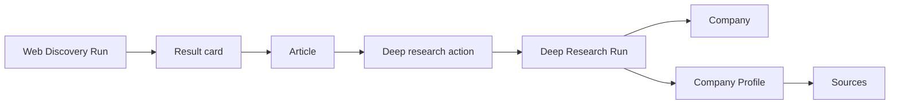

# P1-02 — Core Product Objects (Analyst)

| Field | Value |
|-------|-------|
| **Document ref** | P1-02-User |
| **Title** | Core Product Objects — Analyst perspective |
| **Version** | 2.2 |
| **Last updated** | 2026-06-22 |
| **Audience** | Stakeholders, product, analysts |
| **Controlling doc** | [P1-00 Overview](./phase-1-overview.md) |
| **Paired doc** | [P1-02-Admin](./P1-02-admin.md) — same persisted rows, operator labels |
| **Workflow reference** | [P1-01-User](./P1-01-user.md) |

---

## 1. Introduction

NORAD turns web search hits into structured intelligence — enriched articles and company profiles. Before anyone extends the product, the team needs a shared vocabulary for the **objects** an analyst actually encounters in the app today.

This document names and defines each one from the **analyst reading perspective**: what it is, why it matters, where it appears, and a realistic example. It is the companion to [P1-01-User](./P1-01-user.md) — workflows describe *what the user does*; this document describes *what the things are*.

NORAD is **one application**. There is no separate analyst-only frontend. Operator configuration objects (Cluster, Query) are defined in [P1-02-Admin](./P1-02-admin.md); analysts consume their output on the same routes.

**Per-object format:**

| Block | Purpose |
|-------|---------|
| **What** | Plain-language definition |
| **Why** | Why the product needs it |
| **Example** | Realistic NORAD scenario |
| **Where in UI** | Route or screen |
| **Backend** | Table or view (when helpful) |

**AI Analysis** (§2) is documented once as a cross-cutting concept — not a page the user opens.

### 1.1 Shared terminology (with Admin doc)

| Term | Meaning |
|------|---------|
| **Article** | Deduplicated web story in `articles` — source of executive summary and companies |
| **Web Discovery result card** | What the user sees per URL on the results page — combines run hit + Article hydration |
| **Executive summary** | Sonnet-written paragraph — not Exa's vendor summary |
| **Companies in this story** | `mentioned_companies` from Sonnet enrich |
| **Company Profile** | Analyst label for a **Company Card** (`cards` row) |
| **Deep research** | User action starting a Deep Research Run |

### 1.2 Section pairing (User ↔ Admin)

| Topic | This doc (Analyst) | [P1-02-Admin](./P1-02-admin.md) |
|-------|-------------------|--------------------------------|
| Enriched story | Article, result card | Article, Search Result |
| Company intelligence | Company Profile | Company Card |
| Research run | Deep Research Run outcome | Deep Research Run |
| Configuration | — | Cluster, Query, Research Config |

---

## 2. Cross-cutting concept — AI Analysis

| Attribute | Value |
|-----------|-------|
| **What** | Any step where Claude reads, summarises, extracts entities, or synthesises a company profile |
| **Why** | Turns raw Exa content and multi-engine evidence into readable intelligence |
| **Example** | Sonnet writes the executive summary on a result card; Sonnet builds the Company Profile after Deep research completes |
| **Where in UI** | Executive summary block; Companies in this story; Company detail tabs |

| Pipeline | LLM role | What the analyst sees |
|----------|----------|----------------------|
| Web Discovery enrich | Summarise + extract companies per new article | Executive summary, Companies in this story, **Analyzed** badge |
| Deep research | Synthesise `CompanyCardV1` fact blocks | Company Profile sections, Research Evidence, Profile Completeness |

---

## 3. Object index (built today)

| # | Object | One-line meaning |
|---|--------|------------------|
| 3.1 | Organization | Customer tenant (e.g. BAT) | `organizations` |
| 3.2 | Organization member | Analyst user under that org | `organization_members` |
| 3.3 | Article | One deduplicated web story with Sonnet enrich | `articles` |
| 3.4 | Web Discovery result card | One URL hit as shown on the results page | run-scoped + hydration |
| 3.5 | Company | A business entity NORAD has researched or can research | `companies` |
| 3.6 | Company Profile | Deep-research output for one company (one card version) | `cards` |
| 3.7 | Deep research action | Analyst choice to run full company profiling | `POST /api/research/runs` |

---

## 4. Platform objects

### 4.1 Organization

| | |
|--|--|
| **What** | The customer account (e.g. BAT) that scopes which clusters and companies analysts can see |
| **Why** | Multi-tenant isolation — analyst app authenticates with org integration key + user session (future) |
| **Example** | “Acme Inc.” — GM admin assigns clusters and companies on the **Access** tab |
| **Where in UI** | Not in `apps/web` — managed in **GM Admin Console**; analyst app reads scoped data (future) |

### 4.2 Organization member (analyst user)

| | |
|--|--|
| **What** | A person invited under an organization to use the analyst frontend |
| **Why** | Per-customer user roster — roles `staff` \| `manager` (same permissions for now) |
| **Example** | Analyst accepts invite → reads Web Discovery results and company profiles for their org's scope |
| **Where in UI** | Invited/managed in GM Admin Console → org **Users** tab; logs in via **future analyst app** (not `apps/web`) |

**Not the same as** GM operator (internal staff) or legacy `apps/web` console user.

---

## 5. Discovery objects

Clusters and queries are configured by the operator ([P1-02-Admin](./P1-02-admin.md)). The analyst's discovery journey starts on the **results page** after a run completes.

### 5.1 Article

| | |
|--|--|
| **What** | One deduplicated web story — headline, Sonnet summary, full body text, companies mentioned |
| **Why** | Canonical store so the same URL is not re-enriched on every run |
| **Example** | “Lumina Nicotine closes $42M Series B…” — executive summary + `mentioned_companies` including Lumina Nicotine |
| **Where in UI** | Query results card — Executive summary, Companies in this story, Full article |
| **Backend** | `articles` |

### 5.2 Web Discovery result card

| | |
|--|--|
| **What** | One source (URL) as rendered on the query results page for a specific run |
| **Why** | Presents run context (score, date, ingest status) plus enriched Article fields |
| **Example** | Card with **Analyzed** badge, executive summary, three companies, collapsible Full article |
| **Where in UI** | `/discover-web/clusters/:clusterId/queries/:queryId/results` |
| **Backend** | Run-scoped hit in `engine_outputs`, hydrated via `GET .../results` from `articles` |

When no executive summary exists (thin content or enrich failure), the card falls back to **Source excerpts (Exa)**.

---

## 6. Company intelligence objects

### 6.1 Company

| | |
|--|--|
| **What** | A business entity NORAD tracks — name, domain, denormalised list fields |
| **Why** | Stable identity across multiple research runs |
| **Example** | Ultra Pouches — `takeultra.com` — Wellness, Brooklyn NY |
| **Where in UI** | Companies in this story (results); `/companies` **Profiles** + **Discovered** tabs; `/companies/:id` detail |
| **Backend** | `companies` — `origin` discriminates mention vs full profile |

### 6.2 Company Profile

| | |
|--|--|
| **What** | The structured deep-research output for one company — facts, narrative, sources |
| **Why** | Single place to evaluate strategic fit and evidence quality |
| **Example** | Ultra Pouches profile — founded May 2025, CEO Eric Drymer, strategic fit narrative |
| **Where in UI** | `/companies/:id` — facts, Strategic Fit, Sources, Research Evidence, Profile Completeness |
| **Backend** | `cards` row — same data as operator **Company Card**; **Profile Completeness** from `card_profile_parameters` via `GET /api/research/companies/:id/profile-completeness` |

`companies.canonical_card_id` points at the accepted profile when set. Multiple card versions exist per company (one per Deep Research Run).

### 6.2.1 Profile completeness audit

| | |
|--|--|
| **What** | 44 must-have parameters with verified / uncertain / missing status and completeness % |
| **Why** | Shows which NORAD contract fields are populated vs missing — evidence audit |
| **Example** | Identity group — company name VERIFIED, revenue estimate UNCERTAIN, social growth MISSING |
| **Where in UI** | Company detail → Profile Completeness panel (bottom of page) |
| **Backend** | `card_profile_parameters` — 44 rows per card; summary on `cards.profile_completeness_pct` |

### 6.3 Company Signal — RETIRED

**Dropped 2026-06-16.** Table `signals` removed. BD signal timeline moves to a future frontend. Legacy: `docs/reference/legacy-signals-scores-suggestions.md`.

---

## 7. User actions (not persisted row types)

### 7.1 Deep research action

| | |
|--|--|
| **What** | Analyst starts full company profiling from a company name on a result card (or Companies page) |
| **Why** | Moves from article-level intelligence to a full `CompanyCardV1` |
| **Example** | **Deep research** on “Ultra Pouches” → run log → company appears on `/companies` **Profiles** tab; mention listed on **Discovered** until profile completes |
| **Where in UI** | Query results — per-company **Deep research** button; Companies page add flow |
| **Backend** | `POST /api/research/runs` → `runs` · `source_kind = research` |

---

## 8. Phase 2 — planned objects (not built)

These objects appear in legacy Phase 1 drafts and `phase2test.md` scenarios. They are **not** in the current UI. Documented here so naming does not confuse Phase 2 planning.

| Object | Planned meaning | Status |
|--------|-----------------|--------|
| News Signal | Event tag + score on a feed Article | No News feed |
| Opportunity | Weekly digest highlight on Home Top | No Home Top |
| Pending Review Item | Company + draft card awaiting promote/dismiss | `review_status` exists; no queue UI |
| Watchlist Entry | Promoted company under monitoring | No watchlist UI |
| Manual Bookmark | Analyst-queued company via + Add company modal | Partial — Companies add only |
| Promote / Dismiss Escalation | Accept or reject a researched company | No UI |
| Monitoring Rule | Criteria filtering signals into feeds | No rules UI |

When these ship, relationships will extend [P1-03](./P1-03.md) §11.

---

## 9. Summary table

| Object | Meaning | Example |
|--------|---------|---------|
| Organization | Tenant | BAT Intelligence |
| User | App user | Analyst |
| Article | Enriched web story | Lumina Series B summary |
| Web Discovery result card | One URL on results page | Analyzed card with companies |
| Company | Business entity | Ultra Pouches |
| Company Profile | Deep research card | Facts + strategic fit + sources |
| Company Signal | **Retired** | — |
| Deep research action | Start profiling run | Deep research button |
| AI Analysis | LLM step in pipeline | Sonnet summary on card |

---

## 10. How objects connect (built today)

| From | To | How |
|------|-----|-----|
| Web Discovery Run | Article | New URLs ingested; duplicates reuse existing row |
| Article | Result card | Results API hydrates summary, companies, body onto each hit |
| Result card | Deep Research Run | Analyst clicks **Deep research** on a mentioned company |
| Deep Research Run | Company Profile | Synthesis persists `cards` + `sources` + `card_profile_parameters` |
| Company | Company Profile | One company → many card versions; `canonical_card_id` when accepted |

Full relationship spec: [P1-03](./P1-03.md).

---

## 11. Approval

| Role | Name | Date |
| ------ | ------ | ------ |
| Author | Huzaifa | 2026-06-19 |
| Reviewer | Shehrayar Haq | — |
