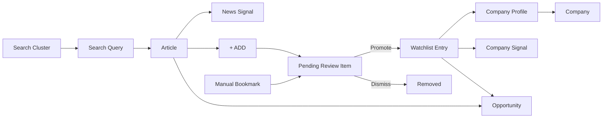

# P1-02 — Core Product Objects

| Field | Value |
|-------|-------|
| **Document ref** | P1-02-User |
| **Title** | Core Product Objects |
| **Version** | 1.2 |
| **Status** | Draft |
| **Last updated** | 2026-06-08 |
| **Audience** | Stakeholders, product, and analyst users |

---

## 1. Introduction

NORAD AI turns market noise into structured intelligence — news stories, scored signals, company profiles, and watchlist monitoring. Before anyone builds or extends the product, the team needs a shared vocabulary for the **objects** that make up that experience.

This document names and defines each one: what it is, why the product needs it, where it appears in the app, and a realistic example from the nicotine and adjacent categories NORAD tracks. It is the companion to the workflow guide — workflows describe *what the user does*; this document describes *what the things are*.

Objects are grouped by role in the product: platform (who uses the system), discovery (how news enters), company intelligence (profiles and signals), analyst decisions (review, promote, dismiss), and escalations (choices that move a company to the next stage).

**Per-object format:**

| Block | Purpose |
|-------|---------|
| **What** | Plain-language definition |
| **Why** | Why the product needs it |
| **Example** | Realistic NORAD scenario |
| **Not confused with** | Similar object in the same product — only when needed |
| **Where in UI** | Screen or tab where it appears |
| **Status** | `Available` · `In progress` · `Planned` |

**AI Analysis** (§2) is documented once as a cross-cutting concept — the AI steps that prepare summaries, scores, and profiles before they appear on screen. It is not a separate page the user opens.

---

## 2. Cross-cutting concept — AI Analysis

| Attribute | Value |
|-----------|-------|
| **What** | Any step where an LLM (Claude) reads, ranks, summarises, scores, or synthesises data inside a pipeline |
| **Why** | Turns raw search hits and web evidence into analyst-ready intelligence — summaries, signal scores, company profiles |
| **Example** | Claude Sonnet writes the executive summary and signal score on an expanded News article; Claude Sonnet builds the company profile after **+ ADD** |
| **Not confused with** | A user clicking a separate “Analyse” button — analysis runs as part of ingestion and research pipelines |
| **Where in UI** | Visible as pre-built content when the analyst expands an article or opens a company profile — not a standalone object row |
| **Status** | Partial — article enrichment and deep research synthesis live; scheduled cluster → News enrichment planned |

**Pipelines that use AI Analysis (analyst-visible outcomes):**

| Pipeline | LLM role | What the analyst sees |
|----------|----------|----------------------|
| News ingestion | Rank, summarise, score articles | Hot News rows, expanded article, Signals tabs |
| Deep research | Synthesise company profile + signals | Pending review summary, company detail tabs |
| Watchlist monitoring | Detect and summarise new activity | Auto-appended signals on company profile (planned) |

---

## 3. Object index

| # | Object | One-line meaning | Status |
|---|--------|------------------|--------|
| 3.1 | Organization | Tenant that owns all analyst data | Planned |
| 3.2 | User | Person using NORAD AI | Available |
| 3.3 | Search Cluster | Named monitoring theme with search queries | Available |
| 3.4 | Search Query | One saved search inside a cluster | Available |
| 3.5 | Article | One news story in the intelligence feed | Available |
| 3.6 | News Signal | Event tag and score on an article | Available |
| 3.7 | Opportunity | Curated weekly highlight on Home Top | Available |
| 3.8 | Company | A business entity the analyst tracks | In progress |
| 3.9 | Company Profile | Deep-research output for one company | In progress |
| 3.10 | Company Signal | Timeline event on a company profile | In progress |
| 3.11 | Pending Review Item | Company awaiting promote/dismiss after research | Available |
| 3.12 | Watchlist Entry | Promoted company under active monitoring | In progress |
| 3.13 | Manual Bookmark | Company queued via **+ Add company** | Available |
| 3.14 | Escalation | Analyst choice that moves a company to the next stage | In progress |
| 3.15 | Monitoring Rule | Criteria that filter signals into feeds and digests | Planned |

---

## 4. Platform objects

### 4.1 Organization

| | |
|--|--|
| **What** | The customer account (e.g. BAT) that owns clusters, articles, companies, and users |
| **Why** | Multi-tenant isolation — every object belongs to one organization |
| **Example** | “BAT Intelligence” — all Search Clusters and Watchlist companies sit under this tenant |
| **Not confused with** | **Company** (a market target being researched) |
| **Where in UI** | Not shown as a screen today — implied by login context |
| **Status** | Planned — single-tenant behaviour in current build |

### 4.2 User

| | |
|--|--|
| **What** | A BAT analyst using NORAD AI |
| **Why** | Attribution, permissions, and personal actions (Promote, Dismiss, bookmark) |
| **Example** | Alex Chen, Senior Lead Analyst — sees Pending review badge and own Watchlist |
| **Not confused with** | **Company** people tab (decision makers at a target company) |
| **Where in UI** | Sidebar profile menu, Settings |
| **Status** | Available |

---

## 5. Discovery and feed objects

### 5.1 Search Cluster

| | |
|--|--|
| **What** | A named group of related search queries the analyst monitors together |
| **Why** | Analysts think in themes (e.g. “Nicotine pouches Canada”), not individual searches |
| **Example** | “NGP Canada” — keywords, geography, signal types, priority — feeds Home News when runs execute |
| **Not confused with** | **Search Query** — one search inside the cluster, not the cluster itself |
| **Where in UI** | Settings → Clusters → list and detail |
| **Status** | Available — scheduled auto-runs to News planned |

### 5.2 Search Query

| | |
|--|--|
| **What** | One saved search definition inside a Search Cluster |
| **Why** | A cluster covers multiple angles — funding news, regulatory filings, product launches |
| **Example** | “New nicotine-free pouch brands in Canada” inside cluster “NGP Canada” |
| **Not confused with** | **Search Cluster** — the parent theme; a cluster holds many queries |
| **Where in UI** | Cluster detail → Queries tab → **+ Add Query** |
| **Status** | Available |

### 5.3 Article

| | |
|--|--|
| **What** | One news story ingested into the intelligence feed — headline, summary, source URL, enrichment |
| **Why** | The primary unit of market signal the analyst reads and acts on |
| **Example** | “Lumina Nicotine closes $42M Series B…” — MED-NIC tag, FUND signal, score 92 |
| **Not confused with** | **Company** — a business entity; an article is a news story that may mention companies |
| **Where in UI** | Home → News tab, Signals page table |
| **Status** | Available |

### 5.4 News Signal

| | |
|--|--|
| **What** | The classified event type and priority score attached to an **Article** |
| **Why** | Lets analysts scan by event (FUND, FDA, LEGAL) and priority without reading every story |
| **Example** | Article about Velo Plus PMTA — category `NIC-ALT`, signal `FDA`, score 88 |
| **Not confused with** | **Company Signal** (§6.3) — events on a company profile, not on a news row |
| **Where in UI** | Article row columns; Signals filter tabs (Regulatory, Filings, Funding, etc.) |
| **Status** | Available — rules-driven auto-categorization planned |

### 5.5 Opportunity

| | |
|--|--|
| **What** | A curated weekly highlight card on Home → Top — either from Watchlist monitoring or from industry news rules |
| **Why** | Digest view — analyst sees “what matters this week” without scanning the full feed |
| **Example** | “Ultra Pouches — FUND” with bullet points on Series A and 1M cans sold |
| **Not confused with** | **Article** (full story) or **Company Signal** (one event on a profile) |
| **Where in UI** | Home → Top → “Opportunities this week — Watchlist” or “— Industry” |
| **Status** | Available layout — rules-driven population planned |

Two opportunity sources (same object, different origin):

| Subtype | Source | Example |
|---------|--------|---------|
| Watchlist opportunity | Promoted company + weekly monitoring | Pendulum Therapeutics — PARTNER — Mayo Clinic expansion |
| Industry opportunity | News articles matching sector rules | Reynolds American — FDA filing — Velo Plus PMTA |

---

## 6. Company intelligence objects

### 6.1 Company

| | |
|--|--|
| **What** | A business entity the analyst is evaluating or monitoring |
| **Why** | Central identity for research, watchlist, and signals |
| **Example** | Ultra Pouches — takeultra.com — Wellness and Fitness Services, Brooklyn NY |
| **Not confused with** | **Organization** (tenant) or **Company Profile** (the research card) |
| **Where in UI** | Companies in story (+ ADD), Pending review, Companies list, company detail |
| **Status** | In progress |

### 6.2 Company Profile

| | |
|--|--|
| **What** | The structured deep-research output for one company — facts, narrative, financials, signals, sources |
| **Why** | Single place to decide if a company merits Watchlist monitoring |
| **Example** | Ultra Pouches profile — founded May 2025, CEO Eric Drymer, HIGH FIT badge, Signal Analysis timeline |
| **Not confused with** | **Article** — a news story; a profile is the full research card for one company |
| **Where in UI** | Pending review expanded card; Companies → detail → Overview, Signals, People, Financials tabs |
| **Status** | In progress |

### 6.3 Company Signal

| | |
|--|--|
| **What** | One identified event on a **Company Profile** — funding, product launch, hiring, partnership |
| **Why** | Tracks how a company changes over time; feeds Watchlist opportunities and profile timeline |
| **Example** | “Ultra Sleep launch (May 7, 2026) expands product portfolio” — STRATEGIC, confirmed, tier A |
| **Not confused with** | **News Signal** (§5.4) — attached to an article, not a company timeline |
| **Where in UI** | Company detail → Overview Signal Analysis; Signals tab feed |
| **Status** | In progress — watchlist auto-append planned |

---

## 7. Analyst decision objects

### 7.1 Pending Review Item

| | |
|--|--|
| **What** | A company that finished (or is finishing) deep research and awaits analyst approval |
| **Why** | Human gate before a company enters Watchlist monitoring |
| **Example** | Lumina Nicotine — origin “Series B funding signal — NGP” — Promote or Dismiss |
| **Not confused with** | **Manual Bookmark** still in research — appears here once pipeline completes |
| **Where in UI** | Sidebar → Pending review — All / Bookmarked / Manual tabs |
| **Status** | Available |

### 7.2 Watchlist Entry

| | |
|--|--|
| **What** | A **Company** the analyst **Promoted** — under active monitoring |
| **Why** | Ongoing intelligence on companies the team cares about |
| **Example** | Ultra Pouches on Watchlist — 4 of 10 companies on Companies page |
| **Not confused with** | **Company** on Companies tab without promote — saved profile only, no monitoring |
| **Where in UI** | Companies → Watchlist tab; Home Top Watchlist section; Signals Priority watch sidebar |
| **Status** | In progress — daily monitoring planned |

### 7.3 Manual Bookmark

| | |
|--|--|
| **What** | A company name or URL the analyst submits via **+ Add company** without coming from News |
| **Why** | Analyst-led discovery outside the automated feed |
| **Example** | Analyst enters “Lumina Nicotine” + URL → **Find & queue** → Pending review (Manual tab) |
| **Not confused with** | **+ ADD** on an article company — that ties research to a specific news signal |
| **Where in UI** | Companies → **+ Add company** modal |
| **Status** | Available |

---

## 8. Escalation objects

An **Escalation** is an analyst **choice** that moves an entity into the next pipeline stage. Each escalation type is its own object.

### 8.1 + ADD Escalation

| | |
|--|--|
| **What** | Analyst flags a company from an **Article** to run deep research |
| **Why** | Connects a news signal to a company profile for review |
| **Example** | **+ ADD** on Lumina Nicotine in “Series B” article → Deep Research → Pending review |
| **Where in UI** | Home News → expanded article → Companies in story |
| **Status** | In progress |

### 8.2 Promote Escalation

| | |
|--|--|
| **What** | Analyst accepts a **Pending Review Item** into the **Watchlist** |
| **Why** | Confirms the company is worth monitoring |
| **Example** | **Promote to Watchlist** on Ultra Pouches after reading deep research summary |
| **Where in UI** | Pending review → expanded card → Promote |
| **Status** | In progress |

### 8.3 Dismiss Escalation

| | |
|--|--|
| **What** | Analyst rejects a **Pending Review Item** — removes from queue, discards research card |
| **Why** | Clears noise — company not relevant for monitoring |
| **Example** | **Dismiss** on a company that fails strategic fit after research |
| **Where in UI** | Pending review → expanded card → Dismiss |
| **Status** | In progress |

---

## 9. Rules object (planned)

### 9.1 Monitoring Rule

| | |
|--|--|
| **What** | Configured criteria that decide which **News Signals** appear in Signals tabs, Top Industry opportunities, and Watchlist digests |
| **Why** | Automates triage — analyst sees filtered intelligence, not raw firehose |
| **Example** | Rule: signal type FDA + score ≥ 80 → Filings tab + Industry opportunity card |
| **Not confused with** | **Search Cluster** scope — rules filter *after* ingestion |
| **Where in UI** | Effect visible on Signals tabs and Home Top — configuration UI planned |
| **Status** | Planned |

---

## 10. Summary table

| Object | Meaning | Example |
|--------|---------|---------|
| Organization | Tenant owning all data | BAT Intelligence |
| User | Analyst using the app | Alex Chen |
| Search Cluster | Themed monitoring group | “NGP Canada” |
| Search Query | One search inside a cluster | “New pouch brands in Canada” |
| Article | One news story in the feed | Lumina Series B headline |
| News Signal | Event tag + score on an article | FUND · score 92 |
| Opportunity | Weekly digest highlight | Ultra Pouches — FUND bullets |
| Company | Business entity tracked | Ultra Pouches |
| Company Profile | Deep research card | Overview + Signals tabs |
| Company Signal | Event on company timeline | Ultra Sleep launch May 2026 |
| Pending Review Item | Awaiting promote/dismiss | Lumina after + ADD |
| Watchlist Entry | Promoted monitored company | Ultra Pouches on Watchlist |
| Manual Bookmark | User-queued company | Find & queue from modal |
| + ADD Escalation | Article → deep research | + ADD on company in story |
| Promote Escalation | Pending → watchlist | Promote to Watchlist |
| Dismiss Escalation | Remove from pending | Dismiss on review card |
| Monitoring Rule | Signal filter criteria | FDA + score ≥ 80 |
| AI Analysis | LLM step in any pipeline | Sonnet summary on expand |

---

## 11. How objects connect (overview)

Formal ownership, cardinality, and cross-UI decisions: [P1-03](./P1-03.md).

Plain-language links between the main things in NORAD AI:

| From | To | How |
|------|-----|-----|
| Search Cluster | Article | Cluster runs find stories that appear in News and Signals |
| Article | Pending Review | Analyst clicks **+ ADD** on a company in the story |
| Pending Review | Watchlist | Analyst clicks **Promote** |
| Watchlist | Company Profile | New signals auto-append on the company page (planned) |
| Article | Opportunity | Industry rules surface top stories on Home Top (planned) |
| Watchlist | Opportunity | Weekly monitored signals on Home Top (planned) |

---

## 12. Completion checklist

| Item | Status |
|------|--------|
| All analyst UI objects defined | Done |
| Objects from P1-01-User covered | Done |
| AI Analysis defined as pipeline LLM concept | Done |
| News Signal vs Company Signal split | Done |
| Escalation objects per analyst choice | Done |
| Organization and User included | Done |
| Stakeholder-only language — no other UI references | Done |
| Duplicate names reviewed | Done |

---

## 13. Approval

| Role | Name | Date | Status |
|------|------|------|--------|
| Author | Huzaifa | 2026-06-08 | Draft |
| Reviewer | Shehrayar Haq | — | Pending |
