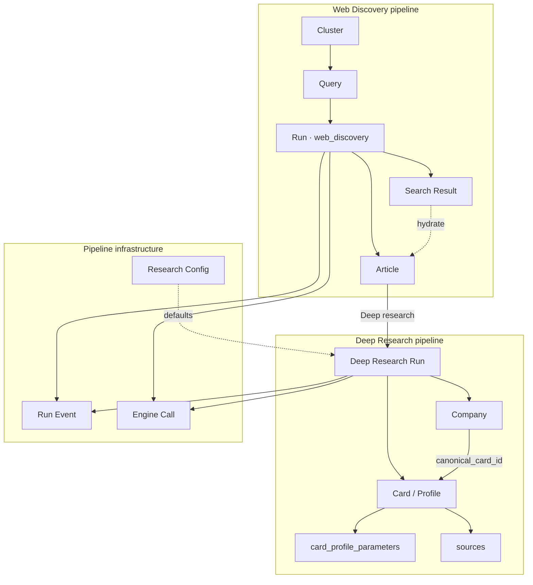
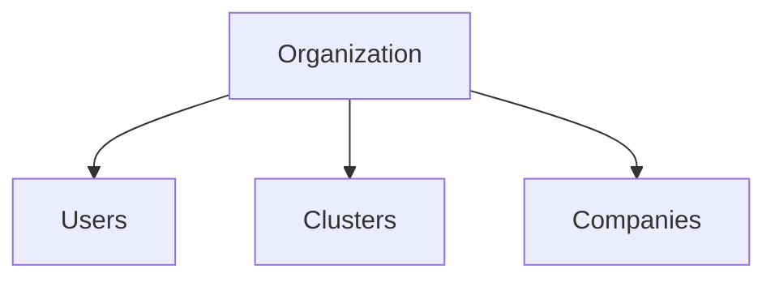
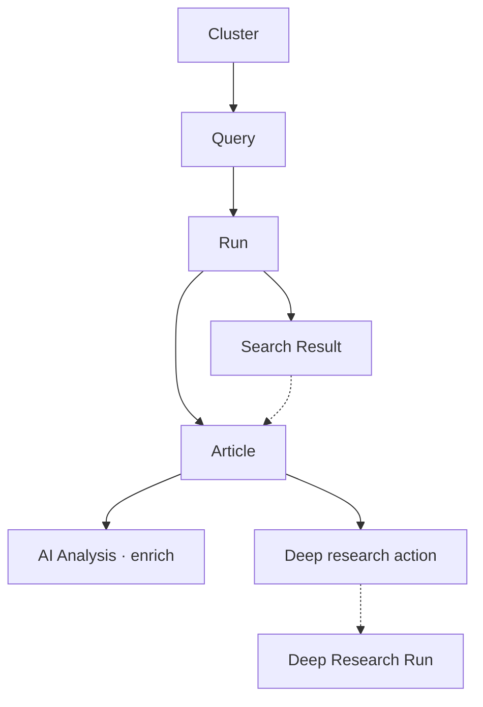
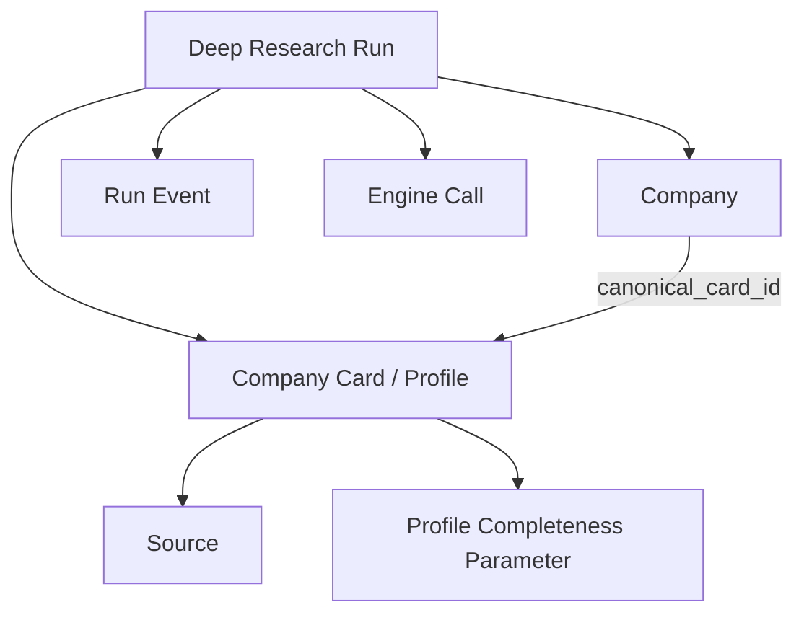
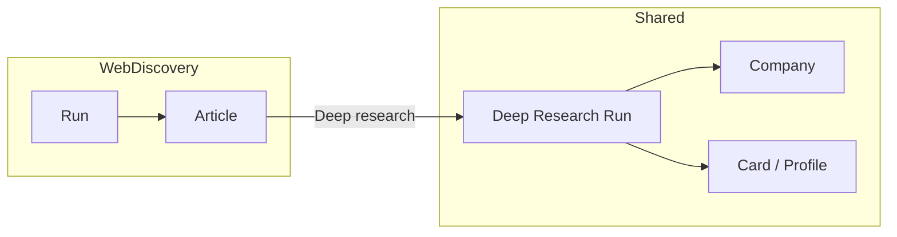
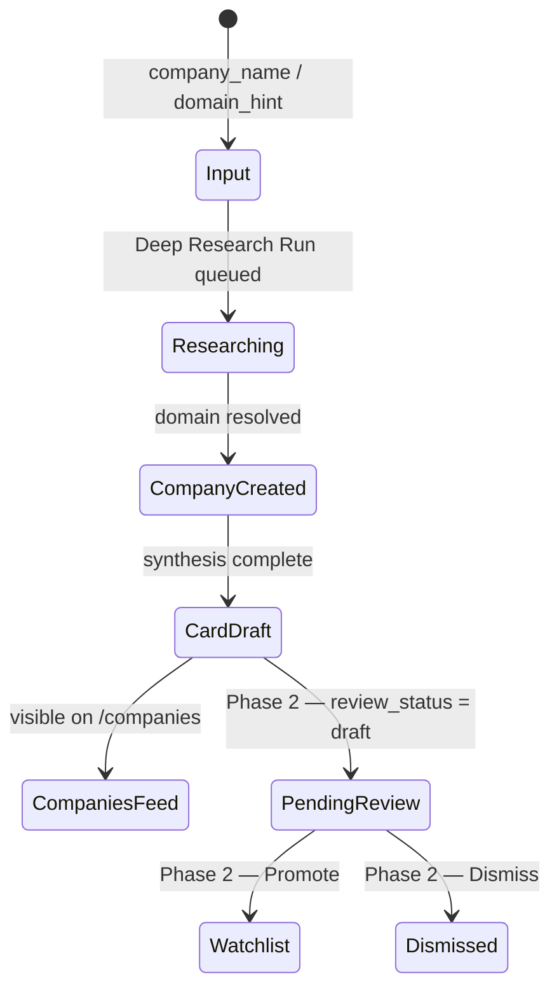

# P1-03 — Object Relationships

| Field | Value |
|-------|-------|
| **Document ref** | P1-03 |
| **Title** | Object Relationships |
| **Version** | 2.1 |
| **Last updated** | 2026-06-16 |
| **Audience** | Internal developers, product, operators |
| **Controlling doc** | [P1-00 Overview](./phase-1-overview.md) |
| **Object reference** | [P1-02-Admin](./P1-02-admin.md) · [P1-02-User](./P1-02-user.md) |
| **Workflow reference** | [P1-01-Admin](./P1-01-admin.md) · [P1-01-User](./P1-01-user.md) |
| **Field spec** | [P1-04](./P1-04-admin.md) |
| **Screen mapping** | [P1-05-Admin](./P1-05-admin.md) · [P1-05-User](./P1-05-user.md) |
| **Backend actions** | [P1-06](./P1-06.md) |
| **Linear** | [GRO-268](https://linear.app/growthmaschine/issue/GRO-268) · Parent [GRO-265](https://linear.app/growthmaschine/issue/GRO-265) |

---

## 1. Introduction

P1-02 named every core object. This document defines **how they connect** — ownership, parent/child structure, cardinality, and whether a child can exist without its parent.

NORAD is **one application** with two documentation perspectives (operator configure/run vs analyst read/decide). The same persisted row often has **different labels** in P1-02-Admin vs P1-02-User (e.g. Company Card vs Company Profile). Relationships are defined once at the data layer.

**User actions** (Deep research trigger) are not persisted row types — they spawn `runs` rows or update `cards.review_status`. See §6.4.

**Per-link format used in §4–§7:**

| Field | Meaning |
|-------|---------|
| **Ownership** | Which object is the parent / owner |
| **Without parent?** | Can the child exist if the parent is deleted or never existed |
| **Cardinality** | One-to-many, many-to-one, or many-to-many |
| **Required** | Must the link exist for the child to be valid in product terms |
| **Backend** | Current table/FK in this repo |

**AI Analysis** is not a persisted child row — it is an in-pipeline step whose output is written onto parent objects. See §9.

---

## 2. Object coverage and naming

### 2.1 Where every P1-02 object is documented

| Object | Doc | Relationship section |
|--------|-----|----------------------|
| Organization | P1-02 both | §4.1 |
| User | P1-02 both | §4.2 |
| Cluster | P1-02-Admin | §5 |
| Query | P1-02-Admin | §5 |
| Run (web_discovery) | P1-02-Admin | §5 |
| Search Result | P1-02-Admin | §5 · §7 |
| Article | P1-02 both | §5 · §6 |
| Web Discovery result card | P1-02-User | §6 (view) |
| Deep research trigger | P1-02 both | §5 · §6.4 |
| Deep Research Run | P1-02-Admin | §5.2 · §7 · §10 |
| Company | P1-02 both | §5.2 · §6 |
| Company Card / Company Profile | P1-02 both | §5.2 · §6 |
| Research Signal / Company Signal | P1-02 both | **Retired** — see legacy reference |
| Source | P1-02-Admin | §5.2 |
| Run Event | P1-02-Admin | §5.2 · §5.3 |
| Engine Call | P1-02-Admin | §5.2 · §5.3 |
| Research Config | P1-02-Admin | §5.3 |
| AI Analysis | P1-02 both | §9 |

Phase 2 objects (Pending Review, Watchlist, News Signal, etc.): [P1-02-Admin §11](./P1-02-admin.md) · relationships deferred to §11.

### 2.2 Label map (same data, different docs)

| Operator label (P1-02-Admin) | Analyst label (P1-02-User) | Persisted as |
|------------------------------|----------------------------|--------------|
| Company Card | Company Profile | `cards` row |
| Company | Company | `companies` row |
| Article | Article | `articles` row |
| Search Result | Web Discovery result card (partial) | `engine_outputs` slice + hydration |
| Deep Research Run | (outcome on Companies) | `runs` · `source_kind = research` |
| Cluster / Query | — | `web_discovery_*` tables |

### 2.3 Unified relationship overview (built today)

---

## 3. Relationship decisions (P1-02 §10)

Questions flagged in [P1-02-Admin §10](./P1-02-admin.md) — answers locked here for P1-04 (fields) and database design.

| # | Question | Decision | Rationale |
|---|----------|----------|-----------|
| 1 | Search Result ↔ Article — same row or separate? | **Separate** | Search Result is run-scoped JSON in `engine_outputs`. Article is a durable row in `articles` (unique `url`). Results API merges Article fields onto each hit when `article_id` is set. |
| 2 | Article lifecycle — create vs reuse? | **Create on first ingest; reuse on duplicate URL** | Dedup normalises URL before insert. Duplicate hits get `ingest_status: duplicate` and reuse existing `articles.summary` / `mentioned_companies`. |
| 3 | Company Card ↔ Company Profile | **Same row — version history via multiple cards** | One `cards` row per Deep Research Run. `companies.canonical_card_id` points at the accepted profile. UI labels differ; data does not. |
| 4 | Deep Research Run ↔ Pending Review | **Phase 2 — queue view, not a table** | `cards.review_status = draft` after complete. No Pending Review UI today. When built: 1:1 company+card while in queue. |
| 5 | Research Signal ↔ Company Signal | **Retired** — `signals` table dropped 2026-06-16 (`0011_drop_signals.sql`). BD layer moves to future frontend. |
| 6 | Run — single table vs typed views | **Single `runs` table + `source_kind`** | Active: `web_discovery`, `research`, legacy `user_query`. Routers filter by kind; no separate run tables. |
| 7 | Company — merge on complete | **Yes — upgrade existing row when `company_id` passed; else domain dedupe** | Discovery rows (`origin=web_discovery`) upgrade to `origin=research` on Deep Research complete. `runs.company_id` set at run **start** when `company_id` in POST body. Domain dedupes research-created rows on `companies.domain`. |
| 8 | Results API hydration | **Yes — canonical enrich from `articles`** | `GET .../queries/:id/results` hydrates `summary`, `mentioned_companies` (with `company_id`), cleaned `body_text` from Article when available. |
| 9 | Article mention ↔ Company row | **Dual write — JSON + relational** | Sonnet enrich upserts `companies` per mention; FK `source_article_id`. Unique `(source_article_id, normalized_name)`. See `0009` migration. |

### 3.1 Additional product decisions

| Question | Decision | Rationale |
|----------|----------|-----------|
| Separate analyst cluster tables? | **No — one schema** | `web_discovery_*` configured on `/discover-web`. Analyst reads results on the same app. |
| Analyst News feed ingest path? | **Not built** | Articles are created **during** Web Discovery runs, not via a separate cron → News feed pipeline. |
| Do we need Organizations now? | **Defer** | Single-tenant — no `organizations` table. |
| News Signal vs Research Signal? | **News Signal Phase 2; Research Signal retired** | News Signal would belong to a feed Article. Research Signal table removed — future frontend rebuilds BD timeline from evidence APIs. |
| Opportunity — entity or view? | **Phase 2 derived view** | Not persisted in MVP. |
| Watchlist? | **Phase 2** | `companies.is_watchlisted` may appear in migrations; no UI. |

---

## 4. Platform relationships

### 4.1 Organization

| Parent → Child | Ownership | Without parent? | Cardinality | Required |
| ---------------- | ----------- | ----------------- | ------------- | ---------- |
| Organization → User | Org owns users | No | 1:N | — |
| Organization → Cluster | Org owns clusters | No | 1:N | — |
| Organization → Company | Org owns companies | No | 1:N | — |

MVP runs without an org row. All tenant-scoped objects will inherit Organization when multi-tenant ships.

### 4.2 User

| Parent → Child | Ownership | Without parent? | Cardinality | Required |
| ---------------- | ----------- | ----------------- | ------------- | ---------- |
| User → Run (triggered) | User initiates runs | Yes — runs persist without user FK | 1:N | Optional |
| User → Deep research action | User clicks Deep research | N/A — action | — | — |

No `users` table in MVP. Runs do not record `triggered_by_user_id`.

---

## 5. Web Discovery — relationship tree

| Parent → Child | Ownership | Without parent? | Cardinality | Required |
| ---------------- | ----------- | ----------------- | ------------- | ---------- |
| Cluster → Query | Cluster owns queries | No — cascade delete | 1:N | Yes |
| Query → Run | Query config defines run input | Run can batch all queries in cluster | N:1 per query slice | Yes |
| Cluster → Run | Cluster scope for Run All | Single-query runs still belong to cluster context | 1:N | Yes |
| Run → Search Result | Run owns raw hits in JSON | No — results live inside `engine_outputs` | 1:N | Yes |
| Run → Article | Run ingests new articles | Article outlives run (`SET NULL` on FKs) | 1:N new URLs | Optional per hit |
| Article → Search Result (hydration) | Article is canonical enrich source | Search Result can exist without new Article (duplicate) | 1:1 per URL | Optional |
| Article → AI Analysis (enrich) | N/A — pipeline step | N/A | 1:1 per new article | — |
| Article → Deep research action | User action on `mentioned_companies` / Discovered tab | N/A | 1:N companies per article | Optional |
| Article → Company (mention row) | Article owns mention via `companies.source_article_id` | Company row survives article delete (`SET NULL`) | 1:N mentions | Optional per Sonnet extract |

**Example — Run → Article:**

* **Ownership:** Run creates or references Articles during ingest.
* **Without parent?** Article can outlive run (`articles.query_run_id` nullable on `SET NULL`).
* **Cardinality:** One Run → zero or many new Articles; duplicate URLs → zero new rows.

**Example — Article → Search Result hydration:**

* **Ownership:** Article owns `summary`, `mentioned_companies` (with `company_id`), `body_text`; Sonnet enrich also upserts **`companies` rows** (`origin=web_discovery`).
* **Without parent?** Search Result (run hit) exists without Article only if ingest failed before row creation.
* **Cardinality:** One Article → many Search Results across runs (same URL in different runs).

---

## 6. Deep research and analyst journey

### 6.1 Deep research pipeline

| Parent → Child | Ownership | Without parent? | Cardinality | Required |
| ---------------- | ----------- | ----------------- | ------------- | ---------- |
| Deep Research Run → Company | Run resolves or creates company | Company outlives run | N:1 | Yes on complete |
| Deep Research Run → Company Card | Run produces one card | Card kept if run deleted (`SET NULL` on `cards.run_id`) | 1:1 | Yes on complete |
| Company → Company Card | Company owns all versions | No | 1:N | Yes (≥1 after first research) |
| Company → Company Card (canonical) | Company points at accepted card | Optional until accept | 1:1 | Optional |
| Company Card → Source | Card owns citations | No | 1:N | Optional |
| Company Card → Profile Completeness Parameter | Card owns audit rows | No | 1:N (44) | Yes on persist |
| Deep Research Run → Run Event | Run owns log lines | No | 1:N | Yes |
| Deep Research Run → Engine Call | Run owns vendor audit | No | 1:N | Yes |

### 6.2 Analyst reading path (same app)

| Parent → Child | Ownership | Without parent? | Cardinality | Required |
| ---------------- | ----------- | ----------------- | ------------- | ---------- |
| Web Discovery result card → Article | Card displays Article enrich | Card is a view | 1:1 per URL | Yes for enrich UI |
| Article → Deep research action | Analyst action | N/A | 1:N companies | Optional |
| Deep Research Run → Company Profile | Outcome visible on Companies | N/A — alias | 1:1 per run | Yes on complete |

### 6.3 Pipeline infrastructure

| Parent → Child | Ownership | Without parent? | Cardinality | Required |
| ---------------- | ----------- | ----------------- | ------------- | ---------- |
| Research Config → Deep Research Run | Global defaults copied into run | Run keeps snapshot in `engines` JSON | N:1 template | Optional |
| Query → Run | Per-query Exa settings | Stored on query row + run metadata | 1:N | Yes |
| Run (any kind) → Run Event | Run owns events | No | 1:N | Yes |
| Run (any kind) → Engine Call | Run owns calls | No | 1:N | Yes |

### 6.4 User actions (not persisted rows)

| Action | From → To | Effect |
|--------|-----------|--------|
| **Deep research trigger** | Article / result card (company mention) → Deep Research Run | `POST /api/research/runs` with `company_name`, optional `domain_hint` |
| **Deep research (Companies)** | Manual company name → Deep Research Run | Same endpoint from `/companies` add flow |

**Not implemented in UI:** article Dismiss (`POST .../articles/:id/dismiss`), card Promote/Dismiss.

**Phase 2 actions (deferred):**

| Action | From → To | Effect |
|--------|-----------|--------|
| Promote | Pending Review → Watchlist | `cards.review_status → accepted`; `canonical_card_id` set |
| Dismiss (card) | Pending Review → removed | `cards.review_status → rejected` |

---

## 7. Cross-pipeline links

| From | To | Link type | Decision |
|------|-----|-----------|----------|
| Run | Article | Ingest + enrich | Same pipeline step — not a separate cron job |
| Search Result | Article | Hydration | Results API merges Article onto run hit |
| Article | Deep Research Run | User action | **Deep research** on `mentioned_companies` |
| Deep Research Run | Company Profile | Alias | Same `cards.id` |

### 7.1 Many-to-many relationships

| Relationship | Resolution |
|--------------|------------|
| Article ↔ Company (mentions) | **Resolved:** `articles.mentioned_companies[]` JSON **and** `companies` rows with `source_article_id` FK. One mention = one company row per article+name. Deep Research upgrades same row. |
| Company ↔ Cluster | **Resolved:** Implicit via which cluster runs ingested articles mentioning the company — no direct FK. |
| Article ↔ Opportunity (Phase 2) | **Deferred:** derived weekly view — not MVP. |

---

## 8. AI Analysis — attachment points

AI Analysis is a pipeline step, not a child table. Outputs attach to:

| Pipeline | Parent object | Persisted fields |
|----------|---------------|------------------|
| Web Discovery — enrich | Article + Company mention | `articles.summary`, `articles.mentioned_companies`; `companies` (`origin=web_discovery`) |
| Deep Research — synthesise | Company Card | `cards.card` JSONB (fact blocks; BD signals/scores stripped) |
| Deep Research — persist | Profile Completeness Parameter | `card_profile_parameters` (44 rows), `cards.profile_*` summary; `sources` rows |

| Parent → AI Analysis | Ownership | Without parent? | Cardinality |
|---------------------|-----------|-----------------|-------------|
| Article → enrich output | Article owns summary | N/A | 1:1 per new URL |
| Company Card → synthesis output | Card owns JSON | N/A | 1:1 per run |

Logged in `engine_calls` (`vendor = anthropic`) for both pipelines.

---

## 9. Run polymorphism (`runs` table)

Single table, discriminated by `source_kind`:

| `source_kind` | Product object | Parent context | Produces |
|---------------|----------------|----------------|----------|
| `web_discovery` | Run | Cluster / Query | Search Results in `engine_outputs`; new `articles` rows; **`companies` mention rows** |
| `research` | Deep Research Run | Deep research action, API | Company, Card, Sources, Profile Completeness |
| `user_query` | Deep Research Run (legacy) | API direct | Same as `research` |

Typed views: `routers/web_discovery.py`, `routers/research.py` filter by `source_kind`.

---

## 10. Company lifecycle (merge on complete)

| Stage | Objects involved | Merge rule |
|-------|------------------|------------|
| Input | Company name from result card or Companies page | No company row yet — or matched by domain |
| Researching | `runs` · `source_kind = research` | `company_id` nullable until resolve |
| Complete | `companies` + `cards` + `sources` + `card_profile_parameters` | **One company per domain**; duplicate runs append new card version |
| Companies feed | `cards.review_status = draft` default | Visible on `/companies` today |
| Phase 2 review | `review_status` promote/dismiss | Queue view — not built |

---

## 11. Phase 2 relationships (planned, not built)

When analyst feed and review queue ship, extend this section:

| Parent → Child | Planned decision |
| ---------------- | ---------------- |
| Run → Article → News Signal | Feed ingestion with signal scoring |
| Pending Review Item → Watchlist Entry | Promote escalation |
| Watchlist Entry → Opportunity | Weekly digest source |
| Monitoring Rule → Article | Predicate filter at read time |

See [phase2test.md](./phase2test.md) for SQL acceptance scenarios — treat Today page / `trend_articles` references as **retired**.

---

## 12. Completion checklist

| Item |
| ------ |
| Every P1-02 object mapped to a section (§2.1) |
| P1-02 §10 relationship questions answered (§3) |
| Web Discovery + Deep Research trees (§5–§6) |
| User actions documented (§6.4) |
| Phase 2 relationships deferred explicitly (§11) |
| Each link marked required or optional |
| Many-to-many relationships resolved (§7.1) |
| Single-app architecture — no separate analyst DB |
| Backend FK mapping vs `apps/api/app/models/` |

---

## 13. Approval

| Role | Name | Date |
| ------ | ------ | ------ |
| Author | Huzaifa | 2026-06-19 |
| Reviewer | Shehrayar Haq | — |
