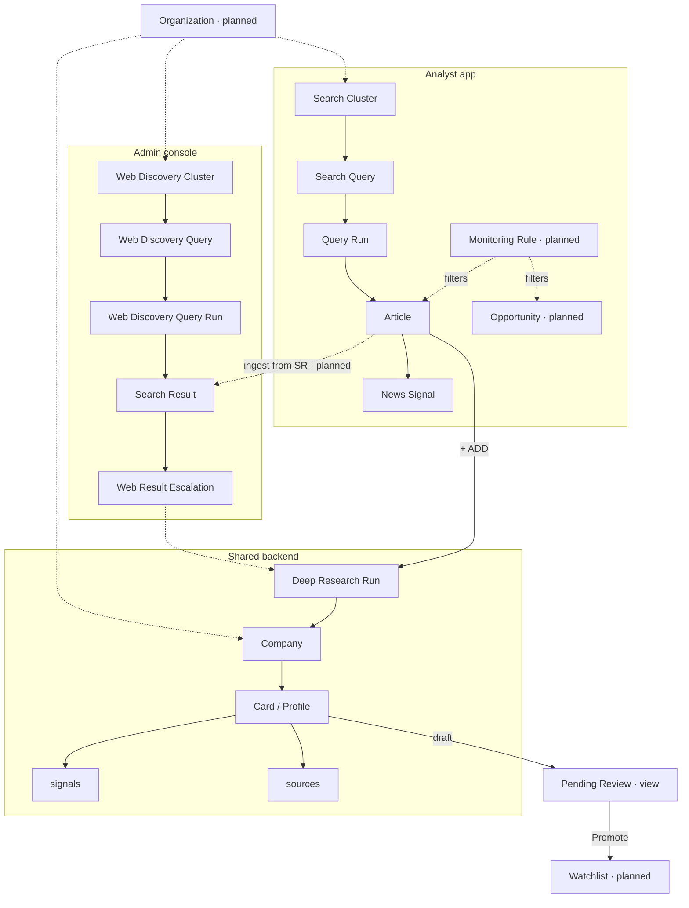
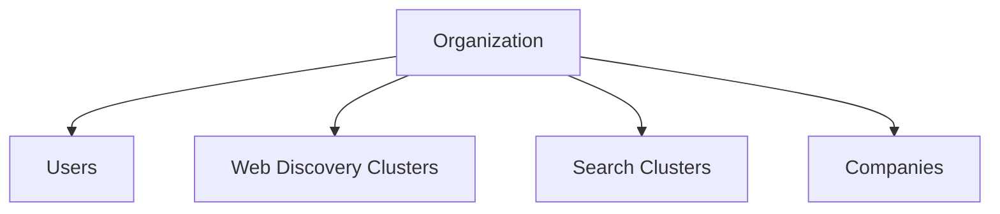
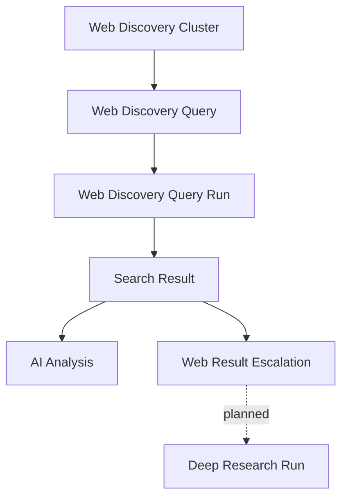
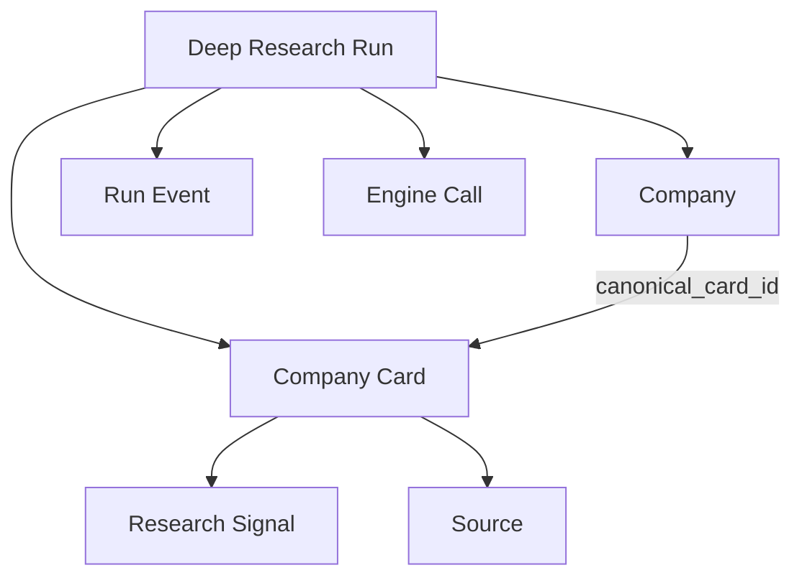
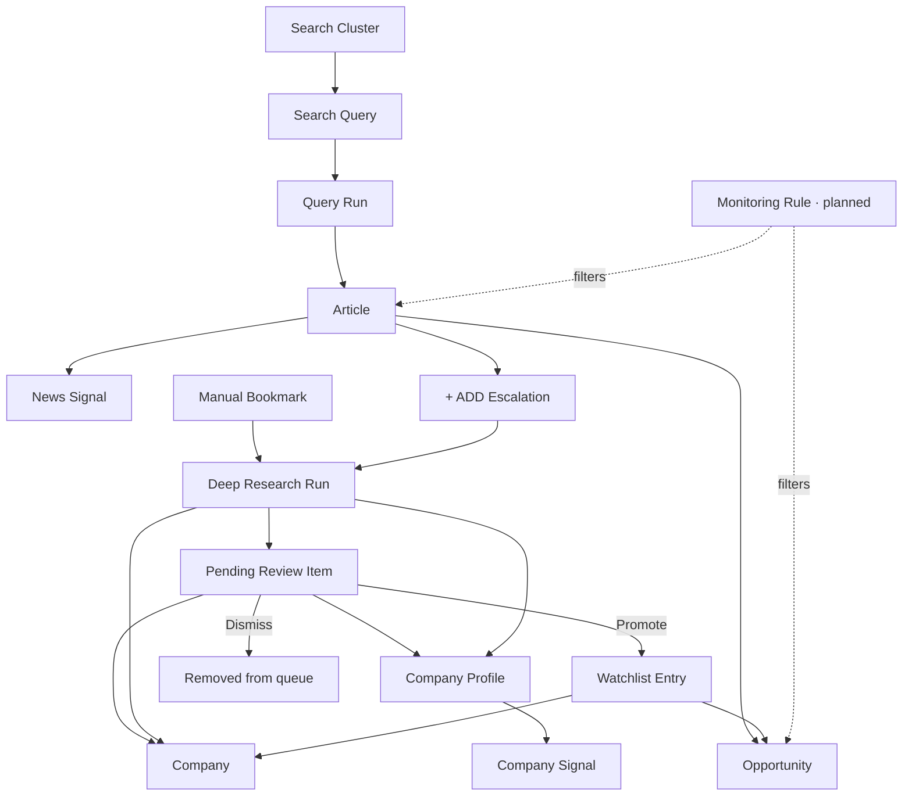
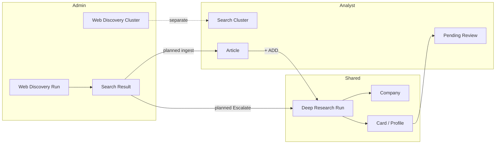
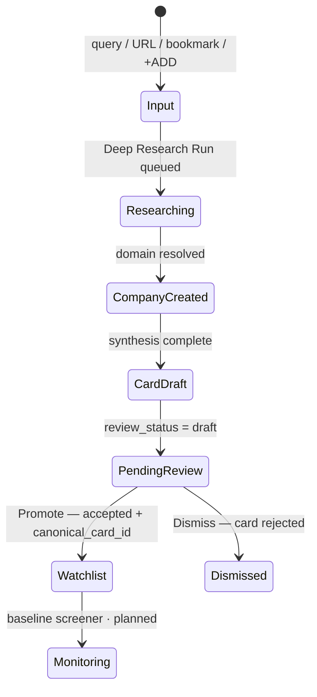

# P1-03 — Object Relationships

| Field | Value |
|-------|-------|
| **Document ref** | P1-03 |
| **Title** | Object Relationships |
| **Version** | 1.2 |
| **Status** | Draft |
| **Last updated** | 2026-06-09 |
| **Audience** | Internal developers, product, operators |
| **Linear** | [GRO-268](https://linear.app/growthmaschine/issue/GRO-268/30-define-relationships-between-core-product-objects) · Parent [GRO-265](https://linear.app/growthmaschine/issue/GRO-265) |
| **Object reference** | [P1-02-Admin](./P1-02-admin.md) · [P1-02-User](./P1-02-user.md) |
| **Workflow reference** | [P1-01-Admin](./P1-01-admin.md) · [P1-01-User](./P1-01-user.md) |
| **Schema diagrams** | [P1-04-Admin §9](./P1-04-admin.md#9-database-schema-diagrams) |
| **Screen mapping** | [P1-05-Admin](./P1-05-admin.md) · [P1-05-User](./P1-05-user.md) |

---

## 1. Introduction

P1-02 named every core object. This document defines **how they connect** — ownership, parent/child structure, cardinality, and whether a child can exist without its parent. It covers the **full P1-02 object set** (admin + analyst), not only the simplified tree in [GRO-268](https://linear.app/growthmaschine/issue/GRO-268) — that issue is a starting sketch; this doc is the product data-model contract.

NORAD has two frontends sharing one backend:

| Surface | Primary objects |
|---------|-----------------|
| Admin console | Web Discovery, Deep Research, pipeline audit |
| Analyst app | Search Clusters, News feed, Pending review, Watchlist |

The same real-world entity often has **different UI labels** on each surface (e.g. Company Card vs Company Profile). Relationships are defined once at the data layer; labels are presentation.

**Escalations** are analyst or operator **actions**, not persisted row types — they spawn runs or update `cards.review_status`. See §6.4.

**Per-link format used in §4–§7:**

| Field | Meaning |
|-------|---------|
| **Ownership** | Which object is the parent / owner |
| **Without parent?** | Can the child exist if the parent is deleted or never existed |
| **Cardinality** | One-to-many, many-to-one, or many-to-many |
| **Required** | Must the link exist for the child to be valid in product terms |
| **Backend today** | Current table/FK in this repo (or `planned`) |

**AI Analysis** is not a persisted child row — it is an in-pipeline step whose output is written onto parent objects (scores on articles, card JSON on research runs). See §9.

---

## 2. Object coverage and naming

### 2.1 Where every P1-02 object is documented

| Object | Doc | Relationship section |
|--------|-----|----------------------|
| Organization | P1-02 both | §4.1 |
| User | P1-02 both | §4.2 |
| Web Discovery Cluster | P1-02-Admin | §5.1 |
| Web Discovery Query | P1-02-Admin | §5.1 |
| Web Discovery Query Run | P1-02-Admin | §5.1 · §10 |
| Search Result | P1-02-Admin | §5.1 · §7 · §9 |
| Web Result Escalation | P1-02-Admin | §5.1 · §6.4 |
| Deep Research Run | P1-02-Admin | §5.2 · §7 · §10 · §11 |
| Company | P1-02 both | §5.2 · §6 · §11 |
| Company Card / Company Profile | P1-02 both | §5.2 · §6 |
| Research Signal / Company Signal | P1-02 both | §5.2 · §6 |
| Source | P1-02-Admin | §5.2 |
| Run Event | P1-02-Admin | §5.2 · §5.3 |
| Engine Call | P1-02-Admin | §5.2 · §5.3 |
| Research Config | P1-02-Admin | §5.3 |
| AI Analysis | P1-02 both | §9 |
| Search Cluster | P1-02-User | §6 |
| Search Query | P1-02-User | §6 |
| Article | P1-02-User | §6 · §7 |
| News Signal | P1-02-User | §6 |
| Opportunity | P1-02-User | §6 · §7.1 |
| Pending Review Item | P1-02-User | §6 · §11 |
| Watchlist Entry | P1-02-User | §6 · §11 |
| Query Run (analyst) | P1-02-User (implied) | §6 · §10 |
| Manual Bookmark | P1-02-User | §6 |
| + ADD / Promote / Dismiss Escalation | P1-02-User | §6.4 |
| Monitoring Rule | P1-02-User | §6.5 |

### 2.2 Cross-UI naming map

Objects that refer to the same persisted data:

| Admin label (P1-02-Admin) | Analyst label (P1-02-User) | Persisted as |
|---------------------------|----------------------------|--------------|
| Company Card | Company Profile | `cards` row |
| Research Signal | Company Signal | `signals` row |
| Company | Company | `companies` row |
| Deep Research Run | (outcome: Pending Review / Profile) | `runs` · `source_kind = research` |
| Web Discovery Cluster | — (operator-only) | `web_discovery_clusters` |
| Web Discovery Query | — (operator-only) | `web_discovery_queries` |
| Search Result | — (operator-only) | `runs.engine_outputs` slice |
| — | Search Cluster | `search_clusters` (planned) |
| — | Search Query | `search_queries` (planned) |
| — | Article | `articles` (planned) |
| — | News Signal | on `articles` or child table (planned) |
| — | Opportunity | derived view / junction (planned) |
| — | Pending Review Item | view on `companies` + `cards` draft |
| — | Watchlist Entry | flag on `companies` or `watchlist_entries` (planned) |

### 2.3 Unified relationship overview

Both surfaces under one tenant (Organization deferred for MVP):

---

## 3. Relationship decisions (P1-02 §11)

Questions flagged in [P1-02-Admin §11](./P1-02-admin.md) — answers locked here for P1-04 (fields) and database design.

| # | Question | Decision | Rationale |
|---|----------|----------|-----------|
| 1 | Web Discovery Cluster ↔ analyst Search Cluster | **Separate tables** | Different operators, search engines, and UI surfaces. Web Discovery is Exa query config for operators. Search Cluster is analyst news-monitoring theme. No shared lifecycle. |
| 2 | Search Result ↔ analyst Article — same row or separate? | **Separate persisted objects** | A Search Result is run-scoped JSON inside `engine_outputs` — not a feed row. An Article is a durable news entity with enrichment, signals, and analyst UI. They are **never the same table row**. Provenance links (`source_run_id`, URL) connect them after ingest. |
| 3 | Search Result ↔ analyst Article — ingest path | **Two paths into Articles** | **(A)** Web Discovery → scheduled/triggered ingest → Article in analyst News feed. **(B)** Analyst Search Cluster run → Query Run → Article directly. Path (A) may copy from operator results; path (B) is independent of Web Discovery. Today / `trend_articles` is **dropped**. |
| 4 | Company Card ↔ Company Profile | **Same row — version history via multiple cards** | One `cards` row per Deep Research Run. `companies.canonical_card_id` points at the accepted profile the analyst sees. Prior runs keep older card rows for history. UI labels differ; data does not. |
| 5 | Deep Research Run ↔ Pending Review Item | **Pending Review is a queue view, not a table** | A Pending Review Item = `Company` + latest `Card` where `review_status = draft` after a completed research run. 1:1 while in queue. `runs.id` on the card is the originating Deep Research Run. |
| 6 | Research Signal ↔ Company Signal | **Same `signals` row** | Extracted during deep research, displayed on admin card detail and analyst company timeline. **News Signal** is different — it belongs to an Article, not `signals`. |
| 7 | Run — single table vs typed views | **Single `runs` table + `source_kind` discriminator** | Already implemented. Active values: `web_discovery`, `research` (+ legacy `user_query`). `discovery` (Today pipeline) is **dropped** — legacy rows may remain in DB. Typed API routes filter `source_kind`; no separate run tables. |
| 8 | Company — merge pin/query rows on complete | **Yes — one canonical `companies` row on complete** | Free-text query / URL at run start resolves to one company on success. Domain dedupes on `companies.domain`. `runs.company_id` and `runs.card_id` filled at end. No permanent "pin" rows. |

### 3.1 Additional product decisions

| Question | Decision | Rationale |
|----------|----------|-----------|
| Can results be manually added, or only from a run? | **From a run by default; manual URL add is a planned escalation** | Search Results are produced by Web Discovery runs. Manual URL promote would start a run or ingestion job — not an orphan result row. Analyst **Manual Bookmark** is for companies, not articles. |
| Do we need Organizations now? | **Defer to post-MVP** | Single-tenant today — no `organizations` table. Document `organization_id` as a future FK on all tenant-scoped tables. Does not block MVP schema. |
| News Signal vs Research Signal? | **Different parents** | News Signal belongs to an **Article** (feed ingestion). Research / Company Signal is a **`signals` table row** on a Company Card. Same word "signal", different tables and lifecycles. |
| Opportunity — entity or view? | **Derived view** | Opportunity is a weekly digest projection over Articles and/or Watchlist Company Signals — not a primary persisted object in MVP. |

---

## 4. Platform relationships

### 4.1 Organization

| Parent → Child | Ownership | Without parent? | Cardinality | Required | Backend today |
|----------------|-----------|-----------------|-------------|----------|---------------|
| Organization → User | Org owns users | No | 1:N | Planned | `planned` |
| Organization → Web Discovery Cluster | Org owns clusters | No | 1:N | Planned | `planned` — no org FK today |
| Organization → Search Cluster | Org owns clusters | No | 1:N | Planned | `planned` |
| Organization → Company | Org owns companies | No | 1:N | Planned | `planned` |

All tenant-scoped objects inherit Organization when multi-tenant ships. MVP runs without an org row.

### 4.2 User

| Parent → Child | Ownership | Without parent? | Cardinality | Required | Backend today |
|----------------|-----------|-----------------|-------------|----------|---------------|
| User → Run (triggered) | User initiates runs | Yes — runs persist without user FK | 1:N | Optional | No `user_id` on `runs` today |
| User → Escalation actions | User owns promote/dismiss/escalate/+ADD clicks | N/A — actions, not rows | — | — | Audit via `run_events` / future `user_id` |
| User → Watchlist Entry | Analyst promotes companies they own | N/A — company-centric | 1:N companies | Optional | **planned** — `watchlist_entries.user_id` or implicit single-tenant |
| User → Manual Bookmark | Analyst queues company for research | N/A — spawns run | 1:N | Optional | No bookmark table — input on research run |

---

## 5. Admin console — relationship trees

### 5.1 Web Discovery pipeline

| Parent → Child | Ownership | Without parent? | Cardinality | Required | Backend today |
|----------------|-----------|-----------------|-------------|----------|---------------|
| Web Discovery Cluster → Web Discovery Query | Cluster owns queries | No — cascade delete | 1:N | Yes | `web_discovery_queries.cluster_id` → `web_discovery_clusters.id` |
| Web Discovery Query → Web Discovery Query Run | Query config defines run input | Run can batch all queries in cluster | N:1 per query slice | Yes | `runs` · `source_kind = web_discovery` · outputs keyed by query id in `engine_outputs` |
| Web Discovery Cluster → Web Discovery Query Run | Cluster scope for Run All | Single-query runs still belong to cluster context | 1:N | Yes | Same `runs` row; cluster id in run metadata |
| Web Discovery Query Run → Search Result | Run owns raw hits | No — results live inside run JSON | 1:N | Yes | `runs.engine_outputs` per query |
| Search Result → AI Analysis | Analysis enriches result | N/A — not a row | 1:1 per result | Planned | Not implemented post-run |
| Search Result → Web Result Escalation | Operator action on result | N/A — action | 1:1 | Planned | Not implemented |

**Example — Web Discovery Cluster → Web Discovery Query:**

* **Ownership:** Cluster owns its Queries.
* **Without parent?** No — a Query always belongs to exactly one Cluster.
* **Cardinality:** One Cluster → many Queries; each Query → one Cluster.

### 5.2 Deep research pipeline

| Parent → Child | Ownership | Without parent? | Cardinality | Required | Backend today |
|----------------|-----------|-----------------|-------------|----------|---------------|
| Deep Research Run → Company | Run resolves or creates company | Company outlives run | N:1 | Yes on complete | `runs.company_id` |
| Deep Research Run → Company Card | Run produces one card | Card kept if run deleted (`SET NULL` on card.run_id) | 1:1 | Yes on complete | `cards.run_id` → `runs.id` |
| Company → Company Card | Company owns all versions | No | 1:N | Yes (≥1 after first research) | `cards.company_id` → `companies.id` |
| Company → Company Card (canonical) | Company points at accepted card | Optional until first accept | 1:1 | Optional | `companies.canonical_card_id` composite FK |
| Company Card → Research Signal | Card owns extracted signals | No | 1:N | Optional | `signals` composite FK to `(card_id, company_id)` |
| Company Card → Source | Card owns citations | No | 1:N | Optional | `sources` composite FK to `(card_id, company_id)`; `company_id` denormalized for cascade |
| Company → Source | Company scopes sources | No — via card | 1:N | Optional | `sources.company_id` FK (redundant guard with composite FK) |
| Deep Research Run → Run Event | Run owns log lines | No | 1:N | Yes | `run_events.run_id` |
| Deep Research Run → Engine Call | Run owns vendor audit | No | 1:N | Yes | `engine_calls.run_id` |

**Example — Company → Company Card:**

* **Ownership:** Company owns all card versions.
* **Without parent?** No — every card requires a `company_id`.
* **Cardinality:** One Company → many Cards (one per research run); each Card → exactly one Company.

**Example — Company Card → Source:**

* **Ownership:** Card owns its citation rows; `company_id` on `sources` mirrors the card's company for integrity.
* **Without parent?** No — every source requires matching `(card_id, company_id)`.
* **Cardinality:** One Card → many Sources; each Source → one Card.

### 5.3 Pipeline infrastructure

| Parent → Child | Ownership | Without parent? | Cardinality | Required | Backend today |
|----------------|-----------|-----------------|-------------|----------|---------------|
| Research Config → Deep Research Run | Global defaults copied into run | Run keeps snapshot in `engines` JSON | N:1 template | Optional | `app_kv` · not FK-linked — **does not affect Web Discovery runs** |
| Web Discovery Query → Web Discovery Query Run | Per-query Exa settings | Stored on query row + run metadata | 1:N | Yes | `web_discovery_queries` columns |
| Run (any kind) → Run Event | Run owns events | No | 1:N | Yes | `run_events` |
| Run (any kind) → Engine Call | Run owns calls | No | 1:N | Yes | `engine_calls` |

---

## 6. Analyst app — relationship tree

| Parent → Child | Ownership | Without parent? | Cardinality | Required | Backend today |
|----------------|-----------|-----------------|-------------|----------|---------------|
| Organization → Monitoring Rule | Tenant owns rules | No | 1:N | Planned | **planned** |
| Search Cluster → Search Query | Cluster owns queries | No | 1:N | Yes | `search_clusters` / `search_queries` — **planned** |
| Search Query → Query Run | Query defines run input | No | 1:N | Yes | `runs` · future `source_kind = analyst_discovery` or shared ingestion run |
| Query Run → Article | Run ingests stories | No | 1:N | Yes | `articles` — **planned** |
| Article → News Signal | Article owns signal tags | No | 1:N | Yes | Embedded on article row or child table — **planned** |
| Article → + ADD Escalation | Analyst action | N/A | 1:N companies per article | Optional | Spawns `runs` · `research` |
| Manual Bookmark → Deep Research Run | Analyst-queued company | No bookmark row — direct run | 1:1 | Yes | `runs` · `source_kind = research` · manual input |
| Deep Research Run → Pending Review Item | Queue view on outcome | N/A — view | 1:1 while in queue | Yes after research | `cards.review_status = draft` |
| Pending Review Item → Company | Item wraps company | No | 1:1 | Yes | `companies` |
| Pending Review Item → Company Profile | Item shows latest card | No | 1:1 | Yes | `cards` draft row |
| Company → Company Profile | Company owns profile versions | No | 1:N cards | Yes after research | `cards.company_id` |
| Company Profile → Company Signal | Profile timeline | No | 1:N | Optional | `signals` (same as Research Signal) |
| Company → Watchlist Entry | Promote adds watch flag | No | 1:1 per promoted company | Optional | **planned** — `watchlist_entries` or `companies.is_watchlisted` |
| Pending Review Item → Watchlist Entry | **Promote Escalation** | N/A — action | 1:1 | Optional | Sets watchlist flag; `cards.review_status → accepted` |
| Pending Review Item → (removed) | **Dismiss Escalation** | N/A — action | 1:1 | Optional | `cards.review_status → rejected`; removed from queue |
| Watchlist Entry → Company | Entry points at company | No | 1:1 | Yes | Same `companies.id` |
| Monitoring Rule → Article (visibility) | Rule filters feed | N/A — predicate | N:M | Planned | **planned** — rules evaluated at read or ingest |
| Monitoring Rule → Opportunity | Rule picks digest rows | N/A — predicate | N:M | Planned | **planned** |
| Article → Opportunity | Industry digest source | N/A | N:M | Optional | **planned** — derived, see §7.1 |
| Watchlist Entry → Opportunity | Watchlist digest source | N/A | 1:N | Optional | **planned** |
| Company → Pending Review Item | Company in draft queue | No | 1:1 while queued | Optional | View when `cards.review_status = draft` |

**Example — Search Cluster → Search Query:**

* **Ownership:** Search Cluster owns its Queries (analyst Settings).
* **Without parent?** No — a Query always belongs to one Cluster.
* **Cardinality:** One Cluster → many Queries; each Query → one Cluster.

**Example — Article → News Signal:**

* **Ownership:** Article owns its signal classification.
* **Without parent?** No — a News Signal does not exist without an Article.
* **Cardinality:** One Article → one or more News Signals (type + score); each News Signal → one Article.

### 6.4 Escalation actions (not persisted rows)

Escalations are **choices** that trigger state changes or new runs. None are standalone tables.

| Escalation | Surface | From → To | Effect |
|------------|---------|-----------|--------|
| **Web Result Escalation** | Admin | Search Result → Deep Research Run | `POST /api/research/runs` with result provenance — **planned** |
| **+ ADD Escalation** | Analyst | Article (company mention) → Deep Research Run | Spawns `runs` · `research` → Pending Review on complete |
| **Promote Escalation** | Analyst | Pending Review Item → Watchlist Entry | `cards.review_status → accepted`; watchlist flag; `canonical_card_id` set |
| **Dismiss Escalation** | Analyst | Pending Review Item → removed | `cards.review_status → rejected`; queue row hidden |

**Example — Promote Escalation:**

* **Ownership:** Analyst action on a Pending Review Item (company + draft card).
* **Without parent?** N/A — not a child row.
* **Cardinality:** One promote per company per decision; re-promote blocked if already on Watchlist.

### 6.5 Monitoring Rule (planned)

| Parent → Child | Ownership | Without parent? | Cardinality | Required | Backend today |
|----------------|-----------|-----------------|-------------|----------|---------------|
| Organization → Monitoring Rule | Tenant owns rules | No | 1:N | Planned | **planned** |
| Monitoring Rule → News Signal (match) | Rule predicate on signal fields | N/A | N:M | Planned | Filter only — no FK |
| Monitoring Rule → Signals tab / Home Top | Rule drives UI routing | N/A | N:M | Planned | Read-time or materialized digest |

Monitoring Rules filter **after** ingestion. They do not replace Search Cluster scope (what to fetch) — they control what the analyst **sees** (Signals tabs, Industry opportunities, Watchlist digests).

**Example — Monitoring Rule → Article visibility:**

* **Ownership:** Rule is tenant config; Articles are not owned by rules.
* **Without parent?** Yes — articles exist without rules; rules only filter presentation.
* **Cardinality:** Many rules may match one Article; one rule matches many Articles.

---

## 7. Cross-pipeline links

How admin and analyst objects connect across surfaces:

| From | To | Link type | Decision |
|------|-----|-----------|----------|
| Web Discovery Cluster | Search Cluster | None | **Separate** — no FK, no sync (§3 #1) |
| Search Result | Article | Transform (path A) | Web Discovery ingest/sync creates Article; `source_run_id` + URL provenance |
| Search Cluster / Query Run | Article | Transform (path B) | Analyst cluster runs ingest directly — independent of Web Discovery |
| Search Result | Deep Research Run | Escalation | Operator **Escalate** on Web Discovery result (planned) |
| Article | Deep Research Run | Escalation | Analyst + ADD |
| Manual Bookmark | Deep Research Run | Escalation | Analyst **Find & queue** — no article parent |
| Deep Research Run | Pending Review | View | Draft card after complete |
| Company Card | Company Profile | Alias | Same `cards.id` |
| Research Signal | Company Signal | Alias | Same `signals.id` |

### 7.1 Many-to-many relationships

| Relationship | Resolution |
|--------------|------------|
| Article ↔ Company (mentions) | **Resolved:** Article stores `mentioned_companies[]` JSON; Company does not own articles. M:N via array or junction when built. |
| Article ↔ Opportunity | **Resolved:** Opportunity is a derived weekly view — junction table `opportunity_articles` or computed at read time. Not a permanent M:N entity. |
| Company ↔ Search Cluster | **Resolved:** Implicit via which cluster runs ingested articles mentioning the company — no direct FK. Watchlist monitoring is company-centric, not cluster-centric. |
| Monitoring Rule ↔ Article | **Resolved:** Rules are predicates — many rules match many articles at read time. No junction table required for MVP; optional `rule_matches` materialization later. |

No unresolved many-to-many relationships remain for MVP.

---

## 9. AI Analysis — attachment points

AI Analysis is a pipeline step, not a child table. Outputs attach to:

| Pipeline | Parent object | Persisted fields |
|----------|---------------|------------------|
| Web Discovery — post-run | Search Result | **Planned** — rank, summary, signals on result or child rows |
| Deep Research — synthesise | Company Card | `cards.card` JSONB |
| Analyst News ingestion | Article | **Planned** — summary, signal scores on `articles` |

| Parent → AI Analysis | Ownership | Without parent? | Cardinality |
|---------------------|-----------|-----------------|-------------|
| Company Card → synthesis output | Card owns JSON | N/A | 1:1 per run |
| Search Result → analysis output | Result owns enrichment | N/A | 1:1 — planned |

---

## 10. Run polymorphism (`runs` table)

Single table, discriminated by `source_kind`:

| `source_kind` | Product object | Parent context | Produces |
|---------------|----------------|----------------|----------|
| `web_discovery` | Web Discovery Query Run | Web Discovery Cluster / Query | Search Results in `engine_outputs` |
| `discovery` | — (dropped) | Legacy Today pipeline | Legacy `trend_articles` — not in target model |
| `research` | Deep Research Run | Search Result escalate, Article +ADD, Manual Bookmark, API query | Company, Card, Signals, Sources |
| `user_query` | Ad-hoc research | Legacy / API direct | Same as research |

Typed views: `routers/web_discovery.py`, `routers/research.py` filter active kinds. `routers/discovery.py` is **legacy** (dropped Today pipeline). No separate run tables.

| `source_kind` (planned) | Product object | Notes |
|-------------------------|----------------|-------|
| `web_discovery` (reuse) | Analyst Query Run | `engines.search_cluster_id` / `search_query_id` discriminate from operator runs — see [P1-04-User §3.3](./P1-04-user.md) |

---

## 11. Company lifecycle (merge on complete)

| Stage | Objects involved | Merge rule |
|-------|------------------|------------|
| Input | Free-text query, URL, Web Discovery escalate, article +ADD | No company row yet — or matched by domain |
| Researching | `runs` · `source_kind = research` | `company_id` nullable until resolve |
| Complete | `companies` + `cards` + `signals` | **One company per domain**; duplicate runs append new card version |
| Pending review | `cards.review_status = draft` | Queue view — not a separate table |
| Promote | Watchlist flag on company | `review_status → accepted`; `canonical_card_id` set in same action |
| Dismiss | `cards.review_status = rejected` | Company row may remain for audit; removed from queue |

Pin/query rows do not persist as separate entities — they collapse into `companies` on research complete (§3 #8).

---

## 12. Completion checklist

| Item | Status |
|------|--------|
| Every P1-02 object mapped to a section (§2.1) | Done |
| P1-02 §11 relationship questions answered (§3) | Done |
| Admin + analyst relationship trees (§5–§6) | Done |
| Escalation actions documented (§6.4) | Done |
| Monitoring Rule relationships (§6.5) | Done |
| Each link marked required or optional | Done |
| Many-to-many relationships resolved (§7.1) | Done |
| Cross-pipeline paths A and B for Articles (§3 #3, §7) | Done |
| Source composite FK accuracy (§5.2) | Done |
| Backend FK mapping vs `apps/api/app/models/` | Done |
| Today / Discovery Cluster dropped from target model | Done |

---

## 13. Approval

| Role | Name | Date | Status |
|------|------|------|--------|
| Author | Huzaifa | 2026-06-08 | Draft |
| Reviewer | Shehrayar Haq | — | Pending |
