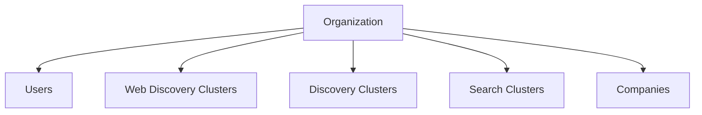
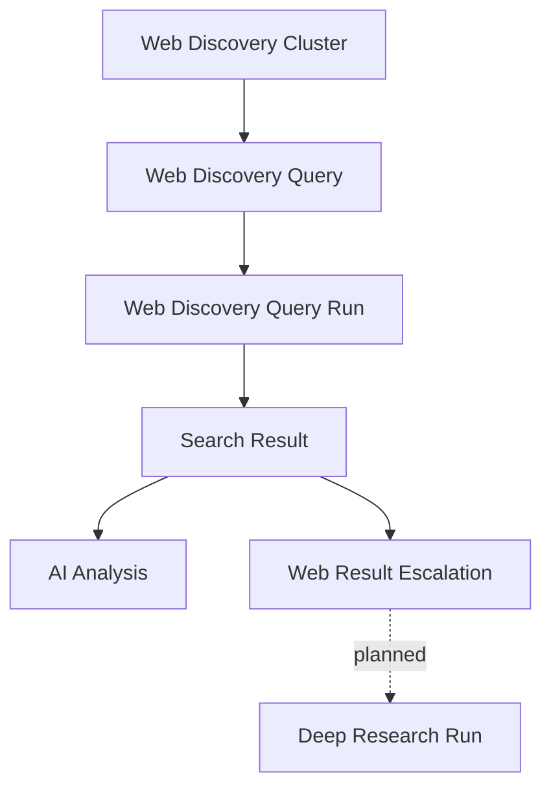
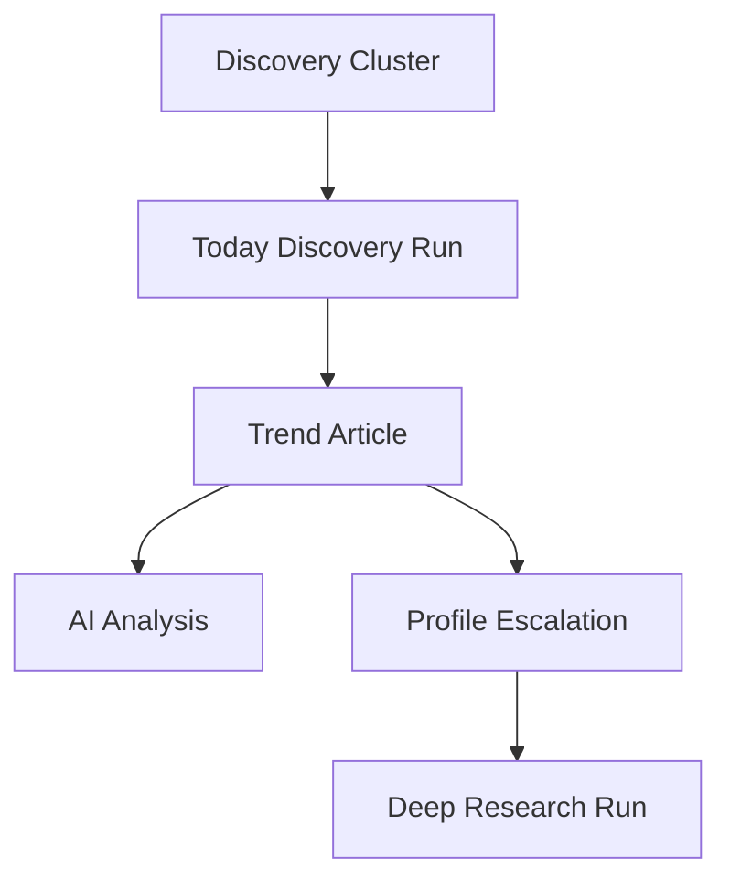
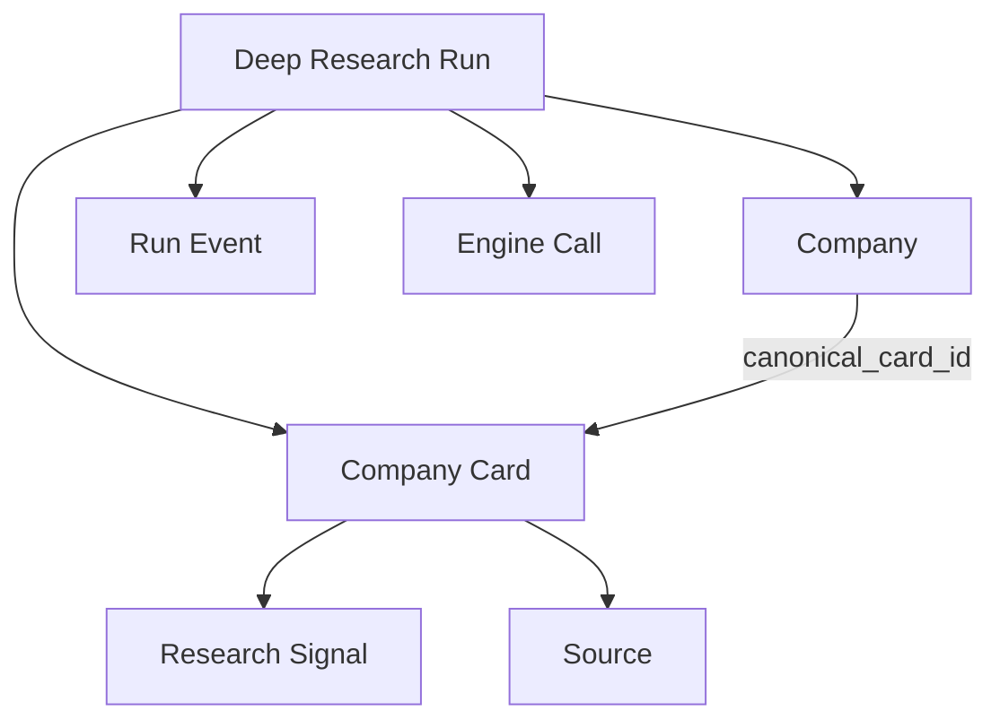
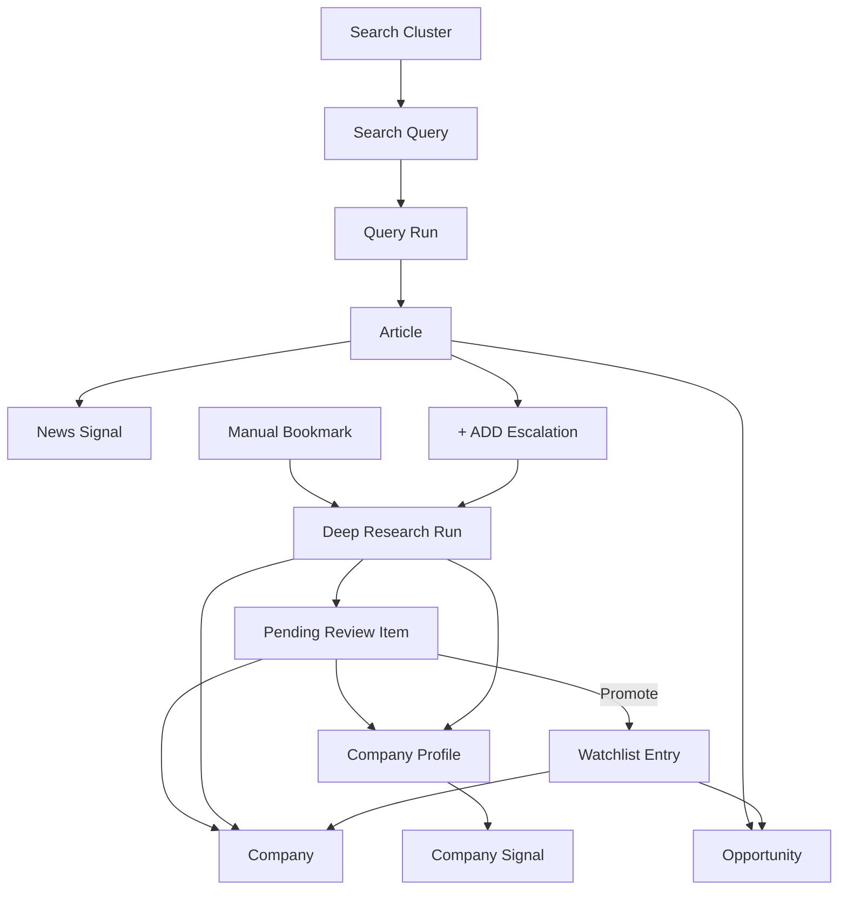
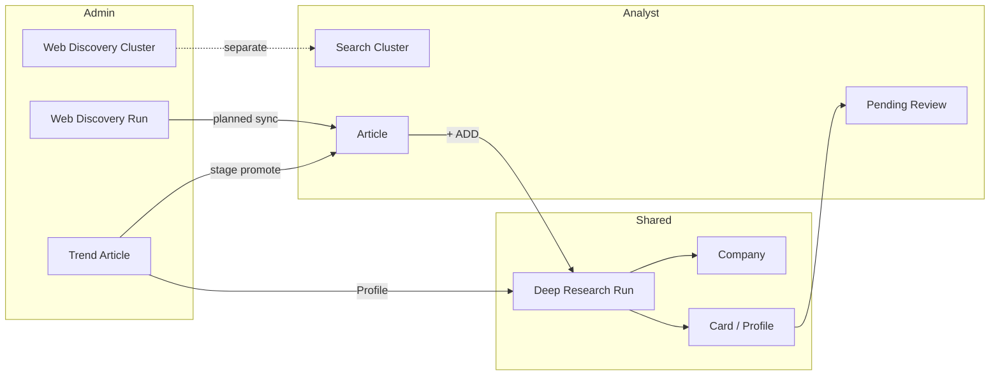
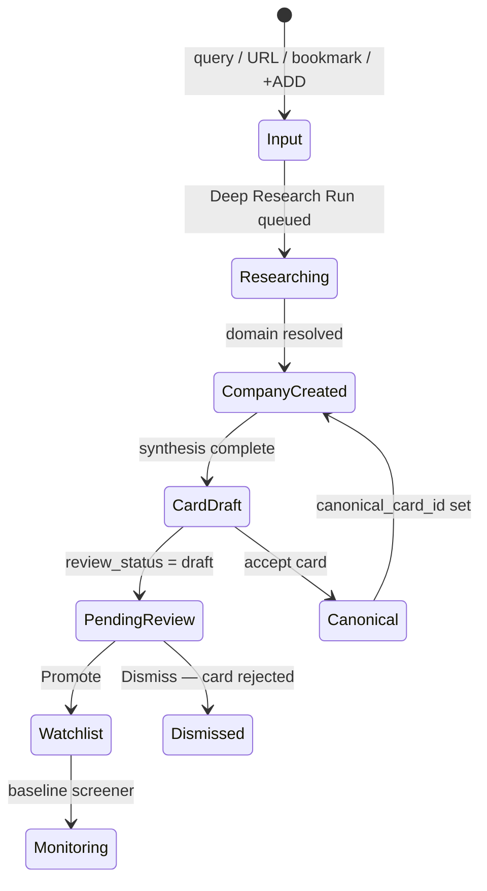

# P1-03 — Object Relationships

| Field | Value |
|-------|-------|
| **Document ref** | P1-03 |
| **Title** | Object Relationships |
| **Version** | 1.0 |
| **Status** | Draft |
| **Last updated** | 2026-06-08 |
| **Audience** | Internal developers, product, operators |
| **Linear** | [GRO-268](https://linear.app/growthmaschine/issue/GRO-268/30-define-relationships-between-core-product-objects) · Parent [GRO-265](https://linear.app/growthmaschine/issue/GRO-265) |
| **Object reference** | [P1-02-Admin](./P1-02-admin.md) · [P1-02-User](./P1-02-user.md) |
| **Workflow reference** | [P1-01-Admin](./P1-01-admin.md) · [P1-01-User](./P1-01-user.md) |

---

## 1. Introduction

P1-02 named every core object. This document defines **how they connect** — ownership, parent/child structure, cardinality, and whether a child can exist without its parent.

NORAD has two frontends sharing one backend:

| Surface | Primary objects |
|---------|-----------------|
| Admin console | Web Discovery, Today discovery, Deep Research, pipeline audit |
| Analyst app | Search Clusters, News feed, Pending review, Watchlist |

The same real-world entity often has **different UI labels** on each surface (e.g. Company Card vs Company Profile). Relationships are defined once at the data layer; labels are presentation.

**Per-link format used in §4–§7:**

| Field | Meaning |
|-------|---------|
| **Ownership** | Which object is the parent / owner |
| **Without parent?** | Can the child exist if the parent is deleted or never existed |
| **Cardinality** | One-to-many, many-to-one, or many-to-many |
| **Required** | Must the link exist for the child to be valid in product terms |
| **Backend today** | Current table/FK in this repo (or `planned`) |

**AI Analysis** is not a persisted child row — it is an in-pipeline step whose output is written onto parent objects (scores on articles, card JSON on research runs). See §8.

---

## 2. Cross-UI naming map

Objects that refer to the same persisted data:

| Admin label (P1-02-Admin) | Analyst label (P1-02-User) | Persisted as |
|---------------------------|----------------------------|--------------|
| Company Card | Company Profile | `cards` row |
| Research Signal | Company Signal | `signals` row |
| Discovery Cluster | — (operator-only) | `discovery_clusters` |
| Web Discovery Cluster | — (operator-only) | `web_discovery_clusters` |
| — | Search Cluster | `search_clusters` (planned) |
| Trend Article | — (operator queue stage) | `trend_articles` |
| — | Article | `articles` (planned) |
| Search Result | — (operator-only) | `runs.engine_outputs` slice |
| Deep Research Run | — (same run, analyst sees outcome) | `runs` · `source_kind = research` |

---

## 3. Relationship decisions (P1-02 §11)

Questions flagged in [P1-02-Admin §11](./P1-02-admin.md) — answers locked here for P1-04 (fields) and database design.

| # | Question | Decision | Rationale |
|---|----------|----------|-----------|
| 1 | Web Discovery Cluster ↔ analyst Search Cluster | **Separate tables** | Different operators, search engines, and UI surfaces. Web Discovery is Exa query config for operators. Search Cluster is analyst news-monitoring theme. No shared lifecycle. |
| 2 | Search Result ↔ analyst Article | **Transform pipeline — separate persisted objects** | Search Result is a raw Exa hit scoped to one `web_discovery` run (`engine_outputs`). Article is an enriched, feed-ready news row. Escalation or scheduled sync **creates** a new Article with provenance back to the result/run — the result row is not updated in place. |
| 3 | Trend Article ↔ analyst Article | **Same entity, different lifecycle stage** | One logical article progresses from operator review (`trend_articles`: discovered → extracted) to analyst feed (`published` / analyst-visible). Target model: single `articles` table with `stage` or status; current repo only has `trend_articles` on the admin side. Analyst Article is the post-ingestion stage of the same URL, not a permanently parallel object. |
| 4 | Company Card ↔ Company Profile | **Same row — version history via multiple cards** | One `cards` row per Deep Research Run. `companies.canonical_card_id` points at the accepted profile the analyst sees. Prior runs keep older card rows for history. UI labels differ; data does not. |
| 5 | Deep Research Run ↔ Pending Review Item | **Pending Review is a queue view, not a table** | A Pending Review Item = `Company` + latest `Card` where `review_status = draft` after a completed research run. 1:1 while in queue. `runs.id` on the card is the originating Deep Research Run. |
| 6 | Research Signal ↔ Company Signal | **Same `signals` row** | Extracted during deep research, displayed on admin card detail and analyst company timeline. **News Signal** is different — it belongs to an Article, not `signals`. |
| 7 | Run — single table vs typed views | **Single `runs` table + `source_kind` discriminator** | Already implemented. Values: `web_discovery`, `discovery`, `research` (+ legacy `user_query`). Typed API routes and UI filters are views on one table — not separate run tables. |
| 8 | Company — merge pin/query rows on complete | **Yes — one canonical `companies` row on complete** | Free-text query / URL at run start resolves to one company on success. Domain dedupes on `companies.domain`. `runs.company_id` and `runs.card_id` filled at end. No permanent "pin" rows. |

### 3.1 Additional checklist items (GRO-268)

| Question | Decision | Rationale |
|----------|----------|-----------|
| Can results be manually added, or only from a run? | **From a run by default; manual URL add is a planned escalation** | Search Results and Trend Articles are always produced by pipeline runs today. Web Discovery manual URL promote (P1-01 §2) would start a run or ingestion job — not a orphan result row. Analyst **Manual Bookmark** is for companies, not articles. |
| Do we need Organizations now? | **Defer to post-MVP** | Single-tenant today — no `organizations` table. Document `organization_id` as a future FK on all tenant-scoped tables. Does not block MVP schema. |

---

## 4. Platform relationships

### 4.1 Organization

| Parent → Child | Ownership | Without parent? | Cardinality | Required | Backend today |
|----------------|-----------|-----------------|-------------|----------|---------------|
| Organization → User | Org owns users | No | 1:N | Planned | `planned` |
| Organization → Web Discovery Cluster | Org owns clusters | No | 1:N | Planned | `planned` — no org FK today |
| Organization → Discovery Cluster | Org owns clusters | No | 1:N | Planned | `planned` |
| Organization → Search Cluster | Org owns clusters | No | 1:N | Planned | `planned` |
| Organization → Company | Org owns companies | No | 1:N | Planned | `planned` |

All tenant-scoped objects inherit Organization when multi-tenant ships. MVP runs without an org row.

### 4.2 User

| Parent → Child | Ownership | Without parent? | Cardinality | Required | Backend today |
|----------------|-----------|-----------------|-------------|----------|---------------|
| User → Run (triggered) | User initiates runs | Yes — runs persist without user FK | 1:N | Optional | No `user_id` on `runs` today |
| User → Escalation actions | User owns promote/dismiss/profile clicks | N/A — actions, not rows | — | — | Audit via `run_events` / future `user_id` |

---

## 5. Admin console — relationship trees

### 5.1 Web Discovery pipeline

| Parent → Child | Ownership | Without parent? | Cardinality | Required | Backend today |
|----------------|-----------|-----------------|-------------|----------|---------------|
| Web Discovery Cluster → Web Discovery Query | Cluster owns queries | No — cascade delete | 1:N | Yes | `web_discovery_queries.cluster_id` → `web_discovery_clusters.id` |
| Web Discovery Query → Web Discovery Query Run | Query config defines run input | Run can batch all queries in cluster | N:1 per query slice | Yes | `runs` · `source_kind = web_discovery` · outputs keyed by query id in `engine_outputs` |
| Web Discovery Cluster → Web Discovery Query Run | Cluster scope for Run All | Single-query runs still belong to cluster context | 1:N | Yes | Same `runs` row; cluster id in run metadata |
| Web Discovery Query Run → Search Result | Run owns raw hits | No — results live inside run JSON | 1:N | Yes | `runs.engine_outputs` per query |
| Search Result → AI Analysis | Analysis enriches result | N/A — not a row | 1:1 per result | Planned | Not implemented post-run |
| Search Result → Web Result Escalation | Operator action on result | N/A — action | 1:1 | Planned | Not implemented |

**Example — Web Discovery Cluster → Web Discovery Query:**

* **Ownership:** Cluster owns its Queries.
* **Without parent?** No — a Query always belongs to exactly one Cluster.
* **Cardinality:** One Cluster → many Queries; each Query → one Cluster.

### 5.2 Today discovery pipeline

| Parent → Child | Ownership | Without parent? | Cardinality | Required | Backend today |
|----------------|-----------|-----------------|-------------|----------|---------------|
| Discovery Cluster → Today Discovery Run | Cluster selected at run time | Run retains cluster slug in query string | 1:N | Yes | Keywords from `discovery_clusters`; articles tagged by `category` = cluster slug |
| Today Discovery Run → Trend Article | Run surfaces articles | Article can orphan if run deleted (`SET NULL`) | 1:N | Yes | `trend_articles.discovery_run_id` → `runs.id` |
| Trend Article → AI Analysis | Pipeline stages write scores/summary | N/A — not a row | 1:1 | Yes | `relevance_score`, `summary`, `extracted_companies` columns |
| Trend Article → Profile Escalation | Operator action | N/A — action | 1:N companies | Optional | `research_run_ids[]` on article |
| Profile Escalation → Deep Research Run | Spawns research | Run links back via context | 1:1 per company profiled | Optional | `POST /api/research/runs` with `trend_article_id` |

**Example — Today Discovery Run → Trend Article:**

* **Ownership:** Run owns the articles it discovered and ranked.
* **Without parent?** Soft — `discovery_run_id` is nullable (`SET NULL` on run delete); URL uniqueness keeps the article row.
* **Cardinality:** One run → many Trend Articles; each Trend Article → at most one discovery run.

### 5.3 Deep research pipeline

| Parent → Child | Ownership | Without parent? | Cardinality | Required | Backend today |
|----------------|-----------|-----------------|-------------|----------|---------------|
| Deep Research Run → Company | Run resolves or creates company | Company outlives run | N:1 | Yes on complete | `runs.company_id` |
| Deep Research Run → Company Card | Run produces one card | Card kept if run deleted (`SET NULL` on card.run_id) | 1:1 | Yes on complete | `cards.run_id` → `runs.id` |
| Company → Company Card | Company owns all versions | No | 1:N | Yes (≥1 after first research) | `cards.company_id` → `companies.id` |
| Company → Company Card (canonical) | Company points at accepted card | Optional until first accept | 1:1 | Optional | `companies.canonical_card_id` composite FK |
| Company Card → Research Signal | Card owns extracted signals | No | 1:N | Optional | `signals` composite FK to `(card_id, company_id)` |
| Company → Source | Company owns citations | No | 1:N | Optional | `sources.company_id` |
| Deep Research Run → Run Event | Run owns log lines | No | 1:N | Yes | `run_events.run_id` |
| Deep Research Run → Engine Call | Run owns vendor audit | No | 1:N | Yes | `engine_calls.run_id` |

**Example — Company → Company Card:**

* **Ownership:** Company owns all card versions.
* **Without parent?** No — every card requires a `company_id`.
* **Cardinality:** One Company → many Cards (one per research run); each Card → exactly one Company.

### 5.4 Pipeline infrastructure

| Parent → Child | Ownership | Without parent? | Cardinality | Required | Backend today |
|----------------|-----------|-----------------|-------------|----------|---------------|
| Research Config → Run | Config is global default, copied into run | Runs keep snapshot in `engines` JSON | N:1 template | Optional | `app_kv` · not FK-linked |
| Run (any kind) → Run Event | Run owns events | No | 1:N | Yes | `run_events` |
| Run (any kind) → Engine Call | Run owns calls | No | 1:N | Yes | `engine_calls` |

---

## 6. Analyst app — relationship tree

| Parent → Child | Ownership | Without parent? | Cardinality | Required | Backend today |
|----------------|-----------|-----------------|-------------|----------|---------------|
| Search Cluster → Search Query | Cluster owns queries | No | 1:N | Yes | `search_clusters` / `search_queries` — **planned** |
| Search Query → Query Run | Query defines run input | No | 1:N | Yes | `runs` · future `source_kind = analyst_discovery` or shared ingestion run |
| Query Run → Article | Run ingests stories | No | 1:N | Yes | `articles` — **planned** |
| Article → News Signal | Article owns signal tags | No | 1:N | Yes | Embedded on article row or child table — **planned** |
| Article → + ADD Escalation | Analyst action | N/A | 1:N companies per article | Optional | Spawns `runs` · `research` |
| Manual Bookmark → Deep Research Run | Analyst-queued company | No bookmark row — direct run | 1:1 | Yes | `runs` · `source_kind = research` · manual input |
| Deep Research Run → Pending Review Item | Queue view on outcome | N/A — view | 1:1 while in queue | Yes after research | `cards.review_status = draft` |
| Pending Review Item → Company | Item wraps company | No | 1:1 | Yes | `companies` |
| Pending Review Item → Company Profile | Item shows latest card | No | 1:1 | Yes | `cards` draft row |
| Company Profile → Company Signal | Profile timeline | No | 1:N | Optional | `signals` (same as Research Signal) |
| Pending Review → Watchlist Entry | Promote action | N/A | 1:1 | Optional | `companies.status` or `watchlist_entries` — **planned** |
| Watchlist Entry → Company | Entry is a company flag | No | 1:1 | Yes | **planned** |
| Article → Opportunity | Rules pick articles | N/A | N:M | Optional | **planned** — rules engine |
| Watchlist Entry → Opportunity | Monitoring picks signals | N/A | 1:N | Optional | **planned** |

**Example — Search Cluster → Search Query:**

* **Ownership:** Search Cluster owns its Queries (analyst Settings).
* **Without parent?** No — a Query always belongs to one Cluster.
* **Cardinality:** One Cluster → many Queries; each Query → one Cluster.

**Example — Article → News Signal:**

* **Ownership:** Article owns its signal classification.
* **Without parent?** No — a News Signal does not exist without an Article.
* **Cardinality:** One Article → one or more News Signals (type + score); each News Signal → one Article.

---

## 7. Cross-pipeline links

How admin and analyst objects connect across surfaces:

| From | To | Link type | Decision |
|------|-----|-----------|----------|
| Web Discovery Cluster | Search Cluster | None | **Separate** — no FK, no sync (§3 #1) |
| Search Result | Article | Transform | Ingestion job creates Article; stores `source_run_id` + URL provenance |
| Trend Article | Article | Lifecycle | Same URL entity; status/stage transition to analyst feed |
| Trend Article | Deep Research Run | Escalation | `research_run_ids[]`; operator Profile button |
| Article | Deep Research Run | Escalation | Analyst + ADD |
| Deep Research Run | Pending Review | View | Draft card after complete |
| Company Card | Company Profile | Alias | Same `cards.id` |
| Research Signal | Company Signal | Alias | Same `signals.id` |
| Discovery Cluster | Search Cluster | None | **Separate** — Today keywords vs analyst news themes |

### 7.1 Many-to-many relationships

| Relationship | Resolution |
|--------------|------------|
| Article ↔ Company (mentions) | **Resolved:** Article stores `mentioned_companies[]` JSON; Company does not own articles. M:N via array or junction when built. |
| Article ↔ Opportunity | **Resolved:** Opportunity is a derived weekly view — junction table `opportunity_articles` or computed at read time. Not a permanent M:N entity. |
| Company ↔ Search Cluster | **Resolved:** Implicit via which cluster runs ingested articles mentioning the company — no direct FK. Watchlist monitoring is company-centric, not cluster-centric. |
| Trend Article ↔ Deep Research Run | **Resolved:** 1:N via `research_run_ids[]` — one article can spawn multiple company profiles. |

No unresolved many-to-many relationships remain for MVP.

---

## 8. AI Analysis — attachment points

AI Analysis is a pipeline step, not a child table. Outputs attach to:

| Pipeline | Parent object | Persisted fields |
|----------|---------------|------------------|
| Today discovery — rank | Trend Article | `relevance_score`, `relevance_reason` |
| Today discovery — extract | Trend Article | `summary`, `extracted_companies` |
| Web Discovery — post-run | Search Result | **Planned** — not persisted today |
| Deep Research — synthesise | Company Card | `cards.card` JSONB |
| Analyst News ingestion | Article | **Planned** — summary, signal scores on `articles` |

| Parent → AI Analysis | Ownership | Without parent? | Cardinality |
|---------------------|-----------|-----------------|-------------|
| Trend Article → rank/extract output | Article owns scores | N/A | 1:1 per stage |
| Company Card → synthesis output | Card owns JSON | N/A | 1:1 per run |
| Search Result → analysis output | Result owns enrichment | N/A | 1:1 — planned |

---

## 9. Run polymorphism (`runs` table)

Single table, discriminated by `source_kind`:

| `source_kind` | Product object | Parent context | Produces |
|---------------|----------------|----------------|----------|
| `web_discovery` | Web Discovery Query Run | Web Discovery Cluster / Query | Search Results in `engine_outputs` |
| `discovery` | Today Discovery Run | Discovery Cluster (by slug) | Trend Articles |
| `research` | Deep Research Run | Trend Article, Article +ADD, Manual Bookmark, operator query | Company, Card, Signals, Sources |
| `user_query` | Ad-hoc research | Legacy / API direct | Same as research |

Typed views: `routers/web_discovery.py`, `routers/discovery.py`, `routers/research.py` — each filters `source_kind`. No separate run tables.

---

## 10. Company lifecycle (merge on complete)

| Stage | Objects involved | Merge rule |
|-------|------------------|------------|
| Input | Free-text query, URL, article company mention | No company row yet — or matched by domain |
| Researching | `runs` · `source_kind = research` | `company_id` nullable until resolve |
| Complete | `companies` + `cards` + `signals` | **One company per domain**; duplicate runs append new card version |
| Pending review | `cards.review_status = draft` | Queue view — not a separate table |
| Promote | Watchlist flag on company | `review_status → accepted`; `canonical_card_id` set |
| Dismiss | `cards.review_status = rejected` | Company row may remain for audit; removed from queue |

Pin/query rows do not persist as separate entities — they collapse into `companies` on research complete (§3 #8).

---

## 11. Completion checklist

| Item | Status |
|------|--------|
| Parent/child structure for all P1-02 objects | Done |
| P1-02 §11 relationship questions answered | Done |
| Each link marked required or optional | Done |
| Many-to-many relationships resolved or noted | Done |
| Manual vs run-only results answered | Done |
| Organizations deferral answered | Done |
| Cross-UI naming map included | Done |
| Current backend FK mapping noted | Done |

---

## 12. Approval

| Role | Name | Date | Status |
|------|------|------|--------|
| Author | Huzaifa | 2026-06-08 | Draft |
| Reviewer | Shehrayar Haq | — | Pending |
