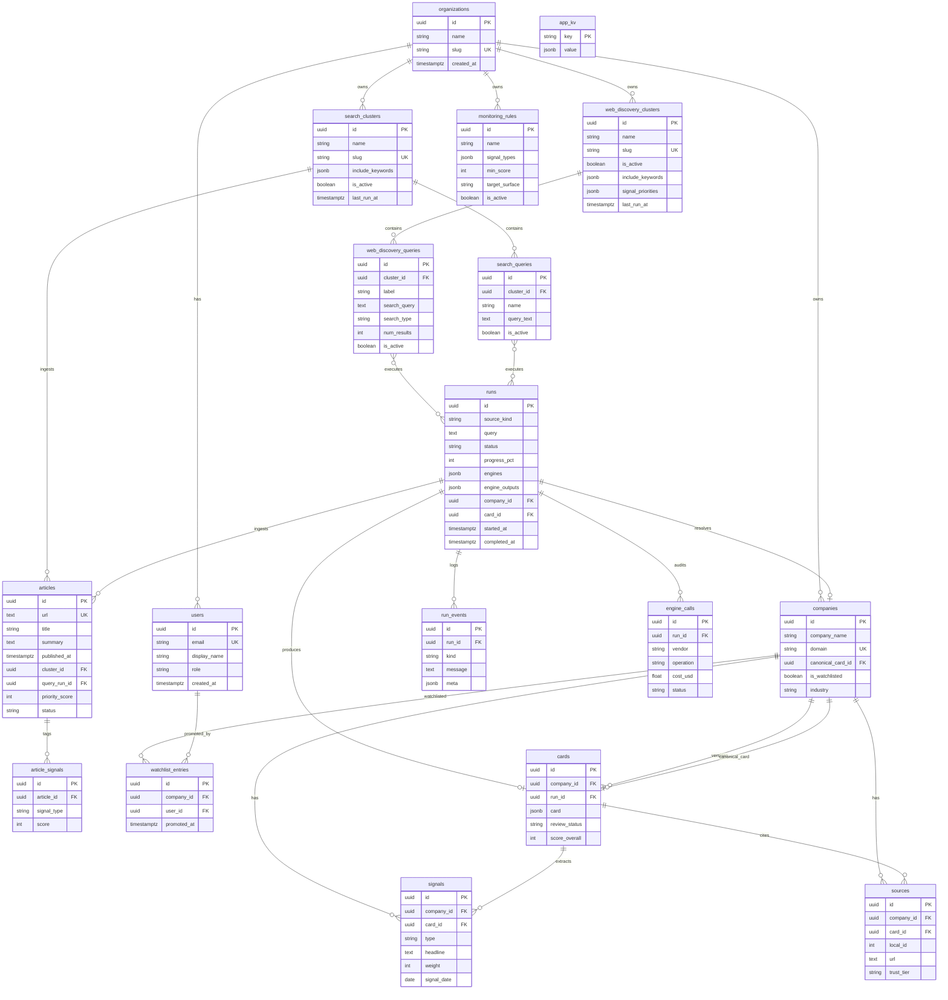
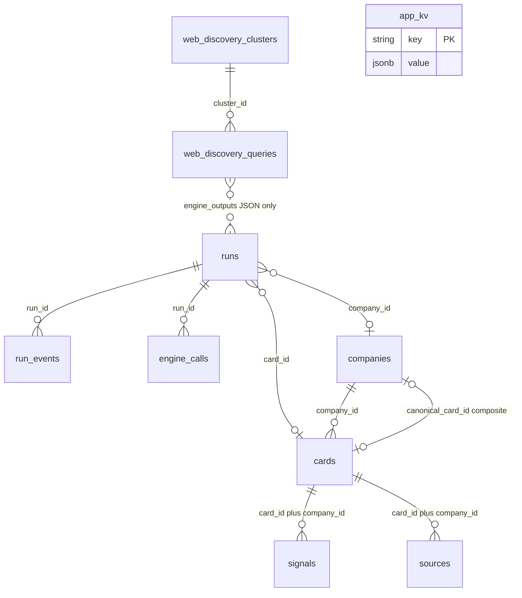
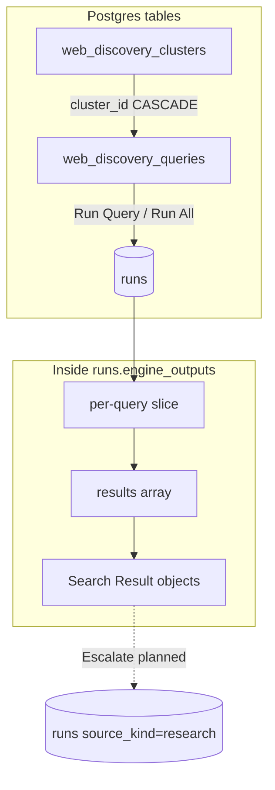
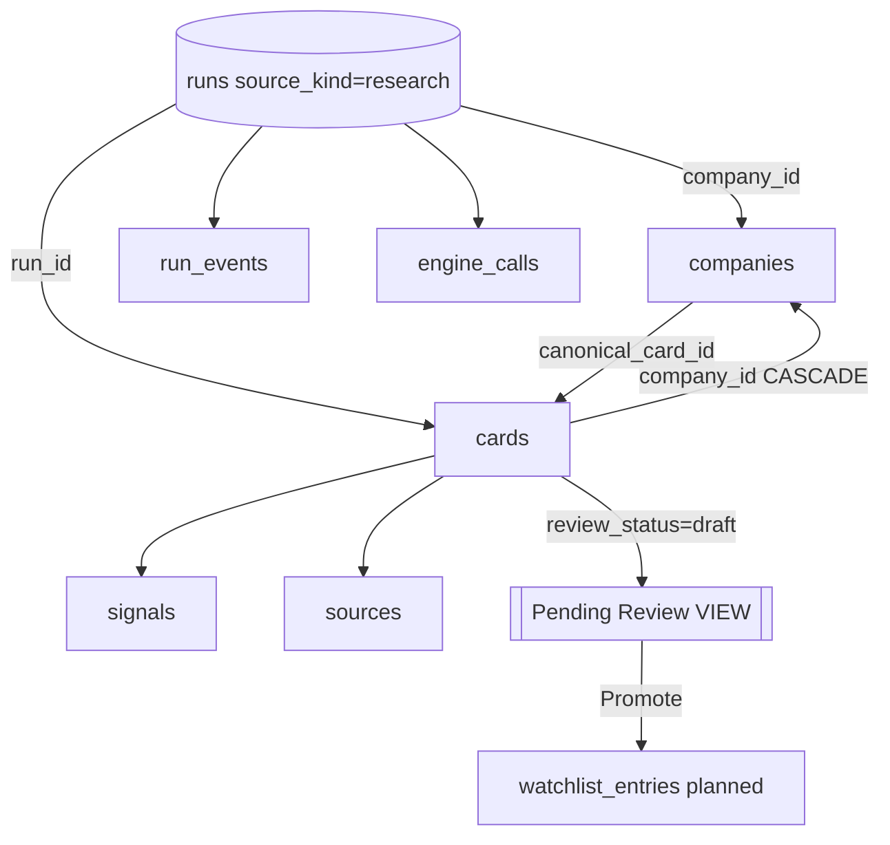
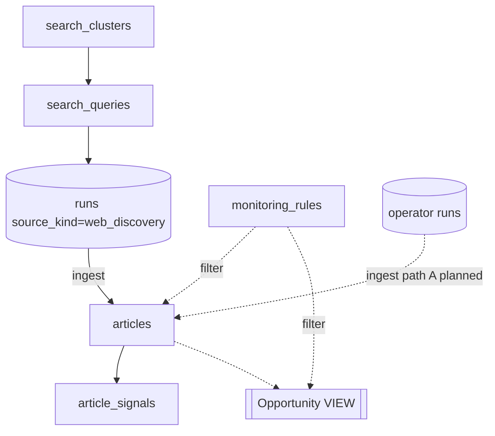
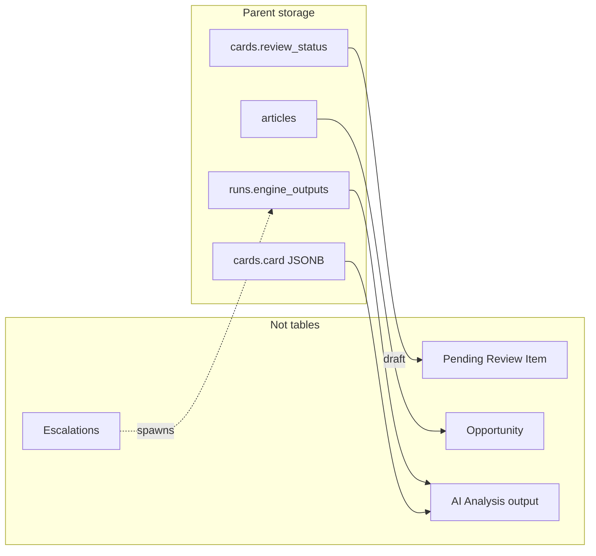
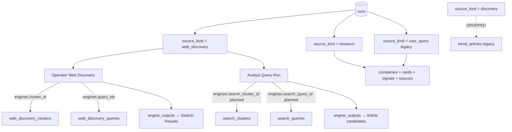
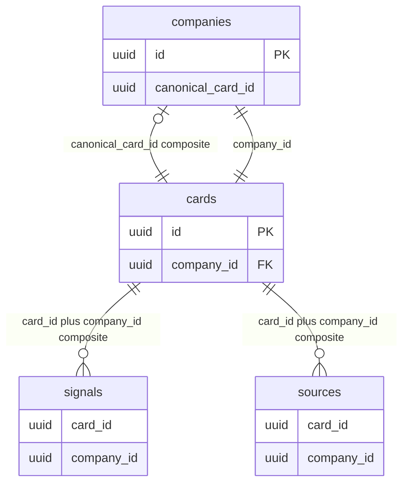
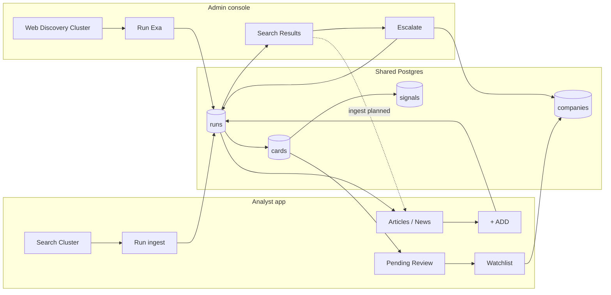

# P1-04 — Required Fields (Admin Console)

| Field | Value |
|-------|-------|
| **Document ref** | P1-04-Admin |
| **Title** | Required Fields per Object — Admin Console |
| **Version** | 1.1 |
| **Status** | Draft |
| **Last updated** | 2026-06-09 |
| **Audience** | Internal developers, operators |
| **Linear** | [GRO-269](https://linear.app/growthmaschine/issue/GRO-269/40-define-required-fields-for-each-core-object) · Parent [GRO-265](https://linear.app/growthmaschine/issue/GRO-265) |
| **Object reference** | [P1-02-Admin](./P1-02-admin.md) · [P1-03](./P1-03.md) |
| **Analyst companion** | [P1-04-User](./P1-04-user.md) |
| **Screen mapping** | [P1-05-Admin](./P1-05-admin.md) · [P1-05-User](./P1-05-user.md) |

---

## 1. Introduction

This document defines the **target field model** for every admin-console object in [P1-02-Admin](./P1-02-admin.md). It is the field-level companion to [P1-03](./P1-03.md) (relationships).

**Conventions**

| Rule | Decision |
|------|----------|
| `organization_id` | **Omitted** until multi-tenant ships (per product decision) |
| Target vs current | **Target model** — Notes column marks `Implemented` · `Planned` · `Gap` vs `apps/api/app/models/` |
| Non-table objects | Documented as **view or action** with fields on parent tables (§8) |
| AI Analysis | Not a table — fields live on parent objects (§7) |
| Schema diagrams | Full ER / flow diagrams in **§9** |
| Today / `discovery` | **Dropped** — not in target model |
| Searchable | Yes = indexed or full-text candidate in target schema |

**Per-object table columns**

| Column | Meaning |
|--------|---------|
| Field | Column or JSON path |
| Type | Postgres-oriented type |
| Required | Yes / No |
| Searchable | Yes / No |
| UI | Where shown, or Internal only |
| Notes | Enum values, FK, implemented status |

---

## 2. Platform objects

### 2.1 Organization *(planned — MVP single-tenant)*

No table in MVP. Documented for post-MVP schema design.

| Field | Type | Required | Searchable | UI | Notes |
|-------|------|----------|------------|-----|-------|
| id | UUID | Yes | No | Internal | Primary key · **Planned** |
| name | string(255) | Yes | Yes | Internal | Tenant display name · **Planned** |
| slug | string(120) | Yes | Yes | Internal | Unique tenant key · **Planned** |
| created_at | timestamptz | Yes | No | Internal | **Planned** |
| updated_at | timestamptz | Yes | No | Internal | **Planned** |

### 2.2 User *(planned — MVP single-user)*

| Field | Type | Required | Searchable | UI | Notes |
|-------|------|----------|------------|-----|-------|
| id | UUID | Yes | No | Internal | **Planned** — no auth user table today |
| email | string(255) | Yes | Yes | Settings profile | **Planned** |
| display_name | string(120) | No | Yes | Sidebar profile | **Planned** |
| role | enum (`operator`, `admin`) | Yes | No | Internal | Admin console access · **Planned** |
| created_at | timestamptz | Yes | No | Internal | **Planned** |
| updated_at | timestamptz | Yes | No | Internal | **Planned** |

---

## 3. Web Discovery objects

### 3.1 Web Discovery Cluster

Table: `web_discovery_clusters` · **Implemented**

| Field | Type | Required | Searchable | UI | Notes |
|-------|------|----------|------------|-----|-------|
| id | UUID | Yes | No | Internal | PK |
| name | string(140) | Yes | Yes | Cluster list, command center header | |
| slug | string(160) | Yes | Yes | Internal | Unique; URL segment · **Implemented** |
| description | text | No | No | Cluster settings | |
| priority | enum (`P1 Critical`, `P2 Daily Intelligence`, `P3 Weekly Monitoring`) | Yes | Yes | Cluster list badge | Default `P2 Daily Intelligence` |
| is_active | boolean | Yes | Yes | Cluster list status | Paused clusters cannot run |
| include_keywords | JSON array[string] | Yes | No | Cluster settings | Scope tags |
| exclude_keywords | JSON array[string] | Yes | No | Cluster settings | |
| geography_focus | JSON array[string] | Yes | No | Cluster settings | |
| source_preferences | JSON array[string] | Yes | No | Cluster settings | |
| signal_priorities | JSON array[string] | Yes | No | Cluster settings | |
| query_count | integer | Yes | No | Cluster list stat | Denormalized · ≥ 0 |
| signal_count | integer | Yes | No | Cluster list stat | Denormalized · ≥ 0 · **Gap**: not populated today |
| last_run_at | timestamptz | No | Yes | Cluster list | Last successful run |
| created_at | timestamptz | Yes | No | Cluster metadata | |
| updated_at | timestamptz | Yes | No | Internal | |

### 3.2 Web Discovery Query

Table: `web_discovery_queries` · **Implemented**

| Field | Type | Required | Searchable | UI | Notes |
|-------|------|----------|------------|-----|-------|
| id | UUID | Yes | No | Internal | PK |
| cluster_id | UUID | Yes | No | Internal | FK → `web_discovery_clusters.id` CASCADE |
| label | string(160) | Yes | Yes | Query list, editor title | |
| search_query | text | Yes | Yes | Query editor | Exa search text |
| search_type | enum (`auto`, `fast`, `deep`, `deep-lite`, `deep-reasoning`, `instant`) | Yes | No | Query editor | Default `auto` |
| num_results | integer | Yes | No | Query editor | 1–100 · default 10 |
| is_active | boolean | Yes | Yes | Query list | Inactive skipped on Run All |
| content_highlights | boolean | Yes | No | Query editor | Exa contents mode |
| content_text | boolean | Yes | No | Query editor | |
| content_summary | boolean | Yes | No | Query editor | |
| structured_outputs | boolean | Yes | No | Query editor | **Gap**: stored, not executed |
| highlights_max_chars | integer | No | No | Query editor | |
| highlights_guiding_query | text | No | No | Query editor | |
| text_max_chars | integer | No | No | Query editor | |
| text_main_content_only | boolean | Yes | No | Query editor | |
| summary_max_chars | integer | No | No | Query editor | |
| system_prompt | text | No | No | Query editor | **Gap**: not executed post-run |
| output_schema | JSON object | No | No | Query editor | **Gap**: not executed post-run |
| livecrawl_timeout_ms | integer | Yes | No | Query editor | Default 10000 |
| max_age_hours | integer | No | No | Query editor | -1 = no limit |
| subpages | integer | Yes | No | Query editor | |
| extra_links | integer | Yes | No | Query editor | |
| extra_image_links | integer | Yes | No | Query editor | |
| subpage_target_keywords | JSON array[string] | Yes | No | Query editor | |
| category | string(80) | No | No | Query editor | Exa category filter |
| user_location | string(8) | No | No | Query editor | ISO country |
| include_domains | JSON array[string] | Yes | No | Query editor | |
| exclude_domains | JSON array[string] | Yes | No | Query editor | |
| published_after | date | No | No | Query editor | |
| published_before | date | No | No | Query editor | |
| crawled_after | date | No | No | Query editor | |
| crawled_before | date | No | No | Query editor | |
| content_moderation | boolean | Yes | No | Query editor | |
| stream_response | boolean | Yes | No | Internal | |
| additional_queries | JSON array[string] | Yes | No | Query editor | |
| created_at | timestamptz | Yes | No | Query metadata | |
| updated_at | timestamptz | Yes | No | Internal | |

### 3.3 Web Discovery Query Run

Table: `runs` where `source_kind = web_discovery` · **Implemented**

| Field | Type | Required | Searchable | UI | Notes |
|-------|------|----------|------------|-----|-------|
| id | UUID | Yes | No | Internal | PK |
| source_kind | string(32) | Yes | Yes | Internal | Always `web_discovery` |
| query | text | Yes | No | Activity log | Human label / cluster context string |
| status | enum (`queued`, `researching`, `synthesizing`, `completed`, `failed`, `cancelled`) | Yes | Yes | Results page, Activity | Web discovery uses `queued` → `completed`/`failed` |
| progress_pct | integer | Yes | No | Activity | 0–100 |
| error | text | No | No | Results error banner | |
| engines | JSON object | Yes | No | Internal | Snapshot: `cluster_id`, `query_ids`, Exa config |
| engine_outputs | JSON object | Yes | No | Internal | Per-query result slices — see §3.4 |
| idempotency_key | string(64) | No | No | Internal | Unique when set |
| started_at | timestamptz | No | Yes | Activity, run selector | |
| completed_at | timestamptz | No | Yes | Run selector | |
| company_id | UUID | No | No | Internal | Null for web discovery runs |
| card_id | UUID | No | No | Internal | Null for web discovery runs |
| created_at | timestamptz | Yes | Yes | Run history | |
| updated_at | timestamptz | Yes | No | Internal | |

**`engine_outputs` slice per query (internal shape)**

| Field | Type | Required | Notes |
|-------|------|----------|-------|
| query_id | UUID | Yes | FK to `web_discovery_queries.id` |
| query_label | string | No | Denormalized |
| result_count | integer | Yes | |
| results | JSON array | Yes | Array of Search Result objects §3.4 |
| latency_ms | float | No | |
| cost_usd | float | No | |

### 3.4 Search Result

**Not a table row today** — object inside `runs.engine_outputs[].results[]`. Target: optional future `search_results` table; MVP keeps JSON embed.

| Field | Type | Required | Searchable | UI | Notes |
|-------|------|----------|------------|-----|-------|
| url | text | Yes | Yes | Results page link | Primary identity |
| exa_id | string | No | No | Internal | Exa document id · **Implemented** |
| title | string | No | Yes | Results page title | |
| snippet | text | No | Yes | Results page excerpt | |
| published_date | string (ISO date) | No | Yes | Results metadata | |
| score | float | No | Yes | Results sort | Exa relevance |
| highlights | JSON array[string] | No | No | Results expand | |
| summary | text | No | Yes | Results expand | Exa vendor summary |
| text | text | No | No | Internal | Full body when content_text enabled |
| image | string (URL) | No | No | Results thumbnail | **Planned** UI |
| favicon | string (URL) | No | No | Results row | |
| author | string | No | No | Results metadata | |
| relevance_score | integer | No | Yes | Results sort | **Planned** — NORAD LLM 0–100 |
| relevance_reason | text | No | No | Results expand | **Planned** — NORAD LLM |
| extracted_signals | JSON array | No | Yes | Results signals column | **Planned** — post-run AI |
| source_run_id | UUID | Yes | No | Internal | Parent run · when promoted to row |
| source_query_id | UUID | Yes | No | Internal | Parent query |

---

## 4. Deep research objects

### 4.1 Deep Research Run

Table: `runs` where `source_kind = research` · **Implemented**

| Field | Type | Required | Searchable | UI | Notes |
|-------|------|----------|------------|-----|-------|
| id | UUID | Yes | No | Internal | PK |
| source_kind | string(32) | Yes | Yes | Internal | `research` or legacy `user_query` |
| query | text | Yes | Yes | Companies Activity | Company name / URL input |
| status | enum (see §3.3) | Yes | Yes | Companies row pill | `researching` → `synthesizing` → `completed` |
| progress_pct | integer | Yes | No | Activity | |
| error | text | No | No | Activity error | |
| engines | JSON object | Yes | No | Internal | Parallel/Exa/Diffbot config snapshot |
| engine_outputs | JSON object | Yes | No | Research Evidence | Raw vendor payloads |
| company_id | UUID | No | Yes | Companies list | Set on complete |
| card_id | UUID | No | No | Internal | Set on complete |
| idempotency_key | string(64) | No | No | Internal | |
| started_at | timestamptz | No | Yes | Activity | |
| completed_at | timestamptz | No | Yes | Profile history | |
| created_at | timestamptz | Yes | Yes | Profile history | |
| updated_at | timestamptz | Yes | No | Internal | |

**Target provenance fields (in `engines` JSON today — optional dedicated columns later)**

| Field | Type | Required | Notes |
|-------|------|----------|-------|
| source_search_result_url | string | No | Web Discovery escalate · **Planned** |
| source_web_discovery_run_id | UUID | No | **Planned** |
| trend_article_id | UUID | No | Legacy Today context · **Dropped** |

### 4.2 Company

Table: `companies` · **Implemented**

| Field | Type | Required | Searchable | UI | Notes |
|-------|------|----------|------------|-----|-------|
| id | UUID | Yes | No | Internal | PK |
| company_name | string(255) | Yes | Yes | Companies list, detail header | |
| domain | string(255) | No | Yes | Company header | Lowercase apex; unique dedupe key |
| legal_entity_name | string(255) | No | Yes | Company detail | |
| website | text | No | No | Company detail | |
| logo_url | text | No | No | Company row | |
| industry | string(128) | No | Yes | Companies filter | Denormalized from canonical card |
| category | string(128) | No | Yes | Companies filter | |
| status | string(32) | No | Yes | Companies list | **Planned**: `watchlisted`, `saved`, etc. |
| headquarters_country | string(64) | No | Yes | Company detail | |
| canonical_card_id | UUID | No | No | Internal | Composite FK with `id` |
| is_watchlisted | boolean | No | Yes | Watchlist tab filter | **Planned** — or separate `watchlist_entries` |
| created_at | timestamptz | Yes | Yes | Company metadata | |
| updated_at | timestamptz | Yes | No | Internal | |

### 4.3 Company Card

Table: `cards` · **Implemented** · JSON contract: `CompanyCardV1` in `apps/api/app/schemas/`

| Field | Type | Required | Searchable | UI | Notes |
|-------|------|----------|------------|-----|-------|
| id | UUID | Yes | No | Internal | PK |
| company_id | UUID | Yes | No | Internal | FK → `companies.id` CASCADE |
| run_id | UUID | No | No | Internal | FK → `runs.id` SET NULL |
| schema_version | string(16) | Yes | No | Internal | Default `1.0` |
| card | JSONB | Yes | Yes (JSON) | Company detail tabs | Full `CompanyCardV1` — see schema, not duplicated here |
| score_overall | integer | No | Yes | Companies list sort | 0–100 denormalized |
| score_growth | integer | No | Yes | Internal | Sort/filter |
| score_momentum | integer | No | Yes | Internal | |
| score_fundraising | integer | No | Yes | Internal | |
| score_acquisition | integer | No | Yes | Internal | |
| score_partnership_fit | integer | No | Yes | Internal | |
| score_strategic_fit | integer | No | Yes | Internal | |
| score_risk | integer | No | Yes | Internal | |
| review_status | enum (`draft`, `accepted`, `rejected`, `archived`) | Yes | Yes | Pending review queue | `draft` = in analyst queue |
| reviewer_notes | text | No | No | Internal | |
| created_at | timestamptz | Yes | Yes | Profile history | |
| updated_at | timestamptz | Yes | No | Internal | |

**`card` JSONB** — document structure in `docs/backend-pipeline.md` and `apps/api/app/schemas/company_card.py`. P1-04 does not duplicate `Valued[]` blocks.

### 4.4 Research Signal

Table: `signals` · **Implemented** · Analyst label: Company Signal

| Field | Type | Required | Searchable | UI | Notes |
|-------|------|----------|------------|-----|-------|
| id | UUID | Yes | No | Internal | PK |
| company_id | UUID | Yes | Yes | Internal | FK → `companies.id` |
| card_id | UUID | Yes | No | Internal | Composite FK with company_id |
| type | enum (`growth`, `fundraising`, `acquisition`, `partnership`, `risk`, `strategic`) | Yes | Yes | Signals section | |
| subtype | string(64) | No | Yes | Signals section | |
| headline | text | Yes | Yes | Signals timeline | |
| evidence | text | No | Yes | Signals expand | |
| weight | integer | Yes | Yes | Signals sort | 1–10 |
| signal_date | date | No | Yes | Signals timeline | |
| source_refs | JSON array | Yes | No | Internal | `[source.local_id, ...]` |
| created_at | timestamptz | Yes | No | Internal | |
| updated_at | timestamptz | Yes | No | Internal | |

### 4.5 Source

Table: `sources` · **Implemented**

| Field | Type | Required | Searchable | UI | Notes |
|-------|------|----------|------------|-----|-------|
| id | UUID | Yes | No | Internal | PK |
| company_id | UUID | Yes | No | Internal | FK → `companies.id` |
| card_id | UUID | Yes | No | Internal | Composite FK |
| local_id | integer | Yes | No | Internal | Id inside `card.sources` array |
| url | text | Yes | Yes | Sources section | |
| title | text | No | Yes | Sources section | |
| type | string(64) | No | Yes | Sources section | |
| trust_tier | string(2) | No | Yes | Sources section | e.g. `A`, `B` |
| date_published | date | No | Yes | Sources section | |
| date_found | date | No | No | Internal | |
| last_checked | date | No | No | Internal | |
| snippet | text | No | Yes | Sources expand | |
| freshness_score | float | No | No | Internal | |
| created_at | timestamptz | Yes | No | Internal | |
| updated_at | timestamptz | Yes | No | Internal | |

---

## 5. Pipeline infrastructure objects

### 5.1 Run Event

Table: `run_events` · **Implemented**

| Field | Type | Required | Searchable | UI | Notes |
|-------|------|----------|------------|-----|-------|
| id | UUID | Yes | No | Internal | PK |
| run_id | UUID | Yes | No | Internal | FK → `runs.id` CASCADE |
| kind | string(48) | Yes | Yes | Activity feed | `stage_completed`, `engine_call`, `log`, … |
| message | text | Yes | Yes | Activity feed | |
| level | enum (`info`, `warning`, `error`) | Yes | No | Activity styling | |
| meta | JSON object | Yes | No | Internal | Stage stats, costs |
| created_at | timestamptz | Yes | No | Activity timestamp | |
| updated_at | timestamptz | Yes | No | Internal | |

### 5.2 Engine Call

Table: `engine_calls` · **Implemented**

| Field | Type | Required | Searchable | UI | Notes |
|-------|------|----------|------------|-----|-------|
| id | UUID | Yes | No | Internal | PK |
| run_id | UUID | No | Yes | Research Evidence | FK → `runs.id` SET NULL |
| vendor | enum (`exa`, `anthropic`, `parallel`, `diffbot`) | Yes | Yes | Evidence expand | |
| operation | string(64) | Yes | Yes | Evidence expand | e.g. `synthesize_card` |
| model | string(64) | No | No | Evidence expand | |
| processor | string(32) | No | No | Evidence expand | Parallel tier |
| units | integer | Yes | No | Internal | |
| input_tokens | integer | Yes | No | Evidence | |
| output_tokens | integer | Yes | No | Evidence | |
| cost_usd | float | Yes | Yes | Activity cost lines | |
| latency_ms | float | Yes | No | Evidence | |
| status | enum (`ok`, `error`, `timeout`) | Yes | Yes | Evidence | |
| error | text | No | No | Evidence | |
| request_snapshot | JSON object | Yes | No | Internal | Truncated · secrets stripped |
| response_snapshot | JSON object | Yes | No | Internal | Truncated |
| created_at | timestamptz | Yes | Yes | Evidence | |
| updated_at | timestamptz | Yes | No | Internal | |

### 5.3 Research Config

Store: `app_kv` key `research_config` · **Implemented** · Affects **deep research runs only**

| Field | Type | Required | Searchable | UI | Notes |
|-------|------|----------|------------|-----|-------|
| parallel_processor | enum (`lite`, `base`, `core`, `pro`, `ultra`, `ultra2x`, `ultra4x`, `ultra8x`) | Yes | No | Settings → Parallel | |
| parallel_timeout_s | integer | Yes | No | Settings | 60–3600 |
| exa_search_type | enum (`auto`, `fast`, `neural`, `keyword`, `deep`) | Yes | No | Settings → Exa | |
| exa_deep_model | string | No | No | Settings → Exa | When search_type = deep |
| exa_num_results | integer | Yes | No | Settings → Exa | 1–50 |
| diffbot_enabled | boolean | Yes | No | Settings → Diffbot | |
| diffbot_score_threshold | float | Yes | No | Settings → Diffbot | 0.0–1.0 |

---

## 6. Run polymorphism note

All run types share `runs` columns (§3.3, §4.1). Discriminator: `source_kind`.

| `source_kind` | Product object | Status |
|---------------|----------------|--------|
| `web_discovery` | Web Discovery Query Run | **Implemented** |
| `research` | Deep Research Run | **Implemented** |
| `user_query` | Legacy ad-hoc research | **Implemented** — merge into `research` target |
| `discovery` | Today pipeline | **Dropped** |

---

## 7. AI Analysis — fields on parent objects

Not a table. Post-pipeline LLM output columns:

| Parent | Field | Type | Required | UI | Status |
|--------|-------|------|----------|-----|--------|
| Search Result | relevance_score | integer | No | Results sort | **Planned** |
| Search Result | relevance_reason | text | No | Results expand | **Planned** |
| Search Result | extracted_signals | JSON array | No | Results signals | **Planned** |
| Company Card | card (synthesis) | JSONB | Yes | Company detail | **Implemented** — Sonnet |
| `engine_calls` | (audit row) | — | — | Research Evidence | **Implemented** per LLM call |

---

## 8. Non-table objects (actions and views)

### 8.1 Web Result Escalation

**No table.** Operator action on Search Result.

| Concept | Persisted as | Notes |
|---------|--------------|-------|
| Escalate click | New `runs` row `source_kind=research` | **Planned** — provenance in `engines` JSON |
| Source URL / company hint | `runs.query` + engines metadata | |

### 8.2 Pending Review Item *(analyst queue — documented for shared backend)*

**View** — not a table. Row appears when `cards.review_status = draft`.

| Field shown | Source table.column |
|-------------|---------------------|
| company_name | `companies.company_name` |
| domain | `companies.domain` |
| summary | `cards.card` JSON excerpt |
| origin_label | `engines` / article provenance · **Planned** |
| review_status | `cards.review_status` |
| run_id | `cards.run_id` |

---

## 9. Database schema diagrams

Visual layer on top of field tables above and [P1-03](./P1-03.md) (relationships). Analyst-facing overview: [P1-04-User §9](./P1-04-user.md#9-how-objects-connect-overview).

### 9.1 How to read

| Symbol / label | Meaning |
|----------------|---------|
| **Solid line** | FK exists (implemented) or planned in target schema |
| **Dotted line** | Logical link — JSON embed, view, or provenance |
| 🟢 | Table exists in repo today |
| 🔵 | Planned — not migrated yet |
| ⬜ | View or derived — not a table |
| 🟠 | Legacy / dropped from target |

**MVP:** No `organizations` or `organization_id` until multi-tenant. **Single `runs` table** — `source_kind` discriminates behavior; analyst and operator Exa runs both use `web_discovery`, differentiated by `engines` JSON (§9.5).

### 9.2 Master schema — all tables (target)

> `companies.canonical_card_id` and `signals` / `sources` use **composite FKs** with `(card_id, company_id)` — simplified above. See §9.6.

### 9.3 Implemented schema today

| Table | Status | Not in target |
|-------|--------|---------------|
| `web_discovery_clusters` | 🟢 Live | |
| `web_discovery_queries` | 🟢 Live | |
| `runs` | 🟢 Live | |
| `companies` | 🟢 Live | `is_watchlisted` planned |
| `cards` | 🟢 Live | |
| `signals` | 🟢 Live | |
| `sources` | 🟢 Live | |
| `run_events` | 🟢 Live | |
| `engine_calls` | 🟢 Live | |
| `app_kv` | 🟢 Live | `research_config` key |
| `discovery_clusters` | 🟠 Legacy | Today — **dropped** |
| `trend_articles` | 🟠 Legacy | Today — **dropped** |

### 9.4 Diagram by product area

#### Web Discovery (operator)

Search Results are **not rows** — JSON inside `engine_outputs`. Optional future: `search_results` table.

#### Deep Research (shared)

#### Analyst News feed (planned)

#### Views and non-tables

| View / action | SQL / logic equivalent |
|---------------|------------------------|
| Pending Review | `cards.review_status = 'draft'` joined to `companies` |
| Watchlist | `companies.is_watchlisted` or `watchlist_entries` |
| Opportunity | Weekly query over `articles` + `signals` + `monitoring_rules` |
| Web Result Escalate | `INSERT INTO runs (source_kind='research', engines→provenance)` |

### 9.5 `runs` polymorphism

| `source_kind` | Who triggers | `engines` discriminator | Output |
|---------------|--------------|-------------------------|--------|
| `web_discovery` | Operator | `web_discovery_cluster_id`, `query_id(s)` | Search Results JSON |
| `web_discovery` | Analyst | `search_cluster_id`, `search_query_id` | Articles ingest |
| `research` | Escalate / +ADD / bookmark / API | `company_name`, provenance URLs | Company + Card |
| `discovery` | — | **Dropped** | Legacy `trend_articles` |

### 9.6 Composite foreign keys

| Constraint | Prevents |
|------------|----------|
| `cards(company_id)` → `companies(id)` | Orphan cards |
| `(canonical_card_id, id)` → `cards(id, company_id)` | Canonical card from another company |
| `(card_id, company_id)` on signals/sources | Cross-company drift |

### 9.7 JSON embeds (not separate tables)

| Location | Contents | Future table? |
|----------|----------|---------------|
| `runs.engine_outputs` | Per-query Exa results, Search Result objects | Optional `search_results` |
| `runs.engines` | Run config + cluster/query provenance | Optional dedicated FK columns |
| `cards.card` | Full `CompanyCardV1` — see `apps/api/app/schemas/` | Stay JSONB |
| `articles.mentioned_companies` | Companies in story | Stay JSON or junction |
| `app_kv.value` | `research_config` | Stay KV |

### 9.8 End-to-end data flow

---

## 10. Completion checklist

| Item | Status |
|------|--------|
| Field table for every P1-02-Admin object | Done |
| Required vs optional on each field | Done |
| Types documented | Done |
| UI visibility noted | Done |
| Searchable fields flagged | Done |
| Implemented / planned / gap in Notes | Done |
| Non-table objects (§8) | Done |
| CompanyCardV1 JSON deferred to schema | Done |
| `organization_id` omitted per MVP decision | Done |
| Database schema diagrams (§9) | Done |

---

## 11. Approval

| Role | Name | Date | Status |
|------|------|------|--------|
| Author | Huzaifa | 2026-06-09 | Draft |
| Reviewer | Shehrayar Haq | — | Pending |
