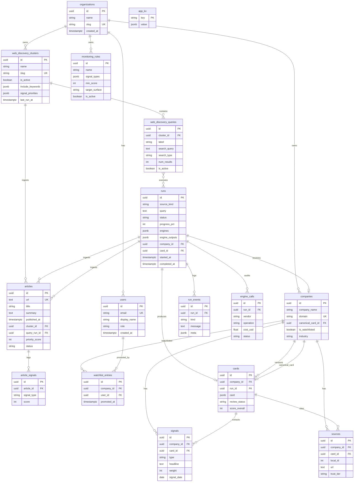
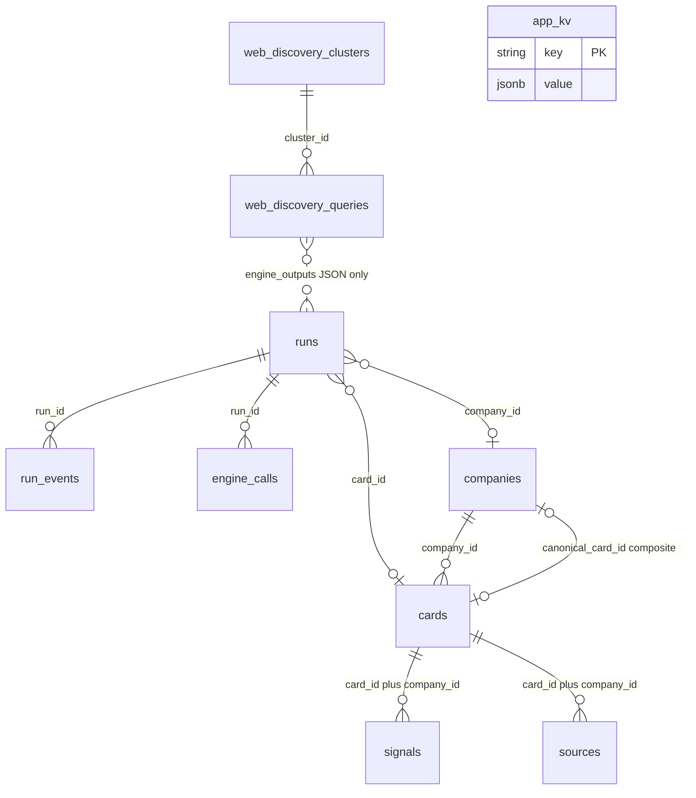
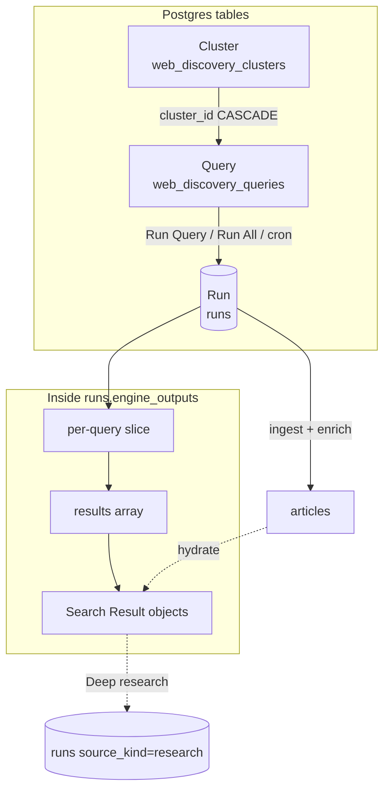
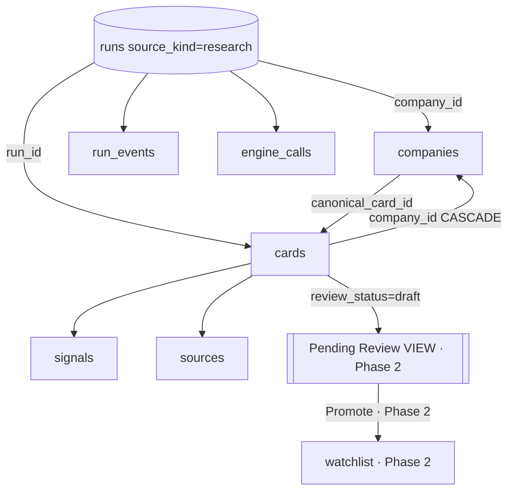
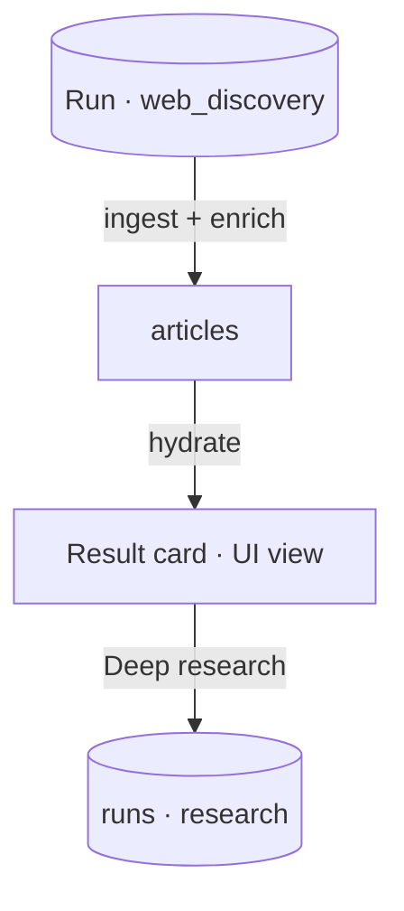
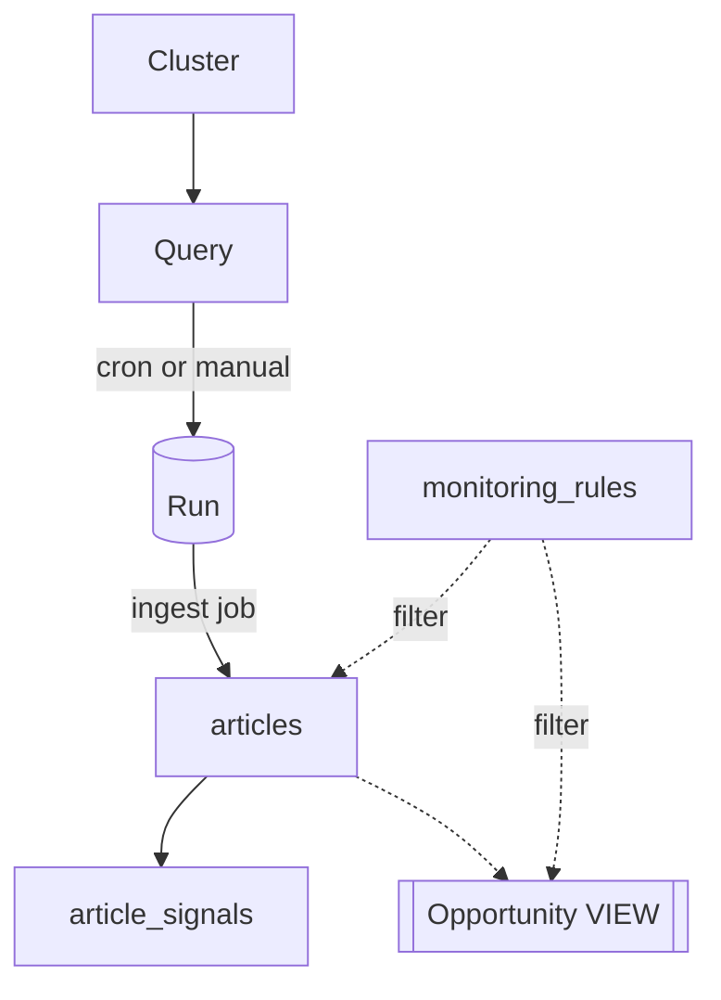
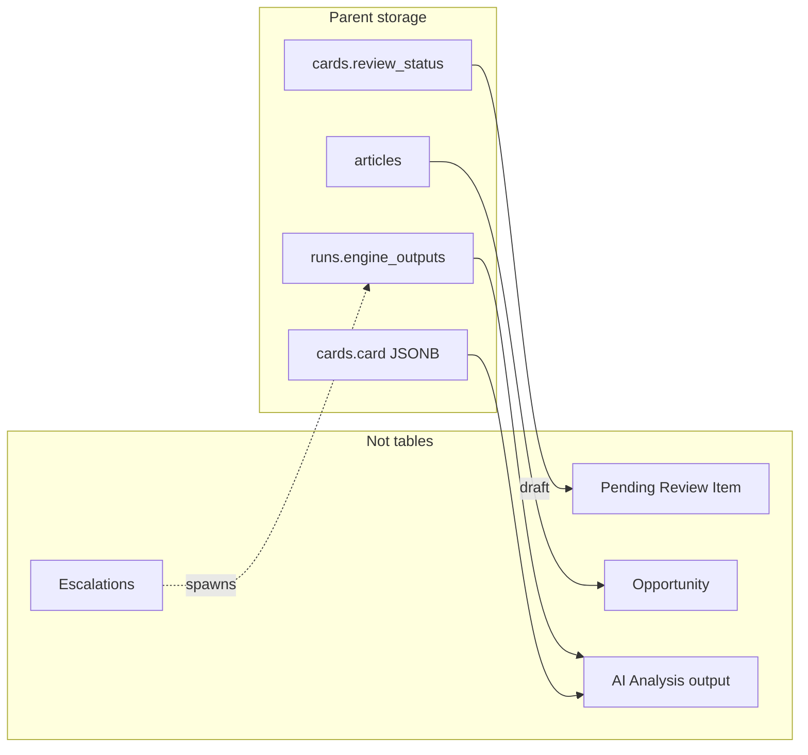
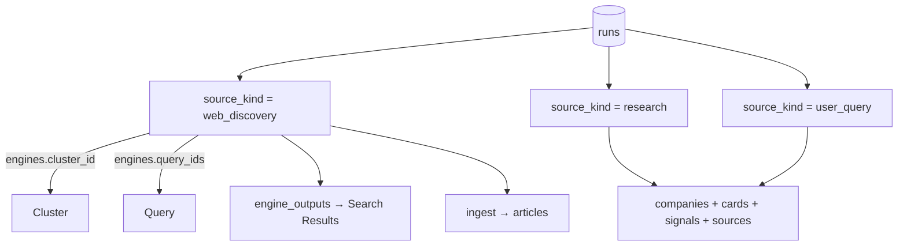
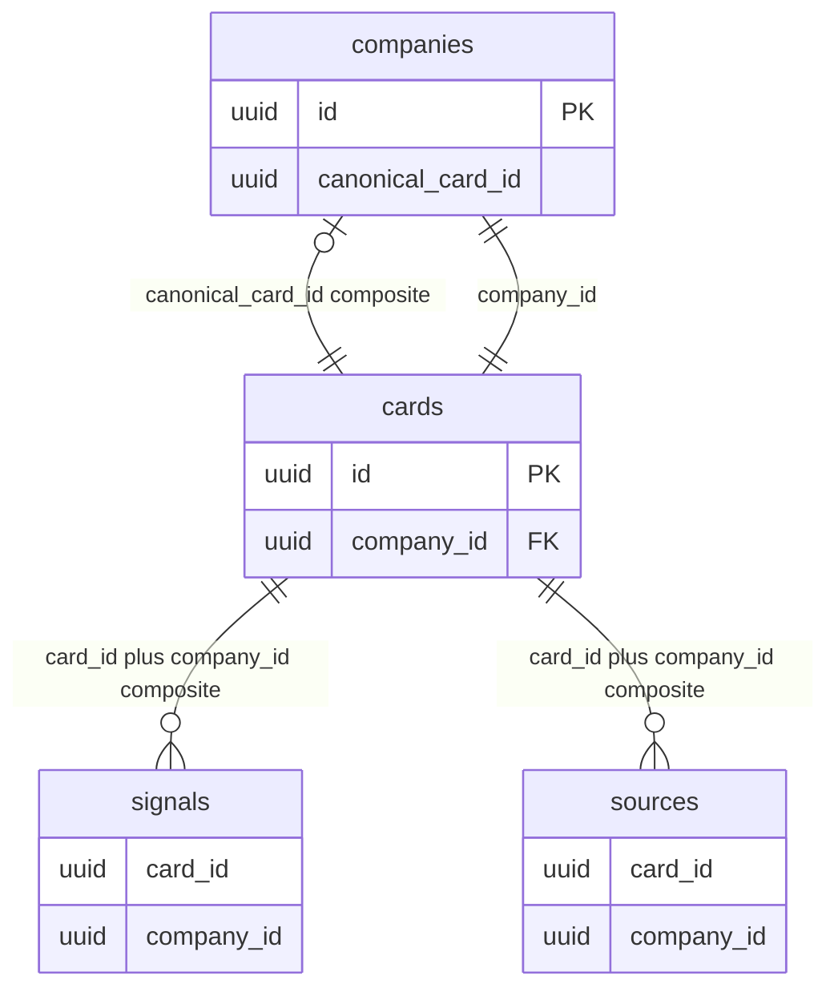
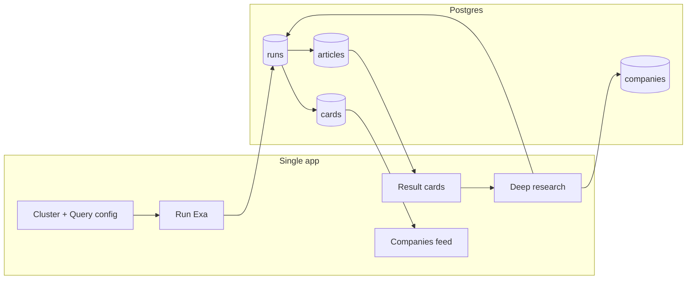

# P1-04 — Required Fields

| Field | Value |
|-------|-------|
| **Document ref** | P1-04 |
| **Title** | Required Fields per Object |
| **Version** | 3.0 |
| **Last updated** | 2026-06-19 |
| **Audience** | Internal developers, operators |
| **Controlling doc** | [P1-00 Overview](./phase-1-overview.md) |
| **Linear** | [GRO-269](https://linear.app/growthmaschine/issue/GRO-269/40-define-required-fields-for-each-core-object) · Parent [GRO-265](https://linear.app/growthmaschine/issue/GRO-265) |
| **Object reference** | [P1-02-Admin](./P1-02-admin.md) · [P1-02-User](./P1-02-user.md) · [P1-03](./P1-03.md) |
| **Screen mapping** | [P1-05-Admin](./P1-05-admin.md) · [P1-05-User](./P1-05-user.md) |
| **Backend actions** | [P1-06](./P1-06.md) |

---

## 1. Introduction

Single field-level spec for the NORAD data model. Companion to [P1-03](./P1-03.md) (relationships). Analyst **screen labels** live in [P1-02-User](./P1-02-user.md) and [P1-01-User](./P1-01-user.md) — not duplicated here.

| Part | Sections | Content |
|------|----------|---------|
| **I — Field tables** | §2–§8 | Postgres columns, enums, FKs, field definitions |
| **II — Schema diagrams** | §9 | Master ER, flows, `runs` polymorphism |
| **III — Analyst consumption** | §10 | Same schema, analyst UI labels — no duplicate field tables |

**Global conventions**

| Rule | Decision |
|------|----------|
| `organization_id` | **Omitted** until multi-tenant ships |
| Part I Notes | field notes vs models
| Non-table objects | Views and actions — fields on parent tables |
| AI Analysis | Not a table — fields on parent objects |

**Cluster · Query · Run**

One pipeline. **Web Discovery** UI (`/discover-web`) creates and edits Clusters and Queries. **Runs** execute on operator action (in-process — no separate worker). Each run **ingests new URLs into `articles`** and runs **Sonnet enrich** in the same pipeline. Analysts read enriched results on the **query results page** in the same app — they do not create clusters or queries. Scheduled cron and News feed are **Phase 2**.

| Level | Product name | Postgres table / row |
|-------|--------------|----------------------|
| **Cluster** | Cluster | `web_discovery_clusters` |
| **Query** | Query | `web_discovery_queries` (`cluster_id` FK) |
| **Run** | Run | `runs` where `source_kind = web_discovery` |

| Label | `label` on Query | Display name in admin UI |
| Search string | `search_query` on Query | Exa text sent on Run — not the cluster name |

`web_discovery_` is the **Postgres table prefix only** — product language is Cluster / Query / Run.

**Table columns (Part I)**

| Column | Meaning |
|--------|---------|
| Field | Column or JSON path |
| Type | Postgres-oriented type |
| Required | Yes / No |
| Searchable | Yes / No |
| UI | Where shown, or Internal only |
| Notes | Enum values, FK, constraints |

---

## Part I — Field tables

Object definitions: [P1-02-Admin](./P1-02-admin.md). Workflows: [P1-01-Admin](./P1-01-admin.md).

---

## 2. Platform objects

### 2.1 Organization

No table in MVP. Documented for post-MVP schema design.

| Field | Type | Required | Searchable | UI | Notes |
|-------|------|----------|------------|-----|-------|
| id | UUID | Yes | No | Internal | Primary key ·|
| name | string(255) | Yes | Yes | Internal | Tenant display name ·|
| slug | string(120) | Yes | Yes | Internal | Unique tenant key ·|
| created_at | timestamptz | Yes | No | Internal ||
| updated_at | timestamptz | Yes | No | Internal ||

### 2.2 User

| Field | Type | Required | Searchable | UI | Notes |
|-------|------|----------|------------|-----|-------|
| id | UUID | Yes | No | Internal ||
| email | string(255) | Yes | Yes | Settings profile ||
| display_name | string(120) | No | Yes | Sidebar profile ||
| role | enum (`operator`, `admin`) | Yes | No | Internal | Admin console access ·|
| created_at | timestamptz | Yes | No | Internal ||
| updated_at | timestamptz | Yes | No | Internal ||

---

## 3. Cluster, Query, and Run

Configured on `/discover-web`. Postgres table names below; product terms are Cluster / Query / Run.

### 3.1 Cluster

Table: `web_discovery_clusters`

| Field | Type | Required | Searchable | UI | Notes |
|-------|------|----------|------------|-----|-------|
| id | UUID | Yes | No | Internal | PK |
| name | string(140) | Yes | Yes | Cluster list, command center header | |
| slug | string(160) | Yes | Yes | Internal | Unique; URL segment |
| description | text | No | No | Cluster settings | |
| priority | enum (`P1 Critical`, `P2 Daily Intelligence`, `P3 Weekly Monitoring`) | Yes | Yes | Cluster list badge | Default `P2 Daily Intelligence` |
| is_active | boolean | Yes | Yes | Cluster list status | Paused clusters cannot run |
| include_keywords | JSON array[string] | Yes | No | Cluster settings | Scope tags |
| exclude_keywords | JSON array[string] | Yes | No | Cluster settings | |
| geography_focus | JSON array[string] | Yes | No | Cluster settings | |
| source_preferences | JSON array[string] | Yes | No | Cluster settings | |
| signal_priorities | JSON array[string] | Yes | No | Cluster settings | |
| query_count | integer | Yes | No | Cluster list stat | Denormalized · ≥ 0 |
| signal_count | integer | Yes | No | Cluster list stat | Denormalized · ≥ 0 |
| last_run_at | timestamptz | No | Yes | Cluster list | Last successful run |
| schedule | string | No | No | Cluster settings | Cron expression ·|
| created_at | timestamptz | Yes | No | Cluster metadata | |
| updated_at | timestamptz | Yes | No | Internal | |

### 3.2 Query

Table: `web_discovery_queries` · belongs to one Cluster (`cluster_id`)

| Field | Type | Required | Searchable | UI | Notes |
|-------|------|----------|------------|-----|-------|
| id | UUID | Yes | No | Internal | PK |
| cluster_id | UUID | Yes | No | Internal | FK → `web_discovery_clusters.id` CASCADE |
| label | string(160) | Yes | Yes | Query list, editor title | Display name for this query (not the Exa string) |
| search_query | text | Yes | Yes | Query editor | The Exa search string sent on Run |
| search_type | enum (`auto`, `fast`, `deep`, `deep-lite`, `deep-reasoning`, `instant`) | Yes | No | Query editor | Default `auto` |
| num_results | integer | Yes | No | Query editor | 1–100 · default 10 |
| is_active | boolean | Yes | Yes | Query list | Inactive skipped on Run All |
| content_highlights | boolean | Yes | No | Query editor | Exa contents mode |
| content_text | boolean | Yes | No | Query editor | |
| content_summary | boolean | Yes | No | Query editor | |
| structured_outputs | boolean | Yes | No | Query editor ||
| highlights_max_chars | integer | No | No | Query editor | |
| highlights_guiding_query | text | No | No | Query editor | |
| text_max_chars | integer | No | No | Query editor | |
| text_main_content_only | boolean | Yes | No | Query editor | |
| summary_max_chars | integer | No | No | Query editor | |
| system_prompt | text | No | No | Query editor ||
| output_schema | JSON object | No | No | Query editor ||
| livecrawl_timeout_ms | integer | Yes | No | Query editor | Default 10000 |
| max_age_hours | integer | No | No | Query editor | -1 = no limit |
| subpages | integer | Yes | No | Query editor | |
| extra_links | integer | Yes | No | Query editor | |
| extra_image_links | integer | Yes | No | Query editor | |
| subpage_target_keywords | JSON array[string] | Yes | No | Query editor | |
| category | string(80) | No | No | Query editor | Exa category filter |
| user_location | string(8) | No | No | Query editor | ISO country |
| include_domains | JSON array[string] | Yes | No | Query editor | |
| exclude_domains | JSON array[string] | Yes | No | Query editor | |
| published_after | date | No | No | Query editor | |
| published_before | date | No | No | Query editor | |
| crawled_after | date | No | No | Query editor | |
| crawled_before | date | No | No | Query editor | |
| content_moderation | boolean | Yes | No | Query editor | |
| stream_response | boolean | Yes | No | Internal | |
| additional_queries | JSON array[string] | Yes | No | Query editor | |
| created_at | timestamptz | Yes | No | Query metadata | |
| updated_at | timestamptz | Yes | No | Internal | |

### 3.3 Run

Table: `runs` where `source_kind = web_discovery` · executes one or more Queries (manual or cron)

| Field | Type | Required | Searchable | UI | Notes |
|-------|------|----------|------------|-----|-------|
| id | UUID | Yes | No | Internal | PK |
| source_kind | string(32) | Yes | Yes | Internal | Always `web_discovery` |
| query | text | Yes | No | Activity log | Run label — cluster name or batch context |
| status | enum (`queued`, `researching`, `synthesizing`, `completed`, `failed`, `cancelled`) | Yes | Yes | Results page, Activity | `queued` → `completed` / `failed` |
| progress_pct | integer | Yes | No | Activity | 0–100 |
| error | text | No | No | Results error banner | |
| engines | JSON object | Yes | No | Internal | Snapshot: `cluster_id`, `query_ids`, Exa config |
| engine_outputs | JSON object | Yes | No | Internal | Per-query result slices — see §3.4 |
| idempotency_key | string(64) | No | No | Internal | Unique when set |
| started_at | timestamptz | No | Yes | Activity, run selector | |
| completed_at | timestamptz | No | Yes | Run selector | |
| company_id | UUID | No | No | Internal | Null for cluster runs |
| card_id | UUID | No | No | Internal | Null for cluster runs |
| created_at | timestamptz | Yes | Yes | Run history | |
| updated_at | timestamptz | Yes | No | Internal | |

**`engine_outputs` slice per query (internal shape)**

| Field | Type | Required | Notes |
|-------|------|----------|-------|
| query_id | UUID | Yes | FK to `web_discovery_queries.id` |
| query_label | string | No | Denormalized |
| result_count | integer | Yes | |
| results | JSON array | Yes | Array of Search Result objects §3.4 |
| latency_ms | float | No | |
| cost_usd | float | No | |

### 3.4 Search Result

**Embedded in run JSON** — object inside `runs.engine_outputs[].results[]`. Optional future `search_results` table; MVP keeps JSON embed.

| Field | Type | Required | Searchable | UI | Notes |
|-------|------|----------|------------|-----|-------|
| url | text | Yes | Yes | Results page link | Primary identity |
| exa_id | string | No | No | Internal | Exa document id |
| title | string | No | Yes | Results page title | |
| snippet | text | No | Yes | Results page excerpt | |
| published_date | string (ISO date) | No | Yes | Results metadata | |
| score | float | No | Yes | Results sort | Exa relevance |
| highlights | JSON array[string] | No | No | Results expand | |
| summary | text | No | Yes | Results expand | Exa vendor summary |
| text | text | No | No | Internal | Full body when content_text enabled |
| image | string (URL) | No | No | Results thumbnail ||
| favicon | string (URL) | No | No | Results row | |
| author | string | No | No | Results metadata | |
| article_id | UUID | No | No | Internal | FK → `articles.id` when ingested |
| ingest_status | string | No | Yes | Results badges | `created` · `duplicate` |
| executive_summary | text | No | Yes | Results card | Sonnet summary — hydrated from `articles.summary` |
| mentioned_companies | JSON array | No | Yes | Companies in this story | Hydrated from `articles` |
| enriched | boolean | No | Yes | **Analyzed** badge | `true` when Sonnet enrich succeeded |
| source_query_id | UUID | No | No | Internal | Parent query (on Article row) |

### 3.5 Article

Table: `articles`

| Field | Type | Required | Searchable | UI | Notes |
|-------|------|----------|------------|-----|-------|
| id | UUID | Yes | No | Internal | PK |
| url | text | Yes | Yes | Results card link | Unique |
| title | string | Yes | Yes | Results card title | |
| summary | text | No | Yes | Executive summary | Sonnet enrich output |
| body_text | text | No | Yes | Full article section | Cleaned for display |
| source_name | string | No | Yes | Results metadata | Publisher |
| published_at | timestamptz | No | Yes | Results metadata | |
| ingested_at | timestamptz | Yes | No | Internal | When Web Discovery run ingested URL |
| cluster_id | UUID | No | No | Internal | FK → `web_discovery_clusters.id` |
| query_run_id | UUID | No | No | Internal | FK → `runs.id` — originating Run |
| source_query_id | UUID | No | No | Internal | FK → `web_discovery_queries.id` |
| category_tag | string | No | No | Internal | Reserved — Phase 2 feed tagging |
| priority_score | integer | No | No | Internal | Reserved — Phase 2 feed scoring |
| mentioned_companies | JSON array | No | Yes | Companies in this story | Sonnet entity extraction |
| source_metadata | JSON object | Yes | No | Internal | Exa hit metadata snapshot |
| status | enum (`active`, `dismissed`, `archived`) | Yes | No | Internal | `dismiss` API exists; no UI |
| created_at | timestamptz | Yes | No | Internal | |
| updated_at | timestamptz | Yes | No | Internal | |

### 3.6 News Signal *(Phase 2 — not migrated)*

Table: `article_signals` — **not in current repo**. Documented for `phase2test.md` acceptance and future News / Signals feed.

| Field | Type | Required | Searchable | UI | Notes |
|-------|------|----------|------------|-----|-------|
| id | UUID | Yes | No | Internal | PK |
| article_id | UUID | Yes | No | Internal | FK → `articles.id` |
| signal_type | string | Yes | Yes | Signals tabs (planned) | FUND, FDA, LEGAL, … |
| score | integer | No | Yes | Feed priority (planned) | 0–100 |
| headline | text | No | Yes | Signals table (planned) | |
| created_at | timestamptz | Yes | No | Internal | |

---

## 4. Deep research objects

### 4.1 Deep Research Run

Table: `runs` where `source_kind = research`

| Field | Type | Required | Searchable | UI | Notes |
|-------|------|----------|------------|-----|-------|
| id | UUID | Yes | No | Internal | PK |
| source_kind | string(32) | Yes | Yes | Internal | `research` (also `user_query` on older rows — same pipeline) |
| query | text | Yes | Yes | Companies Activity | Company name / URL input |
| status | enum (see §3.3) | Yes | Yes | Companies row pill | `researching` → `synthesizing` → `completed` |
| progress_pct | integer | Yes | No | Activity | |
| error | text | No | No | Activity error | |
| engines | JSON object | Yes | No | Internal | Parallel/Exa/Diffbot config snapshot |
| engine_outputs | JSON object | Yes | No | Research Evidence | Raw vendor payloads |
| company_id | UUID | No | Yes | Companies list | Set on complete |
| card_id | UUID | No | No | Internal | Set on complete |
| idempotency_key | string(64) | No | No | Internal | |
| started_at | timestamptz | No | Yes | Activity | |
| completed_at | timestamptz | No | Yes | Profile history | |
| created_at | timestamptz | Yes | Yes | Profile history | |
| updated_at | timestamptz | Yes | No | Internal | |

**Provenance fields** (in `engines` JSON; optional dedicated columns)

| Field | Type | Required | Notes |
|-------|------|----------|-------|
| source_search_result_url | string | No | Deep research from result card |
| source_run_id | UUID | No | Parent Run |

### 4.2 Company

Table: `companies`

| Field | Type | Required | Searchable | UI | Notes |
|-------|------|----------|------------|-----|-------|
| id | UUID | Yes | No | Internal | PK |
| company_name | string(255) | Yes | Yes | Companies list, detail header | |
| domain | string(255) | No | Yes | Company header | Lowercase apex; unique dedupe key |
| legal_entity_name | string(255) | No | Yes | Company detail | |
| website | text | No | No | Company detail | |
| logo_url | text | No | No | Company row | |
| industry | string(128) | No | Yes | Companies filter | Denormalized from canonical card |
| category | string(128) | No | Yes | Companies filter | |
| status | string(32) | No | Yes | Companies list ||
| headquarters_country | string(64) | No | Yes | Company detail | |
| canonical_card_id | UUID | No | No | Internal | Composite FK with `id` |
| is_watchlisted | boolean | No | No | Internal | **Phase 2** — not on `companies` model yet |
| created_at | timestamptz | Yes | Yes | Company metadata | |
| updated_at | timestamptz | Yes | No | Internal | |

### 4.3 Company Card

Table: `cards` · JSON contract: `CompanyCardV1` in `apps/api/app/schemas/`

| Field | Type | Required | Searchable | UI | Notes |
|-------|------|----------|------------|-----|-------|
| id | UUID | Yes | No | Internal | PK |
| company_id | UUID | Yes | No | Internal | FK → `companies.id` CASCADE |
| run_id | UUID | No | No | Internal | FK → `runs.id` SET NULL |
| schema_version | string(16) | Yes | No | Internal | Default `1.0` |
| card | JSONB | Yes | Yes (JSON) | Company detail tabs | Full `CompanyCardV1` — see schema, not duplicated here |
| score_overall | integer | No | Yes | Companies list sort | 0–100 denormalized |
| score_growth | integer | No | Yes | Internal | Sort/filter |
| score_momentum | integer | No | Yes | Internal | |
| score_fundraising | integer | No | Yes | Internal | |
| score_acquisition | integer | No | Yes | Internal | |
| score_partnership_fit | integer | No | Yes | Internal | |
| score_strategic_fit | integer | No | Yes | Internal | |
| score_risk | integer | No | Yes | Internal | |
| review_status | enum (`draft`, `accepted`, `rejected`, `archived`) | Yes | Yes | Companies list pill | `draft` default — Pending Review UI is Phase 2 |
| reviewer_notes | text | No | No | Internal | |
| created_at | timestamptz | Yes | Yes | Profile history | |
| updated_at | timestamptz | Yes | No | Internal | |

**`card` JSONB** — document structure in `docs/backend-pipeline.md` and `apps/api/app/schemas/company_card.py`. P1-04 does not duplicate `Valued[]` blocks.

### 4.4 Research Signal

Table: `signals` · Analyst label: Company Signal

| Field | Type | Required | Searchable | UI | Notes |
|-------|------|----------|------------|-----|-------|
| id | UUID | Yes | No | Internal | PK |
| company_id | UUID | Yes | Yes | Internal | FK → `companies.id` |
| card_id | UUID | Yes | No | Internal | Composite FK with company_id |
| type | enum (`growth`, `fundraising`, `acquisition`, `partnership`, `risk`, `strategic`) | Yes | Yes | Signals section | |
| subtype | string(64) | No | Yes | Signals section | |
| headline | text | Yes | Yes | Signals timeline | |
| evidence | text | No | Yes | Signals expand | |
| weight | integer | Yes | Yes | Signals sort | 1–10 |
| signal_date | date | No | Yes | Signals timeline | |
| source_refs | JSON array | Yes | No | Internal | `[source.local_id, ...]` |
| created_at | timestamptz | Yes | No | Internal | |
| updated_at | timestamptz | Yes | No | Internal | |

### 4.5 Source

Table: `sources`

| Field | Type | Required | Searchable | UI | Notes |
|-------|------|----------|------------|-----|-------|
| id | UUID | Yes | No | Internal | PK |
| company_id | UUID | Yes | No | Internal | FK → `companies.id` |
| card_id | UUID | Yes | No | Internal | Composite FK |
| local_id | integer | Yes | No | Internal | Id inside `card.sources` array |
| url | text | Yes | Yes | Sources section | |
| title | text | No | Yes | Sources section | |
| type | string(64) | No | Yes | Sources section | |
| trust_tier | string(2) | No | Yes | Sources section | e.g. `A`, `B` |
| date_published | date | No | Yes | Sources section | |
| date_found | date | No | No | Internal | |
| last_checked | date | No | No | Internal | |
| snippet | text | No | Yes | Sources expand | |
| freshness_score | float | No | No | Internal | |
| created_at | timestamptz | Yes | No | Internal | |
| updated_at | timestamptz | Yes | No | Internal | |

---

## 5. Pipeline infrastructure objects

### 5.1 Run Event

Table: `run_events`

| Field | Type | Required | Searchable | UI | Notes |
|-------|------|----------|------------|-----|-------|
| id | UUID | Yes | No | Internal | PK |
| run_id | UUID | Yes | No | Internal | FK → `runs.id` CASCADE |
| kind | string(48) | Yes | Yes | Activity feed | `stage_completed`, `engine_call`, `log`, … |
| message | text | Yes | Yes | Activity feed | |
| level | enum (`info`, `warning`, `error`) | Yes | No | Activity styling | |
| meta | JSON object | Yes | No | Internal | Stage stats, costs |
| created_at | timestamptz | Yes | No | Activity timestamp | |
| updated_at | timestamptz | Yes | No | Internal | |

### 5.2 Engine Call

Table: `engine_calls`

| Field | Type | Required | Searchable | UI | Notes |
|-------|------|----------|------------|-----|-------|
| id | UUID | Yes | No | Internal | PK |
| run_id | UUID | No | Yes | Research Evidence | FK → `runs.id` SET NULL |
| vendor | enum (`exa`, `anthropic`, `parallel`, `diffbot`) | Yes | Yes | Evidence expand | |
| operation | string(64) | Yes | Yes | Evidence expand | e.g. `synthesize_card` |
| model | string(64) | No | No | Evidence expand | |
| processor | string(32) | No | No | Evidence expand | Parallel tier |
| units | integer | Yes | No | Internal | |
| input_tokens | integer | Yes | No | Evidence | |
| output_tokens | integer | Yes | No | Evidence | |
| cost_usd | float | Yes | Yes | Activity cost lines | |
| latency_ms | float | Yes | No | Evidence | |
| status | enum (`ok`, `error`, `timeout`) | Yes | Yes | Evidence | |
| error | text | No | No | Evidence | |
| request_snapshot | JSON object | Yes | No | Internal | Truncated · secrets stripped |
| response_snapshot | JSON object | Yes | No | Internal | Truncated |
| created_at | timestamptz | Yes | Yes | Evidence | |
| updated_at | timestamptz | Yes | No | Internal | |

### 5.3 Research Config

Store: `app_kv` key `research_config` · Affects **deep research runs only**

| Field | Type | Required | Searchable | UI | Notes |
|-------|------|----------|------------|-----|-------|
| parallel_processor | enum (`lite`, `base`, `core`, `pro`, `ultra`, `ultra2x`, `ultra4x`, `ultra8x`) | Yes | No | Settings → Parallel | |
| parallel_timeout_s | integer | Yes | No | Settings | 60–3600 |
| exa_search_type | enum (`auto`, `fast`, `neural`, `keyword`, `deep`) | Yes | No | Settings → Exa | |
| exa_deep_model | string | No | No | Settings → Exa | When search_type = deep |
| exa_num_results | integer | Yes | No | Settings → Exa | 1–50 |
| diffbot_enabled | boolean | Yes | No | Settings → Diffbot | |
| diffbot_score_threshold | float | Yes | No | Settings → Diffbot | 0.0–1.0 |

---

## 6. Run polymorphism note

All run types share `runs` columns (§3.3, §4.1). Discriminator: `source_kind`.

| `source_kind` | Product object |
| --------------- | ---------------- |
| `web_discovery` | Run (Exa cluster/query execution) |
| `research` | Deep Research Run |
| `user_query` | Deep Research Run (older discriminator — same as `research`) |

---

## 7. AI Analysis — fields on parent objects

Not a table. LLM output columns:

| Parent | Field | Type | Required | UI |
| -------- | ------- | ------ | ---------- | ----- |
| Article | summary | text | No | Executive summary on results card |
| Article | mentioned_companies | JSON array | No | Companies in this story |
| Company Card | card (synthesis) | JSONB | Yes | Company detail |
| `engine_calls` | (audit row) | — | — | Research Evidence |

---

## 8. Non-table objects (actions and views)

### 8.1 Deep research trigger

**No table.** User action from a Web Discovery result card (company in `mentioned_companies`).

| Concept | Persisted as | Notes |
|---------|--------------|-------|
| Deep research click | New `runs` row `source_kind=research` | `POST /api/research/runs` |
| Company name / domain hint | `runs.query` + engines metadata | |

### 8.2 Pending Review Item *(Phase 2 — view, not a table)*

**View** — not a table. Row appears when `cards.review_status = draft`.

| Field shown | Source table.column |
|-------------|---------------------|
| company_name | `companies.company_name` |
| domain | `companies.domain` |
| summary | `cards.card` JSON excerpt |
| origin_label | `engines` / article provenance ·|
| review_status | `cards.review_status` |
| run_id | `cards.run_id` |

---

## Part II — Database schema diagrams

Visual layer on top of Part I field tables and [P1-03](./P1-03.md) (relationships).

---

## 9. Database schema diagrams

### 9.1 How to read

| Symbol / label | Meaning |
|----------------|---------|
| **Solid line** | FK exists or is defined in schema |
| **Dotted line** | Logical link — JSON embed, view, or provenance |
| 🟢 | Table exists in repo |
| 🔵 | not migrated yet |
| ⬜ | View or derived — not a table |

**MVP:** No `organizations` or `organization_id` until multi-tenant. **Single `runs` table** — `source_kind` discriminates Run vs deep research.

### 9.2 Master schema — all tables

> `companies.canonical_card_id` and `signals` / `sources` use **composite FKs** with `(card_id, company_id)` — simplified above. See §9.6.

### 9.3 Current schema

| Table |
| ------- |
| `web_discovery_clusters` |
| `web_discovery_queries` |
| `runs` |
| `companies` |
| `cards` |
| `signals` |
| `sources` |
| `run_events` |
| `engine_calls` |
| `app_kv` |

### 9.4 Diagram by product area

#### Cluster → Query → Run

Search Results are **not rows** — JSON inside `engine_outputs`. **Articles** are created during the same Web Discovery run (dedup + Sonnet enrich). Results API hydrates Article fields onto each hit.

#### Deep Research (shared)

#### Analyst results (built today)

Users read **result cards** on the query results route — not a separate News feed. `GET /api/web-discovery/articles` exists for article listing; primary analyst surface is query results.

#### Analyst News feed *(Phase 2 — not built)*

Analysts **do not** create Clusters or Queries. **Phase 2:** scheduled runs would feed a News / Signals surface — not built today.

#### Views and non-tables

| View / action | SQL / logic equivalent |
|---------------|------------------------|
| Pending Review | `cards.review_status = 'draft'` joined to `companies` |
| Watchlist | `companies.is_watchlisted` or `watchlist_entries` |
| Opportunity | Weekly query over `articles` + `signals` + `monitoring_rules` |
| Operator deep research trigger | `INSERT INTO runs (source_kind='research', engines→provenance)` |

### 9.5 `runs` polymorphism

| `source_kind` | Trigger | Output |
|---------------|---------|--------|
| `web_discovery` | Run Query / Run All | Search Results JSON · `articles` ingest + enrich |
| `research` | Deep research / API | Company + Card |
| `user_query` | Same as `research` | Company + Card |

### 9.6 Composite foreign keys

| Constraint | Prevents |
|------------|----------|
| `cards(company_id)` → `companies(id)` | Orphan cards |
| `(canonical_card_id, id)` → `cards(id, company_id)` | Canonical card from another company |
| `(card_id, company_id)` on signals/sources | Cross-company drift |

### 9.7 JSON embeds (not separate tables)

| Location | Contents | Future table? |
|----------|----------|---------------|
| `runs.engine_outputs` | Per-query Exa results, Search Result objects | Optional `search_results` |
| `runs.engines` | Run config + cluster/query provenance | Optional dedicated FK columns |
| `cards.card` | Full `CompanyCardV1` — see `apps/api/app/schemas/` | Stay JSONB |
| `articles.mentioned_companies` | Companies in story | Stay JSON or junction |
| `app_kv.value` | `research_config` | Stay KV |

### 9.8 End-to-end data flow

---

## Part III — Analyst journey (same schema)

Analysts use the **same app and Postgres schema**. They read enriched Web Discovery results and company profiles — they do not configure clusters or queries.

| Need | Where to look |
|------|----------------|
| Postgres columns | **Part I** (this doc) — single schema |
| Screen labels & analyst actions | [P1-02-User](./P1-02-user.md) |
| Workflows | [P1-01-User](./P1-01-user.md) |
| Screen → object mapping | [P1-05-User](./P1-05-user.md) |

| Object | Analyst role (built today) |
|--------|---------------------------|
| Cluster, Query, Run | Not configured in analyst journey — operator routes |
| Article, result card | Read on query results page |
| Company, Company Profile, Company Signal | Read on `/companies` |
| Pending Review, Watchlist, News Signal | **Phase 2** — see §8.2, §3.6 |

---

## 11. Completion checklist

| Item |
| ------ |
| Part I — field table for every P1-02-Admin object |
| Part I — Cluster / Query / Run single definition (§3) |
| Part I — Article enrich fields (§3.4–3.5) |
| Part I — News Signal marked Phase 2 (§3.6) |
| Part II — database schema diagrams (§9) |
| Single-app analyst consumption (§10) |
| CompanyCardV1 JSON deferred to `apps/api/app/schemas/` |
| `organization_id` omitted per MVP decision |
| `phase2test.md` — treat `article_signals` / Today as Phase 2 or retired |

---

## 12. Approval

| Role | Name | Date |
| ------ | ------ | ------ |
| Author | Huzaifa | 2026-06-19 |
| Reviewer | Shehrayar Haq | — |
