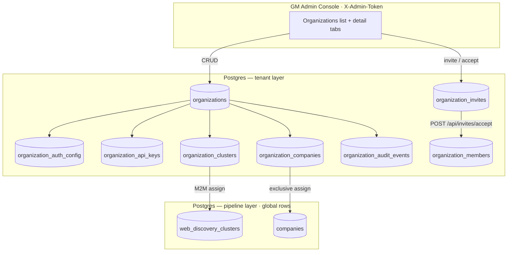
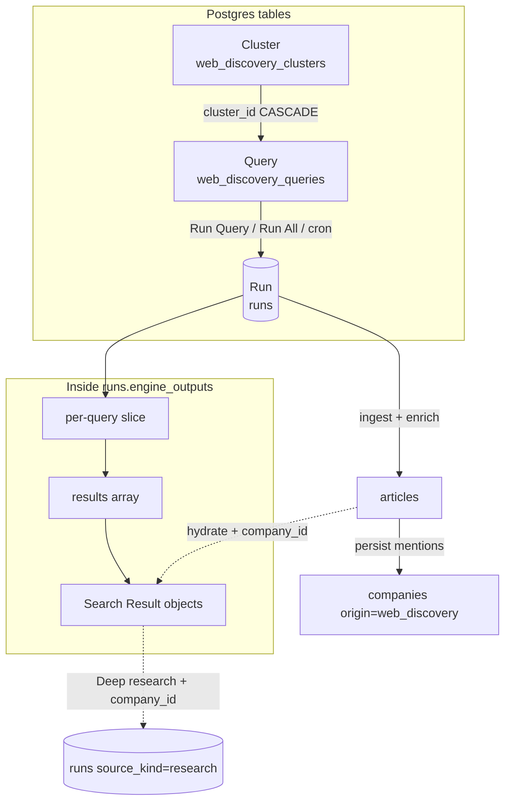
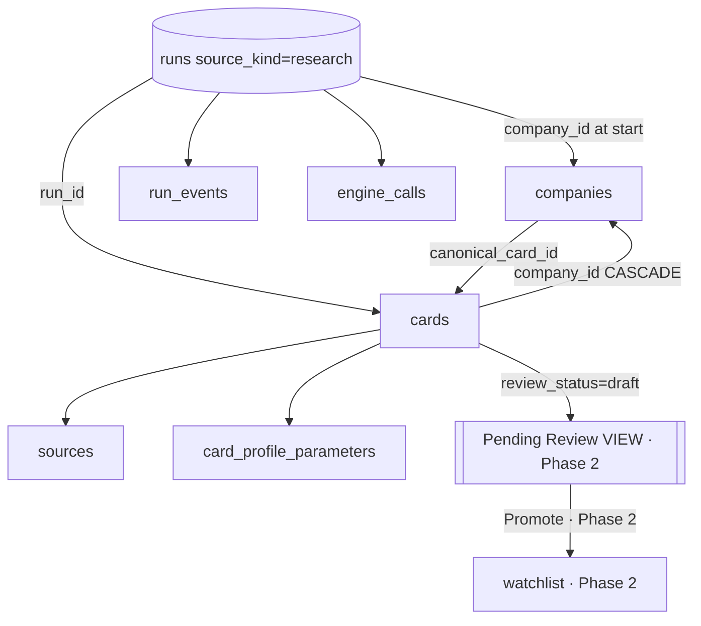
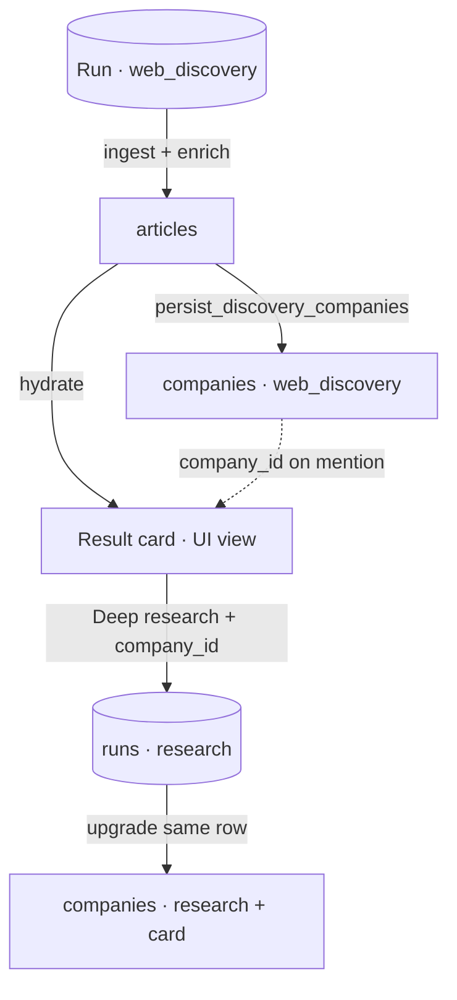
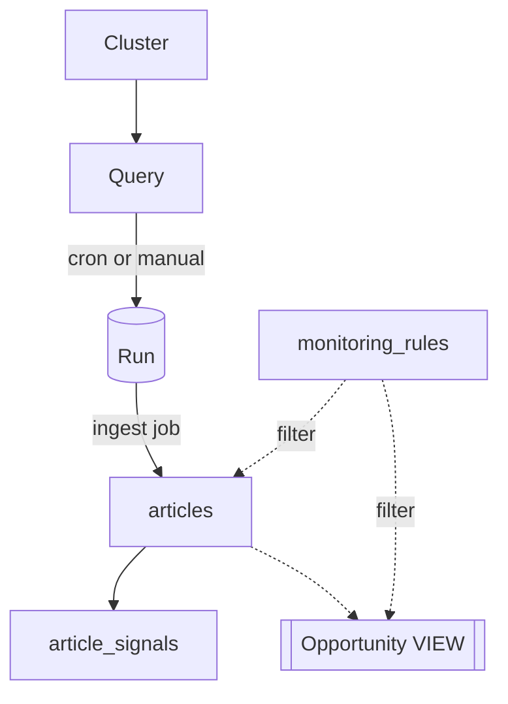
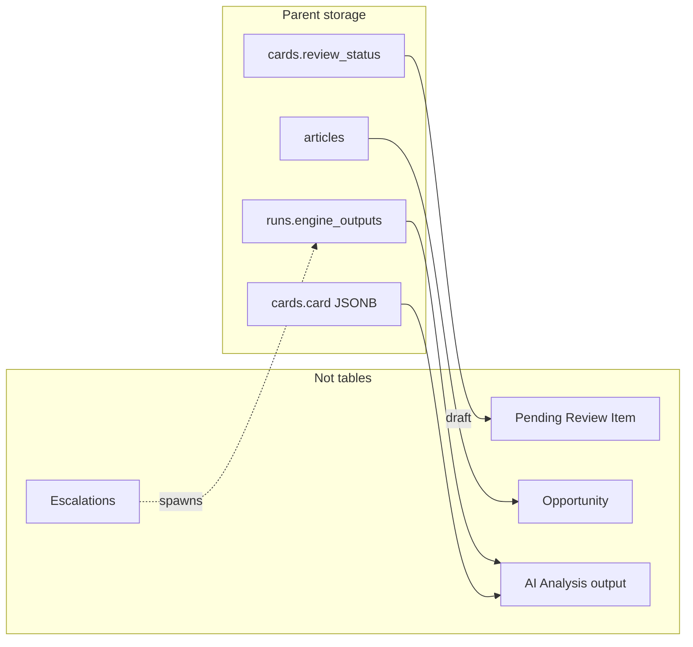
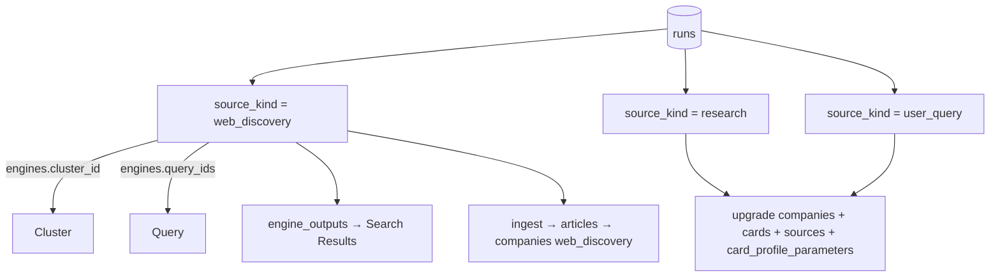
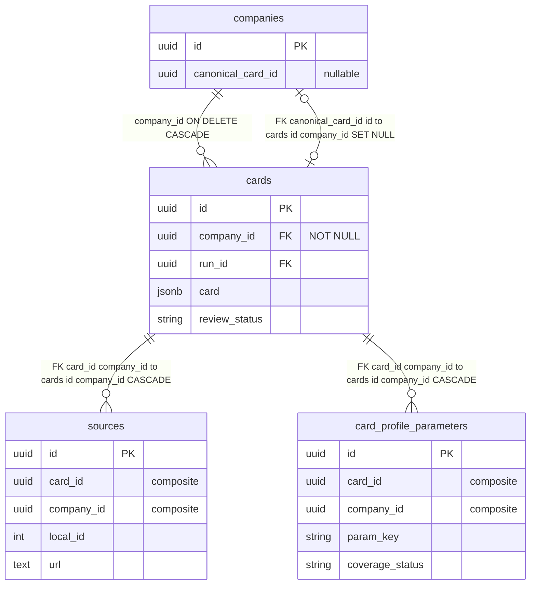
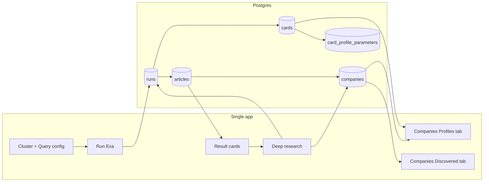

# P1-04 — Required Fields

| Field | Value |
|-------|-------|
| **Document ref** | P1-04 |
| **Title** | Required Fields per Object |
| **Version** | 3.3 |
| **Last updated** | 2026-06-22 |
| **Audience** | Internal developers, operators |
| **Controlling doc** | [P1-00 Overview](./phase-1-overview.md) |
| **Linear** | [GRO-269](https://linear.app/growthmaschine/issue/GRO-269/40-define-required-fields-for-each-core-object) · Parent [GRO-265](https://linear.app/growthmaschine/issue/GRO-265) |
| **Object reference** | [P1-02-Admin](./P1-02-admin.md) · [P1-02-User](./P1-02-user.md) · [P1-03](./P1-03.md) |
| **Screen mapping** | [P1-05-Admin](./P1-05-admin.md) · [P1-05-User](./P1-05-user.md) |
| **Backend actions** | [P1-06](./P1-06.md) |

---

## 1. Introduction

Single field-level spec for the NORAD data model. Companion to [P1-03](./P1-03.md) (relationships). Analyst **screen labels** live in [P1-02-User](./P1-02-user.md) and [P1-01-User](./P1-01-user.md) — not duplicated here.

| Part | Sections | Content |
|------|----------|---------|
| **I — Field tables** | §2–§8 | Postgres columns, enums, FKs, field definitions |
| **II — Schema diagrams** | §9 | Master ER, flows, `runs` polymorphism |
| **III — Analyst consumption** | §10 | Same schema, analyst UI labels — no duplicate field tables |

**Global conventions**

| Rule | Decision |
|------|----------|
| `organization_id` on pipeline tables | **Deferred** — scoping uses `organization_clusters` / `organization_companies` join tables; `companies` and `web_discovery_clusters` rows stay global |
| Part I Notes | field notes vs models |
| Non-table objects | Views and actions — fields on parent tables |
| AI Analysis | Not a table — fields on parent objects |

**Cluster · Query · Run**

One pipeline. **Web Discovery** UI (`/discover-web`) creates and edits Clusters and Queries. **Runs** execute on operator action (in-process — no separate worker). Each run **ingests new URLs into `articles`**, runs **Sonnet enrich**, and **persists each mention as a `companies` row** (`origin = web_discovery`, FK `source_article_id`). Analysts read enriched results on the **query results page** in the same app — they do not create clusters or queries. Scheduled cron and News feed are **Phase 2**.

| Level | Product name | Postgres table / row |
|-------|--------------|----------------------|
| **Cluster** | Cluster | `web_discovery_clusters` |
| **Query** | Query | `web_discovery_queries` (`cluster_id` FK) |
| **Run** | Run | `runs` where `source_kind = web_discovery` |

| Label | `label` on Query | Display name in admin UI |
| Search string | `search_query` on Query | Exa text sent on Run — not the cluster name |

`web_discovery_` is the **Postgres table prefix only** — product language is Cluster / Query / Run.

**Table columns (Part I)**

| Column | Meaning |
|--------|---------|
| Field | Column or JSON path |
| Type | Postgres-oriented type |
| Required | Yes / No |
| Searchable | Yes / No |
| UI | Where shown, or Internal only |
| Notes | Enum values, FK, constraints |

---

## Part I — Field tables

Object definitions: [P1-02-Admin](./P1-02-admin.md). Workflows: [P1-01-Admin](./P1-01-admin.md).

---

## 2. Platform objects

### 2.1 Organization

Table: `organizations` · API: `/api/admin/organizations` · Auth: `X-Admin-Token` (prod)

| Field | Type | Required | Searchable | UI | Notes |
|-------|------|----------|------------|-----|-------|
| id | UUID | Yes | No | Internal | PK |
| name | string(255) | Yes | Yes | Org list, detail header | |
| domain | string(255) | Yes | Yes | Org list subtitle | Unique; normalized lowercase |
| status | enum (`active`, `suspended`) | Yes | Yes | Status badge | Admin-controlled |
| display_status | derived | — | Yes | List/detail badge | `provisioning` when in-flight runs in org scope |
| created_by | string(255) | Yes | No | Internal | GM operator label · header `X-Actor-Label` or `admin` |
| updated_by | string(255) | No | No | Internal | Last profile/status change |
| created_at | timestamptz | Yes | No | Internal | |
| updated_at | timestamptz | Yes | No | Internal | |

### 2.2 Organization member

Table: `organization_members` · Created after invite accept or direct accept flow

| Field | Type | Required | Searchable | UI | Notes |
|-------|------|----------|------------|-----|-------|
| id | UUID | Yes | No | Internal | PK |
| organization_id | UUID | Yes | No | Internal | FK → `organizations.id` CASCADE |
| email | string(320) | Yes | Yes | Users tab | Unique per org |
| display_name | string(255) | Yes | Yes | Users tab | |
| role | enum (`staff`, `manager`) | Yes | Yes | Role filter | Same permissions for now |
| team | string(120) | No | Yes | Team filter | e.g. `Revenue` |
| status | enum (`active`, `deactivated`) | Yes | Yes | Status badge | |
| joined_at | timestamptz | Yes | Yes | Joined date column | |
| created_by | string(255) | Yes | No | Internal | Copied from `invite.invited_by` on accept |
| updated_by | string(255) | No | No | Internal | Last profile edit |
| deactivated_at | timestamptz | No | No | Internal | Set on deactivate |
| deactivated_by | string(255) | No | No | Internal | GM operator on deactivate |

### 2.3 Organization invite

Table: `organization_invites`

| Field | Type | Required | Searchable | UI | Notes |
|-------|------|----------|------------|-----|-------|
| id | UUID | Yes | No | Internal | PK |
| organization_id | UUID | Yes | No | Internal | FK CASCADE |
| email | string(320) | Yes | Yes | Pending count | |
| display_name | string(255) | Yes | No | Invite row | |
| role | enum (`staff`, `manager`) | Yes | Yes | — | |
| team | string(120) | No | Yes | — | |
| status | enum (`pending`, `accepted`, `expired`, `cancelled`) | Yes | Yes | Overview card | |
| invited_by | string(255) | Yes | No | Internal | GM operator who sent/resent invite |
| token_hash | string(64) | Yes | No | Internal | SHA-256; plaintext once on create/resend |
| expires_at | timestamptz | Yes | No | Internal | Default 7 days |
| sent_at | timestamptz | No | No | Internal | |
| accepted_at | timestamptz | No | No | Internal | |

### 2.4 Integration key

Table: `organization_api_keys`

| Field | Type | Required | Searchable | UI | Notes |
|-------|------|----------|------------|-----|-------|
| id | UUID | Yes | No | Internal | PK |
| organization_id | UUID | Yes | No | Internal | FK CASCADE |
| name | string(120) | Yes | No | Internal | Default `default` |
| key_prefix | string(24) | Yes | No | Key metadata | Display only — e.g. `norad_org_…` |
| key_hash | string(64) | Yes | No | Internal | SHA-256 of full key |
| is_active | boolean | Yes | No | Internal | One active per org |
| created_by | string(255) | Yes | No | Internal | Issuer on create/rotate |
| revoked_by | string(255) | No | No | Internal | Set when rotated |
| expires_at | timestamptz | No | No | Future UI | Schema only |
| last_used_at | timestamptz | No | No | Internal | |
| revoked_at | timestamptz | No | No | Internal | Set on rotate |

### 2.5 Organization auth config

Table: `organization_auth_config` · 1:1 with org · **schema-first** (SSO wiring deferred)

| Field | Type | Required | Searchable | UI | Notes |
|-------|------|----------|------------|-----|-------|
| organization_id | UUID | Yes | No | Internal | PK, FK → organizations |
| mfa_enforced | boolean | Yes | No | Security tab toggle | |
| sso_only | boolean | Yes | No | Security tab toggle | |
| ip_allowlist_enabled | boolean | Yes | No | Security tab toggle | |
| scim_enabled | boolean | Yes | No | Security tab toggle | |
| ip_allowlist | JSON array[string] | Yes | No | Security tab | |
| sso_provider | string(64) | No | No | Authentication (future) | |
| sso_config | JSON object | Yes | No | Internal | |
| updated_by | string(255) | No | No | Internal | Last security policy edit |

### 2.6 Organization access (join tables)

**`organization_clusters`** — M2M org ↔ `web_discovery_clusters`

| Field | Type | Required | Notes |
|-------|------|----------|-------|
| organization_id | UUID | Yes | PK part 1 |
| cluster_id | UUID | Yes | PK part 2 · FK CASCADE both sides |
| assigned_at | timestamptz | Yes | |
| assigned_by | string(255) | Yes | GM operator who granted access |

**`organization_companies`** — org ↔ `companies` (**`UNIQUE(company_id)`** — one company, one org)

| Field | Type | Required | Notes |
|-------|------|----------|-------|
| organization_id | UUID | Yes | PK part 1 |
| company_id | UUID | Yes | PK part 2 · exclusive globally |
| assigned_at | timestamptz | Yes | |
| assigned_by | string(255) | Yes | GM operator who attached company |

### 2.7 Organization audit event

Table: `organization_audit_events`

| Field | Type | Required | Searchable | UI | Notes |
|-------|------|----------|------------|-----|-------|
| id | UUID | Yes | No | Internal | PK |
| organization_id | UUID | Yes | No | Internal | FK CASCADE |
| event_type | string(64) | Yes | No | Internal | e.g. `user.invited` |
| title | string(255) | Yes | Yes | Activity tab | |
| description | text | No | No | Activity tab | |
| actor_label | string(255) | No | No | Internal | Default `admin` |
| metadata | JSON object | Yes | No | Internal | |
| created_at | timestamptz | Yes | Yes | Activity timestamp | |

### 2.8 GM operator (not a table)

| Field | Type | Required | Notes |
|-------|------|----------|-------|
| credential | `X-Admin-Token` header | Yes in prod | Env: `NORAD_ADMIN_TOKEN` · GM staff only |

---

## 3. Cluster, Query, and Run

Configured on `/discover-web`. Postgres table names below; product terms are Cluster / Query / Run.

### 3.1 Cluster

Table: `web_discovery_clusters`

| Field | Type | Required | Searchable | UI | Notes |
|-------|------|----------|------------|-----|-------|
| id | UUID | Yes | No | Internal | PK |
| name | string(140) | Yes | Yes | Cluster list, command center header | |
| slug | string(160) | Yes | Yes | Internal | Unique; URL segment |
| description | text | No | No | Cluster settings | |
| priority | enum (`P1 Critical`, `P2 Daily Intelligence`, `P3 Weekly Monitoring`) | Yes | Yes | Cluster list badge | Default `P2 Daily Intelligence` |
| is_active | boolean | Yes | Yes | Cluster list status | Paused clusters cannot run |
| include_keywords | JSON array[string] | Yes | No | Cluster settings | Scope tags |
| exclude_keywords | JSON array[string] | Yes | No | Cluster settings | |
| geography_focus | JSON array[string] | Yes | No | Cluster settings | |
| source_preferences | JSON array[string] | Yes | No | Cluster settings | |
| signal_priorities | JSON array[string] | Yes | No | Cluster settings | |
| query_count | integer | Yes | No | Cluster list stat | Denormalized · ≥ 0 |
| signal_count | integer | Yes | No | Cluster list stat | Denormalized · ≥ 0 |
| last_run_at | timestamptz | No | Yes | Cluster list | Last successful run |
| schedule | string | No | No | Cluster settings | Cron expression ·|
| created_at | timestamptz | Yes | No | Cluster metadata | |
| updated_at | timestamptz | Yes | No | Internal | |

### 3.2 Query

Table: `web_discovery_queries` · belongs to one Cluster (`cluster_id`)

| Field | Type | Required | Searchable | UI | Notes |
|-------|------|----------|------------|-----|-------|
| id | UUID | Yes | No | Internal | PK |
| cluster_id | UUID | Yes | No | Internal | FK → `web_discovery_clusters.id` CASCADE |
| label | string(160) | Yes | Yes | Query list, editor title | Display name for this query (not the Exa string) |
| search_query | text | Yes | Yes | Query editor | The Exa search string sent on Run |
| search_type | enum (`auto`, `fast`, `deep`, `deep-lite`, `deep-reasoning`, `instant`) | Yes | No | Query editor | Default `auto` |
| num_results | integer | Yes | No | Query editor | 1–100 · default 10 |
| is_active | boolean | Yes | Yes | Query list | Inactive skipped on Run All |
| content_highlights | boolean | Yes | No | Query editor | Exa contents mode |
| content_text | boolean | Yes | No | Query editor | |
| content_summary | boolean | Yes | No | Query editor | |
| structured_outputs | boolean | Yes | No | Query editor ||
| highlights_max_chars | integer | No | No | Query editor | |
| highlights_guiding_query | text | No | No | Query editor | |
| text_max_chars | integer | No | No | Query editor | |
| text_main_content_only | boolean | Yes | No | Query editor | |
| summary_max_chars | integer | No | No | Query editor | |
| system_prompt | text | No | No | Query editor ||
| output_schema | JSON object | No | No | Query editor ||
| livecrawl_timeout_ms | integer | Yes | No | Query editor | Default 10000 |
| max_age_hours | integer | No | No | Query editor | -1 = no limit |
| subpages | integer | Yes | No | Query editor | |
| extra_links | integer | Yes | No | Query editor | |
| extra_image_links | integer | Yes | No | Query editor | |
| subpage_target_keywords | JSON array[string] | Yes | No | Query editor | |
| category | string(80) | No | No | Query editor | Exa category filter |
| user_location | string(8) | No | No | Query editor | ISO country |
| include_domains | JSON array[string] | Yes | No | Query editor | |
| exclude_domains | JSON array[string] | Yes | No | Query editor | |
| published_after | date | No | No | Query editor | |
| published_before | date | No | No | Query editor | |
| crawled_after | date | No | No | Query editor | |
| crawled_before | date | No | No | Query editor | |
| content_moderation | boolean | Yes | No | Query editor | |
| stream_response | boolean | Yes | No | Internal | |
| additional_queries | JSON array[string] | Yes | No | Query editor | |
| created_at | timestamptz | Yes | No | Query metadata | |
| updated_at | timestamptz | Yes | No | Internal | |

### 3.3 Run

Table: `runs` where `source_kind = web_discovery` · executes one or more Queries (manual or cron)

| Field | Type | Required | Searchable | UI | Notes |
|-------|------|----------|------------|-----|-------|
| id | UUID | Yes | No | Internal | PK |
| source_kind | string(32) | Yes | Yes | Internal | Always `web_discovery` |
| query | text | Yes | No | Activity log | Run label — cluster name or batch context |
| status | enum (`queued`, `researching`, `synthesizing`, `completed`, `failed`, `cancelled`) | Yes | Yes | Results page, Activity | `queued` → `completed` / `failed` |
| progress_pct | integer | Yes | No | Activity | 0–100 |
| error | text | No | No | Results error banner | |
| engines | JSON object | Yes | No | Internal | Snapshot: `cluster_id`, `query_ids`, Exa config |
| engine_outputs | JSON object | Yes | No | Internal | Per-query result slices — see §3.4 |
| idempotency_key | string(64) | No | No | Internal | Unique when set |
| started_at | timestamptz | No | Yes | Activity, run selector | |
| completed_at | timestamptz | No | Yes | Run selector | |
| company_id | UUID | No | No | Internal | Null for cluster runs |
| card_id | UUID | No | No | Internal | Null for cluster runs |
| created_at | timestamptz | Yes | Yes | Run history | |
| updated_at | timestamptz | Yes | No | Internal | |

**`engine_outputs` slice per query (internal shape)**

| Field | Type | Required | Notes |
|-------|------|----------|-------|
| query_id | UUID | Yes | FK to `web_discovery_queries.id` |
| query_label | string | No | Denormalized |
| result_count | integer | Yes | |
| results | JSON array | Yes | Array of Search Result objects §3.4 |
| latency_ms | float | No | |
| cost_usd | float | No | |

### 3.4 Search Result

**Embedded in run JSON** — object inside `runs.engine_outputs[].results[]`. Optional future `search_results` table; MVP keeps JSON embed.

| Field | Type | Required | Searchable | UI | Notes |
|-------|------|----------|------------|-----|-------|
| url | text | Yes | Yes | Results page link | Primary identity |
| exa_id | string | No | No | Internal | Exa document id |
| title | string | No | Yes | Results page title | |
| snippet | text | No | Yes | Results page excerpt | |
| published_date | string (ISO date) | No | Yes | Results metadata | |
| score | float | No | Yes | Results sort | Exa relevance |
| highlights | JSON array[string] | No | No | Results expand | |
| summary | text | No | Yes | Results expand | Exa vendor summary |
| text | text | No | No | Internal | Full body when content_text enabled |
| image | string (URL) | No | No | Results thumbnail ||
| favicon | string (URL) | No | No | Results row | |
| author | string | No | No | Results metadata | |
| article_id | UUID | No | No | Internal | FK → `articles.id` when ingested |
| ingest_status | string | No | Yes | Results badges | `created` · `duplicate` |
| executive_summary | text | No | Yes | Results card | Sonnet summary — hydrated from `articles.summary` |
| mentioned_companies | JSON array | No | Yes | Companies in this story | Hydrated from `articles`; each object includes `company_id` (UUID string) after enrich |
| enriched | boolean | No | Yes | **Analyzed** badge | `true` when Sonnet enrich succeeded |
| source_query_id | UUID | No | No | Internal | Parent query (on Article row) |

### 3.5 Article

Table: `articles`

| Field | Type | Required | Searchable | UI | Notes |
|-------|------|----------|------------|-----|-------|
| id | UUID | Yes | No | Internal | PK |
| url | text | Yes | Yes | Results card link | Unique |
| title | string | Yes | Yes | Results card title | |
| summary | text | No | Yes | Executive summary | Sonnet enrich output |
| body_text | text | No | Yes | Full article section | Cleaned for display |
| source_name | string | No | Yes | Results metadata | Publisher |
| published_at | timestamptz | No | Yes | Results metadata | |
| ingested_at | timestamptz | Yes | No | Internal | When Web Discovery run ingested URL |
| cluster_id | UUID | No | No | Internal | FK → `web_discovery_clusters.id` |
| query_run_id | UUID | No | No | Internal | FK → `runs.id` — originating Run |
| source_query_id | UUID | No | No | Internal | FK → `web_discovery_queries.id` |
| category_tag | string | No | No | Internal | Reserved — Phase 2 feed tagging |
| priority_score | integer | No | No | Internal | Reserved — Phase 2 feed scoring |
| mentioned_companies | JSON array | No | Yes | Companies in this story | Sonnet entity extraction; upserted to `companies` (`origin=web_discovery`); each element gains `company_id` |
| source_metadata | JSON object | Yes | No | Internal | Exa hit metadata snapshot |
| status | enum (`active`, `dismissed`, `archived`) | Yes | No | Internal | `dismiss` API exists; no UI |
| created_at | timestamptz | Yes | No | Internal | |
| updated_at | timestamptz | Yes | No | Internal | |

### 3.6 News Signal *(Phase 2 — not migrated)*

Table: `article_signals` — **not in current repo**. Documented for `phase2test.md` acceptance and future News / Signals feed.

| Field | Type | Required | Searchable | UI | Notes |
|-------|------|----------|------------|-----|-------|
| id | UUID | Yes | No | Internal | PK |
| article_id | UUID | Yes | No | Internal | FK → `articles.id` |
| signal_type | string | Yes | Yes | Signals tabs (planned) | FUND, FDA, LEGAL, … |
| score | integer | No | Yes | Feed priority (planned) | 0–100 |
| headline | text | No | Yes | Signals table (planned) | |
| created_at | timestamptz | Yes | No | Internal | |

---

## 4. Deep research objects

### 4.1 Deep Research Run

Table: `runs` where `source_kind = research`

| Field | Type | Required | Searchable | UI | Notes |
|-------|------|----------|------------|-----|-------|
| id | UUID | Yes | No | Internal | PK |
| source_kind | string(32) | Yes | Yes | Internal | `research` (also `user_query` on older rows — same pipeline) |
| query | text | Yes | Yes | Companies Activity | Company name / URL input |
| status | enum (see §3.3) | Yes | Yes | Companies row pill | `researching` → `synthesizing` → `completed` |
| progress_pct | integer | Yes | No | Activity | |
| error | text | No | No | Activity error | |
| engines | JSON object | Yes | No | Internal | Parallel/Exa/Diffbot config snapshot |
| engine_outputs | JSON object | Yes | No | Research Evidence | Raw vendor payloads |
| company_id | UUID | No | Yes | Companies list | Set at run **start** when `POST` body includes `company_id`; otherwise set on complete |
| card_id | UUID | No | No | Internal | Set on complete |
| idempotency_key | string(64) | No | No | Internal | |
| started_at | timestamptz | No | Yes | Activity | |
| completed_at | timestamptz | No | Yes | Profile history | |
| created_at | timestamptz | Yes | Yes | Profile history | |
| updated_at | timestamptz | Yes | No | Internal | |

**Provenance fields** (in `engines` JSON; optional dedicated columns)

| Field | Type | Required | Notes |
|-------|------|----------|-------|
| source_search_result_url | string | No | Deep research from result card |
| source_run_id | UUID | No | Parent Run |

### 4.2 Company

Table: `companies`

| Field | Type | Required | Searchable | UI | Notes |
|-------|------|----------|------------|-----|-------|
| id | UUID | Yes | No | Internal | PK |
| company_name | string(255) | Yes | Yes | Companies list, detail header | |
| domain | string(255) | No | Yes | Company header | Lowercase apex; unique dedupe key |
| legal_entity_name | string(255) | No | Yes | Company detail | |
| website | text | No | No | Company detail | |
| logo_url | text | No | No | Company row | |
| industry | string(128) | No | Yes | Companies filter | Denormalized from canonical card |
| category | string(128) | No | Yes | Companies filter | |
| status | string(32) | No | Yes | Companies list ||
| headquarters_country | string(64) | No | Yes | Company detail | |
| canonical_card_id | UUID | No | No | Internal | Composite FK with `id` |
| origin | enum (`web_discovery`, `research`) | Yes | Yes | Discovered tab filter | `web_discovery` = Sonnet mention row; `research` = full profile (upgraded on Deep Research complete) |
| source_article_id | UUID | No | No | Internal | FK → `articles.id` — set when `origin = web_discovery` |
| discovery_role | string(64) | No | Yes | Discovered tab | Sonnet `role_in_story` (e.g. `mentioned`, `competitor`) |
| discovery_context | text | No | Yes | Discovered tab | Sonnet one-line context |
| normalized_name | string(255) | No | No | Internal | Lowercased name — part of unique `(source_article_id, normalized_name)` |
| is_watchlisted | boolean | No | No | Internal | **Phase 2** — not on `companies` model yet |
| created_at | timestamptz | Yes | Yes | Company metadata | |
| updated_at | timestamptz | Yes | No | Internal | |

### 4.3 Company Card

Table: `cards` · JSON contract: `CompanyCardV1` in `apps/api/app/schemas/`

| Field | Type | Required | Searchable | UI | Notes |
|-------|------|----------|------------|-----|-------|
| id | UUID | Yes | No | Internal | PK |
| company_id | UUID | Yes | No | Internal | FK → `companies.id` CASCADE |
| run_id | UUID | No | No | Internal | FK → `runs.id` SET NULL |
| schema_version | string(16) | Yes | No | Internal | Default `1.0` |
| card | JSONB | Yes | Yes (JSON) | Company detail tabs | Full `CompanyCardV1` — see schema, not duplicated here |
| score_overall | integer | No | Yes | Companies list sort | **Legacy** — `NULL` on new cards; pre-2026-06 rows may have values |
| score_growth | integer | No | Yes | Internal | **Legacy** — not written by pipeline |
| score_momentum | integer | No | Yes | Internal | **Legacy** |
| score_fundraising | integer | No | Yes | Internal | **Legacy** |
| score_acquisition | integer | No | Yes | Internal | **Legacy** |
| score_partnership_fit | integer | No | Yes | Internal | **Legacy** |
| score_strategic_fit | integer | No | Yes | Internal | **Legacy** |
| score_risk | integer | No | Yes | Internal | **Legacy** |
| profile_completeness_pct | integer | No | Yes | Profile Completeness header | 0–100 — materialized at card persist |
| profile_verified_count | integer | No | Yes | Profile Completeness header | Count of `verified` params |
| profile_uncertain_count | integer | No | Yes | Profile Completeness header | Count of `uncertain` params |
| profile_missing_count | integer | No | Yes | Profile Completeness header | Count of `missing` params |
| review_status | enum (`draft`, `accepted`, `rejected`, `archived`) | Yes | Yes | Companies list pill | `draft` default — Pending Review UI is Phase 2 |
| reviewer_notes | text | No | No | Internal | |
| created_at | timestamptz | Yes | Yes | Profile history | |
| updated_at | timestamptz | Yes | No | Internal | |

**`card` JSONB** — document structure in `docs/backend-pipeline.md` and `apps/api/app/schemas/company_card.py`. P1-04 does not duplicate `Valued[]` blocks.

**Profile completeness summary** — denormalized on `cards` from the 44 must-have parameters in `card_profile_parameters` (§4.6). Filled at persist time by `profile_completeness.py` — not computed in the UI.

### 4.4 Research Signal — RETIRED

**Dropped 2026-06-16** — table `signals` removed by migration `0011_drop_signals.sql`. Deep Research no longer extracts or persists BD signal rows. Fit scores (`score_*`) and recommended actions are also stripped from synthesis.

Legacy behaviour (for a future frontend): `docs/reference/legacy-signals-scores-suggestions.md`.

### 4.5 Source

Table: `sources`

| Field | Type | Required | Searchable | UI | Notes |
|-------|------|----------|------------|-----|-------|
| id | UUID | Yes | No | Internal | PK |
| company_id | UUID | Yes | No | Internal | FK → `companies.id` |
| card_id | UUID | Yes | No | Internal | Composite FK |
| local_id | integer | Yes | No | Internal | Id inside `card.sources` array |
| url | text | Yes | Yes | Sources section | |
| title | text | No | Yes | Sources section | |
| type | string(64) | No | Yes | Sources section | |
| trust_tier | string(2) | No | Yes | Sources section | e.g. `A`, `B` |
| date_published | date | No | Yes | Sources section | |
| date_found | date | No | No | Internal | |
| last_checked | date | No | No | Internal | |
| snippet | text | No | Yes | Sources expand | |
| freshness_score | float | No | No | Internal | |
| created_at | timestamptz | Yes | No | Internal | |
| updated_at | timestamptz | Yes | No | Internal | |

### 4.6 Profile Completeness Parameter

Table: `card_profile_parameters` · Catalog: `apps/api/app/services/profile_completeness.py`

One row per **must-have profile parameter** per card (44 rows per `CompanyCardV1`). Materialized when Deep Research persists a card. API consumers read this table instead of recomputing coverage from `cards.card` JSONB.

| Field | Type | Required | Searchable | UI | Notes |
|-------|------|----------|------------|-----|-------|
| id | UUID | Yes | No | Internal | PK |
| company_id | UUID | Yes | No | Internal | FK → `companies.id` CASCADE |
| card_id | UUID | Yes | No | Internal | Composite FK with `company_id` → `cards(id, company_id)` |
| param_key | string(64) | Yes | Yes | Internal | Stable key — e.g. `company_name`, `revenue_estimate` |
| group_name | string(64) | Yes | Yes | Profile Completeness section header | e.g. `Identity`, `Funding`, `Strategic Fit` |
| sort_order | integer | Yes | No | Internal | Global display order (0–43) |
| label | string(128) | Yes | Yes | Profile Completeness row | e.g. `Legal entity` |
| value | JSONB | No | Yes | Profile Completeness row | Extracted value (plain or `Valued` payload) |
| confidence | enum (`confirmed`, `estimated`, `inferred`, `unknown`) | Yes | Yes | Profile Completeness expand | From `Valued[]` or `confirmed` for plain facts |
| basis | text | No | Yes | Profile Completeness expand | Synthesizer rationale |
| source_refs | JSON array | Yes | No | Profile Completeness expand | Integer indexes into `sources.local_id` |
| coverage_status | enum (`verified`, `uncertain`, `missing`) | Yes | Yes | Profile Completeness badge | Materialized audit status |
| created_at | timestamptz | Yes | No | Internal | |
| updated_at | timestamptz | Yes | No | Internal | |

**Unique:** `(card_id, param_key)` — one row per parameter per card.

**44-parameter groups:** Identity (6) · Classification (4) · People (4) · Traction (2) · Products (4) · Distribution (3) · Business Model (1) · Financials (1) · Funding (4) · Market (3) · Brand & Sentiment (5) · Tech & IP (1) · Risk (2) · Strategic Fit (2) · Provenance (2).

**Completeness % formula:** `round((verified + uncertain × 0.5) / 44 × 100)` — stored on `cards.profile_completeness_pct`.

**Backfill:** `apps/api/scripts/backfill_card_profile_parameters.py` for cards created before migration `0010`.

---

## 5. Pipeline infrastructure objects

### 5.1 Run Event

Table: `run_events`

| Field | Type | Required | Searchable | UI | Notes |
|-------|------|----------|------------|-----|-------|
| id | UUID | Yes | No | Internal | PK |
| run_id | UUID | Yes | No | Internal | FK → `runs.id` CASCADE |
| kind | string(48) | Yes | Yes | Activity feed | `stage_completed`, `engine_call`, `log`, … |
| message | text | Yes | Yes | Activity feed | |
| level | enum (`info`, `warning`, `error`) | Yes | No | Activity styling | |
| meta | JSON object | Yes | No | Internal | Stage stats, costs |
| created_at | timestamptz | Yes | No | Activity timestamp | |
| updated_at | timestamptz | Yes | No | Internal | |

### 5.2 Engine Call

Table: `engine_calls`

| Field | Type | Required | Searchable | UI | Notes |
|-------|------|----------|------------|-----|-------|
| id | UUID | Yes | No | Internal | PK |
| run_id | UUID | No | Yes | Research Evidence | FK → `runs.id` SET NULL |
| vendor | enum (`exa`, `anthropic`, `parallel`, `diffbot`) | Yes | Yes | Evidence expand | |
| operation | string(64) | Yes | Yes | Evidence expand | e.g. `synthesize_card` |
| model | string(64) | No | No | Evidence expand | |
| processor | string(32) | No | No | Evidence expand | Parallel tier |
| units | integer | Yes | No | Internal | |
| input_tokens | integer | Yes | No | Evidence | |
| output_tokens | integer | Yes | No | Evidence | |
| cost_usd | float | Yes | Yes | Activity cost lines | |
| latency_ms | float | Yes | No | Evidence | |
| status | enum (`ok`, `error`, `timeout`) | Yes | Yes | Evidence | |
| error | text | No | No | Evidence | |
| request_snapshot | JSON object | Yes | No | Internal | Truncated · secrets stripped |
| response_snapshot | JSON object | Yes | No | Internal | Truncated |
| created_at | timestamptz | Yes | Yes | Evidence | |
| updated_at | timestamptz | Yes | No | Internal | |

### 5.3 Research Config

Store: `app_kv` key `research_config` · Affects **deep research runs only**

| Field | Type | Required | Searchable | UI | Notes |
|-------|------|----------|------------|-----|-------|
| parallel_processor | enum (`lite`, `base`, `core`, `pro`, `ultra`, `ultra2x`, `ultra4x`, `ultra8x`) | Yes | No | Settings → Parallel | |
| parallel_timeout_s | integer | Yes | No | Settings | 60–3600 |
| exa_search_type | enum (`auto`, `fast`, `neural`, `keyword`, `deep`) | Yes | No | Settings → Exa | |
| exa_deep_model | string | No | No | Settings → Exa | When search_type = deep |
| exa_num_results | integer | Yes | No | Settings → Exa | 1–50 |
| diffbot_enabled | boolean | Yes | No | Settings → Diffbot | |
| diffbot_score_threshold | float | Yes | No | Settings → Diffbot | 0.0–1.0 |

---

## 6. Run polymorphism note

All run types share `runs` columns (§3.3, §4.1). Discriminator: `source_kind`.

| `source_kind` | Product object |
| --------------- | ---------------- |
| `web_discovery` | Run (Exa cluster/query execution) |
| `research` | Deep Research Run |
| `user_query` | Deep Research Run (older discriminator — same as `research`) |

---

## 7. AI Analysis — fields on parent objects

Not a table. LLM output columns:

| Parent | Field | Type | Required | UI |
| -------- | ------- | ------ | ---------- | ----- |
| Article | summary | text | No | Executive summary on results card |
| Article | mentioned_companies | JSON array | No | Companies in this story — each item may include `company_id` |
| Company Card | card (synthesis) | JSONB | Yes | Company detail brief sections |
| Profile Completeness Parameter | `card_profile_parameters` rows | relational | Yes | Profile Completeness audit panel |
| `engine_calls` | (audit row) | — | — | Research Evidence |

---

## 8. Non-table objects (actions and views)

### 8.1 Deep research trigger

**No table.** User action from a Web Discovery result card or **Companies → Discovered** tab.

| Concept | Persisted as | Notes |
|---------|--------------|-------|
| Deep research click | New `runs` row `source_kind=research` | `POST /api/research/runs` |
| Company name / domain hint | `runs.query` + `runs.engines` | |
| Existing discovery row | Optional `company_id` in POST body | Pins run to `companies` row; `runs.company_id` set at enqueue |

### 8.2 Pending Review Item *(Phase 2 — view, not a table)*

**View** — not a table. Row appears when `cards.review_status = draft`.

| Field shown | Source table.column |
|-------------|---------------------|
| company_name | `companies.company_name` |
| domain | `companies.domain` |
| summary | `cards.card` JSON excerpt |
| origin_label | `engines` / article provenance ·|
| review_status | `cards.review_status` |
| run_id | `cards.run_id` |

---

## Part II — Database schema diagrams

Visual layer on top of Part I field tables and [P1-03](./P1-03.md) (relationships).

---

## 9. Database schema diagrams

### 9.1 How to read

| Symbol / label | Meaning |
|----------------|---------|
| **Solid line** | FK exists in Postgres |
| **Composite FK** | Two columns together reference parent — see §9.3.2 and §9.6 |
| **Logical link (no FK row)** | JSON embed or user action — see §9.3.2 “No FK” table |
| 🟢 | Table exists in live DB (§9.3) |
| 🔵 | Planned — in §9.2 only, not migrated |
| ⬜ | View or derived — not a table |

**MVP:** Pipeline tables have no `organization_id` column. Tenant scoping is via **`organization_clusters`** and **`organization_companies`** assignment tables (migration `0012`). Read APIs do not enforce org scope yet. **Single `runs` table** — `source_kind` discriminates Run vs deep research.

> §9.2 below includes **planned** tables (`article_signals`, `monitoring_rules`, `users`, etc.) for product reference. **§9.3 is the live schema** — **19 tables** on GCP Cloud SQL as of 2026-06-22. Field-level detail: Part I §2–§8.

### 9.2 Master schema — all tables (reference + planned)

🟢 **Live since `0012`:** `organizations`, `organization_*` (8 tables). 🔵 **Planned only:** `users`, `article_signals`, `monitoring_rules`, `watchlist_entries`.

```mermaid
erDiagram
    organizations {
        uuid id PK
        string name
        string domain UK
        string status "active | suspended"
        timestamptz created_at
        timestamptz updated_at
    }

    organization_auth_config {
        uuid organization_id PK FK
        boolean mfa_enforced
        boolean sso_only
        boolean scim_enabled
    }

    organization_members {
        uuid id PK
        uuid organization_id FK
        string email
        string role "staff | manager"
        string status "active | deactivated"
    }

    organization_invites {
        uuid id PK
        uuid organization_id FK
        string email
        string status "pending | accepted | expired"
        string token_hash UK
    }

    organization_api_keys {
        uuid id PK
        uuid organization_id FK
        string key_prefix
        string key_hash UK
        boolean is_active
    }

    organization_clusters {
        uuid organization_id PK FK
        uuid cluster_id PK FK
    }

    organization_companies {
        uuid organization_id PK FK
        uuid company_id PK FK "UNIQUE globally"
    }

    organization_audit_events {
        uuid id PK
        uuid organization_id FK
        string event_type
        string title
    }

    users {
        uuid id PK
        string email UK
        string display_name
        string role
        timestamptz created_at
    }

    web_discovery_clusters {
        uuid id PK
        string name
        string slug UK
        boolean is_active
        jsonb include_keywords
        jsonb signal_priorities
        timestamptz last_run_at
    }

    web_discovery_queries {
        uuid id PK
        uuid cluster_id FK
        string label
        text search_query
        string search_type
        int num_results
        boolean is_active
    }

    articles {
        uuid id PK
        text url UK
        string title
        text summary
        uuid cluster_id FK
        uuid query_run_id FK
        uuid source_query_id FK
        jsonb mentioned_companies
        string status
    }

    article_signals {
        uuid id PK
        uuid article_id FK
        string signal_type
        int score
    }

    monitoring_rules {
        uuid id PK
        string name
        jsonb signal_types
        int min_score
        string target_surface
        boolean is_active
    }

    watchlist_entries {
        uuid id PK
        uuid company_id FK
        uuid user_id FK
        timestamptz promoted_at
    }

    runs {
        uuid id PK
        string source_kind
        text query
        string status
        int progress_pct
        jsonb engines
        jsonb engine_outputs
        uuid company_id FK
        uuid card_id FK
        timestamptz started_at
        timestamptz completed_at
    }

    companies {
        uuid id PK
        string company_name
        string domain UK
        uuid canonical_card_id "composite FK"
        string origin "web_discovery | research"
        uuid source_article_id FK
        string industry
    }

    cards {
        uuid id PK
        uuid company_id FK
        uuid run_id FK
        jsonb card
        string review_status
        int profile_completeness_pct
    }

    card_profile_parameters {
        uuid id PK
        uuid card_id FK
        string param_key
        string coverage_status
    }

    sources {
        uuid id PK
        uuid company_id FK
        uuid card_id FK
        int local_id
        text url
        string trust_tier
    }

    run_events {
        uuid id PK
        uuid run_id FK
        string kind
        text message
        jsonb meta
    }

    engine_calls {
        uuid id PK
        uuid run_id FK
        string vendor
        string operation
        float cost_usd
        string status
    }

    app_kv {
        string key PK
        jsonb value
    }

    organizations ||--|| organization_auth_config : "1:1"
    organizations ||--o{ organization_members : has
    organizations ||--o{ organization_invites : invites
    organizations ||--o{ organization_api_keys : keys
    organizations ||--o{ organization_audit_events : audits
    organizations ||--o{ organization_clusters : scopes
    organization_clusters }o--|| web_discovery_clusters : assigns
    organizations ||--o{ organization_companies : scopes
    organization_companies |o--|| companies : "exclusive"

    web_discovery_clusters ||--o{ web_discovery_queries : contains

    web_discovery_queries }o--o{ runs : executes
    web_discovery_queries ||--o{ articles : "source_query_id SET NULL"
    runs ||--o{ articles : "query_run_id SET NULL"
    articles ||--o{ companies : "source_article_id SET NULL"

    runs ||--o{ run_events : logs
    runs ||--o{ engine_calls : audits
    runs ||--o| companies : resolves
    runs ||--o| cards : produces

    companies ||--o{ cards : versions
    companies ||--o| cards : canonical_card
    companies ||--o{ sources : has
    companies ||--o{ watchlist_entries : watchlisted

    cards ||--o{ sources : cites
    cards ||--o{ card_profile_parameters : materializes

    runs ||--o{ articles : ingests
    articles ||--o{ article_signals : tags

    users ||--o{ watchlist_entries : promoted_by
```

> §9.2 includes **planned** tables not in live DB. For exact FKs, ON DELETE rules, and all **19** production tables, use **§9.3**.

### 9.3 Current schema (live — 19 tables)

**Source of truth:** `apps/api/app/models/` · verified on GCP Cloud SQL Postgres.

#### 9.3.1 Entity-relationship diagram

```mermaid
erDiagram
    web_discovery_clusters {
        uuid id PK
        string slug UK "unique"
        string name
        string priority
        boolean is_active
        jsonb include_keywords
        timestamptz last_run_at
        timestamptz created_at
        timestamptz updated_at
    }

    web_discovery_queries {
        uuid id PK
        uuid cluster_id FK "NOT NULL"
        string label
        text search_query
        string search_type
        int num_results
        boolean is_active
        boolean content_text
        boolean content_highlights
        timestamptz created_at
        timestamptz updated_at
    }

    runs {
        uuid id PK
        string source_kind "web_discovery | research | user_query"
        text query
        string status
        int progress_pct
        jsonb engines "config snapshot"
        jsonb engine_outputs "Search Results JSON"
        uuid company_id FK "nullable"
        uuid card_id FK "nullable"
        string idempotency_key UK "nullable"
        timestamptz started_at
        timestamptz completed_at
        timestamptz created_at
    }

    articles {
        uuid id PK
        text url UK "unique dedupe key"
        string title
        text summary "Sonnet executive summary"
        text body_text
        jsonb mentioned_companies "array"
        jsonb source_metadata "object"
        string status "active | dismissed | archived"
        uuid cluster_id FK "nullable"
        uuid query_run_id FK "nullable"
        uuid source_query_id FK "nullable"
        timestamptz ingested_at
        timestamptz created_at
    }

    companies {
        uuid id PK
        string company_name
        string domain UK "nullable apex domain"
        uuid canonical_card_id "composite FK part 1"
        string origin "web_discovery | research"
        uuid source_article_id FK "nullable"
        string discovery_role "nullable"
        text discovery_context "nullable"
        string normalized_name "nullable"
        string industry
        string category
        timestamptz created_at
    }

    cards {
        uuid id PK
        uuid company_id FK "NOT NULL"
        uuid run_id FK "nullable"
        jsonb card "CompanyCardV1"
        string review_status "draft | accepted | rejected | archived"
        int profile_completeness_pct "0-100 denorm"
        timestamptz created_at
    }

    card_profile_parameters {
        uuid id PK
        uuid card_id FK "composite"
        uuid company_id FK "composite"
        string param_key
        string group_name
        string coverage_status "verified | uncertain | missing"
        jsonb value
    }

    sources {
        uuid id PK
        uuid company_id FK "NOT NULL"
        uuid card_id FK "composite with company_id"
        int local_id
        text url
        string trust_tier
    }

    run_events {
        uuid id PK
        uuid run_id FK "NOT NULL"
        string kind
        text message
        string level
        jsonb meta
        timestamptz created_at
    }

    engine_calls {
        uuid id PK
        uuid run_id FK "nullable"
        string vendor "exa | anthropic | parallel | diffbot"
        string operation
        float cost_usd
        float latency_ms
        string status "ok | error | timeout"
        jsonb request_payload
        jsonb response_payload
    }

    app_kv {
        string key PK
        jsonb value
        timestamptz updated_at
    }

    organizations {
        uuid id PK
        string name
        string domain UK
        string status "active | suspended"
        timestamptz created_at
        timestamptz updated_at
    }

    organization_auth_config {
        uuid organization_id PK FK
        boolean mfa_enforced
        boolean sso_only
        boolean scim_enabled
        boolean ip_allowlist_enabled
    }

    organization_members {
        uuid id PK
        uuid organization_id FK
        string email
        string display_name
        string role "staff | manager"
        string team
        string status "active | deactivated"
        timestamptz joined_at
    }

    organization_invites {
        uuid id PK
        uuid organization_id FK
        string email
        string role "staff | manager"
        string status "pending | accepted | expired"
        string token_hash UK
        timestamptz expires_at
    }

    organization_api_keys {
        uuid id PK
        uuid organization_id FK
        string key_prefix
        string key_hash UK
        boolean is_active
        timestamptz revoked_at
    }

    organization_clusters {
        uuid organization_id PK FK
        uuid cluster_id PK FK
        timestamptz assigned_at
    }

    organization_companies {
        uuid organization_id PK FK
        uuid company_id PK FK
        timestamptz assigned_at
    }

    organization_audit_events {
        uuid id PK
        uuid organization_id FK
        string event_type
        string title
        text description
        timestamptz created_at
    }

    web_discovery_clusters ||--o{ web_discovery_queries : "cluster_id CASCADE"
    web_discovery_clusters ||--o{ articles : "cluster_id SET NULL"
    web_discovery_queries ||--o{ articles : "source_query_id SET NULL"

    runs ||--o{ articles : "query_run_id SET NULL"
    runs ||--o{ run_events : "run_id CASCADE"
    runs ||--o{ engine_calls : "run_id SET NULL"

    runs }o--o| companies : "company_id SET NULL"
    runs }o--o| cards : "card_id SET NULL"
    cards }o--o| runs : "run_id SET NULL"

    articles ||--o{ companies : "source_article_id SET NULL"
    companies ||--o{ cards : "company_id CASCADE"
    companies |o--o| cards : "canonical composite FK"
    cards ||--o{ sources : "card_id company_id composite"
    cards ||--o{ card_profile_parameters : "card_id company_id composite"

    organizations ||--|| organization_auth_config : "1:1 CASCADE"
    organizations ||--o{ organization_members : "organization_id CASCADE"
    organizations ||--o{ organization_invites : "organization_id CASCADE"
    organizations ||--o{ organization_api_keys : "organization_id CASCADE"
    organizations ||--o{ organization_audit_events : "organization_id CASCADE"
    organizations ||--o{ organization_clusters : "organization_id CASCADE"
    organization_clusters }o--|| web_discovery_clusters : "cluster_id CASCADE"
    organizations ||--o{ organization_companies : "organization_id CASCADE"
    organization_companies |o--|| companies : "company_id UNIQUE exclusive"
```

#### 9.3.2 Foreign-key reference (exact behaviour)

| Child table | Column(s) | Parent | ON DELETE | Cardinality | Notes |
|-------------|-----------|--------|-----------|-------------|-------|
| `web_discovery_queries` | `cluster_id` | `web_discovery_clusters.id` | **CASCADE** | N:1 | Delete cluster → deletes its queries |
| `articles` | `cluster_id` | `web_discovery_clusters.id` | **SET NULL** | N:1 | Article survives cluster delete |
| `articles` | `query_run_id` | `runs.id` | **SET NULL** | N:1 | Provenance — which run ingested URL |
| `articles` | `source_query_id` | `web_discovery_queries.id` | **SET NULL** | N:1 | Which query definition |
| `run_events` | `run_id` | `runs.id` | **CASCADE** | N:1 | Events die with run |
| `engine_calls` | `run_id` | `runs.id` | **SET NULL** | N:1 | Audit row kept if run deleted |
| `runs` | `company_id` | `companies.id` | **SET NULL** | N:1 | Set at run **start** when body includes `company_id`; otherwise on research complete |
| `runs` | `card_id` | `cards.id` | **SET NULL** | N:1 | Filled when research completes |
| `companies` | `source_article_id` | `articles.id` | **SET NULL** | N:1 | Web Discovery mention — one row per `(article, normalized_name)` |
| `cards` | `company_id` | `companies.id` | **CASCADE** | N:1 | Delete company → deletes all its cards |
| `cards` | `run_id` | `runs.id` | **SET NULL** | N:1 | Card kept if run deleted |
| `sources` | `(card_id, company_id)` | `cards(id, company_id)` | **CASCADE** | N:1 | **Composite FK** — see §9.6 |
| `sources` | `company_id` | `companies.id` | **CASCADE** | N:1 | Single-column FK for cascade |
| `card_profile_parameters` | `(card_id, company_id)` | `cards(id, company_id)` | **CASCADE** | N:1 | **Composite FK** — see §9.6 |
| `card_profile_parameters` | `company_id` | `companies.id` | **CASCADE** | N:1 | Single-column FK for cascade |
| `companies` | `(canonical_card_id, id)` | `cards(id, company_id)` | **SET NULL** | 1:1 optional | **Composite FK** — accepted profile pointer |
| `organization_auth_config` | `organization_id` | `organizations.id` | **CASCADE** | 1:1 | SSO/MFA policy row |
| `organization_members` | `organization_id` | `organizations.id` | **CASCADE** | N:1 | Unique `(organization_id, email)` |
| `organization_invites` | `organization_id` | `organizations.id` | **CASCADE** | N:1 | `token_hash` unique globally |
| `organization_api_keys` | `organization_id` | `organizations.id` | **CASCADE** | N:1 | `key_hash` unique; one active per org (app logic) |
| `organization_clusters` | `organization_id` | `organizations.id` | **CASCADE** | N:M | Composite PK with `cluster_id` |
| `organization_clusters` | `cluster_id` | `web_discovery_clusters.id` | **CASCADE** | N:M | Same cluster can serve multiple orgs |
| `organization_companies` | `organization_id` | `organizations.id` | **CASCADE** | N:M | Composite PK with `company_id` |
| `organization_companies` | `company_id` | `companies.id` | **CASCADE** | 1:1 per company | **`UNIQUE(company_id)`** — exclusive org assignment |
| `organization_audit_events` | `organization_id` | `organizations.id` | **CASCADE** | N:1 | Append-only activity feed |

**No FK row (logical only):**

| Link | How it works |
|------|----------------|
| `web_discovery_queries` → `runs` | `runs.engines` JSON holds `cluster_id` + `query_ids[]`; `engine_outputs` holds per-query Exa hits |
| `articles.mentioned_companies[]` → `companies` | **Dual write:** JSON array for UI hydration **and** relational rows via `persist_discovery_companies()` after Sonnet enrich |
| `articles` → Deep Research | User action — `POST /api/research/runs` with optional `company_id` from mention row |
| `app_kv` → `runs` | Settings copied into `runs.engines` at research start — no FK |

#### 9.3.3 Unique constraints

| Table | Constraint | Columns |
|-------|------------|---------|
| `web_discovery_clusters` | `slug` unique | `slug` |
| `articles` | one row per URL | `url` |
| `companies` | dedupe by domain | `domain` (nullable) |
| `companies` | one mention per article + name | **`UNIQUE (source_article_id, normalized_name)`** partial — where both NOT NULL (`0009`) |
| `runs` | idempotency | `idempotency_key` (nullable) |
| `cards` | composite uniqueness | **`UNIQUE (id, company_id)`** — enables composite FKs on sources/profile params |
| `card_profile_parameters` | one row per param per card | **`UNIQUE (card_id, param_key)`** (`0010`) |
| `app_kv` | singleton keys | `key` (PK) |
| `organizations` | tenant domain | `domain` (`0012`) |
| `organization_members` | one email per org | **`UNIQUE (organization_id, email)`** (`0012`) |
| `organization_invites` | invite token | `token_hash` (`0012`) |
| `organization_api_keys` | key hash | `key_hash` (`0012`) |
| `organization_companies` | one org per company | **`UNIQUE (company_id)`** (`0012`) |
| `organization_invites` | one pending invite per email per org | partial unique on `(organization_id, lower(email))` WHERE `status = pending` (`0012`) |

#### 9.3.4 `runs` polymorphism (same table, two pipelines)

| `source_kind` | Typical `company_id` / `card_id` | Main outputs |
|---------------|----------------------------------|--------------|
| `web_discovery` | NULL / NULL on run row | `engine_outputs` JSON + `articles` ingest + enrich + **`companies` rows** (`origin=web_discovery`) |
| `research` | `company_id` at start if passed; `card_id` on complete | Upgrades existing row or creates `companies`; writes `cards`, `sources`, **`card_profile_parameters`** |
| `user_query` | Same as `research` | Legacy discriminator — same pipeline |

#### 9.3.5 Tables in production (checklist)

| # | Table | Rows (example) | Written by |
|---|-------|----------------|------------|
| 1 | `web_discovery_clusters` | Operator UI | `POST/PUT /api/web-discovery/clusters` |
| 2 | `web_discovery_queries` | Operator UI | `POST/PUT /api/web-discovery/queries` |
| 3 | `runs` | Both pipelines | Run / Deep research APIs + `web_discovery.py` / `research.py` |
| 4 | `articles` | Web Discovery | Exa ingest + Sonnet enrich in `web_discovery.py` |
| 5 | `companies` | Web Discovery + Deep Research | Sonnet enrich → `discovery_companies.py`; domain resolve + upgrade in `research.py` |
| 6 | `cards` | Deep Research | Sonnet synthesis → `CompanyCardV1` JSON + `profile_*` summary columns |
| 7 | `sources` | Deep Research | Citations from engine evidence |
| 8 | `card_profile_parameters` | Deep Research | 44 must-have profile params per card — materialized at persist |
| 9 | `run_events` | Both pipelines | `emit()` → SSE Activity feed |
| 10 | `engine_calls` | Both pipelines | Every Exa / Anthropic / Parallel / Diffbot call |
| 11 | `app_kv` | Settings | `PUT /api/settings/research` (`key = research_config`) |
| 12 | `organizations` | GM Admin Console | `POST /api/admin/organizations` |
| 13 | `organization_members` | Invite accept | `POST /api/invites/accept` |
| 14 | `organization_invites` | GM Admin Console | `POST /api/admin/organizations/{id}/users` |
| 15 | `organization_api_keys` | Org create / rotate | Auto on create; `POST .../integration-key/rotate` |
| 16 | `organization_clusters` | Org Access tab | `POST .../clusters` |
| 17 | `organization_companies` | Org Access tab | `POST .../companies` |
| 18 | `organization_auth_config` | Org create (defaults) | `PATCH .../security` |
| 19 | `organization_audit_events` | All org admin actions | `GET .../activity` |

**Not in live DB (planned — see §9.2):** `article_signals`, `monitoring_rules`, `users` (legacy generic user table), `watchlist_entries`.

**Retired (dropped in `0007_drop_today_legacy.sql`):** `trend_articles`, `discovery_clusters`.

**Retired (dropped in `0011_drop_signals.sql`):** `signals` — BD signal rows no longer persisted.

**Schema migration `0009_companies_web_discovery_origin.sql`:** adds `origin`, `source_article_id`, discovery columns, and `uq_companies_article_normalized_name`. Apply with **`norad_migrate`** user (not `norad_app`).

**Schema migration `0010_card_profile_parameters.sql`:** adds `card_profile_parameters` table and `cards.profile_*` summary columns. Apply with **`norad_migrate`** user.

**Schema migration `0011_drop_signals.sql`:** drops `signals` table. Apply with **`norad_migrate`** user.

**Schema migration `0012_organizations.sql`:** adds 8 organization tables (tenant admin layer). Apply with **`norad_migrate`** user. Spec: [ORG_USER_SETUP.md](../api/ORG_USER_SETUP.md).

#### 9.3.6 Diagram notes

1. **Composite FKs** on `companies.canonical_card_id`, `sources`, and `card_profile_parameters` prevent a card from one company being attached to another. Full detail: §9.6.
2. **Search Results** are **not rows** — they live in `runs.engine_outputs[].results[]`. The results API **hydrates** enrich fields from `articles` when `article_id` is set.
3. **`mentioned_companies`** is JSONB for the results UI **and** mirrored to **`companies` rows** with FK `source_article_id`. Each JSON object includes `company_id` after enrich. Deep Research can pass that id to upgrade the same row (`origin` → `research` on complete).
4. **`cards.card`** is the full `CompanyCardV1` document; denormalized `score_*` columns are **legacy** (NULL on new cards); `profile_*` columns power completeness summary without parsing JSON.
5. **`card_profile_parameters`** materializes the 44 must-have audit rows per card — `GET /api/research/companies/:id/profile-completeness` serves grouped params + summary.
6. **Organization scoping** uses join tables `organization_clusters` and `organization_companies` — pipeline tables (`companies`, `web_discovery_clusters`) remain global rows. Read APIs do not filter by org yet.

### 9.4 Diagram by product area

#### Organization admin (live — migration `0012`)



GM staff manage orgs. Analyst users become `organization_members` after invite accept. Integration key in `organization_api_keys` is for the **future analyst frontend** — not wired on read APIs yet.

#### Cluster → Query → Run



Search Results are **not rows** — JSON inside `engine_outputs`. **Articles** are created during the same Web Discovery run (dedup + Sonnet enrich). **`companies` rows** (`origin=web_discovery`) are upserted per mention. Results API hydrates Article fields (including `company_id` on each mention) onto each hit.

#### Deep Research (shared)



#### Analyst results (built today)



Users read **result cards** on the query results route — not a separate News feed. **`GET /api/research/discovered`** lists Web Discovery mention rows for **Companies → Discovered**. `GET /api/web-discovery/articles` exists for article listing; primary analyst surface is query results.

#### Analyst News feed *(Phase 2 — not built)*



Analysts **do not** create Clusters or Queries. **Phase 2:** scheduled runs would feed a News / Signals surface — not built today.

#### Views and non-tables



| View / action | SQL / logic equivalent |
|---------------|------------------------|
| Pending Review | `cards.review_status = 'draft'` joined to `companies` |
| Watchlist | `companies.is_watchlisted` or `watchlist_entries` |
| Opportunity | Weekly query over `articles` + `monitoring_rules` |
| Operator deep research trigger | `INSERT INTO runs (source_kind='research', engines→provenance)` |

### 9.5 `runs` polymorphism



| `source_kind` | Trigger | Output |
|---------------|---------|--------|
| `web_discovery` | Run Query / Run All | Search Results JSON · `articles` ingest + enrich · **`companies` mention rows** |
| `research` | Deep research / API | Upgrade or create Company + Card (`origin → research`) |
| `user_query` | Same as `research` | Company + Card |

### 9.6 Composite foreign keys (detail)

`cards` has **`UNIQUE (id, company_id)`**. Child tables reference **both** columns so a source/profile row cannot point at another company's card.



| Constraint | SQL shape | Prevents |
|------------|-----------|----------|
| Card belongs to company | `cards.company_id` → `companies.id` | Orphan cards |
| Canonical card integrity | `(companies.canonical_card_id, companies.id)` → `cards(id, company_id)` | Company pointing at another company's card |
| Source integrity | `(sources.card_id, sources.company_id)` → `cards(id, company_id)` | Citation on wrong company's card |
| Profile param integrity | `(card_profile_parameters.card_id, card_profile_parameters.company_id)` → `cards(id, company_id)` | Completeness row on wrong company's card |

**ORM:** `apps/api/app/models/card.py` (`UniqueConstraint id, company_id`) · `company.py` (`fk_companies_canonical_card`) · `source.py` / `card_profile_parameter.py` (`ForeignKeyConstraint` on both columns).

### 9.7 JSON embeds (not separate tables)

| Location | Contents | Future table? |
|----------|----------|---------------|
| `runs.engine_outputs` | Per-query Exa results, Search Result objects | Optional `search_results` |
| `runs.engines` | Run config + cluster/query provenance | Optional dedicated FK columns |
| `cards.card` | Full `CompanyCardV1` — see `apps/api/app/schemas/` | Stay JSONB — source of truth for synthesis |
| `card_profile_parameters` | 44 must-have params + `coverage_status` per card | **Live table** — queryable audit index |
| `articles.mentioned_companies` | Companies in story + `company_id` per item | JSON kept for hydration; relational rows in `companies` |
| `app_kv.value` | `research_config` | Stay KV |

### 9.8 End-to-end data flow



---

## Part III — Analyst journey (same schema)

Analysts use the **same app and Postgres schema**. They read enriched Web Discovery results and company profiles — they do not configure clusters or queries.

| Need | Where to look |
|------|----------------|
| Postgres columns | **Part I** (this doc) — single schema |
| Screen labels & analyst actions | [P1-02-User](./P1-02-user.md) |
| Workflows | [P1-01-User](./P1-01-user.md) |
| Screen → object mapping | [P1-05-User](./P1-05-user.md) |

| Object | Analyst role (built today) |
|--------|---------------------------|
| Cluster, Query, Run | Not configured in analyst journey — operator routes |
| Article, result card | Read on query results page |
| Company, Company Profile | Read on `/companies` — **Profiles** tab (research feed) and **Discovered** tab (Web Discovery mentions) |
| Profile Completeness Parameter | Read on company detail — `GET /api/research/companies/:id/profile-completeness` |
| Pending Review, Watchlist, News Signal | **Phase 2** — see §8.2, §3.6 |

---

## 11. Completion checklist

| Item |
| ------ |
| Part I — field table for every P1-02-Admin object |
| Part I — Cluster / Query / Run single definition (§3) |
| Part I — Article enrich fields (§3.4–3.5) |
| Part I — News Signal marked Phase 2 (§3.6) |
| Part II — database schema diagrams (§9) |
| Migration `0009` — companies ↔ articles FK documented (§9.3) |
| Migration `0010` — `card_profile_parameters` + `cards.profile_*` documented (§4.6, §9.3) |
| Migration `0011` — `signals` table dropped (§4.4, §9.3) |
| Migration `0012` — organization tables in §9.3.1 ER diagram + §9.4 org flow |
| Single-app analyst consumption (§10) |
| CompanyCardV1 JSON deferred to `apps/api/app/schemas/` |
| Pipeline `organization_id` deferred — join-table scoping only |
| `phase2test.md` — treat `article_signals` / Today as Phase 2 or retired |

---

## 12. Approval

| Role | Name | Date |
| ------ | ------ | ------ |
| Author | Huzaifa | 2026-06-16 |
| Reviewer | Shehrayar Haq | — |
