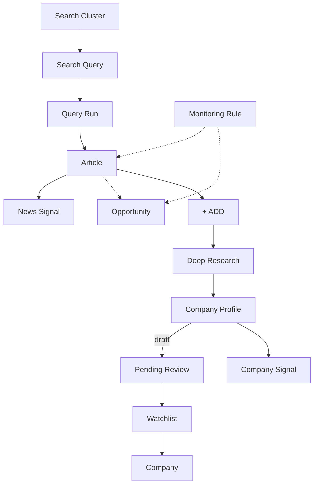

# P1-04 — Required Fields (Analyst App)

| Field | Value |
|-------|-------|
| **Document ref** | P1-04-User |
| **Title** | Required Fields per Object — Analyst App |
| **Version** | 1.2 |
| **Status** | Draft |
| **Last updated** | 2026-06-09 |
| **Audience** | BAT stakeholders, product, analysts |
| **Object reference** | [P1-02-User](./P1-02-user.md) · [P1-01-User](./P1-01-user.md) |
| **Screen mapping** | [P1-05-User](./P1-05-user.md) |

---

## 1. Introduction

This document lists the **data fields** behind each analyst-app object in [P1-02-User](./P1-02-user.md). For every object it records what information is stored, whether it is required, whether analysts can search or filter on it, and where it appears in the UI.

**Status labels** match P1-02: **Available** · **In progress** · **Planned**.

**Per-object table columns**

| Column | Meaning |
|--------|---------|
| Field | Name of the stored attribute |
| Type | Data shape (text, number, date, list, etc.) |
| Required | Must be present for the object to be valid |
| Searchable | Can be used in search or filters in the analyst app |
| UI | Screen or control where the analyst sees it (`—` = not shown) |
| Notes | Status and short context |

**How objects connect** — visual overview in **§9** at the end of this document.

---

## 2. Platform objects

### 2.1 Organization *(planned)*

Single-tenant in the first release — one implicit organization, no separate org screen.

### 2.2 User

| Field | Type | Required | Searchable | UI | Notes |
|-------|------|----------|------------|-----|-------|
| id | identifier | Yes | No | — | **Planned** |
| email | text | Yes | Yes | Settings profile | **Planned** |
| display_name | text | No | Yes | Sidebar | **Planned** |
| role | analyst / lead / admin | Yes | No | — | **Planned** |
| created_at | date-time | Yes | No | — | **Planned** |
| updated_at | date-time | Yes | No | — | **Planned** |

---

## 3. Discovery and feed objects

### 3.1 Search Cluster

**Status:** Planned · Settings → Clusters

| Field | Type | Required | Searchable | UI | Notes |
|-------|------|----------|------------|-----|-------|
| id | identifier | Yes | No | — | |
| name | text | Yes | Yes | Cluster list, Settings | Theme label e.g. "NGP Canada" |
| slug | text | Yes | No | — | Short unique key |
| description | text | No | No | Cluster detail | |
| include_keywords | list of text | Yes | No | Cluster settings | Monitoring scope |
| exclude_keywords | list of text | No | No | Cluster settings | |
| geography | list of text | No | No | Cluster settings | |
| source_preferences | list of text | No | No | Cluster settings | |
| signal_types | list of text | No | No | Cluster settings | FUND, FDA, etc. |
| is_active | yes/no | Yes | Yes | Cluster list | |
| schedule | text | No | No | Cluster settings | Auto-run schedule · **Planned** |
| query_count | number | Yes | No | Cluster list | Count of queries in cluster |
| last_run_at | date-time | No | Yes | Cluster list | |
| created_at | date-time | Yes | No | Cluster metadata | |
| updated_at | date-time | Yes | No | — | |

### 3.2 Search Query

**Status:** Planned

| Field | Type | Required | Searchable | UI | Notes |
|-------|------|----------|------------|-----|-------|
| id | identifier | Yes | No | — | |
| cluster | link to Search Cluster | Yes | No | — | Parent theme |
| name | text | Yes | Yes | Query list | Short label |
| query_text | text | Yes | Yes | Query editor | Search string |
| parameters | settings object | No | No | Query editor | Advanced search options · **Planned** |
| is_active | yes/no | Yes | Yes | Query list | |
| created_at | date-time | Yes | No | Query metadata | |
| updated_at | date-time | Yes | No | — | |

### 3.3 Query Run (analyst)

**Status:** Planned · background job when analyst runs a cluster query

| Field | Type | Required | Searchable | UI | Notes |
|-------|------|----------|------------|-----|-------|
| id | identifier | Yes | No | — | |
| cluster | link to Search Cluster | Yes | No | — | Which theme was run |
| query | link to Search Query | Yes | No | — | Which search string was run |
| status | running / completed / failed | Yes | No | — | |
| started_at | date-time | No | No | — | |
| completed_at | date-time | No | No | — | |
| error_message | text | No | No | — | Shown to ops if run fails |
| created_at | date-time | Yes | No | — | |

### 3.4 Article

**Status:** Planned · News feed, Signals page

| Field | Type | Required | Searchable | UI | Notes |
|-------|------|----------|------------|-----|-------|
| id | identifier | Yes | No | — | |
| url | text | Yes | Yes | Article link | Unique |
| title | text | Yes | Yes | News row headline | |
| summary | text | No | Yes | Expanded article | AI or excerpt |
| body_text | text | No | Yes | Expanded article | |
| source_name | text | No | Yes | News row | Publisher |
| published_at | date-time | No | Yes | News row date | |
| ingested_at | date-time | Yes | No | — | When system added the story |
| cluster | link to Search Cluster | No | No | — | Which theme surfaced it |
| category_tag | text | No | Yes | News row tag | e.g. MED-NIC |
| priority_score | number | No | Yes | News row, Signals sort | 0–100 |
| mentioned_companies | list | No | Yes | Companies in story | Name, domain, excerpt per company |
| status | active / dismissed / archived | Yes | No | — | |
| created_at | date-time | Yes | No | — | |
| updated_at | date-time | Yes | No | — | |

### 3.5 News Signal

**Status:** Planned · stored on the Article or as linked signal rows

| Field | Type | Required | Searchable | UI | Notes |
|-------|------|----------|------------|-----|-------|
| id | identifier | Yes | No | — | |
| article | link to Article | Yes | No | — | Parent story |
| signal_type | FUND / FDA / LEGAL / PARTNER / PRODUCT / … | Yes | Yes | News row, Signals tabs | |
| score | number | No | Yes | News row priority | 0–100 |
| headline | text | No | Yes | Signals table | Short label |
| created_at | date-time | Yes | No | — | |

### 3.6 Opportunity

**Status:** Planned · derived weekly digest on Home → Top (not a separate stored object)

| Field | Type | Required | Searchable | UI | Notes |
|-------|------|----------|------------|-----|-------|
| id | identifier | Yes | No | — | |
| subtype | watchlist / industry | Yes | Yes | Top tab section | |
| company | link to Company | No | Yes | Watchlist opportunity card | Watchlist subtype only |
| article | link to Article | No | Yes | Industry opportunity card | Industry subtype only |
| signal_type | text | No | Yes | Opportunity card | |
| title | text | Yes | Yes | Opportunity heading | |
| bullets | list of text | Yes | No | Opportunity card body | |
| week_start | date | Yes | Yes | Top tab filter | Digest window |
| rule | link to Monitoring Rule | No | No | — | Rule that matched |

---

## 4. Company intelligence objects

### 4.1 Company

**Status:** Available (partial) · shared with operator console

| Field | Analyst UI | Notes |
|-------|------------|-------|
| company_name | Companies list, Pending review, +ADD modal | **Available** |
| domain | Company header | **Available** |
| industry, category | Companies filters | **Available** |
| on_watchlist | Watchlist tab | **Planned** |

### 4.2 Company Profile

**Status:** Available · structured profile behind Overview, Signals, People, Financials tabs

| Field | Analyst UI | Notes |
|-------|------------|-------|
| review_status | Pending review queue | `draft` = awaiting promote/dismiss |
| fit_score | Pending review card, company header | Overall score 0–100 |
| profile_data | All profile tabs | Full company intelligence document |

### 4.3 Company Signal

**Status:** Available · timeline events on the company profile (same data as deep-research signals)

---

## 5. Analyst decision objects

### 5.1 Pending Review Item

**Status:** Available · queue row — not a separate stored object; built from Company + Company Profile in draft state

| Field shown | Required | UI | Notes |
|-------------|----------|-----|-------|
| company_name | Yes | Queue row | |
| domain | No | Queue row | |
| fit_summary | No | Expanded card | Short excerpt from profile |
| fit_score | No | Queue row badge | |
| origin | No | Queue tab filter | bookmark · article +ADD · manual · **Planned:** operator escalate |
| created_at | Yes | Queue sort | When profile entered review |

### 5.2 Watchlist Entry

**Status:** Planned · company promoted from Pending Review to ongoing monitoring

| Field | Type | Required | Searchable | UI | Notes |
|-------|------|----------|------------|-----|-------|
| company | link to Company | Yes | Yes | Watchlist tab | |
| promoted_at | date-time | Yes | Yes | Watchlist metadata | Set when analyst clicks Promote |
| promoted_by | user | No | No | — | **Planned** |
| monitoring_tier | text | No | No | — | Baseline screener label · **Planned** |

### 5.3 Manual Bookmark

**Status:** Available · analyst input from + Add company modal; triggers deep research

| Input field | Type | Required | UI | Notes |
|-------------|------|----------|-----|-------|
| company_name | text | Yes | + Add company modal | |
| website_url | text | No | + Add company modal | |
| notes | text | No | Modal | **Planned** |

---

## 6. Escalation actions

**Status:** Available (partial) · actions, not stored objects — each choice updates Company / Profile state

| Escalation | Input | Effect |
|------------|-------|--------|
| **+ ADD** | Article + company name from story | Starts deep research → Company Profile enters Pending Review |
| **Promote** | Pending Review item | Profile accepted → company joins Watchlist |
| **Dismiss** | Pending Review item | Profile rejected → removed from queue |

---

## 7. Monitoring Rule

**Status:** Planned · Settings → Monitoring rules

| Field | Type | Required | Searchable | UI | Notes |
|-------|------|----------|------------|-----|-------|
| id | identifier | Yes | No | — | |
| name | text | Yes | Yes | Rules settings | |
| is_active | yes/no | Yes | Yes | Rules list | |
| signal_types | list of text | No | No | Rule editor | e.g. FDA, FUND |
| min_score | number | No | No | Rule editor | 0–100 |
| categories | list of text | No | No | Rule editor | |
| target_surface | signals tab / home top / watchlist digest | Yes | No | Rule editor | Where matched items appear |
| signals_tab_key | text | No | No | Rule editor | e.g. regulatory, filings |
| created_at | date-time | Yes | No | — | |
| updated_at | date-time | Yes | No | — | |

---

## 8. AI Analysis — analyst-visible fields

| Parent | Field | Type | UI | Status |
|--------|-------|------|-----|--------|
| Article | summary | text | Expanded article | **Planned** |
| Article | priority_score | integer | News row sort | **Planned** |
| News Signal | signal_type, score | — | Signals tabs | **Planned** |
| Company Profile | profile_data | structured document | Profile tabs | **Available** via deep research |

---

## 9. How objects connect (overview)

Same relationship view as [P1-02-User §11](./P1-02-user.md#11-how-objects-connect-overview), with analyst discovery detail:

| Step | What happens |
|------|----------------|
| Run cluster query | System fetches new Articles into News and Signals |
| Monitoring Rule | Filters which Articles and Opportunities surface on Home |
| + ADD on Article | Deep research builds a Company Profile → Pending Review |
| Promote | Company joins Watchlist for ongoing monitoring |
| Watchlist | New Company Signals append on the profile over time |
