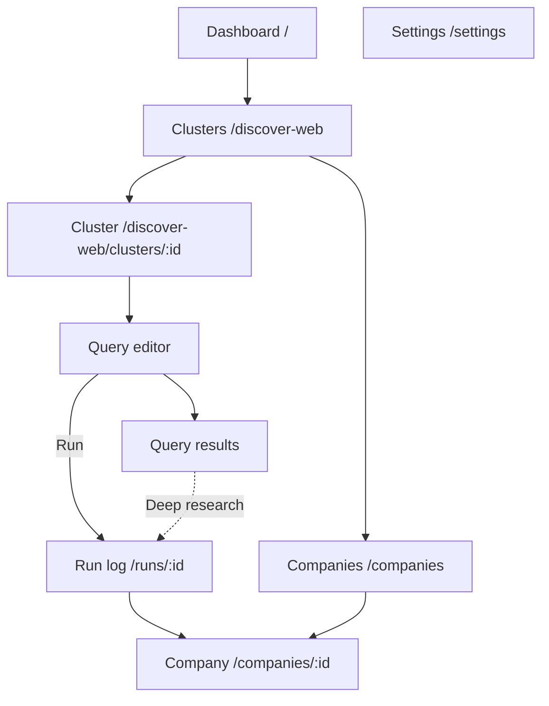

# P1-05 — UI Screen Mapping (Admin Console)

| Field | Value |
|-------|-------|
| **Document ref** | P1-05-Admin |
| **Title** | UI Screen Mapping — Admin Console |
| **Version** | 2.0 |
| **Last updated** | 2026-06-19 |
| **Controlling doc** | [P1-00 Overview](./phase-1-overview.md) |
| **Audience** | Internal developers, operators |
| **Linear** | [GRO-270](https://linear.app/growthmaschine/issue/GRO-270/50-map-existing-ui-screens-to-product-data-objects) · Parent [GRO-265](https://linear.app/growthmaschine/issue/GRO-265) |
| **Workflow reference** | [P1-01-Admin](./P1-01-admin.md) |
| **Object reference** | [P1-02-Admin](./P1-02-admin.md) · [P1-04](./P1-04-admin.md) |
| **Analyst companion** | [P1-05-User](./P1-05-user.md) |
| **Backend actions** | [P1-06](./P1-06.md) |

---

## 1. Introduction

Maps every **operator screen** in the single NORAD app to product objects and actions. Workflow narrative: [P1-01-Admin](./P1-01-admin.md). Field spec: [P1-04](./P1-04-admin.md) Part I.

---

## 2. Screen inventory

| # | Screen | Route | P1-01 |
| --- | -------- | ------- | ------- |
| 1 | Dashboard | `/` | §8 |
| 2 | Cluster list | `/discover-web` | §2 |
| 3 | Cluster detail | `/discover-web/clusters/:clusterId` | §2 |
| 4 | Query editor (new) | `.../clusters/:id/queries/new` | §2 |
| 5 | Query editor (edit) | `.../clusters/:id/queries/:queryId` | §2 |
| 6 | Query results | `.../queries/:queryId/results` | §2 |
| 7 | Deep Research run log | `/runs/:id` | §3.6 |
| 8 | Companies list | `/companies` | §3.3 |
| 9 | Company detail | `/companies/:id` | §3.4–3.5 |
| 10 | Settings | `/settings` | §7 |

---

## 3. Screen → objects → actions

### 3.1 Dashboard (`/`)

| Purpose | Operator landing — quick links and system snapshot |
|---------|-----------------------------------------------------|

| Object |
| -------- |
| Company (count stat) |
| Run (count stat) |

| Control | Action type | Effect |
|---------|-------------|--------|
| Start Discovery CTA | Navigate | → `/discover-web` |
| Stat cards | Read | Counts |

---

### 3.2 Cluster list (`/discover-web`)

| Purpose | List all operator clusters |
|---------|---------------------------|

**Objects:** Cluster

| Control | Action type | Effect | Backend |
|---------|-------------|--------|---------|
| + Create cluster | Navigate | New cluster form | `POST /api/web-discovery/clusters` |
| Cluster row | Navigate | → cluster detail | — |
| Cluster name, slug, last run | Read | List metadata | `web_discovery_clusters` |

**Workflow:** [P1-01-Admin §2.1](./P1-01-admin.md)

---

### 3.3 Cluster detail (`/discover-web/clusters/:clusterId`)

| Purpose | Command center — queries, run all, results entry |
|---------|--------------------------------------------------|

**Objects**

| Object | Area |
|--------|------|
| Cluster | Header, settings |
| Query | Queries list |
| Run | Run history — via results |

| Control | Action type | Effect | Backend |
|---------|-------------|--------|---------|
| + Add query | Navigate | → query editor | — |
| Edit cluster | Configure | Update cluster fields | `PATCH .../clusters/:id` |
| Run All Cluster Queries | Run | Sequential runs for active queries | `POST .../clusters/:id/runs` |
| Run single query | Run | One query execution | `POST .../runs` with `query_id` |
| Open query results | Navigate | → results screen | — |

**Workflow:** [P1-01-Admin §2.2–2.9](./P1-01-admin.md)

---

### 3.4 Query editor (`.../queries/new` · `.../queries/:queryId`)

| Purpose | Create or edit one Exa search definition |
|---------|--------------------------------------------|

**Objects:** Query, Cluster (parent)

| Control | Action type | Effect | Backend |
|---------|-------------|--------|---------|
| Label, search text, search type, num results | Configure | Query fields | `web_discovery_queries` |
| Content modes, filters | Configure | Exa parameters | JSON on query row |
| Save | Configure | Persist query | POST or PATCH |
| Run query | Run | Starts Run | `runs` · `source_kind=web_discovery` |
| View results | Navigate | → results route | — |

---

### 3.5 Query results (`.../queries/:queryId/results`)

| Purpose | Browse enriched Web Discovery results from a completed run |
|---------|-----------------------------------------------------------|

**Objects**

| Object | Storage |
|--------|---------|
| Run | `runs` |
| Search Result | `runs.engine_outputs` JSON |
| Article | `articles` — hydrated onto each result |

| Control | Action type | Effect |
| --------- | ------------- | -------- |
| Run selector | Filter | Historical runs for this query |
| Filter / Sort | Filter | Client-side title / URL / summary |
| Result card — title, URL | Read / Navigate | Headline, domain, date, relevance |
| **Analyzed** badge | Read | Sonnet enrich succeeded |
| **Previously ingested** badge | Read | Duplicate URL — summary from existing article |
| Executive summary | Read | Sonnet paragraph |
| Companies in this story | Read | `mentioned_companies` list |
| **Deep research** (per company) | **Research** | `POST /api/research/runs` → `/runs/:id` |
| Full article | Read | Collapsible `body_text` |
| Source excerpts (Exa) | Read | Fallback when no executive summary |
| Run again / Edit query | Navigate | Returns to query editor |

**Not implemented:** Dismiss result, Save/bookmark on result row. Article dismiss API exists without UI.

**Workflow:** [P1-01-Admin §2.6](./P1-01-admin.md) · [P1-01-User §2](./P1-01-user.md)

---

### 3.6 Deep Research run log (`/runs/:id`)

| Purpose | Live pipeline event stream for one run |
|---------|--------------------------------------|

**Objects:** Deep Research Run, Run Event, Engine Call, Company, Company Card (on complete)

| Control | Action type | Effect |
|---------|-------------|--------|
| Stage timeline | Read | `run_events` stream |
| Engine call rows | Read | Vendor, latency, cost |
| Cancel run | Configure | Stops at next checkpoint |
| Link to company | Navigate | → `/companies/:id` when complete |

**Workflow:** [P1-01-Admin §3.6](./P1-01-admin.md)

---

### 3.7 Companies list (`/companies`)

| Purpose | Researched companies (Profiles tab) + Web Discovery mentions (Discovered tab) |
|---------|-------------------------------------------------------------------------------|

**Objects:** Company, Company Card (Profiles); Company mention row (Discovered)

| Control | Action type | Effect |
|---------|-------------|--------|
| **Profiles** tab | Navigate | Research feed — live runs + completed cards (`GET /api/research/feed`) |
| **Discovered** tab | Navigate | Mention rows from articles (`GET /api/research/discovered`) |
| Table row | Navigate | → company detail when profiled |
| **Deep research** (Discovered) | Run | `POST /api/research/runs` with `company_id` |
| Search / filter | Filter | List subset (Discovered: cluster, has_profile) |
| Review status pill | Read | draft / accepted / rejected |

Shared with analyst journey — same `companies` + `cards` tables on `/companies`.

---

### 3.8 Company detail (`/companies/:id`)

| Purpose | Full Company Card + signals + sources |
|---------|--------------------------------------|

**Objects:** Company, Company Card, Research Signal, Source

| Control | Action type | Effect |
|---------|-------------|--------|
| Profile tabs | Navigate | Overview, signals, evidence |
| Review status | Read | Pending review state |
| Promote / accept (if exposed) | Escalate | `review_status` → accepted — analyst-primary |
| Re-run research | Run | New Deep Research Run — if exposed |

**Workflow:** [P1-01-Admin §3.3–3.5](./P1-01-admin.md)

---

### 3.9 Settings (`/settings`)

| Purpose | Engine config + system health |
|---------|------------------------------|

**Objects:** Research Config (`app_kv`), Engine Call (health indirect)

| Control | Action type | Effect | Backend |
|---------|-------------|--------|---------|
| Postgres / Redis status | Read | Health check — Redis optional | `GET /health/db` |
| Parallel processor / timeout | Configure | Research tuning | `app_kv.research_config` |
| Exa search type / results | Configure | Research tuning | same |
| Diffbot toggle / threshold | Configure | Research tuning | same |
| Save changes | Configure | Persist | `PUT /api/settings/research` |

**Workflow:** [P1-01-Admin §7](./P1-01-admin.md)

---

## 4. User actions (operator)

| Action | Screen | Input | Effect |
| -------- | -------- | ------- | -------- |
| Run query / Run all | Cluster detail | Query | Run |
| Deep research | Query results | Company from article | Deep Research Run |
| Cancel run | Run log | Deep Research Run | Run stopped |

---

## 5. Object → screen index

| Object | Screens |
|--------|---------|
| Cluster | Cluster list, cluster detail |
| Query | Cluster detail, query editor |
| Run | Query results, run log |
| Search Result | Query results (JSON + hydration) |
| Article | Query results card content |
| Deep Research Run | Run log, company detail (provenance) |
| Company | Companies, company detail |
| Company Card | Company detail |
| Research Signal | Company detail |
| Source | Company detail, evidence panels |
| Run Event | Run log |
| Engine Call | Run log, settings health |
| Research Config | Settings |
| Deep research trigger | Query results |

---

## 6. Navigation map

---

## 7. Completion checklist

| Item |
|------|
| Every admin screen listed |
| Objects per screen |
| Actions with backend where known |
| Cross-ref P1-01-Admin |

---

## 8. Approval

| Role | Name | Date |
| ------ | ------ | ------ |
| Author | Huzaifa | 2026-06-19 |
| Reviewer | Shehrayar Haq | — |
