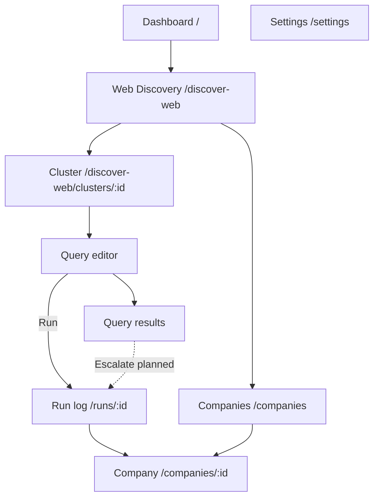

# P1-05 — UI Screen Mapping (Admin Console)

| Field | Value |
|-------|-------|
| **Document ref** | P1-05-Admin |
| **Title** | UI Screen Mapping — Admin Console |
| **Version** | 1.0 |
| **Status** | Draft |
| **Last updated** | 2026-06-09 |
| **Audience** | Internal developers, operators |
| **Linear** | [GRO-270](https://linear.app/growthmaschine/issue/GRO-270/50-map-existing-ui-screens-to-product-data-objects) · Parent [GRO-265](https://linear.app/growthmaschine/issue/GRO-265) |
| **Workflow reference** | [P1-01-Admin](./P1-01-admin.md) |
| **Object reference** | [P1-02-Admin](./P1-02-admin.md) · [P1-04-Admin](./P1-04-admin.md) |
| **Analyst companion** | [P1-05-User](./P1-05-user.md) |

---

## 1. Introduction

Maps every **operator console screen** to product objects and actions. Workflow narrative: [P1-01-Admin](./P1-01-admin.md). Field spec: [P1-04-Admin](./P1-04-admin.md). Schema diagrams: [P1-04-Admin §9](./P1-04-admin.md#9-database-schema-diagrams).

**Dropped from target:** Today (`/discover`), Discovery Clusters (`/discovery-clusters`). Web Discovery is the operator discovery path.

---

## 2. Screen inventory

| # | Screen | Route | Status | P1-01 |
|---|--------|-------|--------|-------|
| 1 | Dashboard | `/` | Available (placeholder) | §8 |
| 2 | Web Discovery list | `/discover-web` | Available | §2 |
| 3 | Web Discovery cluster | `/discover-web/clusters/:clusterId` | Available | §2 |
| 4 | Query editor (new) | `.../clusters/:id/queries/new` | Available | §2 |
| 5 | Query editor (edit) | `.../clusters/:id/queries/:queryId` | Available | §2 |
| 6 | Query results | `.../queries/:queryId/results` | Available | §2 |
| 7 | Deep Research run log | `/runs/:id` | Available | §3.6 |
| 8 | Companies list | `/companies` | Available | §3.3 |
| 9 | Company detail | `/companies/:id` | Available | §3.4–3.5 |
| 10 | Settings | `/settings` | Available | §7 |
| — | Today (legacy) | `/discover` | **Dropped** | — |
| — | Discovery Clusters (legacy) | `/discovery-clusters` | **Dropped** | — |

---

## 3. Screen → objects → actions

### 3.1 Dashboard (`/`)

| Purpose | Operator landing — quick links and system snapshot |
|---------|-----------------------------------------------------|
| **Status** | Available — static entry; not primary workflow |

| Object | Status |
|--------|--------|
| Company (count stat) | Available |
| Web Discovery Query Run (count stat) | Available |

| Control | Action type | Effect |
|---------|-------------|--------|
| Start Discovery CTA | Navigate | → `/discover` legacy or Web Discovery — verify target |
| Stat cards | Read | Counts |

---

### 3.2 Web Discovery list (`/discover-web`)

| Purpose | List all operator Web Discovery clusters |
|---------|------------------------------------------|
| **Status** | Available |

**Objects:** Web Discovery Cluster

| Control | Action type | Effect | Backend |
|---------|-------------|--------|---------|
| + Create cluster | Navigate | New cluster form | `POST /api/web-discovery/clusters` |
| Cluster row | Navigate | → cluster detail | — |
| Cluster name, slug, last run | Read | List metadata | `web_discovery_clusters` |

**Workflow:** [P1-01-Admin §2.1](./P1-01-admin.md)

---

### 3.3 Web Discovery cluster (`/discover-web/clusters/:clusterId`)

| Purpose | Command center — queries, run all, results entry |
|---------|--------------------------------------------------|
| **Status** | Available |

**Objects**

| Object | Area |
|--------|------|
| Web Discovery Cluster | Header, settings |
| Web Discovery Query | Queries list |
| Web Discovery Query Run | Run history — via results |

| Control | Action type | Effect | Backend |
|---------|-------------|--------|---------|
| + Add query | Navigate | → query editor | — |
| Edit cluster | Configure | Update cluster fields | `PATCH .../clusters/:id` |
| Run All Cluster Queries | Run | Sequential runs for active queries | `POST .../clusters/:id/runs` |
| Run single query | Run | One query execution | `POST .../runs` with `query_id` |
| Open query results | Navigate | → results screen | — |

**Workflow:** [P1-01-Admin §2.2–2.9](./P1-01-admin.md)

---

### 3.4 Query editor (`.../queries/new` · `.../queries/:queryId`)

| Purpose | Create or edit one Exa search definition |
|---------|--------------------------------------------|
| **Status** | Available |

**Objects:** Web Discovery Query, Web Discovery Cluster (parent)

| Control | Action type | Effect | Backend |
|---------|-------------|--------|---------|
| Label, search text, search type, num results | Configure | Query fields | `web_discovery_queries` |
| Content modes, filters | Configure | Exa parameters | JSON on query row |
| Save | Configure | Persist query | POST or PATCH |
| Run query | Run | Starts Web Discovery Query Run | `runs` · `source_kind=web_discovery` |
| View results | Navigate | → results route | — |

---

### 3.5 Query results (`.../queries/:queryId/results`)

| Purpose | Browse Search Results from a completed run |
|---------|---------------------------------------------|
| **Status** | Available |

**Objects**

| Object | Storage |
|--------|---------|
| Web Discovery Query Run | `runs` |
| Search Result | `runs.engine_outputs` JSON (not a table row) |

| Control | Action type | Effect | Status |
|---------|-------------|--------|--------|
| Result row expand | Read | Title, URL, Exa summary | Available |
| OPEN URL | Navigate | External link | Available |
| **Escalate to research** | **Escalate** | Spawns Deep Research Run | **Not implemented** (target) |
| Dismiss result | Dismiss | Hide from view | **Not implemented** |
| Save / bookmark | — | — | **Not implemented** |

**Workflow:** [P1-01-Admin §2.8](./P1-01-admin.md) · [P1-01-Admin §5](./P1-01-admin.md)

---

### 3.6 Deep Research run log (`/runs/:id`)

| Purpose | Live pipeline event stream for one run |
|---------|--------------------------------------|
| **Status** | Available |

**Objects:** Deep Research Run, Run Event, Engine Call, Company, Company Card (on complete)

| Control | Action type | Effect |
|---------|-------------|--------|
| Stage timeline | Read | `run_events` stream |
| Engine call rows | Read | Vendor, latency, cost |
| Cancel run | Configure | Stops at next checkpoint |
| Link to company | Navigate | → `/companies/:id` when complete |

**Workflow:** [P1-01-Admin §3.6](./P1-01-admin.md)

---

### 3.7 Companies list (`/companies`)

| Purpose | All researched companies — operator view |
|---------|------------------------------------------|
| **Status** | Available |

**Objects:** Company, Company Card (summary columns)

| Control | Action type | Effect |
|---------|-------------|--------|
| Table row | Navigate | → company detail |
| Search / filter | Filter | List subset |
| Review status pill | Read | draft / accepted / rejected |

Shared with analyst app — same `companies` + `cards` tables.

---

### 3.8 Company detail (`/companies/:id`)

| Purpose | Full Company Card + signals + sources |
|---------|--------------------------------------|
| **Status** | Available |

**Objects:** Company, Company Card, Research Signal, Source

| Control | Action type | Effect |
|---------|-------------|--------|
| Profile tabs | Navigate | Overview, signals, evidence |
| Review status | Read | Pending review state |
| Promote / accept (if exposed) | Escalate | `review_status` → accepted — analyst-primary |
| Re-run research | Run | New Deep Research Run — if exposed |

**Workflow:** [P1-01-Admin §3.3–3.5](./P1-01-admin.md)

---

### 3.9 Settings (`/settings`)

| Purpose | Engine config + system health |
|---------|------------------------------|
| **Status** | Available |

**Objects:** Research Config (`app_kv`), Engine Call (health indirect)

| Control | Action type | Effect | Backend |
|---------|-------------|--------|---------|
| Postgres / Redis status | Read | Health check | `GET /health/db` |
| Parallel processor / timeout | Configure | Research tuning | `app_kv.research_config` |
| Exa search type / results | Configure | Research tuning | same |
| Diffbot toggle / threshold | Configure | Research tuning | same |
| Save changes | Configure | Persist | `PUT /api/settings/research` |

**Workflow:** [P1-01-Admin §7](./P1-01-admin.md)

---

## 4. Escalation actions (operator)

| Action | Screen | Input | Effect | Status |
|--------|--------|-------|--------|--------|
| Run query / Run all | Web Discovery cluster | Web Discovery Query | Web Discovery Query Run | Available |
| Escalate search result | Query results | Search Result | Deep Research Run | **Not implemented** |
| Cancel run | Run log | Deep Research Run | Run stopped | Available |
| + ADD company (analyst) | — | — | Operator does not use analyst escalations | N/A |

---

## 5. Object → screen index

| Object | Screens |
|--------|---------|
| Web Discovery Cluster | Web Discovery list, cluster detail |
| Web Discovery Query | Cluster detail, query editor |
| Web Discovery Query Run | Query results, run log |
| Search Result | Query results (JSON) |
| Deep Research Run | Run log, company detail (provenance) |
| Company | Companies, company detail |
| Company Card | Company detail |
| Research Signal | Company detail |
| Source | Company detail, evidence panels |
| Run Event | Run log |
| Engine Call | Run log, settings health |
| Research Config | Settings |
| Web Result Escalation | Query results — Not implemented |

---

## 6. Navigation map

---

## 7. Repo vs target gaps

| Gap | Screen | Notes |
|-----|--------|-------|
| Escalate on Search Result | Query results | Target: spawn `runs` research with provenance URL |
| No user save/dismiss on results | Query results | §5 P1-01-Admin — automatic pipeline only |
| Dashboard CTA → `/discover` | Dashboard | Legacy Today link — should point to Web Discovery |
| Today / Discovery Clusters routes | Legacy | Remove from nav when code deleted |
| Analyst vs operator Settings | Settings | Same route today — split by role in target |

---

## 8. Completion checklist

| Item | Status |
|------|--------|
| Every target admin screen listed | Done |
| Exists / Dropped status per screen | Done |
| Objects per screen | Done |
| Actions with backend where known | Done |
| Escalate gaps flagged | Done |
| Cross-ref P1-01-Admin | Done |

---

## 9. Approval

| Role | Name | Date | Status |
|------|------|------|--------|
| Author | Huzaifa | 2026-06-09 | Draft |
| Reviewer | Shehrayar Haq | — | Pending |
