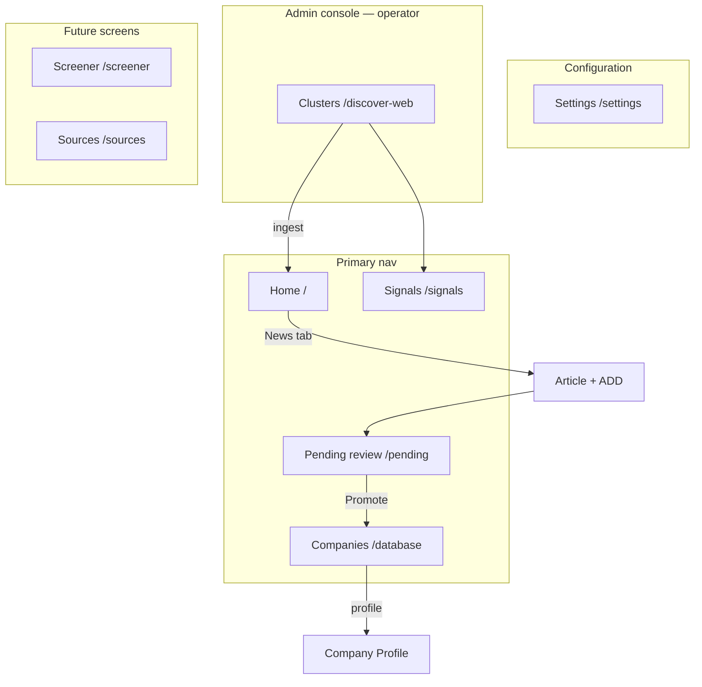

# P1-05 — UI Screen Mapping (Analyst App)

| Field | Value |
|-------|-------|
| **Document ref** | P1-05-User |
| **Title** | UI Screen Mapping — Analyst App |
| **Version** | 1.0 |
| **Last updated** | 2026-06-09 |
| **Audience** | BAT stakeholders, product, analysts |
| **Workflow reference** | [P1-01-User](./P1-01-user.md) |
| **Object reference** | [P1-02-User](./P1-02-user.md) · [P1-04](./P1-04-admin.md) Part III |
| **Backend actions** | [P1-06](./P1-06.md) Part II |

---

## 1. Introduction

This document maps **every analyst screen** in NORAD AI to the **product objects** it displays and the **actions** each control performs. Use it to confirm that every button has a defined purpose before backend work proceeds.

Workflow detail (what the analyst experiences step by step) lives in [P1-01-User](./P1-01-user.md). This doc is the **screen inventory** — route, objects, and actions in one place.

---

## 2. How to read this document

### 2.1 Routes

Each screen lists its analyst-app route.

### 2.2 Action types

Same as P1-01: `Read` · `Navigate` · `Filter` · `Escalate` · `Dismiss` · `Configure` · `—` (display only)

### 2.3 Object names

Objects use [P1-02-User](./P1-02-user.md) vocabulary (Article, Pending Review Item, etc.). Cluster configuration is admin-only — see [P1-05-Admin](./P1-05-admin.md).

---

## 3. Screen inventory

| # | Screen | Route | P1-01 |
| --- | -------- | -------------- | ------- |
| 1 | Home | `/` | §2 |
| 2 | Home — Top tab | `/` (tab) | §2.2–2.4 |
| 3 | Home — News tab | `/` or `/news` | §2.5–2.9 |
| 4 | News (standalone) | `/news` | §2.5 |
| 5 | Signals | `/signals` | §3 |
| 6 | Companies list | `/database` | §5.1–5.2 |
| 7 | Company profile | `/database/:id` | §5.4–5.8 |
| 8 | Pending review | `/pending` | §4 |
| 9 | Screener | `/screener` | §4.4 (post-Promote) |
| 10 | Sources | `/sources` | — |
| 11 | Settings | `/settings` | Profile preferences |

---

## 4. Screen → objects → actions

### 4.1 Home (`/`)

| Attribute | Value |
|-----------|-------|
| **Purpose** | Analyst landing page — weekly digest (Top) and daily news scan (News) |
| **Sidebar label** | Home |

**Objects displayed**

| Object | Where on screen |
| -------- | ----------------- |
| Opportunity (Watchlist) | Top tab — first section |
| Opportunity (Industry) | Top tab — second section |
| Article | News tab — Hot News rows |
| News Signal | News tab — tags and scores on each row |
| Monitoring Rule | Top tab — filters what surfaces (implicit) |

**Actions**

| Control | Action type | Effect |
| --------- | ------------- | -------- |
| Sidebar → Home | Navigate | Opens Home |
| Top tab | Navigate | Shows weekly opportunity sections |
| News tab | Navigate | Shows Hot News table |
| Opportunity card | Read | Shows weekly highlight |
| News row | Read | Headline, summary, tags, score |
| Row chevron | Navigate | Expands article (see §4.3) |
| Full feed → | Navigate | Extended news list |

**Workflow:** [P1-01-User §2](./P1-01-user.md#2-workflow--home-page)

---

### 4.2 Home — Top tab (`/` · Top)

| Attribute | Value |
|-----------|-------|
| **Purpose** | Weekly briefing — Watchlist activity + industry-wide opportunities |

**Objects displayed**

| Object | Section |
| -------- | --------- |
| Opportunity (Watchlist subtype) | Opportunities this week — Watchlist |
| Opportunity (Industry subtype) | Opportunities this week — Industry |
| Watchlist Entry | Source companies for Watchlist section |
| Company Signal | Bullets on opportunity cards |
| Monitoring Rule | Decides which signals appear |

**Actions**

| Control | Action type | Effect |
|---------|-------------|--------|
| Top tab | Navigate | Switches from News to Top view |
| Watchlist opportunity card | Read | Company name, tags, weekly bullets |
| Industry opportunity card | Read | Sector headline, tags, bullets |

**Workflow:** [P1-01-User §2.2–2.4](./P1-01-user.md#22-top-tab--opportunities-this-week--watchlist)

---

### 4.3 Home — News tab (`/` · News)

| Attribute | Value |
|-----------|-------|
| **Purpose** | Browse ingested articles; expand and **+ ADD** companies for deep research |

**Objects displayed**

| Object | Where |
| -------- | ------- |
| Article | Hot News table rows |
| News Signal | Category tag, signal tag, score column |
| Company (mentioned) | Expanded article — Companies in story |
| Cluster | Provenance (implicit — which cluster ingested) |

**Actions**

| Control | Action type | Effect | Objects touched |
|---------|-------------|--------|-----------------|
| News tab | Navigate | Opens Hot News table | Article |
| News row chevron | Navigate | Expands article detail | Article |
| Executive summary block | Read | AI summary | Article |
| Signal score bars | Read | Priority breakdown | News Signal |
| OPEN | Navigate | Opens source URL in browser | Article |
| Related coverage VIEW | Navigate | Linked articles | Article |
| Company chevron | Navigate | Expands company blurb | Company |
| **+ ADD** | **Escalate** | Starts deep research → Pending Review | Company, Company Profile, Manual Bookmark path via Article |

**Workflow:** [P1-01-User §2.5–2.9](./P1-01-user.md#25-news-tab--browse-hot-news)

---

### 4.4 News — standalone (`/news`)

| Attribute | Value |
|-----------|-------|
| **Purpose** | Optional dedicated full news feed (same data as Home → News) |

**Objects and actions:** Same as §4.3. Split route only if navigation IA requires a top-level News item.

---

### 4.5 Signals (`/signals`)

| Attribute | Value |
|-----------|-------|
| **Purpose** | Categorized view of all ingested news — filter by signal type |
| **Sidebar label** | Signals |

**Objects displayed**

| Object | Where |
| -------- | ------- |
| Article | News feed table |
| News Signal | Category, signal, score columns |
| Monitoring Rule | Assigns stories to filter tabs |
| Watchlist Entry | Priority watch sidebar |
| Company Signal | Sidebar bullets for watchlist companies |

**Actions**

| Control | Action type | Effect |
|---------|-------------|--------|
| All / Companies / Industry / Regulatory / Filings / Hiring / Funding tabs | Filter | Shows subset of feed per rule |
| Tab count badge | Read | Stories matching tab rules |
| News feed table row | Read | Headline, category, signal, score, date |
| Top signal card | Read | Highest-priority signal this period |
| Priority watch company card | Read | Watchlist company + active signals |

**Note:** **+ ADD** is intentionally on Home News, not Signals — Signals is for triage by type.

**Workflow:** [P1-01-User §3](./P1-01-user.md#3-workflow--signals-page)

---

### 4.6 Cluster configuration (admin only)

Clusters, queries, and scheduled ingest are **not** analyst screens. Operators configure them in the admin console — [P1-05-Admin §3.2–3.5](./P1-05-admin.md). Analysts consume the resulting **Articles** on Home → News and Signals.

---

### 4.7 Companies list (`/database`)

| Attribute | Value |
|-----------|-------|
| **Purpose** | Browse all saved company profiles; open detail; manually queue new companies |
| **Route** | `/database` |
| **Sidebar label** | Companies |

**Objects displayed**

| Object | Tab |
| -------- | ----- |
| Company | Both tabs |
| Company Profile (summary) | Row columns |
| Watchlist Entry | Watchlist tab only |

**Actions**

| Control | Action type | Effect |
|---------|-------------|--------|
| Watchlist tab | Filter | Promoted companies only |
| Companies tab | Filter | All saved profiles |
| Search companies… | Filter | Text filter on table |
| Table row click | Navigate | Opens company profile (§4.11) |
| + Add company | Navigate | Opens bookmark modal |
| Row actions (⋯) | — | Row menu — row menu |

**Workflow:** [P1-01-User §5.1–5.3](./P1-01-user.md#5-workflow--companies-page)

---

### 4.8 Company profile (`/database/:id`)

| Attribute | Value |
|-----------|-------|
| **Purpose** | Full deep-research card + ongoing watchlist updates |

**Objects displayed**

| Object | Tab |
| -------- | ----- |
| Company | Header |
| Company Profile | Overview, Signals, People, Financials, Timeline, Analysis |
| Company Signal | Overview timeline, Signals tab |
| Source | Evidence behind profile fields |

**Actions**

| Control | Action type | Effect |
|---------|-------------|--------|
| Overview / Signals / People / Financials / Timeline / Analysis / Outreach tabs | Navigate | Switches profile section |
| Breadcrumb Companies › name | Navigate | Back to list |
| View More (description) | Read | Expands narrative |
| Signal feed row | Read | One Company Signal |
| People filters (Champions, etc.) | Filter | People tab subset |

**Watchlist-only behaviour:** new signals auto-append daily without manual refresh.

**Workflow:** [P1-01-User §5.4–5.8](./P1-01-user.md#54-company-detailed-profile--header-and-tabs)

---

### 4.9 Pending review (`/pending`)

| Attribute | Value |
|-----------|-------|
| **Purpose** | Approve or reject companies after deep research |
| **Sidebar** | Pending review (badge count) |

**Objects displayed**

| Object |
| -------- |
| Pending Review Item |
| Company |
| Company Profile (summary) |
| Escalation (origin metadata) |

**Actions**

| Control | Action type | Effect |
|---------|-------------|--------|
| All / Bookmarked / Manual tabs | Filter | Filter by how company arrived |
| Table row | Read | Origin, name, URL, context, time |
| Row chevron | Navigate | Expands detail card |
| Read deep research summary | Read | Profile output when complete |
| **Promote to Watchlist** | **Escalate** | Accept → Watchlist Entry created |
| **Dismiss** | **Dismiss** | Reject → removed from queue |

**Workflow:** [P1-01-User §4](./P1-01-user.md#4-workflow--pending-review)

---

### 4.10 Screener (`/screener`)

| Attribute | Value |
|-----------|-------|
| **Purpose** | Post-Promote baseline fit scoring — lighter pass after Watchlist accept |

**Objects (expected)**

| Object | Role |
|--------|------|
| Company | Subject |
| Company Profile | Receives fit score and tier |
| Watchlist Entry | Triggered after Promote |

**Actions (expected)**

| Control | Action type | Effect |
|---------|-------------|--------|
| — | — | May run automatically with no screen — confirm in design |

**Open question:** Run headless after Promote, or expose `/screener` queue for analysts?

---

### 4.11 Sources (`/sources`)

| Attribute | Value |
|-----------|-------|
| **Purpose** | Browse citations and evidence across profiles  |

**Objects (candidate)**

| Object | Role |
|--------|------|
| Source | Citation rows |
| Company Profile | Parent context |
| Article | News provenance |

**Actions:** Not defined — needs product design.

---

### 4.12 Settings (`/settings`)

| Attribute | Value |
|-----------|-------|
| **Purpose** | Analyst preferences and monitoring rules |
| **Entry** | Sidebar footer or profile menu |

**Objects displayed**

| Object | Area |
| -------- | ------ |
| User | Profile |
| Monitoring Rule | Rules section |

**Actions**

| Control | Action type | Effect |
|---------|-------------|--------|
| Edit monitoring rules | Configure | Updates Monitoring Rule |
| Profile / display name | Configure | Updates User |

---

## 5. Escalation actions (cross-screen)

Analyst choices that move a company to the next stage — no separate stored object.

| Action | Screen | Input | Result objects |
|--------|--------|-------|----------------|
| **+ ADD** | Home → News (expanded article) | Article + company name | Company Profile (draft) → Pending Review Item |
| **Find & queue** | Companies → + Add company modal | Manual Bookmark | Pending Review Item → deep research |
| **Promote** | Pending review | Pending Review Item | Watchlist Entry, Company on watchlist |
| **Dismiss** | Pending review | Pending Review Item | Removed from queue |

Detail: [P1-01-User §4](./P1-01-user.md#4-workflow--pending-review) · [P1-02-User §Escalation](./P1-02-user.md)

---

## 6. Navigation map

---

## 7. Object → screen index

Reverse lookup: where each object appears.

| Object | Primary screens |
|--------|-----------------|
| Cluster | Admin console only — feeds Home News via ingest |
| Article | Home News, Signals, expanded article |
| News Signal | Home News, Signals |
| Opportunity | Home Top |
| Monitoring Rule | Settings|
| Company | Companies, Pending review, article expand |
| Company Profile | Company profile, Pending review expand |
| Company Signal | Company profile, Signals sidebar |
| Pending Review Item | Pending review |
| Watchlist Entry | Companies Watchlist tab, Home Top, Signals sidebar |
| Manual Bookmark | + Add company modal |
| User | Settings|

---

## 9. Related documents

| Need | Document |
|------|----------|
| Step-by-step analyst flows | [P1-01-User](./P1-01-user.md) |
| What objects are | [P1-02-User](./P1-02-user.md) |
| Field-level spec | [P1-04](./P1-04-admin.md) Part III |
| Backend actions | [P1-06](./P1-06.md) Part II |
| Operator screens | [P1-05-Admin](./P1-05-admin.md) |
