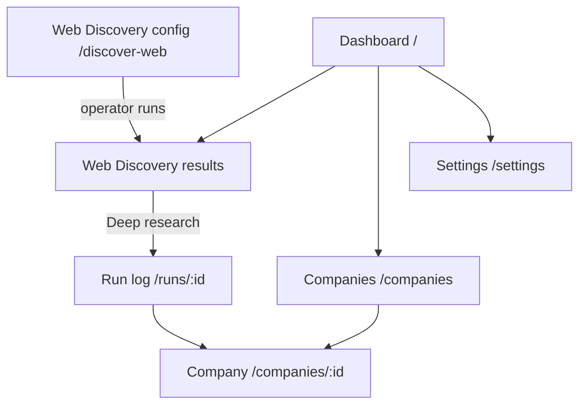

# P1-05 — UI Screen Mapping (Analyst)

| Field | Value |
|-------|-------|
| **Document ref** | P1-05-User |
| **Title** | UI Screen Mapping — Analyst perspective |
| **Version** | 2.0 |
| **Last updated** | 2026-06-19 |
| **Audience** | Stakeholders, product, analysts |
| **Controlling doc** | [P1-00 Overview](./phase-1-overview.md) |
| **Workflow reference** | [P1-01-User](./P1-01-user.md) |
| **Object reference** | [P1-02-User](./P1-02-user.md) · [P1-04](./P1-04-admin.md) §10 |
| **Operator screens** | [P1-05-Admin](./P1-05-admin.md) |
| **Backend actions** | [P1-06](./P1-06.md) |

---

## 1. Introduction

Maps **analyst-facing screens** in the single NORAD app to product objects and control actions. There is no separate analyst frontend — analysts use the same routes as operators for reading intelligence.

Workflow detail: [P1-01-User](./P1-01-user.md). Operator configure/run screens: [P1-05-Admin](./P1-05-admin.md).

### 1.1 Action types

`Read` · `Navigate` · `Filter` · `Research` · `Configure` · `—` (display only)

---

## 2. Screen inventory (built today)

| # | Screen | Route | P1-01 |
| --- | -------- | -------------- | ------- |
| 1 | Dashboard | `/` | §5 |
| 2 | Web Discovery results | `/discover-web/clusters/:clusterId/queries/:queryId/results` | §2 |
| 3 | Deep Research run log | `/runs/:id` | §3 |
| 4 | Companies feed | `/companies` | §4.1 |
| 5 | Company profile | `/companies/:id` | §4.2–4.4 |
| 6 | Settings | `/settings` | §6 |

### 2.1 Sidebar — Phase 2 (not wired)

| Label | Route | Status |
|-------|-------|--------|
| Signals | `/signals` | Nav **Soon** — no route |
| Feeds | `/feeds` | Nav **Soon** — no route |

Legacy drafts also described Home/News, Pending review, Watchlist — **not in this repo**. See [P1-01-User §7](./P1-01-user.md).

---

## 3. Screen → objects → actions

### 3.1 Dashboard (`/`)

| Attribute | Value |
|-----------|-------|
| **Purpose** | Landing — system health snapshot and navigation |
| **Sidebar label** | Dashboard |

**Objects:** Company (count stat), Run (count stat) — when exposed

| Control | Action type | Effect |
|---------|-------------|--------|
| Start Discovery CTA | Navigate | → `/discover-web` |
| Stat cards | Read | Counts |
| System status tile | Read | Postgres / optional Redis from `GET /health/db` |

**Workflow:** [P1-01-User §5](./P1-01-user.md)

---

### 3.2 Web Discovery results (`.../queries/:queryId/results`)

| Attribute | Value |
|-----------|-------|
| **Purpose** | Read Sonnet-enriched articles; start Deep research on companies |
| **Reached from** | After Run Query, or View results on cluster hub |

**Objects**

| Object | Where |
|--------|-------|
| Run | Sidebar run snapshot, run selector |
| Web Discovery result card | Each URL row |
| Article | Executive summary, companies, full body (hydrated) |
| Company (mentioned) | Companies in this story |

| Control | Action type | Effect |
|---------|-------------|--------|
| Run selector | Filter | Historical results |
| Filter / Sort | Filter | Client-side search |
| Executive summary | Read | Sonnet paragraph |
| Companies in this story | Read | Entity list with context |
| **Deep research** | **Research** | `POST /api/research/runs` → `/runs/:id` |
| Full article | Read | Collapsible formatted body |
| Source excerpts (Exa) | Read | Only when no executive summary |
| Run again / Edit query | Navigate | Operator paths |

**Workflow:** [P1-01-User §2](./P1-01-user.md) · [P1-05-Admin §3.5](./P1-05-admin.md)

---

### 3.3 Deep Research run log (`/runs/:id`)

| Attribute | Value |
|-----------|-------|
| **Purpose** | Live Activity feed while profiling runs |

**Objects:** Deep Research Run, Run Event, Engine Call, Company, Company Profile (on complete)

| Control | Action type | Effect |
|---------|-------------|--------|
| Activity timeline | Read | SSE `GET /api/events/runs/:id` |
| Cancel run | Cancel | `POST /api/research/runs/:id/cancel` |
| Link to company | Navigate | → `/companies/:id` when complete |

**Workflow:** [P1-01-User §3](./P1-01-user.md)

---

### 3.4 Companies feed (`/companies`)

| Attribute | Value |
|-----------|-------|
| **Purpose** | Browse researched companies; open profiles |
| **Sidebar label** | Companies |

**Objects:** Company, Company Profile (summary columns), Deep Research Run (in-flight **Profiling…** pill)

| Control | Action type | Effect |
|---------|-------------|--------|
| Table row | Navigate | → `/companies/:id` |
| Search / filter | Filter | List subset |
| Status pill | Read | Run state / review_status |
| Add company (if exposed) | Research | Manual Deep research |

**Workflow:** [P1-01-User §4.1](./P1-01-user.md)

---

### 3.5 Company profile (`/companies/:id`)

| Attribute | Value |
|-----------|-------|
| **Purpose** | Full Company Profile — scores, signals, evidence |

**Objects:** Company, Company Profile, Company Signal, Source, Engine Call (evidence)

| Control | Action type | Effect |
|---------|-------------|--------|
| Overview / Signals / People / Financials tabs | Navigate | Profile sections |
| Research Evidence | Read | Engine calls + sources |
| Run history | Read | Past Deep Research runs |
| Breadcrumb | Navigate | Back to `/companies` |

**Workflow:** [P1-01-User §4.2–4.4](./P1-01-user.md)

---

### 3.6 Settings (`/settings`)

| Attribute | Value |
|-----------|-------|
| **Purpose** | Research engine tuning + system health |
| **Note** | Primarily operator workflow — same route for all users |

**Objects:** Research Config, health probes

| Control | Action type | Effect |
|---------|-------------|--------|
| Parallel / Exa / Diffbot settings | Configure | `PUT /api/settings/research` |
| Postgres / Redis status | Read | `GET /health/db` |
| Save changes | Configure | Persist `app_kv.research_config` |

**Workflow:** [P1-01-User §6](./P1-01-user.md)

---

## 4. User actions (cross-screen)

| Action | Screen | Input | Result |
|--------|--------|-------|--------|
| **Deep research** | Query results | Company from `mentioned_companies` | Deep Research Run → Company Profile |
| **Deep research** | Companies (add) | Company name / domain | Same pipeline |
| **Cancel run** | Run log | In-flight run | Run cancelled |

**Phase 2 (not built):** + ADD from News, Promote, Dismiss, Watchlist monitoring.

---

## 5. Navigation map (built today)

---

## 6. Object → screen index

| Object | Primary screens |
|--------|-----------------|
| Article | Web Discovery results |
| Web Discovery result card | Web Discovery results |
| Company | Results (mentioned), Companies feed, profile |
| Company Profile | Company profile |
| Company Signal | Company profile |
| Deep Research Run | Run log, Companies feed status |
| Research Config | Settings |

---

## 7. Related documents

| Need | Document |
|------|----------|
| Step-by-step analyst flows | [P1-01-User](./P1-01-user.md) |
| What objects are | [P1-02-User](./P1-02-user.md) |
| Field-level spec | [P1-04](./P1-04-admin.md) |
| Backend actions | [P1-06](./P1-06.md) |
| Operator screens | [P1-05-Admin](./P1-05-admin.md) |

---

## 8. Approval

| Role | Name | Date |
| ------ | ------ | ------ |
| Author | Huzaifa | 2026-06-19 |
| Reviewer | Shehrayar Haq | — |
