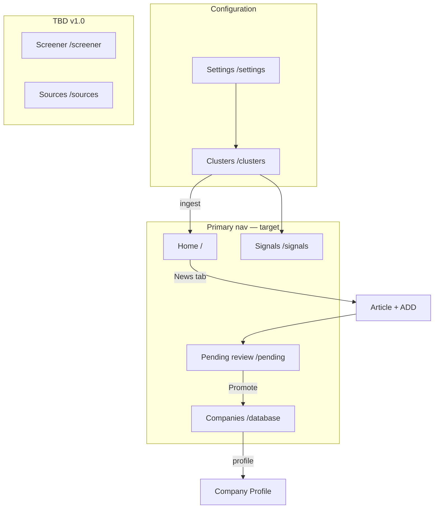

# P1-05 — UI Screen Mapping (Analyst App)

| Field | Value |
|-------|-------|
| **Document ref** | P1-05-User |
| **Title** | UI Screen Mapping — Analyst App |
| **Version** | 1.0 |
| **Status** | Draft |
| **Last updated** | 2026-06-09 |
| **Audience** | BAT stakeholders, product, analysts |
| **Workflow reference** | [P1-01-User](./P1-01-user.md) |
| **Object reference** | [P1-02-User](./P1-02-user.md) · [P1-04-User](./P1-04-user.md) |

---

## 1. Introduction

This document maps **every analyst screen** in NORAD AI to the **product objects** it displays and the **actions** each control performs. Use it to confirm that every button has a defined purpose before backend work proceeds.

Workflow detail (what the analyst experiences step by step) lives in [P1-01-User](./P1-01-user.md). This doc is the **screen inventory** — route, status, objects, and actions in one place.

---

## 2. How to read this document

### 2.1 Screen status

| Status | Meaning |
|--------|---------|
| **Available** | Screen exists in the target analyst app and is usable today (layout + primary actions) |
| **In progress** | Screen or key actions exist but behaviour is incomplete |
| **Planned** | Agreed for v1.0 — not built yet |
| **TBD** | Needed for v1.0 — route and layout not yet designed |
| **Dropped** | Removed from target product — may still exist in the repo as legacy |

### 2.2 Routes

**Target route** is the analyst-app URL in the v1.0 product map. **Repo today** is what exists in the current monorepo build (often operator-skewed). Where they differ, both are listed.

### 2.3 Action types

Same as P1-01: `Read` · `Navigate` · `Filter` · `Escalate` · `Dismiss` · `Configure` · `—` (display only)

### 2.4 Object names

Objects use [P1-02-User](./P1-02-user.md) vocabulary (Search Cluster, Article, Pending Review Item, etc.).

---

## 3. Screen inventory

| # | Screen | Target route | Repo today | Status | P1-01 |
|---|--------|--------------|------------|--------|-------|
| 1 | Home | `/` | `/` (Dashboard placeholder) | In progress | §2 |
| 2 | Home — Top tab | `/` (tab) | — | In progress | §2.2–2.4 |
| 3 | Home — News tab | `/` or `/news` | — | Available | §2.5–2.9 |
| 4 | News (standalone) | `/news` | — (merged into Home tab) | Planned | §2.5 |
| 5 | Signals | `/signals` | `/signals` (nav: Soon) | In progress | §3 |
| 6 | Clusters list | `/clusters` | Settings → Clusters | Available | §7 |
| 7 | Cluster detail | `/clusters/:id` | Settings → open cluster | Available | §7.2 |
| 8 | New query | `/clusters/:id/queries/new` | Cluster → + Add Query | Available | §7.2 |
| 9 | Query detail | `/clusters/:id/queries/:queryId` | Cluster → Queries tab | Available | §7.2 |
| 10 | Companies list | `/database` | `/companies` | Available | §5.1–5.2 |
| 11 | Company profile | `/database/:id` | `/companies/:id` | Available | §5.4–5.8 |
| 12 | Pending review | `/pending` | — | In progress | §4 |
| 13 | Screener | `/screener` | — | TBD | §4.4 (post-Promote) |
| 14 | Sources | `/sources` | — | TBD | — |
| 15 | Settings | `/settings` | `/settings` | In progress | §7.1 |
| — | Discovery (legacy) | `/discovery` | `/discover` (Today) | **Dropped** | — |

---

## 4. Screen → objects → actions

### 4.1 Home (`/`)

| Attribute | Value |
|-----------|-------|
| **Purpose** | Analyst landing page — weekly digest (Top) and daily news scan (News) |
| **Status** | In progress — Top + News layouts documented; repo Dashboard is operator placeholder |
| **Sidebar label** | Home |

**Objects displayed**

| Object | Where on screen | Status |
|--------|-----------------|--------|
| Opportunity (Watchlist) | Top tab — first section | Planned (rules-driven content) |
| Opportunity (Industry) | Top tab — second section | Planned (rules-driven content) |
| Article | News tab — Hot News rows | Available |
| News Signal | News tab — tags and scores on each row | Available |
| Monitoring Rule | Top tab — filters what surfaces (implicit) | Planned |

**Actions**

| Control | Action type | Effect | Status |
|---------|-------------|--------|--------|
| Sidebar → Home | Navigate | Opens Home | Available |
| Top tab | Navigate | Shows weekly opportunity sections | Available |
| News tab | Navigate | Shows Hot News table | Available |
| Opportunity card | Read | Shows weekly highlight | Planned content |
| News row | Read | Headline, summary, tags, score | Available |
| Row chevron | Navigate | Expands article (see §4.3) | Available |
| Full feed → | Navigate | Extended news list | Available |

**Workflow:** [P1-01-User §2](./P1-01-user.md#2-workflow--home-page)

---

### 4.2 Home — Top tab (`/` · Top)

| Attribute | Value |
|-----------|-------|
| **Purpose** | Weekly briefing — Watchlist activity + industry-wide opportunities |
| **Status** | In progress — layout Available; auto-surfacing Planned |

**Objects displayed**

| Object | Section | Status |
|--------|---------|--------|
| Opportunity (Watchlist subtype) | Opportunities this week — Watchlist | Planned |
| Opportunity (Industry subtype) | Opportunities this week — Industry | Planned |
| Watchlist Entry | Source companies for Watchlist section | In progress |
| Company Signal | Bullets on opportunity cards | Planned |
| Monitoring Rule | Decides which signals appear | Planned |

**Actions**

| Control | Action type | Effect |
|---------|-------------|--------|
| Top tab | Navigate | Switches from News to Top view |
| Watchlist opportunity card | Read | Company name, tags, weekly bullets |
| Industry opportunity card | Read | Sector headline, tags, bullets |

**Workflow:** [P1-01-User §2.2–2.4](./P1-01-user.md#22-top-tab--opportunities-this-week--watchlist)

---

### 4.3 Home — News tab (`/` · News)

| Attribute | Value |
|-----------|-------|
| **Purpose** | Browse ingested articles; expand and **+ ADD** companies for deep research |
| **Status** | Available |

**Objects displayed**

| Object | Where | Status |
|--------|-------|--------|
| Article | Hot News table rows | Available |
| News Signal | Category tag, signal tag, score column | Available |
| Company (mentioned) | Expanded article — Companies in story | Available |
| Search Cluster | Provenance (implicit — which cluster ingested) | Available |

**Actions**

| Control | Action type | Effect | Objects touched |
|---------|-------------|--------|-----------------|
| News tab | Navigate | Opens Hot News table | Article |
| News row chevron | Navigate | Expands article detail | Article |
| Executive summary block | Read | AI summary | Article |
| Signal score bars | Read | Priority breakdown | News Signal |
| OPEN | Navigate | Opens source URL in browser | Article |
| Related coverage VIEW | Navigate | Linked articles | Article |
| Company chevron | Navigate | Expands company blurb | Company |
| **+ ADD** | **Escalate** | Starts deep research → Pending Review | Company, Company Profile, Manual Bookmark path via Article |

**Workflow:** [P1-01-User §2.5–2.9](./P1-01-user.md#25-news-tab--browse-hot-news)

---

### 4.4 News — standalone (`/news`)

| Attribute | Value |
|-----------|-------|
| **Purpose** | Optional dedicated full news feed (same data as Home → News) |
| **Status** | Planned — may stay as Home tab only in v1.0 |

**Objects and actions:** Same as §4.3. Split route only if navigation IA requires a top-level News item.

---

### 4.5 Signals (`/signals`)

| Attribute | Value |
|-----------|-------|
| **Purpose** | Categorized view of all ingested news — filter by signal type |
| **Status** | In progress — layout Available; rules-based tab counts Planned |
| **Sidebar label** | Signals |

**Objects displayed**

| Object | Where | Status |
|--------|-------|--------|
| Article | News feed table | Available |
| News Signal | Category, signal, score columns | Available |
| Monitoring Rule | Assigns stories to filter tabs | Planned |
| Watchlist Entry | Priority watch sidebar | In progress |
| Company Signal | Sidebar bullets for watchlist companies | Planned |

**Actions**

| Control | Action type | Effect |
|---------|-------------|--------|
| All / Companies / Industry / Regulatory / Filings / Hiring / Funding tabs | Filter | Shows subset of feed per rule |
| Tab count badge | Read | Stories matching tab rules |
| News feed table row | Read | Headline, category, signal, score, date |
| Top signal card | Read | Highest-priority signal this period |
| Priority watch company card | Read | Watchlist company + active signals |

**Note:** **+ ADD** is intentionally on Home News, not Signals — Signals is for triage by type.

**Workflow:** [P1-01-User §3](./P1-01-user.md#3-workflow--signals-page)

---

### 4.6 Clusters list (`/clusters`)

| Attribute | Value |
|-----------|-------|
| **Purpose** | Manage monitoring themes that feed News and Signals |
| **Status** | Available — today via Settings → Clusters; dedicated `/clusters` nav Planned |
| **Entry** | Settings → Clusters or sidebar Clusters (target) |

**Objects displayed**

| Object | Status |
|--------|--------|
| Search Cluster | Available |
| Search Query (count per cluster) | Available |

**Actions**

| Control | Action type | Effect |
|---------|-------------|--------|
| + Create Cluster | Navigate | Opens create form |
| Cluster row | Navigate | Opens cluster detail (§4.7) |
| Cluster name / status / last run | Read | List metadata |

**Workflow:** [P1-01-User §7](./P1-01-user.md#7-how-news-enters-the-feed-supporting-workflow)

---

### 4.7 Cluster detail (`/clusters/:id`)

| Attribute | Value |
|-----------|-------|
| **Purpose** | Command center for one monitoring theme — overview, queries, results, settings |
| **Status** | Available |

**Objects displayed**

| Object | Tab / area | Status |
|--------|------------|--------|
| Search Cluster | Overview, Settings | Available |
| Search Query | Queries tab | Available |
| Query Run | Results / run history | Planned |
| Article | Results preview (when wired) | Planned |

**Actions**

| Control | Action type | Effect |
|---------|-------------|--------|
| Overview tab | Navigate | Cluster summary |
| Queries tab | Navigate | List of search queries |
| Results tab | Navigate | Run output preview |
| Settings tab | Navigate | Keywords, geography, signal types |
| + Add Query | Navigate | Opens new query (§4.8) |
| Run cluster (manual) | Configure | Executes all active queries → ingests Articles |
| Pause / activate cluster | Configure | Toggles `is_active` |

---

### 4.8 New query (`/clusters/:id/queries/new`)

| Attribute | Value |
|-----------|-------|
| **Purpose** | Define one search string inside a cluster |
| **Status** | Available |

**Objects displayed**

| Object | Status |
|--------|--------|
| Search Query (form) | Available |
| Search Cluster (parent) | Available |

**Actions**

| Control | Action type | Effect |
|---------|-------------|--------|
| Query name, query text | Configure | Defines search |
| Search parameters | Configure | Advanced options — Planned |
| Save / Create | Configure | Saves Search Query |
| Cancel | Navigate | Returns to cluster detail |

---

### 4.9 Query detail (`/clusters/:id/queries/:queryId`)

| Attribute | Value |
|-----------|-------|
| **Purpose** | Edit one query; run individually; view results |
| **Status** | Available |

**Objects displayed**

| Object | Status |
|--------|--------|
| Search Query | Available |
| Query Run | Planned |
| Article (result preview) | Planned |

**Actions**

| Control | Action type | Effect |
|---------|-------------|--------|
| Edit query fields | Configure | Updates Search Query |
| Run query | Configure | Single Query Run → Article candidates |
| View results | Navigate | Result list for this query |
| Delete query | Configure | Removes Search Query |

---

### 4.10 Companies list (`/database`)

| Attribute | Value |
|-----------|-------|
| **Purpose** | Browse all saved company profiles; open detail; manually queue new companies |
| **Status** | Available |
| **Target route** | `/database` |
| **Repo today** | `/companies` |
| **Sidebar label** | Companies |

**Objects displayed**

| Object | Tab | Status |
|--------|-----|--------|
| Company | Both tabs | Available |
| Company Profile (summary) | Row columns | Available |
| Watchlist Entry | Watchlist tab only | In progress |

**Actions**

| Control | Action type | Effect |
|---------|-------------|--------|
| Watchlist tab | Filter | Promoted companies only |
| Companies tab | Filter | All saved profiles |
| Search companies… | Filter | Text filter on table |
| Table row click | Navigate | Opens company profile (§4.11) |
| + Add company | Navigate | Opens bookmark modal |
| Row actions (⋯) | — | Row menu — TBD items |

**Workflow:** [P1-01-User §5.1–5.3](./P1-01-user.md#5-workflow--companies-page)

---

### 4.11 Company profile (`/database/:id`)

| Attribute | Value |
|-----------|-------|
| **Purpose** | Full deep-research card + ongoing watchlist updates |
| **Status** | Available |
| **Repo today** | `/companies/:id` |

**Objects displayed**

| Object | Tab | Status |
|--------|-----|--------|
| Company | Header | Available |
| Company Profile | Overview, Signals, People, Financials, Timeline, Analysis | Available |
| Company Signal | Overview timeline, Signals tab | Available / Planned (auto-append) |
| Source | Evidence behind profile fields | Available (inline) |

**Actions**

| Control | Action type | Effect |
|---------|-------------|--------|
| Overview / Signals / People / Financials / Timeline / Analysis / Outreach tabs | Navigate | Switches profile section |
| Breadcrumb Companies › name | Navigate | Back to list |
| View More (description) | Read | Expands narrative |
| Signal feed row | Read | One Company Signal |
| People filters (Champions, etc.) | Filter | People tab subset |

**Watchlist-only behaviour (Planned):** new signals auto-append daily without manual refresh.

**Workflow:** [P1-01-User §5.4–5.8](./P1-01-user.md#54-company-detailed-profile--header-and-tabs)

---

### 4.12 Pending review (`/pending`)

| Attribute | Value |
|-----------|-------|
| **Purpose** | Approve or reject companies after deep research |
| **Status** | In progress |
| **Sidebar** | Pending review (badge count) |

**Objects displayed**

| Object | Status |
|--------|--------|
| Pending Review Item | Available |
| Company | Available |
| Company Profile (summary) | In progress |
| Escalation (origin metadata) | In progress |

**Actions**

| Control | Action type | Effect |
|---------|-------------|--------|
| All / Bookmarked / Manual tabs | Filter | Filter by how company arrived |
| Table row | Read | Origin, name, URL, context, time |
| Row chevron | Navigate | Expands detail card |
| Read deep research summary | Read | Profile output when complete |
| **Promote to Watchlist** | **Escalate** | Accept → Watchlist Entry created |
| **Dismiss** | **Dismiss** | Reject → removed from queue |

**Workflow:** [P1-01-User §4](./P1-01-user.md#4-workflow--pending-review)

---

### 4.13 Screener (`/screener`)

| Attribute | Value |
|-----------|-------|
| **Purpose** | Post-Promote baseline fit scoring — lighter pass after Watchlist accept |
| **Status** | TBD — behaviour described in P1-01 §4.4; dedicated screen not designed |

**Objects (expected)**

| Object | Role |
|--------|------|
| Company | Subject |
| Company Profile | Receives fit score and tier |
| Watchlist Entry | Triggered after Promote |

**Actions (expected)**

| Control | Action type | Effect |
|---------|-------------|--------|
| — | — | May run automatically with no screen — confirm in design |

**Open question:** Run headless after Promote, or expose `/screener` queue for analysts?

---

### 4.14 Sources (`/sources`)

| Attribute | Value |
|-----------|-------|
| **Purpose** | Browse citations and evidence across profiles — TBD |
| **Status** | TBD |

**Objects (candidate)**

| Object | Role |
|--------|------|
| Source | Citation rows |
| Company Profile | Parent context |
| Article | News provenance |

**Actions:** Not defined — needs product design.

---

### 4.15 Settings (`/settings`)

| Attribute | Value |
|-----------|-------|
| **Purpose** | Analyst preferences, cluster access, monitoring rules |
| **Status** | In progress — repo today is operator engine config |
| **Entry** | Sidebar footer or profile menu |

**Objects displayed (target analyst)**

| Object | Area | Status |
|--------|------|--------|
| User | Profile | Planned |
| Search Cluster | Clusters card / link | Available |
| Monitoring Rule | Rules section | Planned |

**Actions (target analyst)**

| Control | Action type | Effect |
|---------|-------------|--------|
| Open Clusters | Navigate | → §4.6 |
| Edit monitoring rules | Configure | Updates Monitoring Rule |
| Profile / display name | Configure | Updates User |

**Repo today:** engine tuning (Parallel, Exa, Diffbot) — operator-only; not part of analyst target IA.

**Workflow:** [P1-01-User §7.1](./P1-01-user.md#71-overview)

---

### 4.16 Dropped — Discovery / Today (`/discovery`)

| Attribute | Value |
|-----------|-------|
| **Status** | **Dropped** from target analyst app |
| **Repo legacy** | `/discover` (Today) |
| **Replacement** | Home News + Search Clusters pipeline |

Not mapped. Do not build new features on this route.

---

## 5. Escalation actions (cross-screen)

Analyst choices that move a company to the next stage — no separate stored object.

| Action | Screen | Input | Result objects |
|--------|--------|-------|----------------|
| **+ ADD** | Home → News (expanded article) | Article + company name | Company Profile (draft) → Pending Review Item |
| **Find & queue** | Companies → + Add company modal | Manual Bookmark | Pending Review Item → deep research |
| **Promote** | Pending review | Pending Review Item | Watchlist Entry, Company on watchlist |
| **Dismiss** | Pending review | Pending Review Item | Removed from queue |

Detail: [P1-01-User §4](./P1-01-user.md#4-workflow--pending-review) · [P1-02-User §Escalation](./P1-02-user.md)

---

## 6. Navigation map

---

## 7. Object → screen index

Reverse lookup: where each object appears.

| Object | Primary screens |
|--------|-----------------|
| Search Cluster | Clusters list, Cluster detail, Settings |
| Search Query | Cluster detail, New query, Query detail |
| Query Run | Query detail, Cluster results — Planned |
| Article | Home News, Signals, expanded article |
| News Signal | Home News, Signals |
| Opportunity | Home Top |
| Monitoring Rule | Settings — Planned; affects Home Top + Signals |
| Company | Companies, Pending review, article expand |
| Company Profile | Company profile, Pending review expand |
| Company Signal | Company profile, Signals sidebar |
| Pending Review Item | Pending review |
| Watchlist Entry | Companies Watchlist tab, Home Top, Signals sidebar |
| Manual Bookmark | + Add company modal |
| User | Settings — Planned |

---

## 8. Gaps and open decisions

| # | Gap | Screens affected | Decision needed |
|---|-----|----------------|-----------------|
| 1 | `/news` vs Home News tab only | Home, News | Separate route or tab-only? |
| 2 | `/clusters` vs Settings → Clusters | Clusters | Dedicated sidebar item or settings sub-page? |
| 3 | `/database` vs `/companies` | Companies | Final analyst URL |
| 4 | Screener screen vs headless job | Screener, Pending review | Visible queue or background only? |
| 5 | Sources browser scope | Sources | Global citations vs per-profile only? |
| 6 | Analyst Settings vs operator engine config | Settings | Split settings surfaces by role |
| 7 | Repo Dashboard vs target Home | Home | Replace placeholder with Top + News |
| 8 | Rules engine not live | Home Top, Signals tabs | Tab counts may not reflect rules yet |

---

## 9. Related documents

| Need | Document |
|------|----------|
| Step-by-step analyst flows | [P1-01-User](./P1-01-user.md) |
| What objects are | [P1-02-User](./P1-02-user.md) |
| Field-level spec | [P1-04-User](./P1-04-user.md) |
| Operator screens | [P1-05-Admin](./P1-05-admin.md) |
