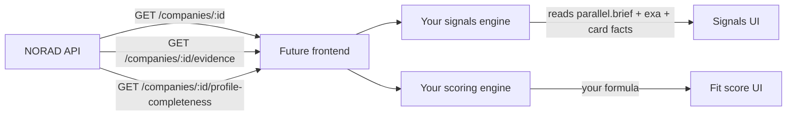

# Legacy Reference — Signals, Scores & Suggestions (Removed from Pipeline)

| Field | Value |
|-------|-------|
| **Status** | Reference only — **removed from Deep Research synthesis** (2026-06-16) |
| **Audience** | Future frontend team building signals/scoring UI on a separate app |
| **Last updated** | 2026-06-16 |
| **Code at time of writing** | `NORAD-INTEL-ENGINE-V1` — pre-removal behavior documented below |

> **Removal note:** Deep Research no longer synthesizes `signals[]`, `scores`, or `recommended_next_action` / rationale. The **`signals` Postgres table was dropped** (`0011_drop_signals.sql`). New cards persist `score_*` columns as `NULL`. `GET /companies/:id/evidence` remains for raw engine evidence. Profile completeness catalog dropped the five signal-audit params (49 → 44).

This document captures **how signals, fit scores, metric breakdown, and recommended actions were implemented** in the NORAD Intel Engine before removal. Use it when the new frontend needs to rebuild those experiences — either from raw evidence APIs or a future dedicated signals service.

---

## 1. Why this exists

The current Vite app (`apps/web`) shows:

- A **Signals** timeline (growth, partnership, strategic, etc.)
- A **Fit Score** card (0–100 + “N signals” badge)
- A **Metric Breakdown** sidebar (6 dimension bars)
- A **Recommended Action** card (Monitor / Pass / Outreach + rationale)

All of these are **produced by the Deep Research pipeline** (Claude Sonnet synthesis) and **stored in Postgres**. The future frontend will own the UX; this backend should focus on **facts + evidence**, not BD scoring/suggestions.

---

## 2. Architecture overview

```mermaid
flowchart TB
    subgraph Stage2["Stage 2 — Engines (parallel)"]
        PAR[Parallel web research]
        EXA[Exa live reads]
        DFB[Diffbot KG enhance]
    end

    subgraph Stage3["Stage 3 — Claude Sonnet"]
        SYN[synthesize_company_card tool]
    end

    subgraph Stage4["Stage 4 — Persist"]
        CARD[(cards.card JSONB)]
        SCORES[(cards.score_* columns)]
        SIG[(signals table)]
        SRC[(sources table)]
        CPP[(card_profile_parameters)]
    end

    PAR -->|compact brief incl. signals[]| SYN
    EXA --> SYN
    DFB --> SYN
    SYN --> CARD
    SYN --> SCORES
    SYN --> SIG
    SYN --> SRC
    CARD --> CPP

    subgraph UI["Current frontend CompanyDetail"]
        SIGUI[Signals list]
        FIT[Fit Score card]
        MET[Metric Breakdown]
        REC[Recommended Action]
    end

    SIG --> SIGUI
    SCORES --> FIT
    SCORES --> MET
    CARD --> REC
```

**Three layers to understand:**

| Layer | What it is | Future frontend use |
|-------|------------|---------------------|
| **Raw evidence** | `engine_calls`, `runs.engine_outputs`, `GET /companies/:id/evidence` | Best input for a *new* signal engine |
| **Synthesized card** | `CompanyCardV1` in `cards.card` | Facts (identity, funding, products) — keep |
| **Derived BD layer** | `signals[]`, `scores`, `strategic_fit.recommended_*` | **Remove from pipeline** — rebuild on future frontend |

---

## 3. Data model

### 3.1 `signals` table

**ORM:** `apps/api/app/models/signal.py`  
**Written by:** `_stage4_persist()` in `apps/api/app/services/research.py`

| Column | Type | Notes |
|--------|------|-------|
| `id` | UUID | PK |
| `company_id` | UUID | FK → `companies` |
| `card_id` | UUID | Composite FK with `company_id` → `cards(id, company_id)` |
| `type` | string(32) | `growth` \| `fundraising` \| `acquisition` \| `partnership` \| `risk` \| `strategic` |
| `subtype` | string(64) | Optional, e.g. `store_expansion` |
| `headline` | text | Required — shown as signal title |
| `evidence` | text | Supporting paragraph |
| `weight` | int 1–10 | UI shows “weight 9/10” |
| `signal_date` | date | Optional YYYY-MM-DD |
| `source_refs` | JSONB int[] | Indexes into `sources.local_id` on same card |

**Also duplicated** inside `cards.card` → `signals[]` (same shape, Pydantic `Signal` in `apps/api/app/schemas/blocks.py`).

### 3.2 `cards.score_*` columns (denormalized)

**ORM:** `apps/api/app/models/card.py`

Copied from `card.scores.*` at persist time for list sorting without parsing JSON:

| Column | Source in JSON |
|--------|----------------|
| `score_overall` | `scores.overall` |
| `score_growth` | `scores.growth` |
| `score_momentum` | `scores.momentum` |
| `score_fundraising` | `scores.fundraising_likelihood` |
| `score_acquisition` | `scores.acquisition_likelihood` |
| `score_partnership_fit` | `scores.partnership_fit` |
| `score_strategic_fit` | `scores.strategic_fit` |
| `score_risk` | `scores.risk` |

### 3.3 `scores` block in `CompanyCardV1`

**Schema:** `apps/api/app/schemas/blocks.py` → `class Scores`

```json
{
  "growth": 0,
  "momentum": 0,
  "fundraising_likelihood": 0,
  "acquisition_likelihood": 0,
  "partnership_fit": 0,
  "strategic_fit": 0,
  "risk": 0,
  "overall": 52,
  "rationale": "optional one-liner"
}
```

All integers 0–100. **`overall`** drives the Fit Score card. Claude invents these during synthesis — they are **not** computed by a deterministic formula.

### 3.4 `strategic_fit` block (suggestions)

**Schema:** `apps/api/app/schemas/blocks.py` → `class StrategicFit`

| Field | UI usage |
|-------|----------|
| `fit_summary` | “Strategic Fit” narrative paragraph (main column) |
| `portfolio_adjacency`, `why_now`, etc. | Optional Valued fields — rarely shown |
| `recommended_next_action` | **Recommended Action** card — enum: `outreach_partnership`, `outreach_investment`, `outreach_acquisition`, `monitor`, `pass`, `unknown` |
| `recommended_action_rationale` | Long text under Recommended Action |

Header pill (“Monitor”, “Strong Fit”) is derived from `recommended_next_action` in `CompanyDetail.tsx`.

### 3.5 Profile completeness — signal audit rows

**Service:** `apps/api/app/services/profile_completeness.py`  
**Table:** `card_profile_parameters`

Five of the 49 must-have params read from `card.signals[]`:

| `param_key` | Label |
|-------------|-------|
| `growth_signals` | Growth signals |
| `fundraising_signals` | Fundraising signals |
| `acquisition_signals` | Acquisition signals |
| `partnership_signals` | Partnership signals |
| `risk_signals` | Risk signals |

Each row’s `coverage_status` is `verified` if any signal of that `type` has a headline.

---

## 4. Pipeline — how signals & scores are produced

**Entry:** `POST /api/research/runs` → `execute_research()` in `research.py`

### Stage 1 — Setup

Resolve company name, domain, optional `company_id` (from Web Discovery mention).

### Stage 2 — Engines (fan-out)

| Engine | Output used for signals/scores |
|--------|-------------------------------|
| **Parallel** | Compact JSON brief with **required `signals[]`** (min 3) — see `_PARALLEL_RESEARCH_SCHEMA` |
| **Exa** | Page text for citation + fact expansion |
| **Diffbot** | KG entity + match **score** (0–1) — *not* the same as Fit Score; entity-trust gate only |

Parallel signal shape (pre-synthesis):

```json
{
  "type": "growth | funding | hiring | product | partnership | risk | strategic",
  "date": "2026-06-15",
  "headline": "...",
  "evidence": "...",
  "weight": 9,
  "source_urls": ["https://..."]
}
```

Parallel types are **mapped** to card enum in `_map_parallel_signal_type()` (e.g. `funding` → `fundraising`).

### Stage 3 — Claude Sonnet synthesis

**System prompt:** `_SYNTH_SYSTEM` in `research.py`

Key enforced rules (today):

1. **`signals` MUST contain AT LEAST 3 entries** (target 3–8), types exactly:  
   `growth | fundraising | acquisition | partnership | risk | strategic`
2. Each signal: `headline`, `weight` 1–10, ≥1 `sources` id
3. **`scores`**: honest 0–100 across all sub-scores
4. **`strategic_fit`**: NORAD-specific take + `recommended_next_action`

**Backfill / retry logic:**

| Function | Purpose |
|----------|---------|
| `_harvest_parallel_signals_if_thin()` | If Claude returns &lt;3 signals, promote Parallel’s `signals[]` into card |
| `_SYNTH_MIN_SIGNALS = 3` | Triggers synthesis retry if still thin after harvest |
| `_merge_candidate_sources_into_card()` | Ensures sources list populated (signals cite by id) |

**Tool:** `synthesize_company_card` with full `CompanyCardV1` JSON Schema (`get_contract_schema()`).

### Stage 4 — Persist

`_stage4_persist()`:

1. Upsert `companies`
2. Insert `cards` row — `card` JSONB + `score_*` columns
3. Insert `sources` rows from `sources_and_confidence.sources`
4. Insert `signals` rows from `card.signals`
5. Materialize `card_profile_parameters` (includes 5 signal audit rows)
6. Set `companies.canonical_card_id`

---

## 5. API contract (current frontend)

### 5.1 Company detail

```
GET /api/research/companies/{company_id}
```

```json
{
  "company": { "company_name": "...", "canonical_card_id": "...", "score_overall": 52 },
  "card": {
    "id": "...",
    "score_overall": 52,
    "score_growth": 45,
    "score_momentum": 60,
    "score_fundraising": 30,
    "score_acquisition": 25,
    "score_partnership_fit": 55,
    "score_strategic_fit": 50,
    "score_risk": 40,
    "card": { "...full CompanyCardV1..." }
  },
  "signals": [
    {
      "id": "uuid",
      "type": "growth",
      "subtype": null,
      "headline": "Launched Prebiotics Coconut Water...",
      "evidence": "...",
      "weight": 9,
      "signal_date": "2026-06-15",
      "source_refs": [15, 16, 17]
    }
  ],
  "sources": [ { "local_id": 15, "url": "...", "title": "..." } ]
}
```

Signals are **scoped to canonical card only** (not historical re-runs).

### 5.2 Profile completeness

```
GET /api/research/companies/{company_id}/profile-completeness
```

Includes `groups[]` with signal param rows (`growth_signals`, etc.) and `coverage_status`.

### 5.3 Raw evidence (useful for future signal rebuild)

```
GET /api/research/companies/{company_id}/evidence
```

**Service:** `apps/api/app/services/company_evidence.py`

Returns normalized Diffbot / Parallel / Exa / synthesis audit from `engine_calls` for the canonical card’s run. Includes:

- `parallel.brief.signals[]` — **raw Parallel signals** before Claude merge
- Full Diffbot entity, Exa pages, engine latencies/costs

This is the **best backend input** if the future frontend builds its own signal timeline without using synthesized `signals` table rows.

### 5.4 Company feed

```
GET /api/research/feed
```

Returns `score_overall` per company row for list sorting.

---

## 6. Frontend mapping (current `apps/web`)

| UI component | File | Data source |
|--------------|------|-------------|
| Signals timeline | `CompanyDetail.tsx` | `GET /companies/:id` → `signals[]` |
| Fit Score card | `CompanyDetail.tsx` | `card.score_overall`, `signals.length` |
| ScoreBar (threshold/current/max) | `components/ui/ScoreBar.tsx` | `score_overall`, hardcoded threshold 50 |
| Metric Breakdown | `CompanyDetail.tsx` | `card.score_*` columns (6 bars) |
| Recommended Action | `CompanyDetail.tsx` | `card.strategic_fit.recommended_next_action` + `recommended_action_rationale` |
| Header fit pill | `CompanyDetail.tsx` | Derived from `recommended_next_action` |
| Strategic Fit narrative | `CompanyDetail.tsx` | `strategic_fit.fit_summary` |
| Top signals preview | `Companies.tsx` | Same `signals` from company payload |
| Parallel signals in evidence | `ResearchEvidence.tsx` | `evidence.parallel.brief.signals` |

---

## 7. Prompt text reference (Sonnet)

Located in `apps/api/app/services/research.py`:

- `_SYNTH_SYSTEM` — signals min 3, scores 0–100, strategic_fit recommendation
- User message in `_stage3_synthesize()` — embeds Parallel JSON, Exa snippets, Diffbot evidence, candidate source registry
- Retry user message when `len(signals) < _SYNTH_MIN_SIGNALS`

Parallel prompt enforcement: `_PARALLEL_RESEARCH_SCHEMA["properties"]["signals"]` description requires ≥3 items.

---

## 8. What is NOT the same as “company signals”

| Concept | Purpose | Keep after strip? |
|---------|---------|-------------------|
| Diffbot **match score** (0.92) | KG entity trust gate | **Yes** — settings `diffbot.score_threshold` |
| `engine_calls` audit | Vendor I/O logging | **Yes** |
| `sources` table | URL citations for facts | **Yes** |
| `brand_marketing_sentiment.tiktok_virality_signal` | Field name only | **Yes** — plain card field |
| Profile completeness “Signals” group | Audit of synthesized signals | **Remove or repurpose** when signals stripped |

---

## 9. Recommended removal strategy (for future frontend)

### Recommended: **Option A+** (strip synthesis, keep evidence APIs)

| Action | Rationale |
|--------|-----------|
| **Stop** prompting Claude for `signals[]`, `scores`, `recommended_next_action` | Future frontend owns BD layer |
| **Stop** writing `signals` rows and `score_*` on new cards | Avoid stale/conflicting data |
| **Keep** `signals` table + API fields (empty for new runs) | Backward compat for old cards |
| **Keep** `GET /companies/:id/evidence` | Future frontend builds signals from Parallel/Exa/Diffbot raw output |
| **Keep** `cards.card` fact blocks | Identity, financials, products, people, etc. |
| **Keep** `sources` + `card_profile_parameters` (minus 5 signal rows) | Evidence + completeness audit |
| **Remove** current Vite UI panels | This app is not the long-term UI |

**Why not full Option B (drop `signals` table) yet:** Old research runs still have data; future frontend may want to read historical rows during migration. Drop table in a later migration once the new app ships.

### What Deep Research will still do after strip

| Stage | Still does |
|-------|------------|
| **1 — Setup** | Resolve company, domain, optional `company_id` |
| **2 — Engines** | Parallel brief (facts, no required signals), Exa crawl, Diffbot KG |
| **3 — Synthesize** | Claude merges evidence into `CompanyCardV1` **fact blocks** + `sources_and_confidence` |
| **4 — Persist** | `companies`, `cards`, `sources`, `card_profile_parameters` |

**Claude still produces:**

- `company_identity`, `classification`, `financials`, `funding_and_investors`
- `people_and_decision_map`, `products_and_skus`, `market_and_competitors`
- `distribution_and_channels`, `business_model`, `legal_regulatory_risk`
- `brand_marketing_sentiment`, `technology_ip_defensibility`
- `strategic_fit.fit_summary` (narrative only — **optional**, no `recommended_next_action`)
- `sources_and_confidence` (≥3 sources, confidence, gaps)

**Claude stops producing:**

- `signals[]`
- `scores` (0–100 dimensions)
- `recommended_next_action` / `recommended_action_rationale`

---

## 10. Future frontend — suggested integration



**Inputs available today without synthesized signals:**

1. `evidence.parallel.brief` — identity, funding, products, competitors, optional `signals[]` from Parallel directly
2. `evidence.exa` — page titles, URLs, text snippets
3. `evidence.diffbot` — KG entity, people, investments
4. `card.card` — merged `CompanyCardV1` facts with `Valued[]` confidence
5. `sources[]` — citation registry with trust tiers

---

## 11. Files to touch when removing

| Area | Files |
|------|-------|
| Pipeline prompts | `apps/api/app/services/research.py` |
| Parallel schema | `_PARALLEL_RESEARCH_SCHEMA` in same file |
| Persist | `_stage4_persist()` — signal inserts, score column copy |
| Schema | `apps/api/app/schemas/blocks.py` (`Signal`, `Scores`), `company_card.py` |
| Profile completeness | `profile_completeness.py` — 5 signal param extractors |
| API | `apps/api/app/routers/research.py` — `signals` in `CompanyDetail` (optional deprecate) |
| Frontend | `CompanyDetail.tsx`, `Companies.tsx`, `ScoreBar.tsx`, `ResearchEvidence.tsx` (Parallel signals section) |
| Docs | `docs/phase-1/P1-04-admin.md`, `P1-06.md`, etc. |
| SQL (later) | Optional migration to drop `signals` table |

---

## 12. Debugging (historical)

From `docs/backend-pipeline.md` §5:

1. Get `run_id` from `cards.run_id`
2. Check `engine_calls` where `operation='synthesize_card'` → `tool_calls[0].input.signals`
3. If thin, look for `synthesis_retry` in `run_events`
4. Check Parallel `output_json.signals` in earlier `engine_calls` row

---

## 13. Related Phase 1 docs

- [P1-04-admin §4.4–4.6](../phase-1/P1-04-admin.md) — `signals`, `card_profile_parameters`
- [P1-06 §I.5–I.6](../phase-1/P1-06.md) — API endpoints
- [backend-pipeline.md](../backend-pipeline.md) — Deep Research stages

---

*When removal is complete, add a one-line note at the top of this file with the commit hash and date.*
